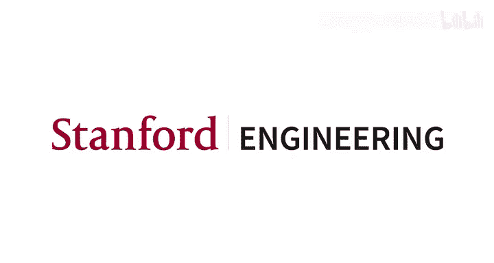
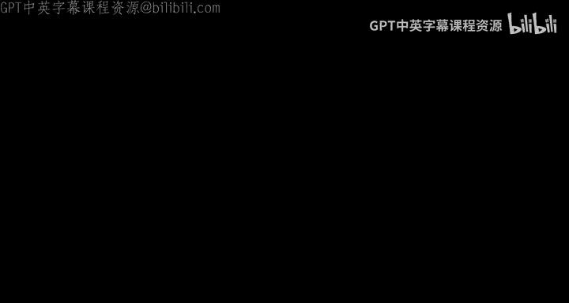
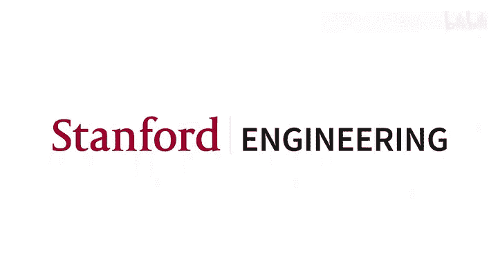

# 24：作业3与竞赛概述 🧠





在本节课中，我们将学习作业3及其关联竞赛的核心内容。我们的主题是**组合泛化**，旨在深入探究模型是否学会了系统性地解释自然语言。

## 背景介绍

研究的起点是Kim和Lndson的Cogs论文及其相关基准。我们将使用其改进版本——**Recogs**。Recogs在保留Cogs核心见解与议程的同时，试图解决我们在原始Cogs基准中发现的一些局限性。

Recogs任务本质上是一个**语义解析任务**。输入是简单句子，输出是如下所示的逻辑形式。

**示例1：**
*   **输入：** `a rose was helped by a dog`
*   **输出：** `help.v ( theme ( a.det rose.n ) , agent ( a.det dog.n ) )`

**示例2：**
*   **输入：** `The sailor dusted a boy`
*   **输出：** `dust.v ( agent ( the.det sailor.n ) , theme ( a.det boy.n ) )`

你可以看到，Cogs和Recogs的句子通常有些特殊。这是一个**合成基准**，由上下文无关文法自动生成，因此其实际含义有些非常规，但这并非这两个基准的重点。

## Cogs与Recogs的对比

我们将在本单元的核心视频中更详细地讨论Cogs和Recogs的对比。简而言之，Cogs是原始版本，Recogs在其基础上构建，并试图重构Cogs的某些方面，以专注于纯粹的语义现象。我们认为Cogs还额外测试了逻辑形式中许多无关紧要的细节。

**快速对比示例：**
*   **输入：** `the sailor saw Emma`
*   **Recogs格式：** `see.v ( agent ( the.det sailor.n ) , theme ( Emma ) )`
*   **Cogs格式：** `see.v ( x1 / see :agent ( x2 / sailor :ref ( x3 ) ) :theme ( x4 / Emma :ref ( x5 ) ) )`

概括地说，Recogs格式更简单。它移除了一些冗余符号，并重组了语义的核心方面，同时保留了原始含义。

## 数据集划分

Recogs的数据划分如下：
*   **训练集：** 约136,000个示例。
*   **开发集：** 3,000个示例，与训练集分布相似（IID划分）。我们不会过多使用开发集。
*   **泛化划分：** 21个类别，共21,000个示例。这是Cogs和Recogs最有趣的部分。其核心在于**测试模型是否对任务找到了组合式的解决方案**，即考察模型能否处理熟悉元素的新颖组合。

以下是三个泛化划分的示例，它们代表了整个集合的特点。可以说，这些泛化划分的一个标志是，对于我们语言使用者而言，它们几乎不像是泛化任务，看起来极其简单。然而，正如你将看到的，即使对我们最好的模型来说，它们也非常困难。

**1. 主语到宾语专有名词**
*   **训练集示例：** `Lina helped a cat.` (Lina是主语)
*   **泛化集示例：** `A dog helped Lina.` (Lina是宾语)
*   **目标：** 测试模型能否理解Lina在这个不熟悉的输入中扮演的语义角色。对人类很简单，对模型则极具挑战。

**2. 原始形式到主语**
*   **训练集示例：** 名字作为孤立元素出现（无句法上下文）。
*   **泛化集示例：** 名字作为完整句子的主语出现。
*   **目标：** 看似简单，但被证明具有挑战性。

**3. CP递归**
*   **训练集示例：** `Emma said that Noah knew that the cat danced.` (两层嵌套)
*   **泛化集示例：** `Emma said that Noah knew that Lucas saw that the cat danced.` (三层嵌套)
*   **目标：** 测试模型能否处理新数量的嵌套句子。对我们来说几乎不像是泛化任务，但对模型而言再次变得困难。

## 作业问题详解

以上是背景介绍。现在，让我们来看看作业的具体问题。

### 问题1：专有名词及其语义角色

对于这个问题，你**不需要训练模型**。这是经典的数据分析任务。它包含两部分：

**任务1：** 编写一个名为 `get_proper_name_roles` 的函数。该函数接收一个逻辑形式，并提取其中出现的所有（名字，角色）对列表。

**任务2：** 编写 `find_name_roles` 函数。该函数使用 `get_proper_name_roles` 来发现不同专有名词在Recogs各个数据划分中扮演的角色。

**剧透预警：** 分析会发现，专有名词“Charlie”在训练集中只作为**主题**出现，而在泛化划分中只作为**施事者**出现；而“Lina”则相反，在训练集中只作为**施事者**，在泛化划分中只作为**主题**。这个关于数据的观察很大程度上解释了后续模型的性能表现。这些名字确实被证明对我们的模型来说非常难以处理。

### 建模环节说明

在问题1之后，我需要提醒你，接下来有一个较长的**建模环节**。我已经提供了训练你自己的Recogs模型所需的所有代码片段。你并非必须这样做，但我希望提供这些资源，以便你可以将其作为构建原创系统的一个途径。

让我为你梳理一下这个环节：
1.  **Hugging Face分词器：** 我原本计划将其设为作业问题，但编写这个分词器非常困难和令人困惑，因此决定不增加你们的负担。我直接提供了它，希望你们能从中受益，并可能为未来的任务修改它。
2.  **PyTorch数据集：** 这是为Recogs准备的数据集。它有一些棘手的细节，因此我也直接提供给你们。
3.  **预训练的Recogs模型：** 这是一个名为`Zen`的预训练模型，性能出色。你可以直接加载并使用它作为你的原创系统的基础。你可以微调它或进行其他操作，但下一个作业问题并不需要你这样做。
4.  **Recogs损失函数：** 这是一个简单的PyTorch模块，帮助我将`Zen`训练的模型与我们课程代码兼容，方便你进行微调。
5.  **Recogs模块：** 这是`Zen`模型的轻量级包装器，旨在帮助我们与课程代码库中的底层优化代码兼容。
6.  **Recogs模型：** 这是主要的接口。如果你不打算为原创系统训练模型，只需关注这一步，将其视为加载和使用`Zen`模型的简单接口。

我希望你们中有人愿意深入研究这个模型的训练方式并改进它。在这种情况下，步骤1到5将特别有用。这就是为什么它们都嵌入在笔记本中。

### 问题2：探索模型预测

完成建模环节后，我们来到问题2：探索模型预测。对于这个问题，你只需直接使用预训练的`Zen` Recogs模型。

你要做的是继续问题1开始的数据分析。你需要完成一个名为 `category_assess` 的函数。这里的核心目标是让你自己发现，这个非常优秀的模型在处理处于不熟悉位置的专有名词时（正是你在问题1中识别出的那些名字）确实遇到了很大困难。

因此，你可以在这里验证Cogs和Recogs背后的假设：这些元素的新颖组合，无论多么简单，对于一个真正优秀的模型来说都是具有挑战性的。

### 关于Recogs评估的说明

在继续之前，我想谈谈Recogs的评估。我们将在本单元的主视频中更详细地讨论这一点。简而言之，Recogs的目标是真正测试语义解释，并超越逻辑形式中一些无关紧要的细节。

因此，我们的评估代码有些复杂。以下是三个有启发性的例子：

1.  **绑定变量的精确名称无关紧要。**
    *   `help.v ( theme ( a.det rose.n ) , agent ( a.det dog.n ) )` 与 `help.v ( theme ( a.det rose.n ) , agent ( a.det dog.n ) )` 是等价的，即使第一个用变量`4`，第二个用变量`7`。因为所有变量都是隐式绑定的，我们只关心它们建立的绑定关系。

2.  **合取项的顺序无关紧要。**
    *   `dog.n and happy.a` 与 `happy.a and dog.n` 评估为真。合取项的顺序是无关紧要的。

3.  **变量名称的一致性很重要。**
    *   `dog.n ( x4 ) and happy.a ( x4 )` 与 `dog.n ( x4 ) and happy.a ( x7 )` 评估为假。因为第一个逻辑形式是关于一个元素，而第二个（可能）是关于两个不同的元素，它们在语义上是不同的。

这三个例子让你感受到我们评估代码的目标：即使逻辑形式不同，也要达到语义等价。

### 问题3：上下文学习基础方法

作业主要部分的最后一个问题是问题3，它完全转换了思路。这是一个**基础的上下文学习方法**。这里的想法是帮助你们迈出第一步，像在作业2中那样使用DSP，并将其应用于这个新案例。

我的想法是，如果我推动你们为Recogs编写第一个DSP程序，你们可能会尝试更多版本并取得真正进展。以下是你将提供给模型的提示示例：

```
输入：a rose was helped by a dog
输出：help.v ( theme ( a.det rose.n ) , agent ( a.det dog.n ) )

输入：The sailor dusted a boy
输出：dust.v ( agent ( the.det sailor.n ) , theme ( a.det boy.n ) )

输入：A cat saw Emma
输出：
```

模型的任务是生成一个新的逻辑形式。你在编码方面的任务就是编写一个非常简单的DSP程序。正如我所说，我希望它能激励你们为原创系统做更复杂的事情。

我需要警告你，即使对于我们最好的大语言模型，它们表面上似乎理解这个任务是什么，当你瞥一眼它们预测的逻辑形式时，它们通常看起来还不错。但当你运行评估代码时，你会得到零分，然后意识到“还不错”对于这个任务来说并不足够。你需要完全正确，而这些大语言模型似乎很难在这个语义解析任务上做到完全正确。

### 问题4：原创系统

最后，和往常一样，问题4是构建你的**原创系统**。对于你的原创系统，你可以做任何你想做的事情。唯一的限制是：**你不能在泛化划分的任何示例上训练你的系统，也不能将这些示例的输出表示包含在你用于上下文学习的任何提示中。**

这里的想法是，我们希望保持泛化划分的纯粹性，以真正了解系统是否以我们关心的方式进行泛化。

在这个规则下，我想回顾几个原创系统的想法。记住，这并非详尽无遗，只是为了启发一些潜在的途径：

1.  **编写DSP程序。**
2.  **对我们的模型进行进一步训练。**
3.  **使用预训练模型。**
4.  **从头开始训练。**
5.  **甚至可以编写符号求解器。**
6.  可能还有其他你可以做的事情。

让我简要阐述其中几个选项：

*   **进一步训练我们的模型**应该非常容易。提供的代码片段可以加载`Zen`训练的模型，然后你可以使用开发集示例对其进行额外的微调（这是允许的，因为我们的重点是泛化划分）。代码中暴露了许多不同的优化参数，以便你思考如何最好地设置模型，从这次进一步的训练中榨取更多性能。
*   我还在笔记本中提供了代码，展示如何轻松修改我们的起点以使用预训练模型（例如T5）。你可以微调T5，使其能够执行Recogs任务，并假设T5所经历的预训练对处理泛化划分特别有用。
*   类似的代码可以修改为**从头开始训练**，只需使用Hugging Face代码加载具有BERT等模型结构的随机参数即可。Hugging Face使这变得非常容易。你可以探索在Recogs任务上从头开始训练的不同变体。

我将其他选项留给你们思考。我真的很期待看到你们用Recogs数据做些什么。

## 竞赛说明

最后是竞赛部分，这很直接。有一个TSV文件包含一些测试用例（这些是泛化测试用例）。你只需要添加一个名为`prediction`的列，其中包含你预测的逻辑形式。然后，使用提供的最终代码片段将其写入磁盘，以便上传到GradeScope自动评分器。我们将看到你们在这个令人惊讶的、极具挑战性的语义解释任务上表现如何。

---



**本节课总结：** 我们一起学习了作业3和关联竞赛的核心内容，重点探讨了**组合泛化**的概念及其在Recogs基准测试中的体现。我们分析了数据特点，探索了预训练模型的预测局限性，并介绍了构建原创系统的多种可能途径。最终目标是测试模型是否能够系统性地理解和组合语言元素，实现真正的语义泛化。