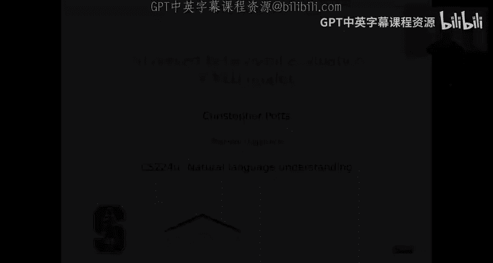
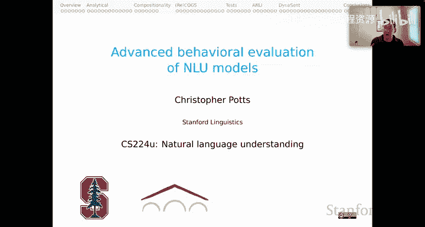
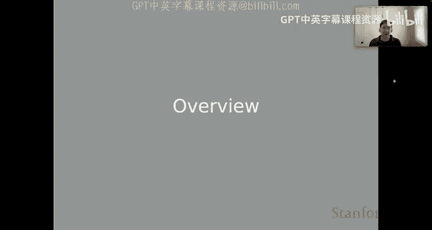
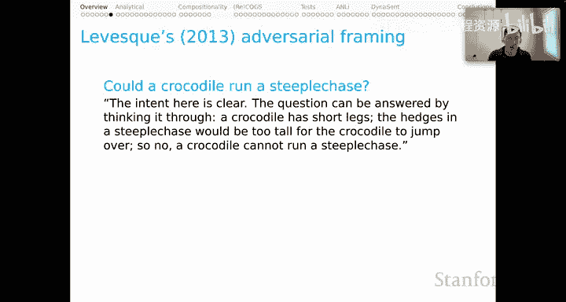

# 25：NLU模型的行为评估（第一部分）：概述 🧠

在本节课中，我们将开始学习关于自然语言理解模型的高级行为评估。我们将暂时将注意力从模型架构和设计上移开，转而关注评估的本质：我们如何收集证据，以及如何衡量该领域的进展。

上一节我们介绍了模型架构，本节中我们来看看如何评估这些模型的行为。

## 评估方法的多样性

在人工智能领域，我们进行多种类型的评估。本单元我们将专注于行为评估方法，即仅关注模型在给定输入下是否产生期望的输出，而不直接关注它们是如何实现这种映射的。

## 行为评估的类型

以下是几种主要的行为评估类型：

**标准评估**
标准评估通常被称为IID评估，即独立同分布评估。其核心思想是，我们有一些与系统训练数据不相交的测试样例，但我们有一个潜在的保证：测试样例与训练中看到的样例非常相似。这种标准模式为我们对测试时的预期提供了很多保证，但它对我们的系统也非常友好。

**探索性分析**
在探索性分析中，你可能会开始超越IID假设。你可能知道或不知道训练数据是什么样的，但核心思想是，你现在要开始通过构建的样本来探测模型是否具有某些能力，这些样本可能超出了你对训练数据的预期。这也可以是假设驱动的，例如，你可能会问：“我的模型知道同义词吗？”或者“它知道词汇蕴含吗？”，然后构建一个专门用于回答该特定问题的数据集。

**挑战数据集**
使用挑战数据集时，你可能会开始进入不那么“友好”的模式。在这种模式下，你可能会提出一些已知对模型来说会很困难的问题，因为这些问题超出了其训练经验的范围。你试图突破极限，看看它究竟会在哪里失败。这可能会变得真正具有对抗性，因为你可能已经对训练数据和模型属性进行了全面研究，然后构建了你明知模型会失败的例子，以此来揭示某种有问题的行为或重要弱点。

**面向安全的行为评估**
我们可以将对抗性升级到我称之为面向安全的行为评估的模式。在这种模式下，你可能会故意构建一些你预期会超出模型正常用户交互范围的例子，例如使用不熟悉的字符或字符组合，看看会发生什么。特别是，你可能会观察在这些非常不寻常的、分布外的输入下，模型是否会做出有毒、有问题或不安全的行为。

以上都是行为评估。我们可以将这些与我称之为结构评估的方法进行对比，后者包括探测、特征归因和干预。这些是下一个单元的主题。在结构评估中，我们试图超越输入输出映射，真正理解这些行为背后的工作机制。我认为其理想目标是揭示模型行为背后的因果机制。这些方法超越了行为测试，并与行为测试形成了强有力的互补。

## 对标准评估的反思

我认为，标准评估对我们的系统极其友好，但当我们考虑到系统在更广阔的世界中部署时，这种友好性应该越来越引起我们的担忧。

以下是标准评估的步骤：
1.  你通过一个单一的过程创建一个数据集。这是需要强调的部分：**单一过程**。你可以抓取网站、重新格式化数据库、为一些例子众包标签等等。无论你做什么，你只运行这一个过程。
2.  然后，在下一阶段，你将数据集划分为不相交的训练集和测试集，并将测试集搁置一旁。它被严格保管，直到最后才会查看。这很好，因为这将是我们估计系统泛化能力的依据。
3.  但请注意，你已经对你的系统非常友好了，因为步骤1在某种意义上保证了这些测试样例将与你在训练中看到的非常相似。
4.  你在训练集上开发你的系统。
5.  只有在所有开发完成后，你才根据测试集上的某种准确率标准来评估系统。
6.  然后，关键的一步是：你报告结果，将其作为系统泛化能力的估计。此时，你正在与更广阔的世界交流，说你有一个衡量系统准确率的指标。人们会推断，这意味着如果他们在自由使用中使用该模型，他们将体验到这种准确率。

这正是让我担忧的部分。步骤1是创建数据的单一过程，我们将其报告为系统泛化能力的估计，尽管我们非常清楚世界并不是一个单一的同质过程。我们绝对知道，一旦模型部署，它将遇到与步骤1创建的例子非常不同的例子。这就是令人担忧的部分，也是所谓的对抗性评估的用武之地。它们不一定是完全对抗性的，但其理念是揭示标准评估模式的某些脆弱性。

## 对抗性评估

在对抗性评估中，步骤有所不同：
1.  像往常一样，通过你喜欢的任何方式创建一个数据集。
2.  根据你选择的任何协议，使用该数据集开发和评估系统。
3.  **新的部分**：开发一个新的测试数据集，其中包含你怀疑或知道对你的系统和原始数据集具有挑战性的例子。
4.  只有在所有系统开发完成后，你才根据这个新测试集上的准确率来评估系统。
5.  然后，像以前一样，你报告结果，将其作为系统泛化能力的某种估计。

这就是新的部分。我们有一个用于创建系统（特别是用于训练）的数据集。但在步骤3中，我们有一个新的测试数据集，它现在发挥着至关重要的作用，为我们提供了系统泛化能力的估计。只要我们以这种方式创建了一些困难且多样化的新测试集，我们或许就能越来越有信心地认为，我们正在模拟模型部署后将面临的情况。

这是一种行动号召，要真正有效地做到这一点，真正让你能够支持这里的步骤5，你应该以覆盖尽可能广泛的用户行为、用户目标、用户输入频谱的方式来构建这些对抗性或挑战性数据集，正如你所预期会看到的那样。这意味着需要让多样化的团队对模型进行实战测试，创建困难的例子，并研究由此产生的行为。通过这种协同努力，你可以逐步接近对模型部署时的行为有一个真正的保证。

行为测试的一个特点是，你永远不会有完全的保证，但你可以接近它。然后，如下一个单元所示，你可以用对模型工作原理的更深入理解来补充它。但无论如何，我认为，在这个影响范围不断扩大的现代时代，当我们思考人工智能系统时，我们应该处于这种模式。

## 对抗性评估的历史

这段历史很有趣。对抗性测试感觉像是一个新想法，但实际上，它至少可以一直追溯到图灵测试。你可能还记得，图灵测试背后的基本见解是，当我们将人与计算机对抗时，我们会得到一个可靠的评估，其中计算机的目标是试图欺骗人，使其认为它本身是一个人，而人则尽其所能去弄清楚那个实体是人还是某种人工智能。这是一种固有的对抗性动态，以语言互动为中心。因此，我认为我们必须称之为第一个，或者肯定是最有影响力的对抗性测试。

一段时间后，Terry Winograd提出开发涉及非常复杂问题的数据集，他希望这些问题能超越简单的统计技巧，真正探测模型是否真正理解世界是什么样子。

Hector Levesque在他那篇精彩的论文《Our Best Behavior》中，复兴了Winograd关于对抗性测试模型以查看它们是否真正理解语言和世界的想法。

Winograd句子现在反思起来真的很有趣。它们是一些可以相当揭示物理现实和社会现实等的简单问题。以下是一个典型的Winograd案例：
*   “奖杯放不进棕色手提箱，因为它太小了。”什么太小了？人类的直觉是说手提箱。这可能是因为你可以对这两个物体进行某种心理模拟，然后得出问题的答案。
*   其最小对比对是：“奖杯放不进棕色手提箱，因为它太大了。”什么太大了？这里，人类的答案是奖杯，同样是因为你可以进行那种心理模拟。

其理念是，这是一种行为测试，将帮助我们理解模型是否也对我们的物理现实有那种深刻的理解。

这里有一个更侧重于社会规范和人们所扮演角色的案例：
*   “委员会拒绝了示威者的许可，因为他们害怕暴力。”谁害怕暴力？人类的答案是委员会，基于对示威者和政治家的刻板印象角色。
*   与之相对的是：“委员会拒绝了示威者的许可，因为他们主张暴力。”谁主张暴力？我们默认说是示威者，因为我们对人们将扮演的角色有默认假设。

其理念是，对于一个模型来说，要正确回答这些问题，它也需要深刻理解这些实体以及所涉及的社会规范发生了什么。这就是指导性假设。再次强调，行为测试永远不能给我们完全的保证，证明我们已经完全探测到了我们所关心的潜在能力，但像这样的例子在让我们更接近那个理想方面具有启发性。

Hector Levesque以一种我认为对该领域真正具有启发性的方式进一步发展了这一点。例如，他说：“鳄鱼能跑障碍赛吗？”这里的意图很明确。这个问题可以通过思考来回答：鳄鱼腿短，障碍赛中的栅栏对鳄鱼来说太高了，跳不过去。所以不，鳄鱼不能跑障碍赛。这再次唤起了对一个非常不熟悉的情况进行心理模拟并得出系统答案的想法。

Levesque真正追求的是他所谓的“挫败廉价技巧”：我们能否找到一些问题，使得像这样的廉价技巧不足以产生期望的行为？

不幸的是，这没有简单的答案。也许我们能做的最好的事情，就是精心设计一套多项选择题，然后研究可能能够回答这些问题的计算机程序类型。再次强调，我在这篇2013年的早期论文中听到的，是对构建对抗性数据集的呼吁，这些数据集将更多地揭示我们的模型所找到的解决方案。

本节课中我们一起学习了自然语言理解模型行为评估的概述，包括标准评估的局限性、对抗性评估的理念及其历史渊源。我们了解到，为了更可靠地评估模型在真实世界中的表现，我们需要超越单一、同质的测试集，主动构建具有挑战性和多样性的评估方案。下一节我们将深入探讨具体的行为评估方法和实践。