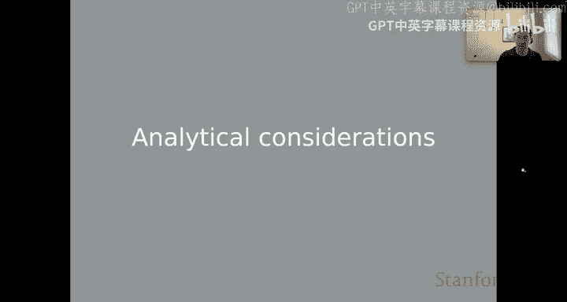
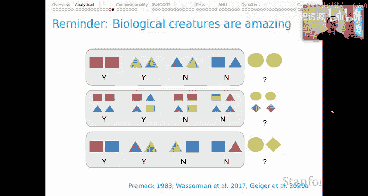

# 26：NLU模型的行为评估与分析考量（第二部分）🔍

在本节课中，我们将继续探讨自然语言理解模型的行为评估方法，并深入分析其背后的考量。我们将重点讨论行为测试能揭示什么、不能揭示什么，以及如何区分模型缺陷与数据集缺陷。

---

## 行为测试的目标与模式 🎯

上一节我们介绍了行为测试的基本概念，本节中我们来看看其具体的目标与模式。行为测试并非总是对抗性的，它也可以用于探索系统能力。

以下是几种可能的研究问题示例，它们从纯粹的探索性逐渐过渡到对抗性：
*   **探索性问题**：我的系统是否学习了关于数字术语的知识？我的系统是否理解否定是如何工作的？我的系统能否处理新的文体或体裁？
*   **对抗性问题**：当应用于虚构的、非常陌生的输入体裁时，系统是否会产生有社会问题的（例如刻板印象的）输出？是否存在某些随机输入会导致系统产生有问题的输出？

所有这些都属于有趣的行为测试范畴。

---

## 行为测试的局限性 ⚠️

然而，行为测试有其固有的局限性。任何数量的行为测试都无法真正保证系统在所有情况下的表现。测试结果完全取决于你决定构建的示例集。

为了说明这一点，请考虑一个判断数字奇偶性的模型。通过有限的测试（如输入4、21、32、36、63），模型可能表现完美。但如果我们“窥视”模型内部，可能会发现它只是一个简单的查找表，仅能处理测试过的几个数字。对于未在列表中的输入（如22），它会默认预测为“奇数”，从而出错。这个弱点并非通过行为测试发现，而是通过检查模型内部机制发现的。

即使模型变得更复杂（例如，通过检查输入字符串的最后一个词来进行分类），我们仍然可能通过检查内部机制（而非行为测试）发现其缺陷（例如，输入“16”时出错）。这说明了行为测试的局限性：我们始终会担心测试中遗漏了某些能暴露系统重大问题的关键案例。

另一个需要记住的附带限制是，在讨论行为测试时，我们通常搁置了评估指标的问题。文献中的挑战和对抗性测试大多采用基础任务中熟悉的指标。虽然这可以接受，但在完整的对抗性测试中，我们应该勇于突破这些任务的限制，以新的方式评估模型，从而暴露新的局限性。

---

## 关键分析点：失败归因 🤔

进行行为测试时，一个关键的分析点是：当我们看到失败时，这是模型的失败，还是底层数据集的失败？

刘等人2019年的一篇题为《通过微调进行“接种”》的论文为此提供了一个思考框架。其核心思想体现在以下引述中：“当系统在挑战数据集上失败时，我们应得出什么结论？在某些情况下，挑战可能利用了原始数据集设计中的盲点（称为**数据集弱点**）。在其他情况下，挑战可能暴露了特定模型族处理某些自然语言现象的固有不足（称为**模型弱点**）。当然，这两者并非互斥。”

人们往往倾向于声称发现了模型弱点，因为这更具影响力。但更可能的情况是，你发现的是数据集弱点——可用的训练数据存在某些问题，导致模型未能达到学习目标。这是一个不那么有趣的结果，因为它通常意味着我们只需要补充更多数据。我们需要谨慎，避免将数据集弱点误认为模型弱点。

我们在关于设计公平但具有挑战性的评估任务的论文中也提出了类似观点：“然而，对于任何评估方法，我们都应该问它是否公平。公平在此意义上指：模型是否看到了足以支持我们所要求的那种泛化能力的数据？除非我们能完全肯定地回答‘是’，否则我们无法确定失败的评估是源于模型限制，还是任何模型都无法克服的数据限制。”

当我们说对模型“公平”时，并非担心它们受到虐待，而是担心犯下分析错误：将失败归咎于模型，而实际上失败在于我们，因为我们给出的规范没有完全消除我们心中学习目标的歧义。这很容易发生，并可能导致对问题的误诊。

---

## “接种”微调框架 💉

之前提到的刘等人2019年的论文提出了一个很好的框架，用于思考如何克服这一分析障碍，区分数据集弱点和模型弱点。这个框架被称为“通过微调进行接种”。

该方法的流程如下：
1.  在原始数据上训练系统。
2.  在原始测试集和我们感兴趣的挑战集上测试它。假设系统在原始测试上表现良好，但在挑战集上表现很差。
3.  为了找出原因，我们在少量挑战示例上进行**微调**以更新模型。
4.  然后在原始数据集和挑战数据集上重新测试。

可能出现三种一般性结果：
*   **数据集弱点**：微调后，模型在原始数据和挑战数据上都表现良好（尤其是挑战集性能大幅提升）。这表明模型的可用训练经验存在一些空白，通过微调可以快速克服。
*   **模型弱点**：即使微调后，模型在挑战数据集上仍然表现不佳，同时保持了原始数据上的性能。这可能意味着挑战集中的新示例对于该模型来说存在根本性的困难。
*   **标注伪影**：微调后，模型在原始测试集上的性能急剧下降。这可能表明我们的挑战数据集对模型做了某些不寻常且有问题的操作，需要我们重新反思所提出挑战的性质。

该论文提供了一个图表，展示了他们在详细研究的对抗性测试中观察到的这三种结果模式。

---

## 案例分析：否定与单调性推理 📚

我想分享的另一个故事来自我们课题组的工作，涉及将否定作为学习目标。这同样是为了帮助大家避免在行为测试中可能犯的严重分析错误。

我们有一个关于否定的直观学习目标：如果A蕴含B，那么非B蕴含非A。这是否定的经典**蕴含反转**特性。文献中的许多论文观察到，我们顶级的自然语言推理模型未能达到这一学习目标。一个诱人的结论是：我们的顶级模型无法学习否定。

但我们必须结合另一个观察：在驱动这些模型的NLI基准测试中，**否定严重 underrepresented**。因此，这应该让我们怀疑，我们发现的可能不是模型弱点，而是数据集弱点。

为了探究这个问题，我们遵循“接种微调”模板，构建了一个略微合成的数据集，称为**MoNLI**。它包含两部分：
*   **Positive MoNLI**：我们从SNLI基准中获取真实假设（如“食物被供应了”），使用WordNet查找特例（如“披萨”），创建蕴含案例（“披萨被供应了”），从而生成新的测试对。
*   **Negative MoNLI**：我们从否定示例开始（如“孩子们没有拿着植物”），使用WordNet查找蕴含关系（“花”蕴含“植物”），创建新示例（“孩子们没有拿着花”）。由于否定的蕴含反转特性，标签模式与正例相反。

我们尽力将此任务设置为困难的泛化任务（例如，在测试中保留整个词），以确保我们考察系统是否真正掌握了词汇关系理论和否定理论。

使用MoNLI作为挑战数据集的初步结果令人担忧。例如，一个在SNLI上训练的BERT模型，在SNLI上表现很好，在MoNLI的正例部分也表现极佳，但在MoNLI的负例部分准确率几乎为零。策略似乎很明显：模型直接忽略了否定。

你可能会想：啊哈，我们发现了BERT的根本局限！但我认为这是不正确的。如果我们对负例MoNLI案例进行一点“接种”微调，该部分的性能立即上升。同时，模型保持了在SNLI上的性能，并在MoNLI负例部分获得了优秀的性能。这强烈表明，我们发现的不是模型弱点，而是**数据集弱点**。

---

## 总结与延伸思考 🧠

本节课中，我们一起学习了NLU模型行为评估的第二部分，重点探讨了分析考量。

我强调了对我们系统的**公平性**，这很重要，可以避免我们混淆视听。但我忍不住要指出，生物体是惊人的。我们现在知道，它们经常能解决在我刚才描述的意义上“不公平”的任务。

一个经典案例是“关系匹配样本”任务。即使是非常年幼的人类和一些动物（包括乌鸦和非人类灵长类动物）也能解决此类任务。例如，向你展示两个红色方块，然后让你从两个选项中选择，人们会选择“两个相同的”来匹配原始提示。人们不需要训练实例就能自然地做到这一点。而如果展示两个不同的形状，人们会选择“两个不同的”。这是我们几乎无需训练数据就能持续进行的“相同-不同”推理。

按此方式提出，我认为这些任务是不公平的。然而，人类和许多生物实体却能系统地解决这些任务。这是关于人类及其他生物认知的一个谜题，我们应该牢记：**人类能解决不公平的任务**。问题是，如果我们确实希望机器学习模型做到这一点，我们该如何让它们解决此类任务？这些还只是较简单的案例，例如，我们还可以进行层次化的相等性推理。经过一些训练，甚至乌鸦也能解决此类问题，而人类基本上无需训练实例或没有足够的训练实例来完全消除任务歧义就能解决。

因此，在向我们的系统提出公平任务的同时，我们应该记住，存在一些场景，我们可能期望一种不被数据支持的解决方案，但尽管如此，我们所有人似乎都能毫不费力地得出这个解决方案。

**本节课中，我们一起学习了行为测试的局限性、失败归因的重要性、“接种”微调的分析框架，并通过否定推理的案例加深了理解。最后，我们对比了机器评估的“公平性”要求与人类解决“不公平”任务的能力，为思考模型评估与人类认知的差异提供了启发。**