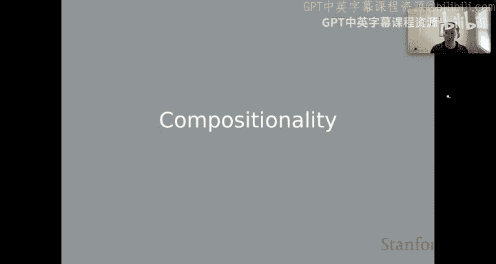
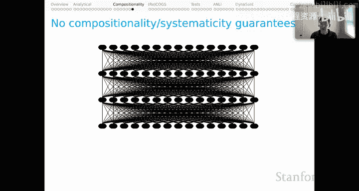
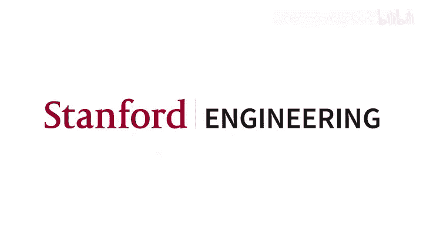

# 27：组合性 🧩

在本节课中，我们将学习自然语言理解中一个核心原则——组合性。我们将探讨其定义、重要性，以及如何通过系统性概念来评估模型的行为表现。

---

## 组合性原则

上一节我们介绍了高级行为测试，本节中我们来看看组合性原则。这是语言学语义学中的一个重要原则，也是理解组合泛化基准（如COGS和ReCOGS）目标的前提。

组合性原则的非正式表述是：**一个短语的意义是其直接句法成分的意义以及它们组合方式的函数**。

让我们通过一个例子来解析这个原则。考虑一个简单的句法结构：句子“Every student admired the idea”。组合性原则指出，这个句子（S节点）的意义完全由其两个组成部分——名词短语（NP）和动词短语（VP）——的意义决定。这暗示了一个递归过程。

名词短语（NP）的意义又完全由其组成部分——限定词（Det）“every”和名词（N）“student”——的意义决定。而这些成分的意义又由其各自的词汇项决定。这就是递归过程的起点。

直觉是：你只需要学习一门语言的所有词汇项，并弄清楚它们如何相互组合，你就获得了一个递归过程，允许你以新的方式组合这些元素并理解新颖的组合。组合性保证了这一点，因为整体的意义是部分意义及其组合方式的函数。

我们也可以自底向上地思考这个过程。我们从词汇项开始，它们的意义是规定或学习记忆的。然后，这些意义依次决定了其父节点（如NP、VP）的意义，进而决定了更复杂节点（如S）的意义，直到我们自底向上推导出整个句子的意义。

---

## 为何重视组合性？

为什么语言学家倾向于坚持组合性原则？其动机通常如下：

首先，作为研究语言的语义学家，我们希望为语言的所有有意义单元建模。这意味着我们需要为每一个词汇项（即使看起来最偶然的）赋予独立的意义，就像优秀的词典编纂者所做的那样。

在实践中，这意味着语言学语义学中存在大量抽象。因为很难（或许不可能）为像“every”这样的词脱离其组合对象而赋予独立意义。因此，实践中赋予的意义通常是函数。例如，“every”是一个函数意义，当与“student”的意义结合时，会产生另一个函数，再与动词短语的意义结合，最终得到句子（S节点）的意义。这类似于全称量化。

其次，我们常听到语言学家谈论人类处理语言的“无限能力”。虽然从抽象角度看，我们理解的句子在复杂性或长度上似乎没有原则性限制，但这需要严格限定。实际上，作为有限的存在，我们制造和理解语言的能力也是有限的。这个说法有些夸大，但其核心直觉更接近于“创造性”。

我们拥有令人印象深刻的语言创造力。大体上，你今天产生和理解的句子，在整个人类历史中可能从未出现过。大多数句子都是如此。然而，我们却能即时、毫不费力地产生这些句子并理解其含义。这确实意味着我们拥有利用有限资源（如词汇项）并以新方式组合它们从而进行语言创造的能力，而组合性可以被视为对此的一种解释。

---

## 组合性与系统性

还有一个来自认知科学的相关概念叫做“系统性”。它可能是一个比组合性更普遍、更准确的描述。

系统性的思想可追溯至Fodor和Pylyshyn。他们说，当我们说语言能力是系统性的时，是指产生或理解某些句子的能力，与产生或理解其他某些句子的能力有着内在联系。

例如，如果你理解句子“Sandy loves the puppy”，那么仅凭这一事实，你也理解“The puppy loves Sandy”。如果你认识到“turtle”和“puppy”之间存在某种分布上的亲和性，你也能立即理解“The turtle loves the puppy”、“The puppy loves the turtle”、“The turtle loves Sandy”等等。你的知识数量会瞬间爆炸式增长，这在某种意义上是你对语言的理解具有系统性的结果。

我认为组合性可能是解释人类语言能力系统性的一种特定方式，但系统性 arguably 更为普遍。它在这里被赋予了一种分布式的描述，可能允许非严格组合但仍具系统性的情况。系统性是思考我们进行的许多行为测试（尤其是假设驱动的挑战测试）背后直觉的一个有力概念。

---

## 系统性直觉示例

以下是一个简短的例子来说明基于系统性的担忧。这来自一个我开发的、我认为相当不错的真实情感分类模型。我开始向它提出一些小挑战。

最初，我对这些例子感到鼓舞：
*   “The bakery sells a mean apple pie.”（这家面包店卖的苹果派很棒。）—— 这是一个积极的评价，涉及“mean”这个词非常特殊的含义（意为“出色的”）。我很高兴模型的预测标签与黄金标签一致。
*   “They sell a mean apple pie.”（他们卖的苹果派很棒。）—— 同样，预测正确。

我开始认为我的模型真正理解了形容词“mean”的这个非常专业的含义。

但这种想法在接下来的两个例子中破灭了：
*   “She sells a mean apple pie.”（她卖的苹果派很棒。）—— 模型预测为消极。
*   “He sells a mean apple pie.”（他卖的苹果派很棒。）—— 模型预测为消极。
而黄金标签当然仍然是积极的。

这些错误令人担忧，但我更担心的是缺乏系统性。作为人类，我绝不期望将主语从复数代词改为单数代词，或者使用代词而非完整名词短语（如“the bakery”），会影响到对其中形容词“mean”的解释。然而，模型的预测却改变了，这对我来说表现为一种系统性的缺失。

这种直觉指导了许多对抗性或挑战性数据集的构建。人们基于语言的系统性提出假设，并在模型中观察到偏离该假设的情况，从而开始担忧这些模型。

---

## AI模型历史中的组合性

回顾AI模型的历史，思考组合性原则很有趣。

在AI的早期时代，如我们在第一天看到的SHRDLU或CHAT-80系统，我们通过设计获得了某种组合性，因为它们是本身遵循组合性原则的符号语法实现。因此我们并不怀疑这些NLU模型是否具有组合性，因为我们预设它们会有。

这种思想的一部分实际上延续到了更现代的机器学习时代。例如，许多语义解析系统（如Percy Liang工作中描述的系统）在底层也有组合语法，其任务是学习该语法规则的权重。因此，可以说其产物是具有组合性的，并带有一些随机性（因为它们是概率模型）。

即使在更现代的深度学习时代，我们也看到了 arguably 具有组合性的系统。例如，启动斯坦福情感树库的论文中描述的是一个递归树结构神经网络。从所有节点表示向量，并通过复杂的深度学习函数组合这些向量以推导其父节点意义的角度看，它遵循了组合性原则。这个过程递归进行，直到获得整个句子的意义。

因此，它不像旧系统或语言学语义学中的许多工作那样是符号化的，但它 arguably 是一个组合系统。事实上，这是这些深度学习产物一个有趣的性质。

---

## 当前挑战与开放问题

但现在，我们似乎已经远离了那种视角。我们时刻面对着这些庞大的、通常基于Transformer的模型，其中一切都相互连接。显然，我们无法保证这些网络内置了组合性或系统性。

事实上，在早期，人们常常担心，尽管这些模型表现良好，但它们可能在学习非系统性的解决方案，这激发了对它们的大量挑战测试。

现在的问题是：**我们能否提出行为测试，来真正评估这些难以进行解析分析的模型，是否为我们提出的语言问题找到了系统性的解决方案？**

如果答案是否定的，我们应该担忧。如果答案是肯定的，那将是一个惊人的发现，既解释了这些模型为何表现如此出色，也揭示了仅靠数据驱动学习就能为语言问题提供系统性解决方案的强大能力。因此，这是一个开放性问题，但随着我们的模型即使在面对我们提出的困难行为任务时也表现得越来越好，探索这些问题变得异常令人兴奋。

---

## 总结

本节课中，我们一起学习了自然语言理解中的组合性原则。我们了解了其定义、作为解释人类语言创造性和系统性基础的重要性，并通过实例看到了模型缺乏系统性可能带来的问题。我们还回顾了组合性原则在AI模型历史中的体现，并提出了当前大模型时代评估其系统性的重要性与挑战。理解并测试组合性与系统性，对于构建真正可靠、可理解的NLU模型至关重要。