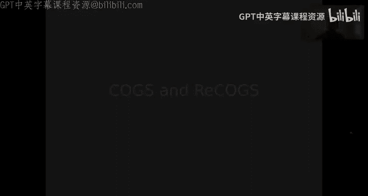
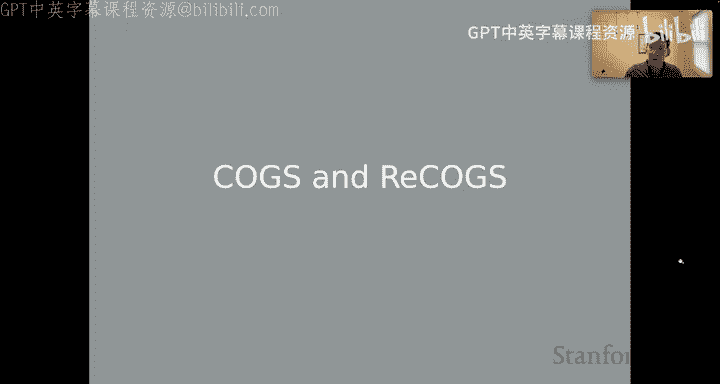
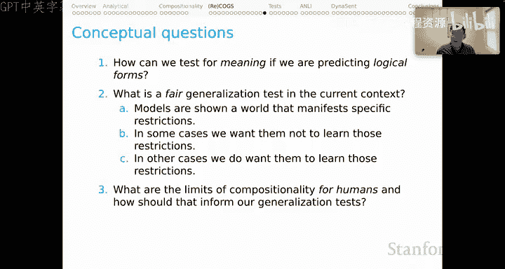

# 28：NLU模型的行为评估（四）：COGS与ReCOGS 📚






在本节课中，我们将学习两个专门用于测试模型组合泛化能力的基准：COGS和ReCOGS。我们将探讨它们的设计动机、逻辑形式的特点、评估分割的结构，以及ReCOGS如何改进COGS以更纯粹地测试语义现象。

---

## 概述

上一节我们讨论了组合性原则。本节我们将聚焦于课程作业相关的两个基准：COGS和ReCOGS。它们旨在测试模型是否能像人类一样，系统性地理解熟悉元素的新颖组合。

COGS设定了议程，而ReCOGS是我们的扩展。我们希望通过ReCOGS，首先理解为何COGS中的某些泛化分割对当今模型极具挑战性；其次，重新构建COGS，使其更接近测试纯粹的语义现象，并抽象掉COGS中某些逻辑形式的偶然性特征。

---

## COGS任务描述

COGS的输入是简单的英语句子，例如：
> a rose was helped by a dog.

输出是逻辑形式，即句子含义的描述。对于COGS和ReCOGS，这些描述采用一种事件语义风格。

**示例逻辑形式：**
```
rose(x1) & indefinite(x1) & help_theme(e3, x1) & agent(e3, x6) & dog(x6) & indefinite(x6)
```

*   `rose(x1)` 和 `indefinite(x1)` 对应句子的语法主语“a rose”。
*   `help_theme(e3, x1)` 描述了帮助事件的主题论元，`e3`是该事件的变量。
*   `agent(e3, x6)` 描述了该事件的施事者论元。
*   `dog(x6) & indefinite(x6)` 将`x6`识别为“a dog”。

另一个涉及定指描述的例句：
> The sailor dusted a boy.

其逻辑形式包含 `*` 操作符来表示定指描述。

---

## ReCOGS任务描述

ReCOGS在许多方面与COGS相似，但逻辑形式更简洁。

**相同例句在ReCOGS中的逻辑形式：**
```
rose(x1) & indefinite(x1) & help(e7) & theme(e7, x1) & agent(e7, x6) & dog(x6) & indefinite(x6)
```

主要改进包括：
*   移除了许多与变量相关的冗余符号。
*   重组了合取结构。
*   事件描述更透明（例如，将“帮助事件”本身作为一个独立的谓词`help(e7)`）。

---

## 设计动机与核心问题

COGS和ReCOGS的动机紧密关联组合性原则。我们观察到，人类能轻松、系统地解释熟悉元素的新颖组合。对我们说英语的人来说，这种泛化如此不费吹灰之力，以至于COGS的泛化分割有时都难以被视为组合泛化任务。

**核心问题：**
1.  我们最好的模型能否进行组合泛化？
2.  它们是否也找到了组合性的解决方案？（一个关于其内部因果机制的更深层问题）

COGS和ReCOGS的愿景是，通过行为任务帮助我们解决关于泛化的问题。如果模型能在这些任务上成功，我们就有理由相信它们找到了组合性解决方案，因为这是对其成功的最佳解释。

---

## 深入理解COGS逻辑形式

COGS的逻辑形式有一些有趣特征，有助于解释文献中观察到的结果模式。

**动词与事件：**
动词指定了具有自身核心概念结构的原始事件，可涉及一个或多个强制性或可选性角色。
*   例句：`Emma broke a vase.`
    *   核心是一个打破事件`break(e2)`，有两个参与者：施事者`Emma`和主题`a vase`。
*   相关句：`The vase broke.`
    *   缺少施事者论元，主题论元被提升为英语句子的语法主语。

**变量编号规则：**
在COGS中，变量编号由其在输入句子中的线性位置决定。例如，动词`break`在输入句中是第2个位置，因此它锚定的事件变量是`e2`。事实证明，这一特征严重影响了现代模型（尤其是带有位置编码的模型）的性能。

**变量绑定：**
COGS和ReCOGS逻辑形式中的所有变量都是被绑定的。看似自由的变量（如`x1`, `x2`）实际上都被最广辖域的存在量词前缀所约束。定指描述则由`*`操作符进行局部绑定。

---

## COGS评估分割结构

COGS的数据分割结构如下：
*   **训练集：** 规模较大。
*   **开发集和测试集：** 均为IID（独立同分布）数据，用于标准评估。
*   **泛化示例集：** 包含21,000个示例，对应**21种不同的分割**，每种都旨在探究模型对不同组合泛化现象的能力。

以下是泛化分割的主要类别：

**熟悉短语置于新位置：**
例如，“主语到宾语”分割意味着在训练中，我们看到像“hedgehog ate the cake”这样的句子，其中“hedgehog”是主语；而在泛化分割中，我们首次遇到“hedgehog”出现在非主语的位置。

**原始语法角色：**
在训练中，像“shark”这样的原始元素作为孤立元素出现；在泛化中，我们在完整的句子语境中遇到它们，模型需要弄清楚如何处理。

**修饰短语的新组合：**
例如，“宾语修饰到主语修饰”意味着像“on the plate”这样的修饰语在训练示例中出现在宾语位置，而在泛化分割中出现在主语位置。这被证明非常困难。

**更深层的递归：**
对于句子补语和介词短语补语，在训练中我们看到一定递归深度，在泛化中我们看到更深的递归。

**其他类别：**
包括句法角色交替（主动到被动）、论元结构转换以及涉及动词类别的分割。

---

## 现有模型的性能与谜题

为了解现状，我们在ReCOGS论文中汇总了文献中多个重要论文处理COGS问题的结果，形成了一个“合成排行榜”。

**观察结果：**
*   **整体性能：** 如果只看“整体”列，一些模型在泛化分割上的准确率达到了80%以上，看起来表现不错。
*   **词汇泛化：** 在涉及词汇泛化的分割上，模型取得了令人印象深刻的高分。
*   **结构泛化：** 然而，在三个被我们称为“结构泛化任务”的列中（Obj PP to Subj PP, CP Recursion, PP Recursion），模型的表现几乎是**全零或接近零**。

这强烈表明模型完全无法在这些结构泛化任务上取得任何进展，背后存在系统性问题。这正是我们开始ReCOGS研究时想要解开的谜团：这些零分或接近零分的背后原因是什么？

---

## ReCOGS的改进措施

基于对COGS局限性的分析，我们实施了多项改进以创建ReCOGS。

**1. 移除冗余标记**
COGS逻辑形式中存在大量冗余标记。例如，每个变量都以“X _ [数字]”的形式出现，其中“X _ ”是冗余的。我们移除了这些冗余部分，只保留数字作为变量标识。这个看似保留语义的简单更改，极大地改善了模型性能，因为它平衡了数据中的n-gram频率分布，使语言模型所处的数据环境更健康。

**2. 解耦长度与递归深度**
我们发现，在CP和PP递归分割中，泛化示例的长度分布与训练示例有显著不同，泛化示例要长得多。这使得“递归”问题与“长度泛化”问题纠缠在一起。为了将它们分开，我们通过**拼接现有训练示例并重新索引变量名**的方式，创建了更长的训练示例。这确保了模型在训练时就能接触到与测试时相似的长度范围和变量名。实验表明，这一方法显著提升了LSTM和Transformer模型在递归分割上的性能，说明原先的难点主要在于长度泛化，而非递归本身。

**3. 扩展PP修饰语的分布**
对于PP修饰语分割（那一列零分），我们的假设是：COGS的训练数据教会了模型“PP只与特定的变量和位置关联”。当模型学会这一“错误”教训后，就无法处理在泛化时出现的、违反此规律的例子。为了打破这种虚假关联，我们进行了**多种语义保留的数据增强**：
*   **宾语名词短语前置：** 例如，将“Emma was lent the box in the tent.”变为“The box in the tent, Emma was lent.”。
*   **插入感叹词：** 在句子中随机插入“um”等填充停顿词，这会改变变量名和位置。
*   **使用分词结构：** 例如，将介词修饰语改为分词结构“a leaf painting the spaceship”。
这些操作扩展了PP在训练数据中关联的变量名和位置范围，从而大幅提升了模型在PP修饰语分割上的性能。

**4. 引入任意变量命名**
在COGS中，变量名与输入字符串中的位置绑定。在ReCOGS中，我们切断了这种联系，以**语义一致但任意的方式分配变量名**。这迫使模型学习抽象于具体变量名的语义结构。

**ReCOGS逻辑形式示例：**
对于输入句“Mia ate a cake”，经过上述改进后，ReCOGS的逻辑形式更加简洁，变量命名与输入位置无关。

---

## 改进效果与总结

这些改进的综合效果是显著的：
*   对于COGS，结构泛化任务的表现非常差。
*   冗余标记移除主要帮助了词汇泛化，但对顽固的结构分割影响不大。
*   **语义保留的数据增强**和**任意变量重命名**则戏剧性地改善了结构泛化分割的性能，使得模型在COGS/ReCOGS问题的各个方面的表现更加均衡。

实验结果表明，ReCOGS并非一个更简单的任务，它的某些方面实际上比COGS更难。但关键是我们证明了，在那些曾导致全零结果的、极其顽固的结构泛化分割上取得进展是可能的。因此，我们认为ReCOGS是一个更健康的、可供模型攀登的基准，它让我们更接近测试我们所关心的纯粹语义现象。

---

## 遗留的开放性思考

在深入研究COGS和ReCOGS之后，一些概念性问题依然萦绕：

1.  **如何通过逻辑形式测试真实含义？** 逻辑形式本身也是句法表达式，总带有一定的任意性。这始终会阻碍我们纯粹地判断模型是否真正理解了句子的含义。
2.  **什么是公平的泛化测试？** 我们关于组合性的许多见解，开始触及“不公平”的边界。例如，我们有意在训练中隐藏某些模式（如PP只出现在宾语位置），却期望模型在测试时能处理它们（如PP出现在主语位置）。困难在于，对于某些现象，我们希望模型**不要**学会训练数据中的限制；而对于另一些现象，我们又希望它们**学会**。从概念上区分这两类现象极其困难。
3.  **人类组合性的界限在哪里？** 这或许是最终的基准。我们假设自然语言是组合性的，但这假设很强，必然有其局限性。也许我们应该先弄清楚人类如何泛化、在何处无法泛化，然后期望我们的模型能遵循。但这引发更多问题：如果我们有数据集无法支持、但对模型而言是良好的目标，该如何在任务和模型中表达？

---

## 总结




本节课我们一起深入探讨了用于评估NLU模型组合泛化能力的两个重要基准：COGS和ReCOGS。我们了解了COGS的任务设计、逻辑形式特点及其具有挑战性的泛化分割。通过分析模型在COGS上的失败模式，我们揭示了其背后可能的原因，如冗余标记、长度泛化与递归的耦合、以及训练数据带来的虚假分布限制。在此基础上，ReCOGS通过移除冗余、解耦长度与深度、进行语义保留的数据增强以及引入任意变量命名等改进，旨在更纯粹、更公平地测试模型的语义组合能力。尽管仍有许多开放性问题，但这些基准为我们推动模型实现真正的人类式组合泛化提供了重要的工具和思考方向。