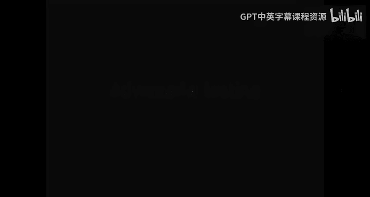
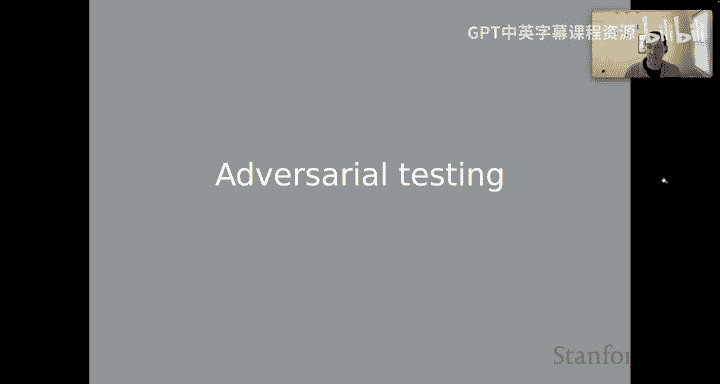
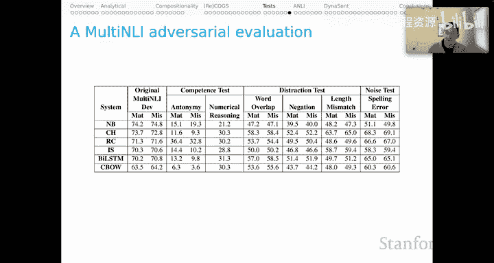

# 29：NLU模型的行为评估，第五部分：对抗性测试 🛡️

在本节课中，我们将学习对抗性测试，这是一种评估自然语言理解模型鲁棒性的重要方法。我们将回顾几个著名的对抗性测试案例，分析它们揭示的模型弱点，并探讨这些挑战如何推动了模型的进步。

上一节我们讨论了行为测试的优势与局限。本节中，我们将通过几个近期著名的对抗性测试案例，来学习它们带给我们的启示。特别是从历史视角来看，我们对于这些挑战的本质有了许多新的认识。

## SQuAD 对抗性测试 📚

让我们从SQuAD开始。这张幻灯片展示了近期SQuAD排行榜的截图。SQuAD排行榜对人类很友好，因为它将人类表现置于排行榜顶端。可以看到，人类在SQuAD上的精确匹配率约为87%。

但请注意，根据这个指标，你需要一直翻到排行榜第31位才能找到一个表现不如人类的系统。许多系统的表现都远超人类。这很容易让人得出“计算机在回答问题方面已超越人类”的结论，其依据就是SQuAD。Jia和Liang在2017年进行的首次重要对抗性测试，正是受到了这类标题的启发。这标志着NLU现代对抗性测试时代的一个重要开端。

首先，回顾一下SQuAD任务：给定上下文证据段落，提出一个问题，任务是在段落中找到一个子字符串作为答案。

Jia和Liang的直觉是，模型可能过度拟合了SQuAD中的特定数据。他们设置了一些对抗样本来诊断这个问题。他们的对抗方法是在这些段落的末尾附加误导性句子。

例如，附加句子“Qua Leland Stanford had Jersey number 37 in Champo 34”。Jia和Liang发现，有了这些附加句子，模型会转而开始回答“Leland Stanford”。它们被这个新的、错误的证据分散了注意力。

这令人担忧。你可能会想，我们肯定能克服这个对抗样本。我们应该做的是用这些附加了句子的增强训练集重新训练模型，模型就一定能克服这个对抗样本。事实上，模型确实克服了这个特定的对抗样本，不再被附加句子误导。

但Jia和Liang想得更远。如果我们将误导性句子**前置**到证据段落开头呢？他们再次发现模型被分散注意力，开始使用第一个新句子来回答“Leland Stanford”。

你可能会想，我们现在可以在同时包含前置和附加句子的增强训练集上训练，也许就能克服对抗样本了。但你可以看到我们陷入了一种动态博弈。现在我们可以把误导性句子放在段落中间。模型很可能再次表现不佳。

模型确实再次失败了。这里展示了一个排行榜，对比了当时SQuAD的顶级系统在原始数据集和Jia-Liang对抗集上的表现。显然，系统在这个对抗集上的整体性能大幅下降，这本身就足够令人担忧。

但我们应该看得更仔细。值得注意的是，原始排名在这个对抗性排行榜上几乎完全被打乱。原来的第一名系统跌到了第5位，第二名跌到了第10位，第三名跌到了第12位。原来的第7名现在在对抗集上排第一。关键是，原始表现和对抗表现之间几乎没有关联。

这张图证实了这一点：X轴是原始系统性能，Y轴是对抗性能。这些点呈云状分布，显示两者之间没有明显的相关性。这可能表明系统过度拟合了原始的SQuAD问题，并且以相当混乱的方式处理这个对抗集。这本身就令人担忧。

需要说明的是，我不确定这个特定对抗集在当前模型上的状态。我很想为你提供关于更现代的Transformer系统在这些对抗集上表现如何的证据。但据我所知，还没有人进行过系统性的测试。我认为拥有这些数据点会很有价值。

## 自然语言推理的对抗性测试 🤔

让我们看第二个例子：自然语言推理。幻灯片上展示了SNLI（该任务的主要基准之一）随时间的性能变化图。X轴是时间，Y轴是F1分数，红线标记了我们对人类性能的估计，蓝线追踪了已发表文献中的不同系统。需要强调的是，这些基本上都是已发表的论文。

你可以看到随着时间的推移，性能快速提升，最终超过了我们对人类性能的估计，并且这条线几乎是单调递增的。这强烈地向我表明，已发表的论文正在从前人的论文中学习如何在SNLI任务上表现出色的隐性经验。

但重点是，我们现在确实有了超越人类水平的系统。MultiNLI排行榜则有些不同。它托管在Kaggle上，任何人都可以参加。因此，有更多的系统在这个排行榜上竞争，并且那种社区范围内在任务上的“爬山”现象要少得多，因为互不沟通的人们只是提交系统看看结果。所以蓝线上下振荡，但这仍然是一个朝着人类性能估计值进步的故事。

如果你只看这些数字的表面价值，你可能会得出结论：我们正在开发真正擅长进行自然语言推理（实际上是常识推理）的系统。

然而，对抗性测试背后的直觉再次让我们对此感到担忧。NLI领域最早且最具影响力的对抗性测试之一是Glockner等人2018年的工作，即“Breaking NLI”论文。他们的方法在概念上非常简单，并且很好地利用了关于系统性和组合性的直觉。

以下是两个例子。第一个例子利用了同义词。来自SNLI的原始前提是“A little girl kneeling in the dirt, crying.”，这蕴含了“A little girl is very sad.”。他们为对抗样本所做的只是将“sad”改为“unhappy”。😔 这些本质上是同义词，因此我们期望系统在这种情况下继续判断为“蕴含”。

但Glockner等人观察到，即使是最好的系统也倾向于开始将其判断为“矛盾”情况。它们这样做是因为它们过度拟合了“否定词的出现是矛盾的指标”这一假设。

我再次喜欢这个测试，因为它显然利用了关于系统性的直觉。我们假设同义词替换应该保留SNLI标签，但系统就是不遵守这种基本原则。

第二个例子类似。前提是“An elderly couple are sitting outside a restaurant enjoying wine.”。原始的SNLI案例是“A couple drinking wine.”，标签是“蕴含”。对于Breaking NLI，他们将“wine”换成了“champagne”。现在，我们有了两个在概念层次上是“兄弟”关系的词。它们彼此互斥，但语义上非常相关。人类的直觉是，这些例子现在是“中立”的，因为“wine”和“champagne”是互斥的。但系统对这种词汇细微差别只有非常模糊的理解，因此它们也非常倾向于将这个案例判断为“蕴含”。这再次体现了关于词汇系统性及其如何影响我们对自然语言推理判断的直觉，而我们并没有从这些系统中看到类似人类的行为。

这是Glockner等人论文中的结果表。我认为我们应该排除最后几行，理由是那些系统使用了WordNet（创建对抗集时使用的资源）。看看前三行的系统，你会发现它们在SNLI测试集上表现很好（F1分数在80多分），但在新的对抗测试集上表现极差，性能存在巨大落差。

这很有趣，也令人担忧。但我们应该在此暂停，更仔细地看看这个表格，特别是“模型”这一列。所有这些模型都来自Transformer时代之前。事实上，它们正处于Transformer时代的边缘。这些都是带有大量注意力机制的循环神经网络实例，几乎触及了“注意力应成为主要机制”这一洞见。你也能从它们的SNLI测试结果（低于我们今天基于Transformer架构常规训练的系统）中看出它们所处的历史时期。

因此，我们应该问自己，如果我们测试一些更新的Transformer模型会发生什么？我决定这样做。我简单地下载了一个在MultiNLI数据集上微调过的RoBERTa模型（这与Glockner等人用来创建数据集的SNLI不同）。这是进行测试的代码，有点繁琐，所以我决定复现它。

这里的结论是：这个现成的模型**基本上解决了**Glockner等人的对抗集。我们应该只看“矛盾”和“蕴含”类别，因为“中立”在这个小挑战集中的样本太少。你可以看到令人印象深刻的高F1分数，与Glockner等人在前Transformer时代报告的结果截然不同。请记住，这甚至是在领域转移的情况下，因为这个RoBERTa模型是在MultiNLI上训练的，而测试的是源自SNLI的例子。这看起来像一个真正的成功故事，一个基本上被克服了的对抗集。我认为即使是最持怀疑态度的人也会将此视为进步的一个实例。

## 另一个NLI对抗性测试案例 🔍

让我们看第二个NLI案例。这个案例的发展会有些不同，但同样有一些重要的经验教训。这来自Nie等人2018年的工作。这是一个更大的对抗性测试基准，包含许多不同的类别：反义词、数字、词汇重叠、否定等。

对于其中一些类别，他们做了与Glockner非常相似的事情，即利用关于组合性或系统性的底层直觉，来处理诸如“爱/恨”或围绕数字术语的推理。但这个数据集也包含了一些在我看来更直接的对抗性内容，例如在示例末尾附加一些冗余或令人困惑的元素，以查看是否影响系统性能。我认为这更像是SQuAD对抗性测试的直觉。

这是一个相当大的基准，里面有很多例子。结果讲述了一个类似的故事：系统在MultiNLI上表现相当好，但在这个对抗性基准的所有子集上表现得非常、非常差。

但我们之前见过这个数据集。在讨论“通过微调进行免疫”的论文时，我们谈到过它。这张中心图中六个面板中的五个实际上都来自这个Nie等人的基准，但它们讲述了非常不同的故事。我们看到“词汇重叠”和“否定”被诊断为**数据集弱点**实例，即如果给予足够的相关证据，模型解决这些任务没有问题。相比之下，“拼写错误”和“长度不匹配”是**模型弱点**，模型在这些方面确实无法取得进展，因此这些可能仍然令我们担忧。而“数字推理”是**数据集伪影**的一个例子，即示例中的某些东西确实干扰了原本相当稳健的模型的性能。

因此，来自同一个挑战或对抗性基准，我们得到了三个非常不同的教训。我认为这也是进步的一个标志，因为我们现在有了工具，可以帮助我们在理解模型为何在这些不同的挑战测试集上失败方面，深入一个层次。毕竟，这正是我们希望通过这种新的行为测试模式来实现的分析性洞见。

## 总结 📝

本节课中，我们一起学习了对抗性测试在评估NLU模型鲁棒性中的关键作用。我们回顾了SQuAD和NLI领域的几个经典对抗性测试案例，看到了模型如何因过度拟合、缺乏系统性理解或对特定数据模式的依赖而失败。同时，我们也见证了技术进步（如Transformer架构）如何帮助模型克服了早期的某些对抗性挑战。更重要的是，我们认识到对抗性测试不仅能暴露弱点，其细致的分析（如区分数据集弱点、模型弱点和数据集伪影）还能为我们提供更深入的诊断见解，从而指导模型朝着更稳健、更类人的方向改进。对抗性测试是推动NLU模型不断超越表面指标、实现真正理解的重要工具。