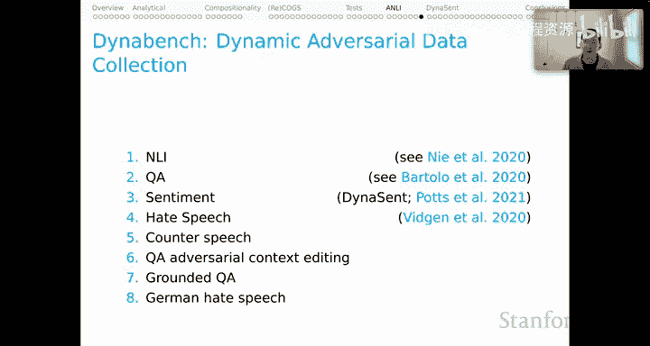

# 30：对抗性自然语言推理 🛡️

在本节课中，我们将学习自然语言理解模型行为评估的进阶部分，重点关注**对抗性训练**的潜在益处。我们将深入探讨开创性的 **ANLI** 基准及其背后的动态对抗数据收集愿景。

---

上一节我们回顾了模型在系统性测试中暴露的弱点。本节中，我们将探讨如何通过将对抗性案例纳入训练集来增强模型的鲁棒性。

## ANLI：对抗性自然语言推理基准

ANLI 论文及相关基准是这一领域的开创性工作。据我所知，ANLI 是首次尝试创建一个**真正大规模、充满对抗性示例的训练集**。这些示例能够“欺骗”当时性能顶尖的模型，但对人类而言却直观易懂。

可以公允地说，ANLI 是对我们上一节所回顾的对抗性测试结果的直接回应。当时我们看到，一些 NLI 模型的表现超过了我们对人类水平的估计，却在涉及语言**系统性**或**组合性**的简单现象上失败。

ANLI 的愿景是：通过在训练集创建中引入对抗性动态，我们可以获得更鲁棒的模型。

以下是数据集创建的工作流程：

1.  向标注员展示一个前提句和一个条件（蕴含、矛盾或中立，即 NLI 的标签之一）。
2.  标注员根据条件撰写一个假设句。
3.  一个顶尖模型对这个生成的前提-假设对进行预测。
4.  如果模型的预测与条件匹配（即模型预测“正确”），则标注员返回第 2 步重试。
5.  如果模型被“欺骗”（预测错误），则该前提-假设对会由其他人类标注员独立验证后纳入数据集。

与顶尖模型的这种动态交互过程，产生了一个充满**真正困难案例**的训练集——既包含欺骗了该模型的案例，也包含未能欺骗它的案例。

ANLI 的示例颇具特色。其前提句往往较长，假设句则具有挑战性。有趣的是，数据集中还包含了“推理文本”，这是标注员对模型为何在该特定示例上遇到困难的最佳解释。据我所知，这些推理文本在文献中未被充分利用，但它们作为任务的一种间接监督来源，非常值得关注。

## ANLI 核心结果分析

以下是 ANLI 论文的核心结果表。信息量很大，但故事线相当清晰。

让我们聚焦于 **BERT** 模型。可以看到，在所有不同的训练方案变体中，BERT 在 **SNLI** 和 **MultiNLI** 基准上都表现优异。

然而，当模型**仅**在 SNLI 和 MultiNLI 上训练时，它在 ANLI 上的表现非常差（三回合数据汇总后准确率仅约 20%）。

当我们用之前回合的 ANLI 数据来**增强**该模型的训练数据时，在 ANLI 列确实看到了整体性能的提升，这令人鼓舞。看起来，随着更多对抗性示例加入训练，模型在该任务上变得更好。

但根本的洞见在于：**ANLI 上的性能远低于其他基准的性能**，因为这是一个巨大的挑战。据我所知，这个重大挑战至今依然存在，模型在 ANLI 上并未达到卓越水平。

## 动态基准的愿景

ANLI 最吸引我的一点是，它为领域未来训练和测试资产的发展投射了一个非常有趣的愿景。这要完全归功于 Zellers 等人的工作，他们在关于 SWAG 和 HellaSWAG 的论文中也描述了这个愿景。

他们为 NLP 的进步规划了一条道路：**基准与不断发展的顶尖模型进行对抗性协同进化**。

这个故事细节很多，但简要来说：Zellers 等人首先引入了 **SWAG**，这是一个为对抗性测试创建的合成训练与测试环境。他们发现它非常困难，但当 BERT 论文出现后，BERT 基本上解决了 SWAG 问题。作为回应，Zellers 等人对 SWAG 数据集进行了一些调整，产生了 **HellaSWAG**。HellaSWAG 对 BERT 来说要困难得多，并且我相信它至今仍是一个具有挑战性的基准。

这开启了一条道路，让我们看到创建数据集、用其开发模型，然后在模型似乎成功时以**更难的挑战**作为回应，这一过程可以多么富有成效。

在 ANLI 论文中，他们非常直接地阐明了这一愿景：
> 这个过程为 NLU 系统产生了一个**动态移动的目标**，而不是一个最终会饱和的静态基准。

这听起来极具生产力。在整个领域，大型团队花费大量时间和金钱，只为在已有基准上获取微小的性能提升。如果我们能在看到基准饱和时，直接创建新的基准并为自己提出新的挑战，那该多好。如果进行这种“移动目标”式的实践，模型很可能会进步得更快，能力也变得更强。

## Dynabench：实现愿景的平台

这正是 **Dynabench** 的愿景。Dynabench 是一个开源软件项目，一个用于（除其他功能外）**动态对抗性数据收集**的开源平台。

截至目前，Dynabench 已经产生了许多数据集。ANLI 是第一个，是先驱。此外，还有 Dynabench 衍生的用于**问答**、**情感分析**的数据集，以及多个用于**仇恨言论**（包括反仇恨言论）的数据集。我们还有几个关于问答的数据集和一个关于德语仇恨言论的数据集。我相信这个列表将继续增长，为我们提供这些不可思议的新资源。

---

本节课中，我们一起学习了对抗性训练的理念，深入分析了 **ANLI 基准**的创建方法、核心结果及其揭示的模型局限性。更重要的是，我们探讨了通过 **Dynabench** 平台实现的、让基准与模型**协同进化**的愿景，这为自然语言理解领域的持续进步指明了一个富有前景的方向。

下一节，我们将深入探讨一个我们创建的、名为 **Dynasent** 的 Dynabench 衍生数据集。