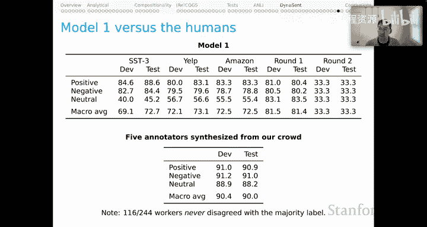
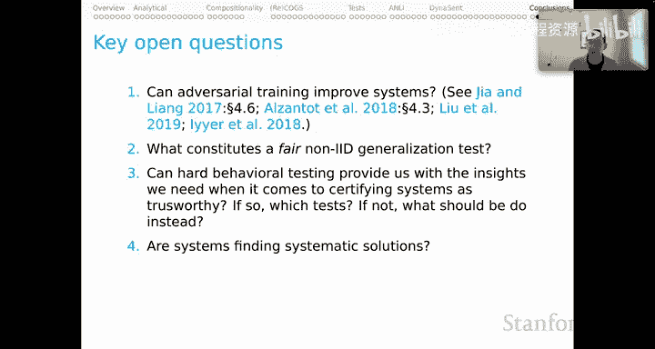

# 31：DynaSent 数据集与行为评估结论 🧠

在本节课中，我们将深入探讨 DynaSent 数据集，并总结关于自然语言理解模型行为评估的系列内容。DynaSent 是一个大规模、多轮次构建的情感分析数据集，其创建过程融合了对抗性数据收集与人工验证，旨在为模型评估提供更严苛的基准。

上一节我们介绍了对抗性训练集的概念以及 DynaBench 平台。本节中，我们将详细解析 DynaSent 数据集的构建过程、设计理念及其在模型评估中的应用。

## DynaSent 项目概述 📊

DynaSent 是一个包含超过 12 万个句子的重要资源，涵盖两轮数据收集。每个例句都附有五位众包工作者提供的黄金标签。该项目的第二轮数据是在 DynaBench 平台上通过有趣的对抗性动态过程创建的。

以下是该项目的整体流程概览：
*   **两轮构建**：包含初始数据收集和对抗性增强两轮。
*   **两个模型参与**：使用初始模型（Model 0）发现数据，使用增强模型（Model 1）进行对抗性挑战。
*   **广泛人工验证**：每一轮都进行了大量的人工标注与验证。

## 第一轮数据构建 🔄

第一轮的起点是 **Model 0**。我们将其作为一个工具，用于从网络上发现自然出现的有趣案例。对这些案例进行人工验证后，便得到了第一轮数据集。

### Model 0 的构建

Model 0 是一个基于 RoBERTa 的模型，在大量情感分析示例上进行了微调。我们使用了五个基准数据集来开发这个模型，并将所有数据集都视为**三元情感问题**（积极、消极、中性）。该模型在 SST-3、Yelp 和 Amazon 这三个外部数据集上表现良好，使其成为一个可靠的、用于从真实场景中挖掘示例的工具。

### 数据收集与验证

我们探索的空间是 Yelp 开放数据集，并采用以下启发式方法：
*   倾向于选择评论为一星但 Model 0 预测为积极的句子。
*   反之，倾向于选择评论为五星但 Model 0 预测为消极的句子。

我们使用的唯一标签来自人工验证阶段。每个例子由五位工作者验证，他们需要判断句子的情感是积极、消极、无情感还是混合情感。

### 第一轮数据集概览

最终得到的数据集规模可观，其中 **47%** 的例子是对抗性的。数据集同时包含对抗性和非对抗性案例，这对于构建高质量的基准测试非常重要。

关于在此资源上进行训练，有两种方式：
1.  **多数标签训练**：将一个例子的标签定义为至少三位标注者选择的标签。如果没有这样的多数标签，则将其归入“其他”类别。
2.  **分布训练**：将每个例子根据其从众包工作者那里获得的所有五个标签重复五次，并在整个集合上进行训练。这种方式能保留所有例子，并让模型更细致地学习人类情感判断的分布，实践中能产生更鲁棒的模型。

对于开发集和测试集，我们只关注积极、消极和中性三类，以构成一个清晰的三元情感问题，并在这三个标签上进行了平衡。

### 模型与人类表现

我们设置实验使得 Model 0 在第一轮数据上的表现处于随机水平。相比之下，人类在第一轮数据上表现极佳，我们估计人类的 F1 分数约为 **88%**。数据显示，1200 位工作者中有 614 位从未与多数标签产生分歧，这表明人类在该资源上具有高度的一致性和共识。

## 第二轮数据构建 ⚔️

第二轮与第一轮有显著不同。我们以 **Model 1** 为起点，这是一个在外部情感基准以及我们所有第一轮数据上微调过的 RoBERTa 模型。此阶段的直觉来源于 ANLI 项目，即应该在自身动态数据集收集的先前轮次上训练模型。

在此阶段，我们不再从野外收集例子，而是使用 **DynaBench** 平台来众包那些能够“愚弄” Model 1 的句子，然后对这些句子进行人工验证，从而得到第二轮数据集。

### Model 1 的构建与表现

Model 1 同样基于 RoBERTa，并在相同的外部基准上进行训练，但为了给予第一轮数据更多权重，对外部数据进行了降采样。该模型在外部数据集上保持了良好性能，同时在第一轮数据上达到了约 **80%** 的准确率，这表明在引入第一轮数据后，模型性能得到了有效提升。

### 对抗性例句的众包策略

我们深入探讨了例句的众包方式。最初，我们仿照 ANLI 的做法，要求工作者从头开始编写句子来以特定方式愚弄模型。然而，这被认为是一项非常困难的创造性写作任务，容易导致数据集中出现重复模式。

因此，我们转向强调 **“提示条件”**。在这种条件下，我们向众包工作者提供一个来自 Yelp 开放数据集的自然出现的句子，他们的任务是编辑这个句子以达到愚弄模型的目的。结果，我们获得了质量更高、例子更自然的数据集。

### 第二轮数据集概览

验证方式与第一轮相同。最终数据集中只有 **19%** 的例子是对抗性的，这表明在此过程中，我们已经拥有了一个非常强大、难以被愚弄的情感模型。尽管如此，19% 在数量上仍然可观。这是一个比第一轮稍小的基准，但具有类似的结构，同样支持多数标签训练和分布训练，并拥有平衡的开发集和测试集。

### 模型与人类表现对比

同样，我们设置使得 Model 1 在第二轮数据上的表现处于随机水平。而人类在这一轮的表现更加出色，估计 F1 分数高达 **90%** 左右。244 位工作者中有 116 位从未与多数标签产生分歧。这一轮的例子更广泛地使用了复杂的句法结构以及隐喻、讽刺、反语等非字面语言，这些对人类来说直观，但对即使是最好的模型也极具挑战性。

## 结论与开放性问题 🤔

以上就是对 DynaSent 数据集的介绍。借此机会，我想提出几个结论性的开放性问题，旨在引导我们展望对抗性训练和测试的未来。

以下是几个核心的开放性问题：
*   **对抗性训练能否改进系统？** 总体证据显示答案是肯定的，但其中存在细微差别，需要精确校准。
*   **什么构成了公平的非独立同分布泛化测试？** 在讨论围绕所有行为评估的分析考量时，我们引入了“公平性”的概念。当我们谈论为什么某些 COGS 和 ReCOGS 的数据划分如此困难时，这个问题变得非常紧迫。我们甚至需要思考，要求机器学习系统以特定方式泛化（即使这对人类来说很直观）是否公平。
*   **困难的行为测试能否为我们提供认证系统可信度所需的洞察？** 如果可以，是哪些测试？如果不可以，我们应该怎么做？这是一个关键问题。某种程度上，我们知道答案是否定的——任何数量的行为测试都无法提供我们所寻求的那种保证。但它是深入了解这些系统特性的有力组成部分。我们当然可以使用行为测试来发现系统明显失败的案例。但对于安全和可信度的实际认证，我们需要更深入的方法，这将是课程下一单元的主题。
*   **我们的最佳系统是否找到了系统性的解决方案？** 如果答案是肯定的，作为人类我们会感到可以信任它们。如果答案是否定的，即使它们在某些场景下表现良好，我们也可能总是担心它们会做出让我们完全困惑的事情。
*   **人类能以直接经验不支持的方式进行泛化。AI 在系统设计上应如何回应？** 这是一个宏大且涉及认知与哲学的问题。为了实现这些非常不寻常的、准认知/准行为的学习目标，我们应该做什么？目前我无法解答这个问题，但当我们考虑挑战系统用语言做复杂事情时，它确实非常紧迫。

本节课中，我们一起深入学习了 DynaSent 数据集的构建细节、其对抗性数据收集策略，并探讨了行为评估在衡量和提升 NLU 模型鲁棒性方面的作用与局限。我们认识到，虽然对抗性测试是强大的工具，但要实现真正的系统可信度认证，仍需探索更深入的方法。