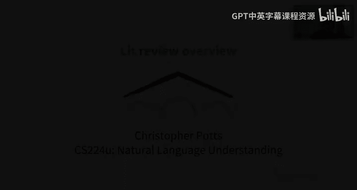
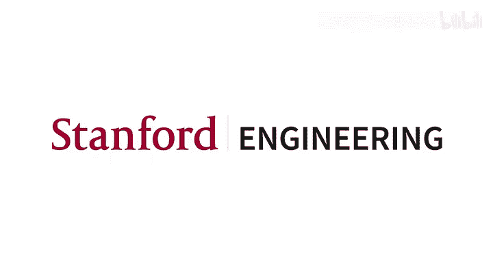

# 32：文献综述概述 📚

在本节课中，我们将学习如何为课程项目撰写文献综述。文献综述是项目阶段的关键起点，旨在帮助你为最终项目建立坚实的知识基础。

## 概述

文献综述的核心在于进行富有成效的对话。你需要与团队成员、导师以及自己进行对话，探讨在最终项目中计划实现的目标。这包括提出问题、识别障碍、构思初步解决方案、寻找数据集与模型，并仔细评估可用资源。其根本理念是从现有文献中收集信息，了解相关领域的研究现状，并以此为基础，规划出自己项目的原创方向。

## 具体要求

以下是文献综述的具体要求，你可以在课程网站找到详细说明。

*   **篇幅**：文档长度约为6页，最多不超过8页（不含参考文献部分）。
*   **模板**：我们提供了一个基于ACL格式的LaTeX模板。虽然不强制使用，但建议你使用它，以便提前熟悉最终论文所需的格式。
*   **文献数量**：单人小组需评阅5篇论文，双人小组7篇，三人小组9篇。这在一定程度上鼓励了团队合作。
*   **主题一致性**：理想情况下，文献综述与最终项目应主题一致，这样最高效。但我们也理解，完成文献综述后你可能会改变研究方向。若发生这种情况，请务必与导师和团队成员沟通，确保能在有限时间内调整并完成项目。

## 核心内容构成

以下是文献综述应包含的主要部分，你可以直接将这些短语用作章节标题，以帮助导师理解你的思路。

*   **问题与任务定义**：这是绝对关键的部分。你需要阐明将要研究的问题类型，并引导我们关注对项目至关重要的方面。
*   **文献简明摘要**：我们需要的并非简单的文献内容复述，而是能够提出问题、指出对你思考项目工作本身有启发的问题和观点的理想摘要。
*   **文献比较与对比**：你需要比较这些文献在模型、数据和核心结果等方面的异同，因为这有助于为你指明原创贡献的可能方向。
*   **未来工作展望**：这是非常重要的一环。你需要思考下一步计划，以及如何将这些想法整合成一个完整的项目。创造性思考越早开始越好，你在此部分思考得越深入，与导师的对话就会越有成效，项目也就能走得更远。
*   **参考文献**：最后，为了养成良好习惯并让我们清楚你评阅了哪些文献，必须包含参考文献部分。

## 如何进行文献检索

在具体进行文献检索时，以下是我多年来总结的一些高效技巧，我至今仍经常使用这个循环流程。

1.  **初步搜索**：在ACL Anthology、Google Scholar或Semantic Scholar中使用关键词进行搜索。鉴于这是NLP课程，建议从ACL Anthology开始，因为NLP领域的文献组织得非常完善。
2.  **筛选与下载**：下载相关或高被引的搜索结果，并查看其摘要和相关工作部分。此时的目标是找出关键问题、技术以及其他高被引文献，**切勿**在此阶段通读全文，那样效率极低。
3.  **扩展检索**：将相关工作中频繁出现的论文也下载下来，加入你的核心文献集。
4.  **迭代优化**：带着在搜索过程中收集到的新关键词，返回第1步。当你对该领域的研究现状和自己的方向有清晰认识，并开始围绕几篇你认为至关重要的论文进行深入思考时，就可以跳出这个循环了。

完成上述流程后，你便有了选择文献综述核心论文的基础。此时，从下载的文献集中选出一些核心论文，**最后**再对其进行深度阅读和评述。这样，你可以先通过广泛、轻量的调研获取最大信息量，然后在明确投资方向后进行深度钻研。

## 关于AI助手与学术诚信的特别说明

这涉及到一个有趣的学术诚信政策。鉴于我们研究大语言模型，学术界日益担忧这些模型会增加评估学生写作的难度。让我们尝试接纳这一点。例如，我使用GPT-4搜索了关于ELECTRA论文与Transformer论文关系的资料，返回的结果看起来非常有用，像是可以为文献综述提供信息的原始资料。

**但请务必了解课程政策**：政策允许你使用像GPT-4这样的AI助手来协助完成文献综述，**但模型的所有输出都必须被引用**。你需要将其视为任何其他资源来对待。当然，完全由任何资源的引文组成的作业在评估中不会获得好成绩。

此外，**文字有实质性重叠的作业将被审查是否抄袭**。这意味着如果两个小组使用了相似的提示词，得到了相似的结果，并且未加引用地将其放入文献综述，他们可能会因抄袭而被扣分——这不是因为他们使用了模型，而是因为两份作业看起来过于相似。此时，问题不在于语言模型本身，而在于我们通常担心的那种标准抄袭行为。

因此，我建议使用这些助手**不是为了为你生成原始文本**，而是帮助你了解文献内容。同时，你需要保持审慎的态度。因为即使AI生成的描述看起来不错，在未经彻底核实确保其事实正确性之前，也不应直接使用（即使是转述）。毕竟，我们最终追求的是事实的准确性，而非文字的来源。这些工具显然有价值，可以提升研究的某些方面，我们不想禁止它们（这正是我们学习这门课程的原因），但我们希望谨慎使用，并确保它们不会最终产生糟糕的学术成果。

## 衔接下一个环节：实验方案

在完成文献综述后，值得提前考虑下一个文档——**实验方案**。这在课程中是一个相对独特的环节。这是一份简短的结构化报告，旨在帮助你建立核心实验框架。

其必需部分包括：**假设、数据、评估指标、模型、总体推理、进度总结和参考文献**。你可以看到，这基本上构成了一个NLP项目的原始材料。我们试图通过它来检查是否有任何缺失，或者是否存在其他可能阻碍项目按时完成的障碍。其核心思想是明确项目目标、识别障碍和评估项目风险。因此，你应该倾向于披露更多信息，以确保我们能克服所有障碍、填补所有空白，最终使项目成功。

虽然实验方案是下一个任务，但你在撰写文献综述时就可以开始沿着这些思路进行思考。**越早开始构思最终项目的具体样貌越好**。即使在文献综述阶段，你也可以开始感受哪些假设有趣、希望尝试哪些技术等等。这正是所有这些前期项目作业的意义所在。

## 总结

本节课中，我们一起学习了文献综述的目的、具体要求、核心构成部分以及高效的检索方法。我们还特别讨论了在AI助手时代如何合理利用工具并遵守学术规范。最后，我们预览了下一个环节——实验方案，并鼓励大家尽早为最终项目进行规划。记住，文献综述是项目成功的基石，扎实的调研将为你的原创工作照亮道路。🚀