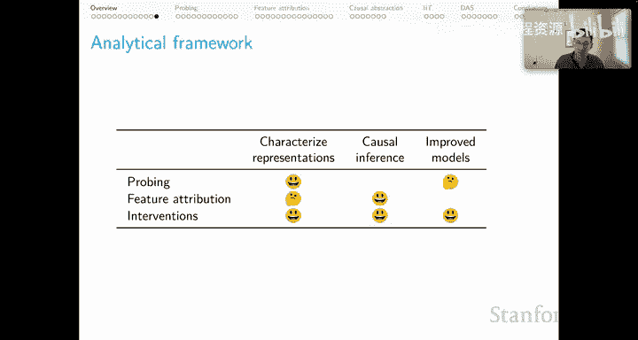

# 33：NLU分析方法概述（第一部分）🔍

在本节课中，我们将开始学习自然语言处理（NLP）中的分析方法。我们将超越单纯的行为测试，深入探讨如何理解模型内部的工作机制，以获得关于模型行为的因果性保证。

---

## 从行为测试到结构分析

在上一单元中，我们重点讨论了行为测试，特别是以假设驱动的挑战集和对抗性测试作为工具，来深入理解模型在陌生场景下的行为。然而，行为测试有其固有的局限性。

为了更生动地说明这一点，让我们回顾一下“奇偶检测器”的例子。假设一个模型接收像“4”这样的字符串，并预测它指的是偶数还是奇数。它可能在前几个测试（如4、21、32、36、63）中都做出正确预测，让我们感觉它是一个好模型。

但当我们看到其内部工作原理时，真相才被揭示。例如，第一个模型可能只是一个简单的查找表，遇到不熟悉的输入就默认预测为奇数。一旦我们看到 `if input in lookup_table: return lookup_table[input] else: return "odd"` 这样的逻辑，我们就完全明白了模型是如何失效的，以及如何在行为上击败它（例如输入“22”，它会错误地预测为奇数）。

第二个模型可能更复杂，它会对输入进行分词，并使用最后一个词元作为预测奇偶的基础。这听起来是个不错的策略，但它可能同样有一个默认预测为奇数的 `else` 子句。只有当我们看到内部因果机制时，我们才能确切知道模型如何工作以及它将在何处失败。

对于现代NLP模型，它们几乎从不象刚才展示的符号程序那样易于理解。相反，我们的模型看起来像巨大的、不透明的“鸟巢”，由权重和权重的乘法构成，没有明显的符号，这使得我们很难像理解简单程序那样理解它们。

---

## 为什么需要超越行为测试？

行为测试虽然重要，但不足以提供我们所需的全部保证。这主要有三个原因：

1.  **系统性（Systematicity）**：人类的语言能力是系统性的。理解“Sandy loves the puppy”这句话，内在关联着理解“The puppy loves Sandy”。我们不会将每句话都视为全新的事实来学习，而是基于已有的底层能力进行推导。我们希望验证模型找到的解决方案是否也具有这种系统性，甚至是组合性（Compositionality），否则我们总会担心它们在关键时刻的行为是任意的。

2.  **基准测试的局限性**：虽然模型在各类基准测试上进步神速，但我们怀疑，即使在这些任务上表现良好的模型，距离我们试图诊断的人类能力仍然很远。我们感觉它们拥有脆弱的、可能以问题方式暴露自身的解决方案。要真正超越这种担忧，我们需要超越行为测试。

3.  **安全与可信赖的目标**：领域内有许多关乎安全与可信赖的高层目标，例如：认证模型可在何处使用、不应在何处使用；认证模型没有有害的社会偏见；保证模型在特定上下文中的安全性。行为测试或许能告诉我们模型**存在**问题，但无法提供**不存在**问题的正面保证（如“无社会偏见”、“在上下文中安全”）。要获得这些保证，我们需要在深层理解模型的结构和引导其行为的机制。

---

## 三类核心分析方法

为了向上述目标迈进，我们将讨论三类主要方法：

### 1. 探针分析（Probing）

探针分析通过训练小型监督模型来探测神经网络内部表示（如BERT的不同层）中编码的信息。Tenney等人（2019）的研究具有开创性，他们发现BERT的各层系统性地编码了丰富的语言学信息。

例如，在他们的研究中，词性（POS）信息大约在中间层出现，依存句法信息出现稍晚，命名实体（NER）信息更微弱且出现更晚，语义角色（SRL）在中间层附近很强，共指（Coref）信息在网络较深层出现。这表明，即使BERT以“黑盒”方式运行，其内部表示也学习到了系统性的语言结构。

探针分析能很好地**表征内部表示**，但它本身不能证明这些信息是模型做出决策的**原因**。

### 2. 特征归因（Feature Attribution）

这类方法旨在理解模型的输入-输出行为由哪些内部神经元或特征引导。在深度学习背景下，通常通过研究模型的梯度来实现。

例如，在一个情感分析挑战集中，特征归因方法可以高亮显示模型做出预测时所依赖的输入部分。如果高亮的部分是直观上重要的词语（如情感强烈的动词或转折词），这可能会让我们感到安慰，认为模型正在使用人类可解释的、系统性的信息。

特征归因方法能提供一些**因果性保证**（例如，通过**积分梯度法**可以量化每个输入特征对最终预测的贡献），但它们对内部表征的**描述**相对模糊，通常只给出权重或贡献度。

### 3. 基于干预的方法（Intervention-based Methods）

这是我们将重点探讨的一类方法。其核心思想是对模型进行“脑外科手术”，即主动操纵其内部状态，并观察这对输入-输出行为产生的影响。

通过这种方式，我们可以拼凑出塑造模型行为的因果机制。这类方法有望推动我们获得所需的那种保证。

---

## 分析方法评估框架

我们可以用一个简单的评估框架来思考这些方法。假设我们有三个目标：
1.  **表征内部表示**：描述模型内部状态的含义。
2.  **做出因果断言**：证明特定表示或机制是模型行为的原因。
3.  **改进模型**：基于获得的见解，找到改进模型的清晰路径。

以下是三类方法在这个框架下的表现：

| 方法 | 表征表示 | 因果保证 | 改进路径 |
| :--- | :--- | :--- | :--- |
| **探针分析** | **优秀** 👍 | 弱/无 👎 | 不明确 ❓ |
| **特征归因** | 模糊/微弱 👎 | **中等**（部分方法）👍 | 不明确 ❓ |
| **基于干预** | **优秀** 👍 | **优秀** 👍 | **清晰** 👍 |

基于干预的方法在三个方面都表现突出。它不仅能帮助我们表征和理解内部表示，还能通过主动干预建立因果联系，并且这些见解能直接用于指导模型改进（例如，修复已识别的缺陷或增强特定能力）。因此，这也是我个人最推崇的一类方法。

---

## 总结

本节课中，我们一起学习了超越行为测试、深入分析NLP模型内部机制的必要性。我们探讨了行为测试的局限性，并介绍了三类核心的分析方法：**探针分析**、**特征归因**和**基于干预的方法**。我们还建立了一个评估框架，从“表征表示”、“因果保证”和“改进路径”三个维度来审视这些方法。在接下来的课程中，我们将系统地深入学习这些方法，以更深入地理解它们的工作原理。