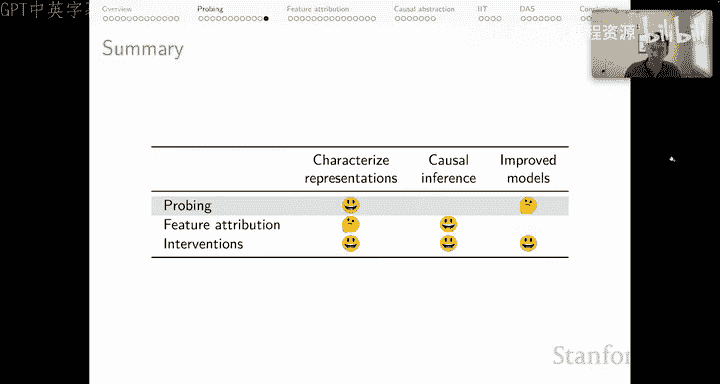

# 34：NLU分析方法（第二部分）：探针分析 🔍

在本节课中，我们将继续探讨自然语言理解的分析方法，重点介绍一种称为“探针分析”的技术。我们将了解其工作原理、潜在价值以及需要谨慎对待的局限性。

## 概述：什么是探针分析？🤔

探针分析的核心思想是使用**有监督的模型**（即我们的“探针模型”），来确定目标模型（我们真正关心的模型）的隐藏表征中潜在编码了哪些信息。

探针分析常应用于所谓的“BERTology”领域。Tenny等人2019年的研究是该领域的一项基础性贡献，它揭示了BERT模型通过其训练机制在多大程度上诱导出了关于语言的有趣结构。

虽然探针分析能提供有价值的见解，但我们必须谨慎行事。

## 探针分析的步骤与注意事项 ⚠️

以下是进行探针分析时需要遵循的步骤和注意事项：

首先，你需要提出一个关于目标模型内部结构某个方面的假设。例如，你可以假设它存储了关于词性、命名实体或依存句法分析的信息。

接着，你需要选择一个有监督的任务，作为你感兴趣的内部结构的代理。例如，如果你想寻找词性信息，就需要一个词性标注数据集，并且探针本身的定义将依赖于这个数据集。

然后，你需要在模型中选择一个位置，即一组你认为该结构会被编码的隐藏表征。

之后，你在选定的位置上训练一个有监督的探针。

最后，探针的成功程度就是你对你所提基础假设正确性的估计。但这里有一些需要注意的地方。

## 探针分析的核心方法 🛠️

让我们先了解核心方法。以一个简化的三层BERT类模型为例。假设我们选择隐藏表征 `H` 作为探针的目标位置。

我们将使用一些任务标签，在该内部表征上拟合一个小的线性模型。实际操作过程如下：

1.  在输入序列上运行BERT模型。
2.  获取目标位置的向量表征。
3.  开始构建一个小型的有监督学习数据集，其中 `X` 是向量，`Y` 是输入示例的任务标签。
4.  对不同的输入序列重复此过程，获取不同的向量表征和任务标签，不断扩充数据集。
5.  最终，在这个 `(X, Y)` 数据对上拟合一个小的线性模型。

需要注意的是，我们只是将BERT模型用作获取这些向量表征的“引擎”，以供探针模型使用。通常，我们会进行分层分析。例如，你可以认为整个层编码了词性信息，然后构建一个由向量列表及其对应标签列表组成的数据集，并在此基础上训练一个词性标注模型，这就是你的探针。

## 核心问题：我们到底在探测什么？🎯

探针分析面临的第一个紧迫问题是：我们是在探测目标模型，还是仅仅在学习一个新的探针模型？

在当前语境下，探针本身就是有监督模型，其输入是我们所探测模型的冻结参数。我们使用BERT模型作为创建特征表征的引擎，这些表征是另一个独立建模过程的输入。这很难与通常的、基于特定特征化选择（即我们根据BERT的计算方式选择的位置）来拟合有监督模型的过程区分开来。

因此，我们知道，我们识别出的信息至少有一部分可能存储在探针模型中，而非目标模型中。当然，更强大的探针可能会在目标模型中发现更多信息，但这仅仅是因为它们在探针参数中存储了更多信息——它们有更大的容量来做到这一点。

## 探针选择性：校准信息源 📏

为了帮助解决上述问题，Hewett和Leang引入了**探针选择性**的概念，这有助于我们在一定程度上校准有多少信息实际上存在于目标模型中。

第一步是定义一个**控制任务**。这是一个随机任务，具有与你的目标任务相同的输入输出结构。例如：
*   对于词义分类，你可以为单词分配随机的固定词义。
*   对于词性标注，你可以将单词分配到随机的固定标签，或许保持与底层词性数据集相同的标签分布。
*   对于句法分析，你可以使用一些简单策略随机分配边，从而得到与黄金数据集中结构截然不同的树结构。

然后，探针的选择性指标就是探针在目标任务上的性能与在控制任务上的性能之差。这样，你就衡量了你的模型在一种随机任务上的表现能力。

Hewett和Leang提供了一个总结性图示，表明能提供可靠见解的探针往往是那些非常小的模型（例如只有两个隐藏单元的模型），它们具有很高的选择性。相反，如果探针模型参数很多、能力很强，其选择性就会很低，因为它有巨大的容量去单纯记忆数据集的各个方面。

## 第二个担忧：因果推断的缺失 ⛓️

现在让我们转向第二个担忧，即关于因果推断的问题。为了阐明这个论点，我们使用一个简单的例子。

假设我们有一个小型神经网络，它接收三个数字作为输入，并完美计算它们的和。问题是，它是如何实现这一壮举的？模型是如何工作的？

你可能有一个假设：它以组合方式工作，前两个输入 `X` 和 `Y` 结合形成一个中间变量 `S1`，第三个输入 `Z` 被复制到内部状态 `W`，然后 `S1` 和 `W` 这两个模块化表征被加在一起形成输出表征。这是一个关于模型如何工作的假设。

现在的问题是，我们能否使用探针分析来可靠地评估这个假设？

假设我们探测 `L1` 层，并发现它总是完美编码第三个输入 `Z` 的身份。接着我们探测 `L2` 层，发现它总是完美计算 `X + Y`。这看起来支持了我们最初的假设。

然而，探针误导了我们。实际上，`L2` 层对输出行为完全没有影响（查看输出层的权重向量，`L2` 的权重全为零，没有因果影响）。探针说它存储了 `X + Y`，它可能确实在做这件事，但这种方式并不能告诉我们关于输入输出行为的信息。因此，探针在因果层面误导了我们。

## 探针分析能改进模型吗？🚀

我设定的最终目标是：我们是否有一条路径，能通过所选的分析方法来改进模型？我的答案是混合的。

似乎存在一条从探针分析到**多任务训练**的路径。例如，我训练这个模型做加法，同时额外训练它，使某个表征编码 `Z`，另一个表征编码 `X + Y`。我们当然可以设定这样的目标。但这是否真的能诱导出我们感兴趣的那种模块化，仍是一个悬而未决的问题。

对我来说，真正深层的担忧是，即便如此，我们仍然得不到因果保证。我们可以进行多任务训练，但这并不能保证我们诱导出的结构（无论它是什么样）实际上塑造了核心任务（此处是数字相加）的性能。因此，我们必须谨慎行事。

## 无监督探针 📝

最后快速提一下无监督探针。这个领域有出色的工作，使用了多种不同的方法。这里列出了一些该文献中具有开创性的参考文献。同样，我认为这些技术不受探针能力过强问题的影响（因为它们通常没有自己的参数），但我认为它们确实存在因果推断方面的局限性。

## 总结 📋

让我们用评分卡来总结一下：
*   **表征刻画**：探针分析可以很好地刻画表征（我们使用有监督探针来实现这一点）。👍
*   **因果推断**：探针无法提供因果推断。👎
*   **模型改进**：目前尚不清楚多任务训练是否真的是一条从探针分析到更好模型的可行、通用的途径。🤔

本节课中，我们一起学习了探针分析这种NLU分析方法。我们了解了其通过有监督模型探测目标模型内部表征的基本流程，同时也深入探讨了其两大核心局限：难以区分信息是存储在目标模型还是探针模型中，以及无法提供关于模型行为的因果性见解。理解这些优点和局限性，对于正确应用和解读探针分析至关重要。