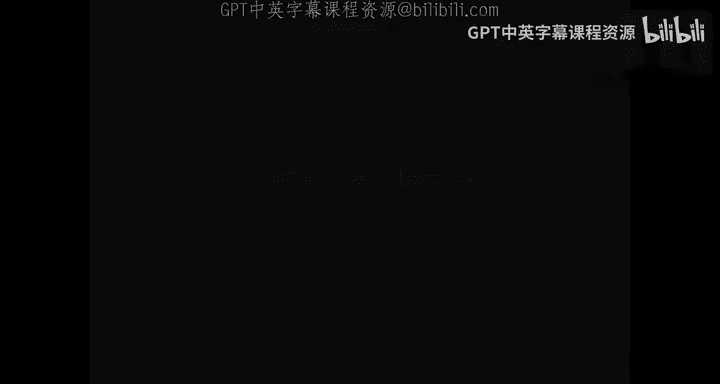
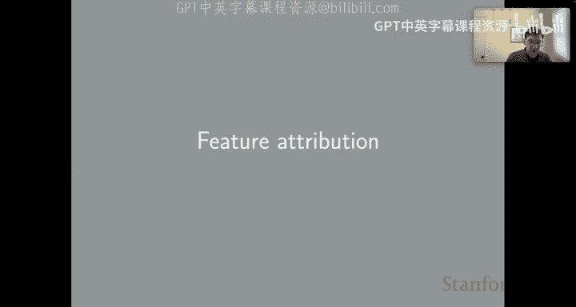
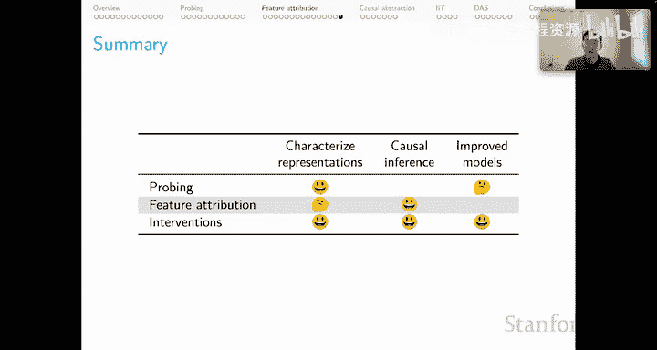

# 35：NLU分析方法（三）特征归因 🔍






在本节课中，我们将学习自然语言理解中的特征归因方法。特征归因旨在解释模型的预测结果，帮助我们理解模型在决策时关注了输入的哪些部分。我们将重点介绍一种强大且具有理论保证的方法——积分梯度法。

## 概述：什么是特征归因？

特征归因方法试图为模型的每个输入特征分配一个重要性分数，以解释该特征对最终预测的贡献。这对于理解复杂的深度学习模型（如BERT）的内部工作机制至关重要。

## 特征归因的公理框架

在深入具体方法之前，我们先了解评估特征归因方法的理论框架。积分梯度法的论文提出了几个公理，其中最重要的是**敏感性公理**。

**敏感性公理**指出：如果两个输入 `x` 和 `x‘` 仅在维度 `i` 上不同，并且导致了不同的预测结果，那么与维度 `i` 相关的特征必须具有非零的归因分数。

用公式表示，对于一个模型 `M`：
- 若 `M(x) ≠ M(x‘)`，且 `x` 与 `x‘` 仅在维度 `i` 上不同。
- 则 `attribution_i ≠ 0`。

这个公理非常直观，它要求归因方法必须能够识别出导致预测差异的关键特征。

## 基线方法：梯度 × 输入

让我们从一个直观的基线方法开始：**梯度 × 输入**法。这种方法计算模型输出相对于目标特征的梯度，然后将梯度值乘以该特征的实际值。

其核心计算如下：
```python
attribution = gradient_of_output_wrt_input * input_value
```

以下是两种实现方式：
1.  使用原始PyTorch计算。
2.  使用Captum AI库的封装函数。

这种方法实现简单，并且可以推广到深度学习模型中的任何神经元状态。

### 一个关键的概念难题

在应用归因方法时，我们面临一个选择：归因计算应该基于**预测的标签**还是**真实的标签**？这两个标签对应于模型输出向量的不同维度。

对于高性能模型，预测标签和真实标签几乎相同，这个选择影响不大。但当我们研究一个性能较差的模型以找出其缺陷时，这两种选择会产生截然不同的归因结果，从而为我们提供关于模型行为的不同图景。没有先验的理由偏爱其中一种，最佳做法是明确你在分析中所做的假设和使用的方法。

### 基线方法的缺陷

然而，“梯度 × 输入”法存在一个根本性问题：它**违反了敏感性公理**。

考虑一个简单的单输入模型 `M(x) = 1 - ReLU(1 - x)`：
- 输入 `x=0` 时，输出为 `0`。
- 输入 `x=2` 时，输出为 `1`。

根据敏感性公理，由于输入维度的变化导致了输出差异，该特征应获得非零归因。但“梯度 × 输入”法对这两个输入计算出的归因分数均为 `0`。这个反例揭示了该方法的局限性，也引出了我们需要更优的方法。

## 核心方法：积分梯度法

积分梯度法通过探索输入的**反事实版本**来改进归因，这对于获得模型行为的因果洞察至关重要。

### 工作原理

IG的直觉是：我们不仅看当前输入点的梯度，而是沿着一条从**基线输入**（如零向量）到**实际输入**的路径，对路径上所有点的梯度进行积分。

具体步骤如下：
1.  **设定基线**：选择一个参考点（如零向量）。
2.  **线性插值**：在基线和实际输入之间创建一系列插值输入 `x’ = baseline + α * (input - baseline)`，其中 `α` 从0逐步增加到1。
3.  **计算路径梯度**：计算模型输出对每个插值输入的梯度。
4.  **积分近似**：对所有插值点的梯度进行求和（积分近似）。
5.  **缩放**：将积分结果乘以 `(input - baseline)`，得到最终的归因分数。

用公式概括为：
```
IntegratedGrads(x) = (x - baseline) * ∫_{α=0}^{1} (∂F(baseline + α*(x-baseline)) / ∂x) dα
```
其中 `F` 是模型函数。

### 为何IG更优？

回到之前那个违反敏感性公理的例子。IG方法通过积分路径上所有点的梯度，成功地为该特征分配了约为 `1` 的非零归因分数。理论上可以证明，IG满足敏感性公理，提供了更强的因果保证。

## 实践应用：分析BERT类模型

IG方法最强大的特性之一是其灵活性。对于像BERT这样的复杂模型，我们可以计算模型中**任何层次、任何神经元状态**对最终预测的归因。

这结合了探针技术的灵活性，同时提供了归因与输入-输出行为之间因果效力的理论保证。

### 完整工作示例

以下是一个使用Captum库和基于RoBERTa的推特情感分类器进行IG分析的简化流程：

1.  **加载模型与定义函数**：加载预训练模型，并定义用于计算概率和生成基线/实际输入表示的函数。
2.  **指定目标**：选择要计算归因的目标类别（如真实标签“积极”）。
3.  **执行归因计算**：调用 `LayerIntegratedGradients` 函数，传入模型、目标层、基线输入和实际输入。
4.  **后处理与可视化**：对归因分数进行标准化（如Z-score），并使用Captum的可视化工具生成结果。

分析结果通常以高亮文本的形式呈现，其中颜色深度表示归因分数的大小：
- **绿色**：该特征支持目标标签（例如，在积极情感分析中，支持“积极”标签）。
- **红色**：该特征反对目标标签。
- **白色**：中性贡献。

通过观察不同示例（如包含“great”、“wrong”等词的句子），我们可以定性地评估模型是否系统性地利用了合理的特征进行情感预测。

## 总结与思考

本节课我们一起学习了特征归因方法。总结如下：

*   **价值**：特征归因提供了对模型表征的宏观描述，为每个特征分配一个重要性标量，是理解模型决策的有用指南。
*   **因果保证**：使用如积分梯度法这类方法，可以获得理论上的因果保证，增强解释的可信度。
*   **局限性**：归因方法本身并不能直接用于改进模型。它提供的是“环境信息”，这些洞察可能需要在一个独立的后继建模步骤中，才能指导我们优化模型。




总而言之，特征归因是一种强大而灵活的启发式方法，能够为我们提供关于模型如何解决任务的宝贵见解。