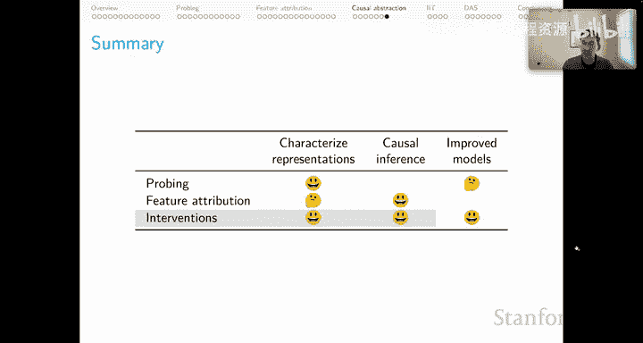
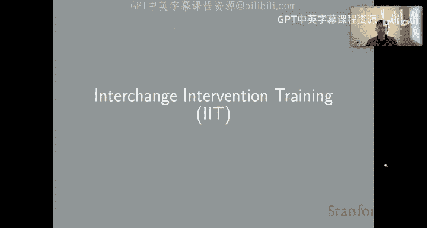
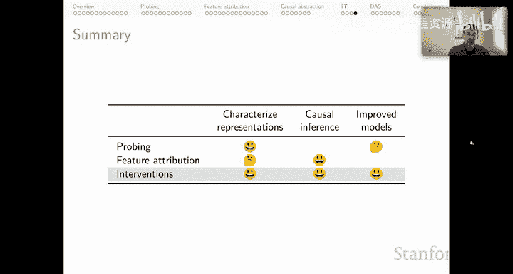

# 36：因果抽象与互换干预分析 🧠

在本节课中，我们将学习因果抽象分析的核心方法。这是一种基于干预的技术，旨在为复杂的自然语言处理模型提供概念层面的因果解释。我们将重点理解“互换干预”这一基本操作，并探讨如何利用它来验证模型内部机制与人类可理解的因果假设是否一致。

---

## 因果抽象分析：一个操作指南 📋

上一节我们讨论了其他分析方法，本节中我们来看看因果抽象分析的具体步骤。其核心流程可以概括为以下两步：

1.  **提出假设**：首先，你需要对你的目标模型（例如一个神经网络）的因果结构提出一个假设。这个假设通常可以表示为一个**小型计算机程序**或一个清晰的因果图模型。
2.  **寻找对齐**：接着，你需要在这个假设的因果模型中的变量，与目标模型中的神经元（或神经元集合）之间，寻找一种对齐关系。这本质上是一个关于“哪些神经元组在扮演哪些因果角色”的假设。

为了评估这种对齐假设是否正确，我们需要执行因果抽象分析的基本操作：**互换干预**。

---

## 理解互换干预：一个加法网络的例子 ➕

为了让你对互换干预如何工作有直观感受，我们来看一个简单的运行示例。

假设我们有一个简单的神经网络，它的任务是输入三个数字并将它们相加。我们假设这个网络能成功完成此任务。那么问题来了：**这个网络是如何以人类可理解的方式执行这个加法功能的？**

我们可以提出一个因果假设模型（用绿色表示）：
*   该网络先将前两个输入相加，得到一个中间变量 **S1**。
*   同时，第三个输入被复制到另一个中间变量 **W**。
*   最后，**S1** 和 **W** 直接相加得到模型的输出。

这是一个关于我们原本不透明的神经网络内部可能发生什么的假设。问题是：**这个假设正确吗？** 我们将使用互换干预来评估它。

### 第一步：评估 L3 是否对齐 S1

以下是评估“神经表示 L3 是否扮演与 S1 相同角色”的具体步骤：

1.  **在因果模型上进行干预**：
    *   我们用因果模型处理输入 `(1, 3, 5)`，得到输出 `9`。
    *   再用同一个因果模型处理输入 `(4, 5, 6)`，得到输出 `15`。
    *   现在进行干预：我们**锁定**右侧例子（输入为 `(4,5,6)`）中值为 `9` 的变量 **S1**，将这个值**直接替换**到左侧例子（输入为 `(1,3,5)`）中 **S1** 的位置。
    *   由于因果模型是我们完全理解的，我们知道干预后的输出将变为 `9 + 5 = 14`。被干预变量下方的子节点信息被完全覆盖。

2.  **在神经模型上进行平行操作**：
    *   我们用神经模型处理 `(1, 3, 5)`，得到输出 `9`。
    *   用神经模型处理 `(4, 5, 6)`，得到输出 `15`。
    *   现在进行干预：我们**锁定**右侧例子中的 **L3** 状态，将这些值**直接替换**到左侧例子中 **L3** 的对应位置。
    *   然后观察输出。**如果干预后的输出也是 `14`**，那么我们就获得了一个证据，表明 L3 与 S1 的因果角色是一致的。

**核心逻辑**：如果我们对模型所有可能的输入都重复这个干预，并且总是看到因果模型和神经模型的输出在这种对齐下保持一致，那么我们就证明了 **L3 与 S1 扮演相同的因果角色**。

### 第二步：评估其他变量

我们可以继续这个过程来评估其他对齐假设：

*   **评估 L1 是否对齐 W**：假设 L1 扮演 W 的角色。在因果模型上，将右侧例子的 W 值（例如 `6`）替换到左侧，输出应变为 `1+3+6=10`。如果在神经模型上对 L1 进行同样的互换干预后，输出也变为 `10`，则证明 L1 与 W 因果对齐。
*   **评估 L2 的因果角色**：如果我们对 L2 进行各种可能的干预，但**从未**观察到模型输出行为因此改变，那么我们就证明了 **L2 在此网络的输入-输出行为中不扮演任何因果角色**。

如果所有输入、输出以及中间变量的对齐假设都通过了互换干预的检验，那么我们就证明了那个绿色的因果模型，就是那个更复杂的神经模型的**一个抽象**。这意味着我们可以放心地用更简单、可理解的因果模型来推理神经模型的行为机制。

---

## 现实世界的考量与评估指标 📊

刚才描述的是因果抽象分析的理想情况。现实中需要考虑以下几点：

*   **无法穷举所有干预**：对于真实模型，可能的输入是无穷的，我们只能选择一个小子集进行测试。
*   **不存在完美的抽象**：由于自然训练模型的复杂性，我们几乎永远不会看到完美的因果抽象关系。因此，我们需要一个**分级的成功度量标准**。

一个很好的基线指标是 **互换干预准确率**：
`IIA = (导致输出与因果模型预测一致的互换干预次数) / (执行的互换干预总次数)`

**关于 IIA 的重要说明**：
*   IIA 的值在 0 到 1 之间，类似于准确率。
*   它可能**高于任务本身的性能**。这是因为互换干预有时会将模型置于比原始状态更好的“弗兰肯斯坦”状态。
*   IIA **高度依赖于你所选择执行的干预子集**。特别是，那些**应该改变输出标签**的干预，才是真正提供因果洞察的关键。

---

## 因果抽象的研究发现与应用 🚀

以下是来自相关研究（主要是我们团队的工作）的一些发现：

*   **微调后的 BERT 模型**之所以能在涉及词汇蕴含和否定的困难域外例子上成功，是因为它们被**简单的单调性程序**所抽象。这里的“因为”是一个**因果声明**，这正是因果抽象分析所允许的。
*   模型在 **MQNLI**（多重量化自然语言推理）任务上的成功，是因为它们找到了**组合式解决方案**。因果分析证明了模型成功的程度与其找到组合解的程度直接相关。
*   模型在 **MIS 指针值检索**任务上的成功，是因为它们被类似 `if the digit is 6, then the label is in the lower left` 的简单程序所抽象。这种解释与任务结构本身完美对齐，令人振奋。
*   研究还表明，**BART 和 T5** 模型使用了连贯的实体和情境表征，这些表征会随着语篇展开而演化。

**一个深刻的启示**：因果抽象开始模糊**神经模型**与**符号模型**之间的界限。如果你能证明两者通过因果抽象对齐，那么它们之间就不存在有意义的区别。这引发了人们对符号 AI 与神经 AI 是否真有本质不同的思考。

---

## 从分析到改进：互换干预训练 🛠️

因果抽象不仅能解释模型，还能**改进模型**。这就是 **互换干预训练** 的核心思想。

方法很简单，直接建立在因果抽象之上。回顾之前的加法例子，假设我们对 L3 的干预没有得到预期的 `14`，而是得到了 `4`。这表明我们假设的对齐关系不正确。

但这里也蕴含着一个改进的机会：**我们知道干预后应有的输出（`14`）和实际输出（`4`）之间的差异**。这个差异可以作为一个梯度信号，用来更新模型的参数，使其在此对齐假设下更符合底层的因果模型。

**IIT 的更新过程**：
*   对于 L1 和 L2，梯度像往常一样流回输入状态。
*   对于被干预的 L3，情况更复杂：由于我们复制了完整的计算图（包括梯度信息），L3 会得到一个“双重更新”——既来自当前例子，也来自提供该表征的源例子。

通过反复使用因果模型作为“标签”来执行这种 IIT 更新，我们可以**推动模型将关于 S1 的信息模块化到 L3 变量中**。这样，对齐的重要性就降低了，重点变成了**通过赋予模型我们假设的因果结构来主动改进模型**，希望它们能以更系统化的方式形成，从而在我们设定的任务上表现更好。

**IIT 的研究发现**：
*   在 **MIS 指针值检索** 和 **ReSCAN**（一个接地语言理解基准）任务上达到了最先进的性能。
*   可作为**蒸馏目标**，不仅迫使师生模型的输入输出行为一致，还迫使它们在 IIT 创建的反事实条件下，内部表征也保持一致。这是一种强大的蒸馏方法。
*   可用于在基于子词分词的语言模型中，**诱导出基于字符的内部表征**，这有助于处理各种字符级游戏和任务。
*   最近被用于创建解释模型行为的**概念级方法**，即 **因果代理模型** 技术。

---

## 总结 ✨

本节课中，我们一起学习了基于干预的模型分析方法，重点是**因果抽象**与**互换干预**。

*   **因果抽象分析** 允许我们为黑盒神经网络提出可理解的因果假设，并通过**互换干预**这一核心操作来验证神经元的集合是否与假设中的因果变量扮演相同的角色。
*   我们探讨了评估指标 **IIA**，并了解了该领域的一些关键研究发现，这些发现揭示了成功模型背后的可解释机制。
*   更进一步，我们看到了如何将分析工具转化为改进工具。**互换干预训练** 利用干预产生的误差信号来更新模型，主动地将其内部结构塑造成我们期望的因果形式，从而提升模型的系统性和性能。

综上所述，基于干预的方法（尤其是因果抽象和 IIT）能够丰富地表征模型内部表示，进行因果推断，并最终指导我们改进模型，是目前我们深入理解 NLP 模型工作机制的最佳途径之一。