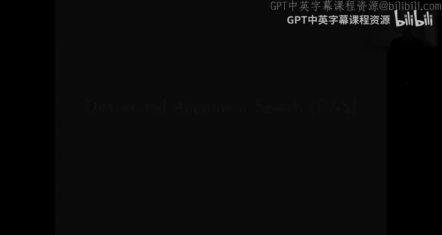
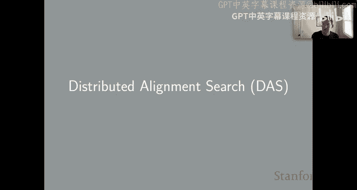
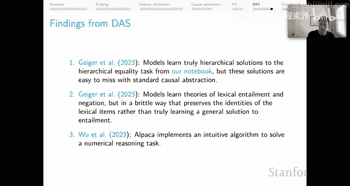
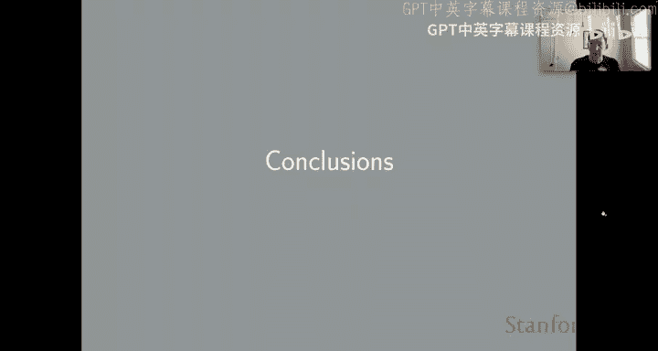
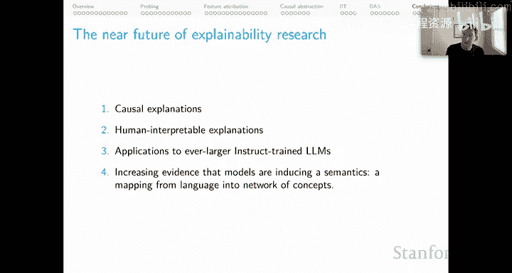
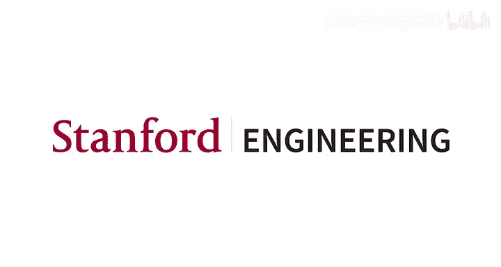

# 37：分布式对齐搜索 (DAS) 🧠

在本节课中，我们将学习一种全新的自然语言处理分析方法——分布式对齐搜索。我们将探讨它如何克服先前介绍的因果抽象方法的局限性，并通过一个简单示例理解其核心思想。最后，我们将展望可解释性研究的未来方向。

---

## 回顾分析方法的挑战

上一节我们介绍了因果抽象方法。现在，让我们回到分析方法的评估表。

我已在“干预”这一行证明了三个笑脸标记的合理性，但这类方法仍存在两个紧迫问题。

以下是两个主要问题：

1.  **对齐搜索成本高昂**。对于复杂的因果模型和现代大型语言模型，可能的对齐方式数量极其庞大。我们引入了许多近似方法，但仍可能错过真正优秀的对齐方案。
2.  **因果抽象可能因预设标准基而失败**。DAS 的核心见解是，如果我们能以各种方式旋转这些表示，可能会发现可解释的结构。DAS 的目标正是学习一个旋转矩阵，以帮助我们找到最优对齐。

我将通过一个简单示例来直观地解释这些概念。

---

## 一个运行示例：布尔合取

为了保持直观，我将使用一个非常简单的运行示例：布尔合取运算。

*   左侧是一个因果模型。它接收布尔变量输入，有对应的中间变量，然后输出结果：当且仅当两个输入都为真时输出真，否则为假。
*   右侧是一个非常简单的神经网络模型。该神经网络模型通过这组参数完美解决了我们的布尔合取任务。

这就是我们的起点。

---

## 经典因果抽象模式下的问题

在经典的因果抽象模式下，我可以像图中红色箭头那样定义一个对齐关系，这看起来不错。我按预期对齐了输入和输出，并添加了决策规则：如果神经网络输出负值，则对应因果模型的假；如果输出正值，则对应因果模型的真。这很直观。

然后，我直观地将因果模型的中间变量 V1 与神经网络的隐藏单元 H1 对齐，V2 与 H2 对齐。

现在，如前所述，这个模型在行为上是完美的，但它在我们选择的对齐方式下并不抽象神经网络模型，而“选择的对齐方式”这一点至关重要。我直接给出结论：我不小心颠倒了那些内部变量的顺序。我本应将 V1 映射到 H2，将 V2 映射到 H1。

我们通过这个简单示例模拟了一种情况：我错误地决定了我所要查看的对齐集合，并且选择了一个在寻找实际存在的结构方面是次优的对齐方案。

DAS 的承诺是，即使我从这个不正确的对齐开始，一个旋转操作也能帮助我找到正确的结构。

---

## 验证因果抽象失败

首先，我来证实因果抽象确实失败了。我将展示一个失败的互换干预。

在顶部，像往常一样，我们用因果模型进行干预。我们从右侧示例中取出 V1，并将其放入左侧示例的相应位置。左侧示例的原始输出是假，但由于干预，我们应该得到输出值真。

当我们在神经网络模型上进行相应的对齐干预时，我们最终得到一个输出状态为负。这意味着预测为假，但因果模型说我们应该预测为真。这正是导致我们说这不处于抽象关系中的那种情况：这个因果模型和这个神经网络模型。

两个模型具有不相等的反事实预测。这是问题的核心。但请记住，我们已经知道原因：由于运气不好或研究不足等原因，我选择了错误的对齐。

---

## DAS 的核心见解

DAS 背后的关键见解是：**对齐关系在一个非标准基中成立**。

如果我采用当前的网络和当前的对齐方式，并简单地使用这个旋转矩阵旋转 H1 和 H2，那么我将得到一个在行为上完美且满足因果抽象关系的网络。

因果抽象经典模式错过了这一点，正是因为我们选择了标准基。其本质在于，没有理由必须选择标准基。这对我们人类来说是直观的，但没有理由假定我们的神经网络模型更倾向于在那个基中运行。这个例子揭示，通过放弃关于基的假设，我们可能会发现可解释的结构。

因此，DAS 的本质（请关注重点）确实是学习这个旋转矩阵。**这是 DAS 学习的目标**，然后这个旋转矩阵就成为你可以用来实际发现、展示和评估内部因果结构的资产。

---

## DAS 的高级抽象概述

以下是如何使用一对对齐干预来实现这一点的更高级抽象概述。

*   图中红色部分是我的目标模型。
*   左侧和右侧有两个源模型。它们处理各自的示例，我们将针对模型中这些不同用法所对应的变量 X1、X2 和 X3。

我们做的第一件事是旋转我们锁定的那个表示，以创建一些新变量 Y1、Y2 和 Y3。请记住，这里的 **R** 是 DAS 的本质，也是我们将要学习的矩阵，本质上是通过互换干预训练来学习。

完成这个旋转后，我然后创建一个新矩阵，这来自于我决定用 Y2 对 Y1 进行干预，然后将 Y3 从这个核心基础示例中复制过来。这给了我这里的新向量。然后我们进行反旋转，并执行干预。

请记住，DAS 的本质是**我们将冻结模型参数**。这是一种分析方法，而不是改变核心底层目标模型的方法。但我们做的是学习一个旋转矩阵，该矩阵本质上最大化我们通过进行这种旋转和反旋转来创建这些新模型所获得的互换干预准确率。

所以，这是 IIT 类技术与经典因果抽象的结合。我们冻结模型是因为我们想要解释它，但我们学习那个旋转矩阵。这就是 DAS 的本质。

---

## DAS 的现有发现

到目前为止 DAS 的发现。这些在我们的 DAS 论文中相当微妙。

1.  我们表明，模型学习到了针对分层相等性任务的真正分层解决方案。事实上，这是我们为本课程笔记本回顾的那个任务。但由于这个非标准基问题，这些解决方案很容易被标准因果抽象所忽略。
2.  这是一个更微妙的发现。在早期的因果抽象工作中，我们发现模型学习了词汇蕴含和否定的理论，这些理论与高层次直观因果模型基本一致。但通过 DAS，我们可以揭示它们以一种脆弱的方式做到这一点，实际上保留了词汇项的身份，而不是真正学习到解决蕴含问题的通用方案。
3.  第三个发现来自另一篇论文，这非常令人兴奋，因为它表明我们可以扩展到以前由于缺乏搜索对齐方式而无法达到的规模，因为现在我们本质上学习了对齐。因此，我们将 DAS 扩展到了 Alpaca 模型，并发现 Alpaca 这个拥有 70 亿参数的模型实现了一种直观算法来解决数值推理任务。

我认为这只是我们看到的利用 DAS 来理解我们最大、性能最强、最有趣的大型语言模型的潜力的开始。

---

## 高级结论与未来展望

现在，让我转向总结一些高级结论。

首先，我想回到这张图，我用它来总体激励分析方法。我们对该领域有这些极其重要的目标：识别批准和禁止的用途，识别和纠正有害的社会偏见，以及保证模型在某些上下文中的安全性。我认为，除非我们对底层模型有分析性的保证，否则我们无法对这些议题提供保证。对我来说，这意味着需要对塑造其输入输出行为的机制有真正深入的因果理解。因此，我认为 NLP 中的分析项目是该领域最紧迫的项目之一。

本着这种精神，让我们稍微展望一下该领域可解释性研究的近期未来。

以下是几个关键方向：

1.  **寻求因果且人类可解释的解释**。正如我所说，我们应该寻求因果解释，但我们也需要人类可解释的解释。如果因果性是唯一要求，我们可以只给出 Transformer 如何工作的低层次机械数学解释，并称之为可解释性研究。但对于试图提供安全性和可信度保证的人类来说，这是错误的层次。我们需要人类可解释的解释。
2.  **将这些方法应用于越来越大的指令微调 LLM**。这些是当前时刻最相关的人工制品。我认为我们正开始通过 DAS 接近这个目标。我刚提到我们如何将其应用于 Alpaca。我认为我们可以扩展得更远，但我们真的希望在探索内容方面不受限制。这需要在该领域进行更多创新。
3.  **模型正在诱导一种语义学**。最后，回到上一个单元以及我们关于认知和组合性的讨论，我认为我们正看到越来越多的证据表明，模型正在诱导一种语义学，即从语言到概念网络的映射。如果它们正在这样做，并且如果我们能找到强有力的证据，那么关于哪些数据驱动的学习过程可以导致语言技术从其经验中实际诱导出语义学，这将极具启发性。这反过来将引导我们走上一条道路，使我们对其行为的系统性有更多的保证，这可能是它们再次变得可信、安全、可靠以及实现该领域和社会所有重要目标的基础。

---

本节课中，我们一起学习了分布式对齐搜索这一新兴分析方法。我们了解了它如何通过引入可学习的旋转矩阵来克服传统因果抽象方法在对齐搜索成本和标准基假设上的局限性。通过布尔合取的示例，我们直观地理解了其核心思想。最后，我们探讨了可解释性研究对于确保模型安全、可信的重要性，并展望了未来结合因果性、人类可解释性并应用于大型指令模型的研究方向。