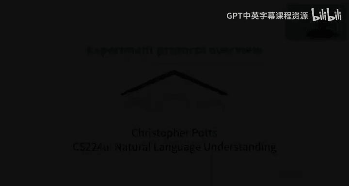
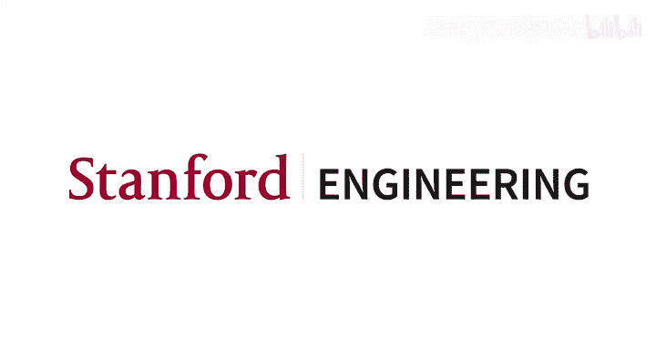

# 38：实验方案概述 📋

在本节课中，我们将学习课程项目中的第二个关键文档——实验方案文档。这份文档旨在帮助你、你的团队成员以及导师，就最终论文的目标和实现路径达成清晰共识。

## 文档概述与核心理念

上一节我们介绍了文献综述，本节我们来看看实验方案文档。这份文档虽然形式有些特殊，但对于确保项目最终能成功完成至关重要。

其核心理念与文献综述相同，都是为了促进**高效对话**。我们希望你能与队友、导师以及自己进行有效沟通，明确项目的范围与总体目标。

## 实验方案的核心组成部分

以下是实验方案文档需要涵盖的几个关键部分，每一部分都旨在推动项目的清晰规划。

1.  **核心假设**
    *   你需要尽可能清晰地陈述你的核心假设（或假设群）。这是你实验设计的出发点。

2.  **数据资源**
    *   详细说明你将使用的数据资源，并讨论任何潜在的限制，例如数据获取难度、数据生成成本等可能威胁项目数据需求的问题。

3.  **评估指标**
    *   明确你将使用的评估指标。对于标准分类问题，这可能很简单（例如报告宏平均F1分数 `macro F1`）。但如果你在研究一个特殊问题或自创指标，这里则需要更详细的讨论。

4.  **模型与方法**
    *   描述你计划使用的模型或架构。这包括你设定的基线模型、用于对比的模型点以及消融实验设计等。这部分内容需要与你列出的核心假设紧密关联。

5.  **整体逻辑**
    *   阐述整个项目是如何整合在一起的。即数据、模型和指标如何共同验证你的假设。这是文档中最需要传达清楚、也最具力量的部分。

6.  **当前进展总结**
    *   总结到目前为止的项目进展。**请注意，现阶段并不要求你必须得出任何实验结果**。这份文档可以纯粹是计划性的。当然，如果你已有结果，汇报出来会非常好，这证明你的项目已具备最小可行性。

## 文档要求与撰写建议

实验方案是一份简短的结构化报告，用于确立核心实验框架并进行讨论。我们强调“简短”，如果项目进展顺利，它本应是一份短文档。具体要求如下：

*   **长度**：最大页数为8页，但通常会更短。
*   **模板**：我们提供了可选的Overleaf模板（基于ACL模板），鼓励使用但不强制。
*   **参考文献**：与之前一样，必须包含参考文献部分。

关于撰写，有以下几点建议：

*   **积极揭示问题**：请务必指出你遇到的任何疑虑或障碍，即使是远期可能出现的。这份文档是确保项目能在规定时间内顺利收尾的最后机会，因此宁可多披露一些。
*   **假设是必须的**：你需要能够陈述一个假设。常有工程师表示“我没有假设，我只想看看这个模型是否适合我的问题”。这本身就是一个假设——只需将其表述为一个关于你认为什么会奏效的论断即可。这将从智力上指导我们，并帮助我们选择基线、设计消融实验等，以验证你的想法。
*   **尽早建立完整流程**：我们希望你尽快建立一个完整、可运行的项目流程。理想状态是，在任何一天你都能提交一个“可运行”的项目（即使它还不是你最终设想的样子）。达到这个状态后，你将主要专注于添加新的实验结果、分析和报告，从而充实整个项目，这能让你在没有过大压力的情况下进行创造性探索。

## 额外资源与总结

我准备了一份非常全面的Markdown文档，其中包含了许多常见问题解答、与最终项目相关的各文档讨论、以及过往优秀最终论文（其中一些后来已发表为出版物）的示例等。如果你在如何开展项目方面需要关键指导，我强烈推荐查阅这份文档。

最后，如果你的课程论文最终得以发表，请务必告诉我。在你的允许下，我很乐意将其加入源自本课程工作的已发表论文列表中。我为这个列表的长度和多样性感到非常自豪。😊

本节课中，我们一起学习了实验方案文档的目的、核心组成部分以及撰写要点。这份文档是项目成功的关键规划工具，旨在通过清晰的沟通和问题预判，确保你的研究路径坚实可靠。