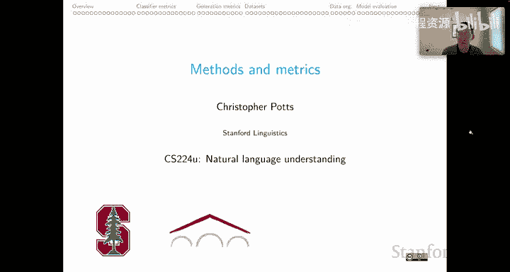
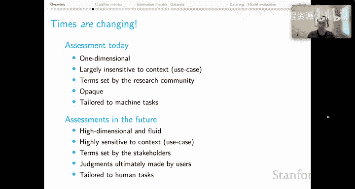

# 39：方法与度量概述 🧭

在本节课中，我们将探讨自然语言处理项目中的核心方法论与评估度量。我们将了解如何为项目做出明智的实验设计、数据管理和度量选择决策，并讨论当前领域面临的挑战与未来的发展方向。

---

## 课程目标与当前问题

首先，我们来概述本系列课程的目标以及当前NLP研究领域在方法与度量上面临的一些普遍问题。

我们的根本目标是帮助你顺利完成项目，在实验、数据、度量等方面做出明智选择。同时，本课程也旨在成为你在面对艰难研究决策时可以信赖的伙伴和参谋。

关于课程材料，我们提供了一个关于评估度量的大型实践笔记，让你可以亲手操作我在视频中概述的一些详细技术内容。此外，课程网站还嵌入了关于如何更广泛地思考AI模型评估的优秀页面。我们还有一个内容广泛的实践笔记，让你可以动手操作我们将要讨论的方法论内容，并通过实验来验证我将在这里作为一般经验分享的一些观点。

在阅读材料方面，虽然相关文献比硬科学和行为科学领域要少得多，但这可能表明我们的领域仍在发展中。本单元的目标就是为这些构成我们领域基础的关键事项提供更系统的指导。

---

## 项目评估的核心原则

上一节我们介绍了课程的整体目标，本节中我们来看看评估项目时一个至关重要的原则。

关于我们如何看待你的项目，首先要说明一件非常重要的事：**我们永远不会根据结果的“好坏”来评估你的项目**。这里的“好”通常意味着在排行榜上名列前茅或类似的标准。

我认识到该领域的学术出版机构确实这样做，其理由是它们有版面限制，这导致它们更倾向于发表关于新进展的积极结果，而非消极结果。但这对科学文献是一种扭曲，并且绝对最终会阻碍进步，因为消极结果在指导人们将精力投向何处（特别是何处不应投入）方面可能非常强大和有用。

对于我们这门课程而言，我们不受任何关于可以发表什么内容的真实或想象的限制。因此，我们可以做正确且有益的事，即同等重视积极结果、消极结果以及介于两者之间的一切。

这意味着，根据你自己的实验，你可能在排行榜上名列前茅。但如果你的报告很肤浅，没有真正解释那个数字是如何得出的或其背后的思考过程，你也不会得到好成绩。更重要的是，反过来，你可能尝试了一些非常有创意和雄心勃勃的东西，它可能失败了。但这可能是一项杰出的贡献，因为你在我们真正关心的事情上非常谨慎，这些事包括：度量的适当性、方法的严谨性，以及论文在多大程度上公开、清晰地认识到其发现的局限性。

这是该领域一个可喜的趋势，我们越来越强调找出我们想法的外部局限性，并在论文中描述这些局限性。我鼓励你们也做类似的事情。总的来说，这类工作将引导你获得更富有成果的系统、更有价值的成果和更高质量的论文。

因此，我对这一点感到非常满意。我们可以在下一单元讨论如何应对与这种发表偏见相关的棘手问题。我认为从根本上说，我们也能在这方面做得很好。

你需要转变的视角是：从将论文视为一场偏袒你所选系统的竞赛，转向将论文视为仅仅是公开评估科学假设，并尽可能多地收集证据来为这些假设提供信息。一旦你进入这种模式，你就不再考虑如何挑选赢家，而是思考证据的强度和假设的重要性。这样我们就能达到目标，每个人都会因此更快乐。但这确实需要我们摆脱经常听到的、以竞争为导向的规范，进行视角的转变。

---

## 方法论的演变与困境

上一节我们明确了项目评估的价值导向，本节中我们来看看具体的研究方法在过去十几年间发生了怎样的变化，以及我们面临的困境。

我将这部分内容放在“时代如何变迁”的标题下。不幸的是，我在这里没有太多令人愉快的经验可以传授。

让我们把时钟拨回到2010年左右。在那个时代，你可以在训练数据的微小样本上开发完整的系统。一旦系统运行起来，你将仅使用训练数据进行常规的交叉验证。这是一个非常理想的实验环境。你只会偶尔在保留的开发集上进行评估，以避免在该开发集上进行“爬山”优化并最终对其过拟合。这就是为什么你在那里会非常谨慎。然后，在项目的最后阶段，你将使用开发数据进行一轮完整的超参数调优，选择最佳模型，运行最终的测试评估，并或多或少地直接报告那个数字。

那是2010年。作为我们领域的科学图景，这其中有某种深刻正确的东西。但不幸的是，时代已经变了。

在2023年，你仍然可以像以前一样在数据的微小样本上开发你的系统，这很好。然而，对于第二步，要么你的任务没有训练数据，要么在其上进行交叉验证将花费2万美元并耗时六个月。因此，就我们理想的科学图景而言，我们已经偏离了轨道。与此相关的是，开发集对于优化过程经常至关重要。因此，你必须祈祷它确实是测试集的绝佳代理，因为毕竟，你将把所有优化过程都导向这个开发集。最后，对于最终阶段，要么超参数调优将花费10万美元并耗时10年，要么没有超参数，但每次测试运行要花费4000美元，因为你在调用OpenAI模型之类的东西。

这看起来难以为继，对吧？我们该怎么办？

前一时代的核心原则仍然是合理的。正如我所说，我喜欢它们。它们有真正的好处，但我们无法强制执行它们。强制执行已经变得不可能。如果我们只这样做，那么只有最富有的组织才能遵循它们，这将以一种可怕的方式限制该领域的参与。如果你要创建一个排名列表，你必须将广泛参与置于所有这些我们过去在每台消费级笔记本电脑上都能快速训练模型时能够侥幸使用的、非常理想化和规范化的方法之上。

因此，你必须做的是阐明你的方法及其背后的原理，包括资源限制等实际细节以及你不得不采用的启发式方法。

然而，有两条规则在这里应该绝对保持不变。我对此非常坚持。

第一，**你永远不要基于测试集评估（即使是非正式地）进行任何模型选择**。我知道该领域有人违反这条规则，但不要走那条路。这对我们来说非常重要，特别是当我们考虑到我们可能部署系统的高风险场景时，我们需要原始的测试评估，以诚实地了解我们的系统在未见示例上的表现。一旦你基于测试集数字选择模型，你就完全破坏了这一点。

第二，当你考虑构建基线、进行消融研究以及与文献进行比较时，**你必须努力为你评估的所有系统提供成功的最佳机会**。你永远、永远不应该偏袒你倡导的系统。我们都知道可以这样做。所有这些模型都有超参数，你可以为你反对的模型选择非常糟糕的设置，并为你喜欢的模型努力寻找最优设置。通过这种方式，你似乎赢得了某种竞赛，但你却损害了你项目的基础。

相反，你需要做的是给每个系统最好的机会，努力让它们都具有竞争力。结果将是更好的、你可以信赖的科学成果。最终，如果你对这条规则也同样严谨，你将在该领域走得更远。

---

## 评估度量的现状与展望

上一节我们讨论了研究方法面临的挑战，本节中我们转向评估度量，在这方面我可以更乐观一些。

我将这部分内容放在“时代应如何改变”的标题下，我确实感觉它们正在以令人愉快的方式迅速改变。

我们在这里可以牢记的总体思想是**古德哈特定律**：当一个度量本身成为目标时，它就不再是一个好的度量。我们必须警惕古德哈特定律，必须保持警惕，确保我们不会落入这个陷阱。

在这种背景下，我总是会想到排行榜。排行榜是该领域运作方式的核心。我们都思考它们，并将其用作进步的标志。它们确实有其好的一面。排行榜可以成为客观比较的基础，这为即使是看似疯狂的想法提供了被倾听的机会。在没有排行榜的领域，这些疯狂的想法经常被社区直接拒绝，没有任何评估。而至少排行榜给了我们领域的人们一个参与的机会。

这是好的一面。然而，坏的一面是，排行榜可能变得非常糟糕。我们经常将基准改进与实际进步混为一谈，而事实上我们知道基准可能是有缺陷的。与此相关的是，我们将基准与经验领域混为一谈。人们会说诸如“OCR解决了”、“问答解决了”之类的话。他们真正的意思是某些基准被解决了。我们现在都意识到，关于基准和能力的这两个主张是截然不同的，但人们仍然将它们混为一谈。甚至在我们说话的方式中，我经常发现我们犯有第三种错误，即将基准性能与能力混为一谈。我们看到一个系统在SQuAD问答上表现良好，就假设它是一个好的问答系统，尽管我们心里知道这两者是非常不同的。

这就是排行榜的坏处。我认为我们未来应该做的是思考如何引入更多好的方面、更多维度的优点，并减少对这些我们经常做出的糟糕假设的依赖。

这里的根本问题，我想说的是，你选择的度量（包括那些嵌入在排行榜中的度量）实际上与你试图解决的问题紧密相连。而在该领域，我们往往没有真正建立这种联系。

让我为你提供一些场景，它们应该能让你思考，如果考虑到不同的度量，你会如何以不同的方式处理这些问题。

以下是需要考虑不同度量的场景示例：

*   **场景一：** 假设你处于一个**错过安全信号会付出生命代价**，并且**人工审查可行**的场景中。你会青睐哪种类型的度量来评估系统？
*   **场景二：** 相反，假设需要在一个**海量数据集中找到范例**。在这种背景下，你会使用哪种度量来评估系统？
*   **场景三：** 假设**特定的错误是致命的**，而其他错误几乎无关紧要。现在，你需要一个度量，能以不同的方式对不同类型错误和良好预测给予奖励和惩罚，以体现这些基本理念。
*   **场景四：** 假设**需要对案例进行优先级排序**。你谈论的不再是分类，而是排序。同样，你应该有好的排序度量。
*   **场景五：** 假设解决方案需要在**老化的蜂窝网络**上运行。那么，你对准确性的执着应该让位于能够在非常受限的硬件上运行的系统（低能耗、低功耗、非常快等）。
*   **场景六：** 假设解决方案**不能为特定群体提供更差的服务**。标准的机器学习模型通常会偏向多数群体。如果你的最终目标是确保系统在各群体间公平，你将不得不改变你的度量标准，甚至可能改变围绕优化的基本实践。
*   **场景七：** 假设**必须绝对阻止特定的预测**。现在你进入了一个完全不同的领域，某些类型的错误代价无限大，而其他错误几乎无关紧要。这又是一个与常规非常不同的场景。

在该领域，可悲的是，科学文献似乎为几乎每个场景提供了一个答案：**使用F1和相关准确率度量作为系统性能的衡量标准**。

如果你回顾这个列表，你会发现F1不适用于其中任何一个场景。F1只是我们作为研究者在没有应用领域信息时做出的选择。当我们有信息时，我们应该根据这些具体场景定制我们的度量标准。但这几乎从未做过。我担心我们向世界投射的教训是“你不需要费心”。我们不做，而我们被认为是专家。那么为什么其他人要做呢？尽管作为专家，我们可以看到这些不同的场景需要非常不同的度量。

与此相关的是，如果你对科学文献进行调查，你会发现一种对性能（准确率、F1等）的普遍痴迷。Birhane等人2021年的论文《机器学习研究中编码的价值观》很好地支持了这一点。我将他们的证据提炼成一个卡通化的图景，我认为这抓住了本质。我使用字体大小来传达他们发现编码在我们文献中的价值观。毫不奇怪，**性能**以最大的字体占据主导地位，压倒了我们可能希望反映在我们研究中的所有其他价值观。

紧随其后但差距相当大的第二位是**效率**。然后是**可解释性**，但请注意，这是针对研究者的可解释性。我们在这门课中可能也犯了这种错误，上一单元讨论的可解释性工作非常侧重于技术消费者。适用性、鲁棒性、可扩展性也有较好的体现。然后，我使用了不同且更浅的字体来反映在这个排名中非常遥远的事物：针对用户的**可解释性**、**仁慈**、**隐私**、**公平**、**正义**。我们都认识到这些是成功NLP系统的关键方面。但它们很少反映在我们关于假设和系统评估的实践中。真的，如果有人只是消费我们的文献，他们从中得到的，再次是，对准确性和相关性能概念的痴迷。

因此，我们应该抵制。我们应该以我们使用的度量形式提升其中一些其他价值观。幸运的是，已经有这方面的努力。我将其放在“多维排行榜”的标题下。我参与了一项努力——DynaBoard。还有Don Bench和Explainaboard。这些都是为我们的系统提供更多维度评估，以获得关于实际发生的更丰富图景的努力。

在这种背景下，我想提一下**Dynascore**。我认为这是一种非常强大的方式，可以引入多个度量，甚至允许系统背后的人决定在多大程度上青睐哪些度量。它是一个如此强大的度量，以至于我实际上为你提供了一个实现Dynascore并提供一些使用技巧的笔记，这样你也可以探索使用Dynascore来综合你所测量的多个方面。

让我给你一个感觉，为什么这可能如此强大。我这里有一个真实的问答系统排行榜。根据我的Dynascore，DeBERTa模型排名第一。那个Dynascore是通过给予性能很大权重，然后给予吞吐量、内存、公平性和鲁棒性相等权重创建的。

然而，使用Dynascore，我可以调整这些权重。假设我决定我真的想要一个高性能且公平（根据我的公平性度量）的系统。因此，我调整Dynascore，给予公平性5倍权重，并相应降低吞吐量、内存和鲁棒性的权重。那么，之前排名第一的系统现在变成了第二，而ELECTRA-large成为了第一。当然，对我这里不同度量的不同加权会以其他方式调整排名。这表明没有唯一真实的排名，只有相对于我采取的不同优先级、价值观和测量的排名。这就是Dynascore的本质：透明地展示这些价值观，并在传统的排行榜中反映它们，就像我们在这里做的那样。

---

## 对图灵测试与人类性能评估的反思

上一节我们探讨了多维评估的重要性，本节中我们来看看两个经典的评估概念：图灵测试和人类性能基准，并反思其局限性。

在这种背景下，当我们谈论评估和不同度量时，人们常说，等等，这些都太技术性、太定制化、太复杂了。我们应该做的是更像**图灵测试**的事情。毕竟，在某种意义上，那是终极测试。这里的想法是，一个人和一台计算机进行交互，然后人试图弄清楚那是计算机，而计算机则尽其所能欺骗那个人。通过这种方式，我们应该对系统的整体质量和智能等有一个良好的诊断。

我只想在这里发出一个警示。

第一个有记录的图灵测试出现在Sheber 1994年的报告中。在那个测试中，莎士比亚专家Cynthia Clay三次被误分类为计算机，理由是没有人能知道那么多关于莎士比亚的知识。这是一个人们并不真正了解人类经验全部范围和普遍性的例子。

相反，这是另一个滑稽的故事。2014年，一个非常简单的名为Eugene Goostman的AI通过了图灵测试。它是怎么做到的？它通过采用一个13岁男孩的人格做到了这一点。当它粗鲁或显得心不在焉（因为它对人类试图做的事情感到困惑）时，人们只是将其归因于13岁男孩经常有点粗鲁和心不在焉。通过这种方式，它轻松过关。

Google Duplex是一个真实的、复杂的AI系统，它是一个经常运行并赢得与服务人员图灵测试的AI。它打电话，即使它依法在对话一开始就宣布自己是AI，人们也常常忘记这个信息，并相信他们正在与计算机交谈。

与此相关的是，既然我们已经进入了进行大量自然语言生成的模式，我们都发现人们不擅长区分人类书写的文本和来自我们最好的大语言模型的文本。

因此，通过这种方式，特别是Duplex和LLM的故事，我们应该反思这样一个事实：我们所有人可能在某些情况下不断未能通过图灵测试，在某些情况下是与复杂的AI，但在某些情况下是与实际上相当简单的AI。关于社交互动的一些认知偏见使得这不是一个非常可靠的测试。

在评估的背景下，我们应该思考的另一个维度是我们如何估计人类性能。我在这里的总结是：我们通过强迫人类执行机器任务来估计人类性能，然后说这就是人类的实际表现。

让我在自然语言推理的背景下给你一个例子。想象一下你是一个众包工作者。你被要求为“前提-假设”对标注它们是中性、蕴含还是矛盾。你接受了一点培训。培训后，你看到，“一只狗在跳”和“一只穿着毛衣的狗”。这两者彼此是中性关系，因为我们从“跳”中不知道它是否穿着毛衣。没有关系。

然后你看到例子“乌龟”和“语言学家”。你想，嗯，我可以在某个可能的世界里想象乌龟语言学家，但我被告知这是一个常识推理情境。所以我会说矛盾，因为“没有真正的乌龟是语言学家”似乎是一个安全的假设。

但然后你看到一张赛马的照片和一张运动员的照片，你被要求分配一个标签，你想，嗯，我以前没怎么想过这个。赛马能是运动员吗？一般来说，动物能是运动员吗？你可能决定对此有固定的看法。也许你说，当然，赛马可以是运动员。或者，当然不是。但真正根本的是，你可能不确定其他人对此的看法。反过来，你可能对你应该分配什么标签感到不确定。人类的方式是讨论和辩论，以弄清楚为什么问这个问题，以及人们对此相关问题有什么想法。但我们所做的却是阻止所有这些互动，简单地强迫众包工作者选择一个标签，然后我们实际上会惩罚他们，惩罚的程度取决于他们没有选择其他人选择的标签，尽管我们所有人都感到不确定。

这是另一个例子：“一位厨师在使用烧烤架”和“一个人在使用机器”。烧烤架是机器吗？我认为这可能取决于情境、目标、假设等所有因素。人类的方式是讨论这些不确定点，然后分配一个标签。但当我们进行众包时，我们只是阻止了这一点。

所以现在，当你听到“人类性能的估计”时，你应该记住，人类可能不被允许做大多数人类会做的事情，比如“让我们讨论一下”。因此，这些背景下的人类性能实际上意味着匆忙的众包工作者重复执行机器任务的平均表现。

我们都可以做这种心理简写，但当然，在现实世界中，人们听到“人类性能”，会想到最重大意义上的人类性能。我们应该意识到这不是真的。我们应该抵制这种假设，即当我们实际上这样做时，这就是我们的本意。

---

## 我们真正寻求的评估度量是什么？

上一节我们反思了传统评估方式的局限，本节中我们总结一下，在评估度量方面，我们真正应该追求的是什么。

我会说，我们寻找的是介于标准旧评估之间的东西。

“一个系统能否在友好的测试中比执行相同机器任务的人类更准确？”——这是我对我标准评估的略带讽刺的转述。

但我们也不想转向“一个系统能否在开放式对抗性交流中表现得像人类？”——那是图灵测试。它是一个非常特殊的东西，而且非常棘手。

在这两者之间，有很多富有成效的东西。

本着我们之前单元的精神，我们可以问：

*   **系统性：** 一个系统能否**行为系统化**，即使它不准确？这可能是一个我们最终可以信任的系统，即使它目前表现不佳。
*   **置信度评估：** 一个系统能否**评估自己的置信度**，知道何时不做预测？我们AI中的系统过去会在每个未预料到的输入上失败。现在，无论你扔给它什么，它似乎都自信地给出一个答案。我们需要改变这一点。我们需要系统在不确定信息是否良好时保留信息。
*   **终极目标：** 也许从根本上，我们应该问，一个系统能否**让人们更快乐、更高效**？这将使我们远离自动评估，转向更像人机交互评估的东西。但最终，我觉得这是我们的目标，我们不妨就设计面向它的评估。

正如我所说，我对这一切充满希望。我认为时代应该改变，而且它们正在改变。

**昨天的评估**（