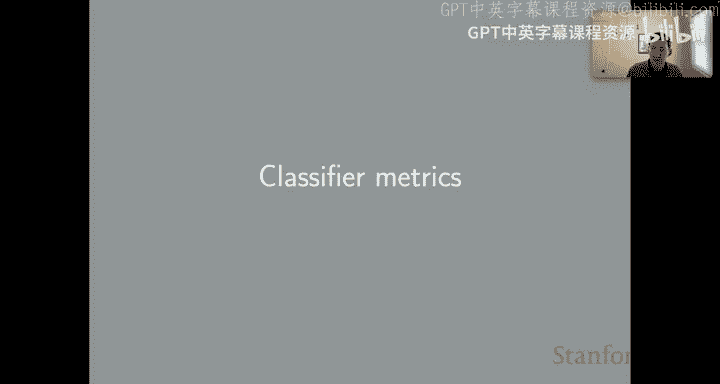
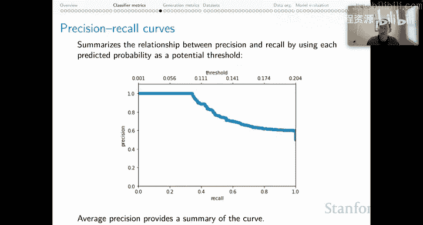

# 40：分类器评估指标 📊

在本节课中，我们将深入学习分类器评估指标。上一节我们介绍了方法与指标的高层主题，本节我们将深入探讨分类器评估的具体技术细节。

## 概述

不同的评估指标体现了不同的价值取向，因此选择指标是实验工作的关键环节。你需要结合假设、数据和模型来做出明智的指标选择。即使是在拟合看似简单的分类器时，也应根据目标来定义新指标或调整现有指标的使用方式。

对于成熟的任务，通常会存在使用特定指标的压力，例如排行榜或先前文献中使用的指标。但如果你认为有必要，也应该勇于提出质疑。毕竟，研究领域可能因指标选择不当而停滞不前。

## 混淆矩阵

让我们从混淆矩阵开始，这是许多计算的基础。作为一个示例，我将使用一个三元情感分类问题。行代表真实标签，列代表预测标签。

例如，这个混淆矩阵显示，有15个真实为“积极”的样本被系统预测为“积极”，而有100个真实为“积极”的样本被系统预测为“中性”。

需要强调的是，这些分类预测很可能基于一个阈值，特别是对于概率分类器。模型输出的是各类别的概率分布，然后应用某个决策规则来确定最终的预测类别。

显然，不同的决策规则会产生截然不同的结果表。此外，值得关注的是“支持度”，即每个类别在真实数据中的样本数量。在我们的示例中，数据是高度不平衡的，这在选择合适指标时是一个重要因素。

## 准确率

准确率是正确预测数除以总样本数。给定一个混淆矩阵，这意味着我们对角线上所有元素求和，然后除以表中所有元素的总和。

准确率的取值范围是0到1，0最差，1最好。准确率体现的价值很简单：系统正确的频率。

这引出了两个弱点。首先，没有针对每个类别的指标。其次，它完全无法控制类别大小的影响。准确率只关注你猜对的原始次数，而不敏感于系统中的不同类别以及系统对这些类别的预测方式。

我们的示例表很好地说明了这可能存在的问题。本质上，所有真实案例都是“中性”，所有预测也都是“中性”。因此，系统在“积极”和“消极”类别上的表现对准确率影响微乎其微，因为准确率完全由“中性”类别的表现主导。

如果你确实有在最小类别上也表现良好的目标，我将为你介绍一些指标。但请记住，如果你使用交叉熵损失，你实际上是在隐式地优化模型的准确率，因为准确率与负对数损失（即交叉熵损失）成反比。

## 精确率

为了摆脱原始准确率的局限，第一步是引入精确率。

类别K的精确率是K类正确预测数除以所有被预测为K类的样本数。我们在这里按列操作。

以下是“积极”类别的精确率计算示例：

**公式：**
`精确率(K) = 正确预测为K的数量 / 所有预测为K的数量`

精确率的边界是0和1，0最差，1最好。需要注意的是，当分母为0时精确率未定义，通常我们将其映射为0。

精确率体现的价值是惩罚错误的猜测。其弱点是，你可以通过很少预测类别K来获得该类的高精确率。如果你对这个类别的预测非常谨慎，你很可能会获得高精确率，但这不一定是我们想要体现的全部价值。

## 召回率

通常，我们用召回率来平衡精确率。

类别K的召回率是K类正确预测数除以所有真实为K类的样本数。我们在这里按行操作。

以下是“积极”类别的召回率计算示例：

**公式：**
`召回率(K) = 正确预测为K的数量 / 所有真实为K的数量`

召回率的边界是0和1，0最差，1最好。

召回率体现的价值是惩罚遗漏的真实案例。它与精确率形成一种对立。其弱点是，我们可以通过总是猜测K来获得该类的高召回率。如果我想确保不遗漏任何样本，我就会不断猜测K，以增加不错过的机会。

现在你可以非常直接地看到，我们应该用精确率来平衡召回率，因为它施加了相反的价值。这通常是F分数（通常是F1分数）的动机。

## F分数

原则上，我们可以有一个权重参数beta来控制我们偏向精确率和召回率的程度。同样，无需盲从。有些场景精确率重要，有些场景召回率重要。你可以使用beta来使你的指标与你高层的价值取向保持一致。但默认情况下，beta为1，表示均衡。

F1分数是精确率和召回率的调和平均数。这可以是一个针对每个类别的概念。

以下是每个类别的F1分数计算示例：

**公式：**
`Fβ = (1 + β²) * (精确率 * 召回率) / (β² * 精确率 + 召回率)`
`F1 = 2 * (精确率 * 召回率) / (精确率 + 召回率)`

F1分数的边界是0和1，0最差，1最好，并且它总是作为精确率和召回率的调和平均数介于两者之间。

F1分数体现的价值类似于：类别K的预测与K的真实实例在多大程度上对齐，beta控制着精确率和召回率的权重。因此，它有点像精确率和召回率都融入了这个“与真实对齐”的概念中。

其弱点是：没有对数据集大小进行归一化；它忽略了K所在行和列之外的所有值。例如，在计算“积极”类别的F1时，我不关注其他单元格的值，无论那些非对角线元素中有多少样本。这是一种结构性的偏差。

## F分数的平均方法

我们可以用多种方式对F分数进行平均，我将讨论三种：宏平均、加权平均和微平均。

### 宏平均

这是该领域最主要的选择。原因是我们作为NLP研究者，倾向于关心类别本身，无论其大小。甚至，我们通常更关心小类别，因为它们可能更有趣或更难。

宏平均就是对这些数值进行简单的算术平均。

**公式：**
`宏平均F1 = (F1(类别1) + F1(类别2) + ... + F1(类别n)) / n`

其边界是0和1，0最差，1最好。它体现的价值与F分数相同，外加一个假设：所有类别无论大小或支持度如何都是平等的。

其弱点是：一个只在小类别上表现良好的分类器在现实世界中可能表现不佳；一个只在大类别上表现良好的分类器可能在重要的小类别上表现很差。

### 加权平均F分数

这是一种考虑总支持度的直接平均方法，即对三个F1分数进行直接的加权数值平均。

**公式：**
`加权平均F1 = Σ (支持度(类别i) * F1(类别i)) / 总支持度`

其边界是0和1，0最差，1最好。它体现的价值与F分数相同，外加一个假设：类别大小确实重要。因此，这会更像准确率。

其弱点当然是，大类别将严重主导结果，我们又回到了准确率所具有的弱点。

### 微平均F分数

微平均的做法是：为每个类别形成其自己的二元混淆矩阵，然后将它们加在一起，得到一个单一的二元表。

其属性同样是边界0和1，0最差，1最好。它体现的价值与准确率完全相同。如果你关注最终构建的那个表中的“是”类别，它完全等同于准确率。

因此，其弱点与F分数相同，外加一个“是”分数和一个“否”分数，这有点烦人，因为你怎么处理“否”类别？你必须关注“是”，而“是”那个毕竟就是准确率。据我所知，这是唯一一个大家都关注的数字。

总的来说，我认为在这一点上，你可以忽略微平均F分数。你仍然会在文献和scikit-learn的结果表中看到它们，但总的来说，基本上就是：用宏平均来抽象掉类别大小的影响，或者用加权平均来将总体类别大小作为指标的一个要素。这是我建议未来使用的两种方法。只有在完全平衡的问题中，你才应该回到准确率，因为那时类别大小不会成为干扰因素。

## 超越单一决策边界

最后，我想回到开始时的一个观察：我们总是需要强加一个决策边界，这有点令人烦恼。对于精确率和召回率，我们也必须做同样的事情。我们可以用不同的方式思考这个问题。

例如，我们可以有精确率-召回率曲线，这允许我们探索在给定决策边界下，系统可能进行预测的所有可能方式。这提供了关于这两种压力之间权衡的更多信息，并且可以使人们更容易地将系统选择与他们对系统的潜在价值取向对齐。

我知道要求这样做是不切实际的，因为该领域相当关注单一汇总数字，但我认为思考精确率-召回率曲线以获得更多信息可能很有趣。然后，如果我们确实需要选择一个单一数字，平均精确率是对这条曲线的总结，它再次避免了关于如何权衡精确率和召回率的决定，并带来了更多信息。你会认出这类似于我们在信息检索背景下所做的平均精确率计算，它同样提供了关于系统表现的非常细致的解读。

## 总结

本节课我们一起学习了分类器评估的核心指标。我们从混淆矩阵出发，理解了准确率、精确率、召回率和F分数的定义、计算、价值取向及各自的优缺点。我们还探讨了宏平均、加权平均和微平均这三种对F分数进行平均的方法，并了解了它们适用的场景。最后，我们思考了超越单一决策边界、使用精确率-召回率曲线来获取更丰富系统信息的可能性。理解这些指标将帮助你更好地评估和优化你的分类模型。