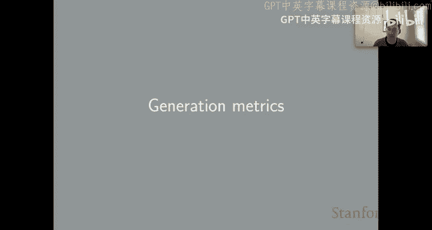
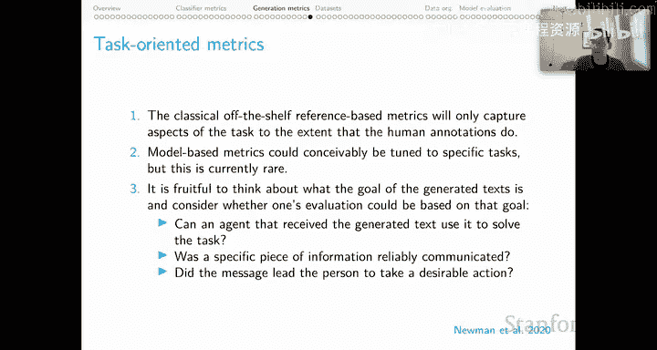

# 41：生成评估指标 📊

在本节课中，我们将学习用于评估自然语言生成系统性能的各种指标。生成任务的核心挑战在于，表达同一件事通常有多种有效方式，这使得评估变得复杂。我们将从困惑度开始，逐步探讨基于参考文本的指标、无参考指标以及面向任务的评估方法。

---

## 困惑度：生成任务的“准确率” 📈

上一节我们讨论了分类器指标，本节我们来看看生成任务的基础指标——困惑度。困惑度可以被视为生成任务中“准确率”的类比。

困惑度的定义如下：对于一个序列 **X** 和一个能够为其分配概率的模型，该序列的困惑度是该模型分配给序列中各个时间步概率的**几何平均数**。

**公式**：
`困惑度(X) = (∏_{t=1}^{T} P(x_t | x_{<t}))^{-1/T}`

在评估整个语料库时，我们计算所有序列困惑度的几何平均数，得到平均困惑度。

**困惑度的特性**：
*   **范围**：1 到无穷大，1 为最佳（我们希望最小化此值）。
*   **本质**：它等价于交叉熵损失的指数化。由于现代语言模型普遍使用交叉熵损失进行训练，这意味着我们实际上是在针对困惑度进行优化。
*   **评估含义**：困惑度衡量的是模型为输入序列分配高概率的程度。评估时，我们在评估集上运行模型，计算平均困惑度，并将该数值作为系统质量的估计。

**困惑度的弱点**：
*   **依赖词汇表**：困惑度严重依赖于底层词汇表。例如，若将所有词元映射为同一个未知字符，困惑度会变得完美，但生成系统会非常糟糕。
*   **无法跨数据集比较**：我们无法脱离数据本身定义“好”或“坏”的困惑度标准，因此比较不同数据集上的困惑度数值如同比较不可比之物。
*   **模型间比较困难**：进行模型间比较时，必须确保分词方式、数据集等众多因素保持一致，否则比较可能无效。

---

## 词错误率：对齐参考文本 🔤

词错误率可能比困惑度更好，因为它更紧密地对齐了人工创建的参考文本，这在评估思路上是一种进步。

词错误率是一类指标的总称。你需要选择一个字符串间的**距离度量**（如编辑距离），词错误率则由该距离度量参数化。

**计算方法**：
对于参考文本 **X** 和预测文本 **pre**，词错误率 = `距离(X, pre) / len(X)`。
在语料库层面，分子是所有（参考文本，预测文本）对距离的总和，分母是所有参考文本的总长度。

**词错误率的特性**：
*   **范围**：0 到无穷大，0 为最佳（我们希望最小化此值）。
*   **评估含义**：它衡量预测序列与真实序列的对齐程度，在选择距离度量后，其思路类似于 F 分数。

**词错误率的弱点**：
*   **仅容纳单一参考文本**：这与“表达方式多样”的根本挑战相悖，因为它只能容纳一种（假设是好的）表达方式。
*   **默认是句法概念**：大多数距离度量（如字符串编辑距离）对字符串的具体结构非常敏感。因此，从语义上看相近的句子（如“It was good.” 和 “It was great.”）与语义相反的句子（如“It was not good.”）可能被计算为相似的“距离”。

---

## BLEU 分数：平衡精确率与召回率 ⚖️

BLEU 分数建立在词错误率的直觉之上，试图更好地应对“表达方式多样”的挑战。

以下是 BLEU 分数的工作原理。它同样是精确率与召回率的平衡，但针对生成任务进行了调整。

**修正的 N 元语法精确率**：
这是 BLEU 中的精确率概念。我们通过一个简单例子来理解：假设候选文本是七个连续的“the”，这显然不是一个好候选。我们有两个参考文本。
对于词元“the”，其修正的 N 元语法精确率是 2/7。因为候选文本中有 7 个“the”，而参考文本中“the”出现次数最多的是 2 次（来自参考文本1）。

**简短惩罚**：
为了平衡精确率，BLEU 引入了**简短惩罚**。其本质是：如果生成的文本短于语料库的期望长度，系统会受到惩罚。一旦达到期望长度，则停止惩罚，主要依赖修正的 N 元语法精确率。

**BLEU 分数**：
BLEU 分数是简短惩罚得分与各 N 元语法（如一元、二元、三元）的加权修正精确率之和的乘积。

**BLEU 分数的特性**：
*   **范围**：0 到 1，1 为最佳。对于自然数据，我们并不期望任何系统能达到 1，因为理论上我们无法拥有所有相关的参考文本。
*   **评估含义**：它编码了一种（我们希望是）恰当的精确率与召回率的平衡。
*   **与词错误率的关系**：它与词错误率相似，但试图容纳“对于给定输入通常存在多个合适输出”这一生成任务的根本挑战。

**BLEU 分数的弱点**：
*   **与人工评分相关性存疑**：有大量文献指出，BLEU 在翻译（其重要应用领域）任务上与人工评分的相关性不佳。
*   **对 N 元语法顺序敏感**：这使得它非常关注比较中的句法元素。
*   **对 N 元语法类型不敏感**：这仍然是字符串依赖性的体现。例如，“that dog”、“the dog”和“that toaster”在 BLEU 评分中可能被同等对待，尽管前两者在语义上显然更接近。
*   **需谨慎考虑应用领域**：BLEU 可能与特定领域的生成目标不匹配。例如，在评估神经对话代理时，有研究反对使用 BLEU 作为指标。

因此，需要仔细思考你的生成任务目标、拥有的参考文本类型，以及它们是否与你的高级目标一致。

---

## 其他基于参考文本的指标 🧩

上文提到的词错误率和 BLEU 都是基于参考文本的指标，因为它们依赖于人工创建的参考文本。这个家族中还有其他成员，例如 ROUGE 和 METEOR。

以下是这些指标的发展趋势：
*   特别是 METEOR，它试图更面向任务（如摘要），并且对参考文本和生成文本的细粒度细节不那么敏感，以捕捉更多语义概念。它通过词干还原和同义词匹配来实现这一点。
*   随着 CIDEr 和 BERTScore 等评分方法的出现，我们实际上进入了向量空间模型，希望能捕捉语义的深层方面。
    *   CIDEr 使用 TF-IDF 向量。
    *   BERTScore 使用词元级别的加权最大值来定义两个文本之间的分数，这是一个非常语义化的概念。其评分过程与 ColBERT 检索模型使用的过程非常相似。

可以看到，特别是 BERTScore，我们正试图摆脱字符串的所有细节，真正切入意义的更深层方面。

---

## 基于图像的 NLG 指标 🖼️

有些系统以图像作为输入并生成文本，我们需要评估生成的文本是否适合该图像。

对于此任务：
*   **基于参考文本的指标**（如 BLEU 和词错误率）在存在人工标注且这些标注与你的生成目标一致时是可行的。
*   **无参考指标**：但在许多领域和任务中，获取合适的人工标注可能负担沉重。无参考指标旨在无需人工创建的参考文本来评估文本-图像对。目前最流行的是 **CLIP Score**，此外还有 UIC、SPURTS 等。其愿景是摆脱对人工标注的依赖（这是评估的主要瓶颈），直接独立地评估这些图像-文本对。

我们认为无参考指标前景广阔。然而，我们也有研究指出，当前的无参考指标对文本的目的和图像出现的上下文不敏感，而这些在图像描述生成的目标中是至关重要的方面。不过，我们乐观地认为，可以设计 CLIP Score 及相关指标的变体，将这些质量概念纳入其中。因此，无参考指标可能是基于图像的 NLG 评估的一条富有成果的前进道路。

---

## 面向任务的评估：回归生成的根本目标 🎯

最后，为了完善讨论，我们提出一个更高层次的评论：**面向任务的指标**。

到目前为止，我们一直非常关注与参考文本的比较和其他内在质量概念。但我们应该反思：当我们进行生成时，通常是为了实现某种沟通目标或帮助智能体采取某种行动。

*   **传统基于参考文本的指标**：它们只能捕捉到任务的相关方面，前提是人工标注本身包含了这些任务目标。如果你的参考文本没有反映生成的目标，那么评估也不会反映。
*   **面向任务的模型指标**：可以想象针对特定任务进行调整的模型指标，但这目前还非常罕见。

我们认为，思考文本的目标并考虑评估是否可以基于该目标，这是一种富有成果的新思维方式。

**评估思路的转变**：
你可以问自己：
1.  **任务成功**：接收生成文本的智能体能否利用它来完成任务？你的指标就是任务成功率。
2.  **信息可靠传达**：特定的信息是否被可靠地传达了？我们可以直接询问接收消息的智能体是否可靠地提取了我们关心的信息。
3.  **引导期望行动**：消息是否引导接收者采取了期望的行动？这可以是对沟通成功的一种更间接的衡量。

这可以成为我们用于生成评估的基本指标。它会捕捉某些方面（如任务有效性），而忽略其他方面（如流畅度）。但总体而言，你可以想象，这与我们为生成系统设定的实际目标更加紧密地对齐。

---

**本节课总结**：
本节课我们一起学习了评估自然语言生成系统的多种指标。我们从基础的困惑度开始，认识到其局限性。接着探讨了基于参考文本的指标，如词错误率和 BLEU 分数，它们试图与人类输出对齐，但仍面临表达多样性的挑战。我们还了解了其他更语义化的参考指标（如 METEOR、BERTScore）以及面向图像生成任务的无参考指标（如 CLIP Score）。最后，我们强调了回归生成任务根本目标的重要性，提出了面向任务的评估思路，这可能是未来更有效评估生成系统的关键方向。选择评估指标时，务必清晰定义你的高级目标。