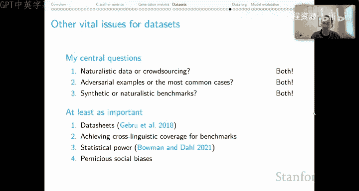

# 42：方法与指标（第四部分）数据集 📊

在本节课中，我们将探讨数据集在自然语言处理领域中的核心作用，以及如何有效地构建和使用它们。上一节我们深入讨论了分类器和生成模型的评估指标，现在让我们提升视角，从概念层面理解数据集如何塑造我们的研究进展。

## 概述：数据集的基石作用

著名海洋学家雅克·库斯托曾说过：“水和空气是所有生命赖以生存的两种基本流体。” 在NLP领域，**数据集**就是所有进展所依赖的资源。我们使用数据集来优化模型、评估模型、比较模型、通过训练为模型赋予新能力、衡量整个领域的进展，并进行科学探究。可以说，我们在NLP领域所做的一切都依赖于数据集。因此，正确构建和使用数据集至关重要，否则我们的研究基础将不稳固，甚至可能产生对进展的误判。

已故的阿拉文德·乔希曾将数据集比作我们领域的“望远镜”。他指出，NLP研究者就像想看星星却拒绝建造望远镜的天文学家。如今，我们拥有的数据集比以往任何时候都多，这或许会让他感到欣慰。

然而，一个值得关注的现象是“基准饱和速度加快”。下图展示了模型性能随时间（自90年代起）接近所谓“人类表现”的归一化距离。虽然一些人从中看到了快速进步的轨迹，但另一个令人担忧的事实是：图表中没有任何系统在真正意义上达到“超人类”水平。这背后的根本问题可能在于，我们的数据集本身就不足以衡量我们想要衡量的能力。

## 数据集的局限性

随着时间推移，我们发现数据集局限性的速度越来越快。以宾州树库为例，这个句法解析数据集驱动了数十年的进展。但多年来，只有相对较少的论文指出了其中的解析树错误。

相比之下，2015年发布的斯坦福自然语言推理基准发布后，立即涌现出大量论文，指出了数据集中的**伪影**、**偏见**和**覆盖缺口**等问题。类似的情况也发生在SQuAD问答数据集和ImageNet图像分类数据集上。这标志着一个新时代的到来：如果一个基准取得成功并被广泛使用，人们也会迅速发现其局限性。虽然作为数据集创建者，这可能令人难以接受，但这种对基础工具的批判性质询，本身就是一种健康的进步标志。

为了简洁起见，我将围绕数据集的三个核心问题进行阐述，并在最后列出更多值得思考的方向。

## 核心问题一：自然数据 vs. 众包数据 🤔

第一个问题是：我们应该依赖从网站抓取或现有数据库中提取的**自然数据**，还是应该转向**众包**？我的答案是：**两者都用**。

以下是两种方法的权衡对比：

**自然数据（或称“发现”或“整理”数据）**
*   **优势**：数据量丰富，收集成本可能较低，并且在某种意义上具有“真实性”，因为这些数据并非为实验而创造，而是源于真实的交流目的。
*   **劣势**：数据集不可控，受限于你在世界中观察到的内容。可收集的信息类型有限，并且可能存在隐私侵犯问题，因为你可能并未获得每位数据贡献者的知情同意。

**众包数据（或称“实验室培育”数据）**
*   **优势**：高度可控，因为你可以设定任务。可以保护隐私，确保贡献者知情并有机会退出。具有表达性，原则上可以让众包工作者完成在自然环境中难以观察到的复杂任务。
*   **劣势**：数据稀缺，永远不够用，且成本高昂。任务可能显得**做作**，因为工作者是在完成你设定的、非自然的任务，结果可能为了取悦任务发布者而显得不真实。

如何平衡这些因素？我认为可以找到**混合模型**，兼顾真实性与表达性，最大化优势，最小化劣势。

例如，在Dynabench Round 2项目中，我们设置了两种条件：一种是让工作者从头编写文本来试图欺骗顶级情感模型；另一种是给他们现有句子进行编辑以达到相同目的。编辑条件在保持我们所需结果的同时，提供了更多的自然性。在长度和词汇多样性上，编辑后的结果更接近从Yelp等网站获取的自然句子。这种混合模型在某种意义上让我们获得了两种世界的最佳体验。

## 核心问题二：对抗样本 vs. 常见案例 📈

第二个问题是：我们应该使用**对抗样本**，还是仅包含最常见案例的基准？我的答案同样是：**两者都用**。

回顾一下：
*   **标准评估**：从一个独立的、与模型无关的过程中创建数据集，并划分为训练集、开发集和测试集。
*   **对抗性评估**：创建一个单独的测试集，其构建方式旨在挑战你的系统。
*   **完全对抗性数据集**：训练集、开发集和测试集都通过（通常由人）试图欺骗顶级模型的方式来构建。

目前已有许多覆盖广泛领域的完全对抗性数据集，相关文献表明，尤其是对抗性训练和测试，带来了许多积极成果。

但也存在不同的观点。例如，Bowman和Dahl在2021年的论文中指出，对抗性过滤可能会系统性地消除对任务必要但已被对抗模型很好解决的某些语言现象或技能的覆盖。这种“模式寻求”而非“质量覆盖”的行为，如果不受控制，会降低数据集多样性，从而使有效性更难实现。

我承认这是一个合理的观点，但关键在于“对抗性过滤”这个概念。我并非主张进行过滤。以Dynabench为例，我们的训练集、开发集和测试集都混合了对抗性案例和模型原本能正确处理的案例（即他们所说的“模式寻求”案例）。我主张的是“两者兼顾”的视角。

他们还认为，通过构建一个**大规模**的基准，就能自然而然地覆盖所有相关现象。我认为这在事实上是不正确的。考虑到语言的复杂性，很难开发出一个大到足以覆盖所有困难案例的基准。而对抗性训练样本的作用，恰恰是帮助我们以更高效的方式填补这些空白。

以情感分析领域为例，我们的模型不仅需要正确处理“食物很好”这样的常规案例，还需要处理复杂的视角转换（如“我妹妹讨厌这食物，但她大错特错”）、非字面语言使用（如讽刺“早餐真好，如果你打算喂狗的话”），以及语言创新（如“值得发出美食的惊叹”）。如果仅进行标准数据收集，你可能根本看不到这些例子，或者密度不足以改进系统。因此，我主张在训练、开发和测试中引入一定程度的对抗性，但避免Bowman和Dahl所担心的过滤操作。

关于对抗性测试，我们目前学到的主要经验有：
1.  我们的顶级系统往往找到了非系统性的解决方案，这令人担忧。
2.  在挑战集上的进展似乎与整体上的实质性进展相关。
3.  现有系统能在不损害通用案例性能的前提下，处理对抗性案例。
4.  无论你对对抗性在系统开发中的作用持何观点，当你部署系统时，人们构思并抛向系统的对抗性例子将定义公众对你系统的看法。因此，出于自我保护，我鼓励你在任何部署之前，就为评估考虑对抗性动态。

## 核心问题三：合成基准 vs. 自然基准 🔬

第三个问题是：应该使用**合成基准**还是**自然基准**？我的答案依然是：**两者都有其作用**。

领域内有一种突出的观点，认为我们只应使用自然基准。从科学层面看，这令我深感忧虑，因为它为我们几乎所有的实验引入了两个**未知数**：
1.  **数据集是未知的**：我们不完全掌握其结构。
2.  **模型是未知的**：我们正试图探索其属性。

在这种情况下，你有一个无法全面审计、甚至可能不完全理解其创建过程的大规模数据集，将其输入到一个同样是主要未知数的模型中，然后得到输出。问题是：输出中的因果因素是什么？由于存在两个未知数，因果归因变得非常困难。

如果我们能将数据集固定为一个已知量，就可以将输出的某些方面追溯到我们操纵的模型属性上。但有两个未知数在起作用，这始终是不确定的。

让我用一个关于“否定作为学习目标”的例子来说明。我们期望系统知道：如果A蕴含B，那么非B蕴含非A（否定的蕴含逆转属性）。许多论文观察到，顶级NLI模型未能达到这个学习目标。人们很容易得出结论：问题出在模型上——顶级模型似乎无法学习否定。

但我们同时观察到，这些模型所训练的自然基准数据集严重**低度表征**了否定。现在我们不知道问题究竟出在模型还是数据集上，因为我们有两个未知数。

作为回应，我们创建了一个“略微合成”的基准——**单调性NLI**。它包含两部分：一个正例部分，我们使用WordNet从现有SNLI假设创建新的例子，以触发系统性的中性B和B蕴含A的案例；一个否定部分，我们对否定例子做了同样处理。替换后，我们得到了这些模式的反转。这个数据集以自然发生的案例为基础，但通过系统性的操作，保证了我们对词汇蕴含和否定有特定类型的表征。

当我们将其用作挑战数据集时，我们获得了深刻的见解。例如，BERT在SNLI上表现极佳，在我们合成基准的正例部分也表现极好，但在否定部分的表现几乎为零——它显然忽略了否定。问题到底是数据还是模型？当我们对负例MonNLI进行少量微调后，模型在该部分的表现立即得到提升。这明确地告诉我们：当向BERT这样的模型展示相关的否定案例时，它能够处理这个任务。

因此，通过拥有一个已知的数据集，我们直接学到了关于模型的知识。当我们转向自然数据时（我强调“当”，因为我认为这很重要），我们知道BERT在**原则上**能够学习否定，而数据覆盖将是其性能的主要影响因素。这些清晰的分析性经验，正是因为我们允许进行一些合成评估才得以获得。

## 总结与更多思考方向

本节课中，我们一起探讨了数据集在NLP中的核心作用，并围绕三个核心问题展开了讨论：自然数据与众包数据的权衡、对抗样本与常见案例的结合、以及合成基准与自然基准的互补价值。我的核心观点是，在这些看似对立的选择中，采取“两者兼顾”的混合策略往往能带来更稳健和深刻的见解。

当然，关于数据集还有更多值得深入思考的问题，例如：
*   **数据表**：为数据集提供披露文件，帮助我们理解如何负责任地使用它们以及其局限性所在。
*   **跨语言覆盖**：如何实现基准的跨语言覆盖？目前我们对英语的关注仍然过多，而我们需要的是在全球范围内都表现良好的系统和模型。
*   **统计功效**：我们需要关注数据集的统计功效。
*   **社会偏见**：我们必须深刻关注数据集中嵌入的有害社会偏见，并思考如何消除它们，以创造更公平的技术。

通过审慎地构建和使用数据集，我们才能为NLP领域的持续进步奠定坚实的基础。