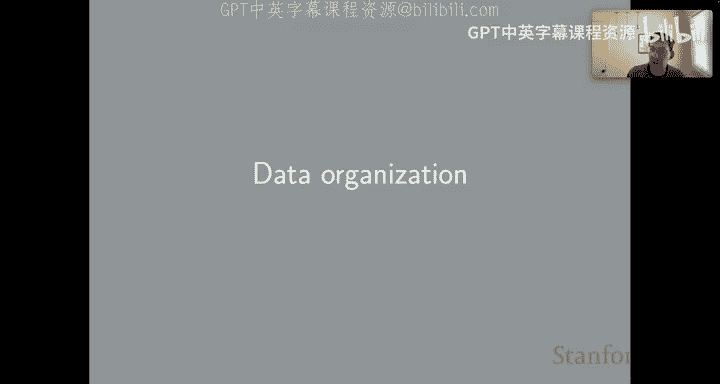
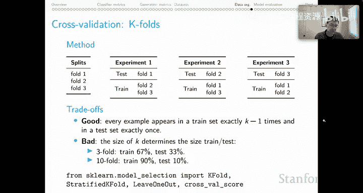

# 43：数据组织方法 📊

在本节课中，我们将要学习在自然语言处理（NLP）和人工智能（AI）领域中，如何有效地组织数据以进行评估。我们将重点探讨当数据集没有预定义划分时，应如何通过交叉验证等方法来确保评估的稳健性和一致性。

---

## 数据划分的常规做法

在NLP乃至整个AI领域，我们通常习惯于将数据集划分为训练集、开发集和测试集。这在大型公开数据集中非常普遍。

这种做法预设了一个相当大的数据集，因为我们几乎从不轻易使用测试集。正如我在该领域反复强调的，我们遵循一个“荣誉体系”：只有在所有系统开发完成后，才能对测试集进行一次性的最终评估。因此，测试集在大部分研究过程中是“上锁”的，这意味着它在科学探究过程中很少被使用。

拥有固定的测试集是有益的，因为它确保了评估的一致性。如果两个模型按照完全相同的协议进行评估，那么比较它们会容易得多。然而，它也有一个缺点：由于我们总是使用相同的测试集，整个研究社区会在这个测试集上进行某种“集体爬山”，后来的论文会从文献中早期的论文间接地学习到关于测试集的信息，这最终会导致性能指标的虚高。

但总体而言，我认为训练-开发-测试的划分方式对NLP领域是有益的。

---

## 处理无预定义划分的数据集

然而，如果你在NLP之外进行工作，可能会遇到没有预定义划分的数据集。这可能是因为数据集较小，或者来自不同的领域。例如，在心理学领域，你几乎不会遇到这种训练-开发-测试的方法论。因此，来自该领域、你可能想利用的数据集不太可能有预定义的划分。

这对评估提出了挑战。因为正如我所说，为了进行稳健的比较，我们真的希望所有模型都在相同的评估机制下运行，这意味着为你所有的实验运行使用相同的划分。

对于大型数据集，你可以自己设定划分，然后在整个项目中使用它们。这将简化你的实验设计，并减少你需要进行的超参数优化量。所以，如果可以的话，就自己设定划分，也许可以将其融入NLP中人们思考数据的方式。

但对于小型数据集，强行进行这种划分可能只会给你留下太少的数据。这可能导致系统评估的变异性非常大。要么你用于训练的样本太少，要么用于评估的样本太少，这都会导致评估结果充满噪声且高度可变。在这种情况下，很难做到正确。

---

## 交叉验证方法

我认为在这种情况下，你应该考虑使用交叉验证。在交叉验证中，我们取一组样本，将它们划分为两个或多个训练-测试分割。我们进行一系列系统评估，然后以某种方式（通常是取平均值）汇总这些分数，并将其报告为系统性能的衡量标准。

以下是两种主要的交叉验证方法：

### 1. 随机分割法

第一种方法非常简单，我在这里称之为随机分割。其思想是，对于K次分割（即K次实验），你打乱你的数据集，然后将其分割为T%的训练集和（1-T）%的测试集（以使用所有数据），然后进行一次评估。你重复这个过程K次，得到一个分数向量，然后以某种方式汇总这些分数。通常你会取平均值，但你也可以考虑平均值加上置信区间，或者某种统计检验，来告诉你两个系统在这种机制下有何不同。

通常，你希望这些分割是分层的，即训练集和测试集在类别或输出值上具有大致相同的分布，以提供一致的评估。

**权衡分析：**
*   **优点**：你可以创建任意多的实验，而不会影响训练与测试样本的比例。这里的K值与T和（1-T）的值是独立的。这意味着你可以运行大量实验，并独立设置训练样本数量或评估样本数量。
*   **缺点**：由于引入了大量随机性的打乱操作，你无法保证每个样本在训练和测试中被使用的次数相同。坦率地说，对于规模合理的数据集，这个缺点确实非常小。因此，我非常喜欢随机分割法。只有在数据集非常小的情况下，我才会担心这个缺点。

最后，Scikit-learn有很多用于进行这种随机分割的实用工具。我鼓励你使用它们。它们是经过精心设计的、可靠的工具代码，将帮助你实施这些协议。

---

### 2. K折交叉验证法

在某些情况下，你可能希望进行所谓的K折交叉验证。这有些不同。

假设我们有一个数据集，我们事先将其划分为三个“折”，即三个互不相交的部分。
*   实验1：我们以折1作为测试集，在折2和折3上训练。
*   实验2：我们以折2作为测试集，在折1和折3上训练。
*   实验3：我们以折3作为测试集，在折1和折2上训练。

这样我们就涵盖了所有组合。我们的三个折给了我们三个独立的实验。然后，我们汇总所有三个实验的结果。

**权衡分析：**
*   **优点**：每个样本在训练集中恰好出现K-1次，在测试集中恰好出现一次。在这方面，我们得到了一个非常理想的实验设置。
*   **缺点**：在我看来，这个缺点确实很严重。K值的大小决定了训练集的大小。如果我进行3折交叉验证，我可以在67%的数据上训练，在33%的数据上测试。但如果我想做10折交叉验证，现在我必须在90%的数据上训练，在10%的数据上测试。感觉实验次数与我想要的训练和测试比例问题性地纠缠在一起了。这确实是个问题。你可能想要很多折（即很多次实验），但在每种情况下却只能在80%的数据上训练。

这导致我在几乎所有情况下都更倾向于随机分割法，因为相对于K折交叉验证所引入的这种混淆因素，随机分割法的缺点相对较小。

最后，我再次指出，Scikit-learn也为你提供了支持。他们有很多很棒的工具，可以以各种方式进行这种K折交叉验证。所以，请务必利用它们来确保你的协议是你想要的。

---

## 总结

本节课中，我们一起学习了在数据组织方面的关键方法。我们回顾了传统的训练-开发-测试划分的优缺点，并重点探讨了当数据集没有预定义划分时，应如何采用交叉验证策略。我们比较了**随机分割法**和**K折交叉验证法**各自的权衡，并得出结论：在大多数情况下，尤其是数据集规模适中时，随机分割法因其灵活性和对训练/测试比例的独立控制而更具优势。最后，我们强调了利用像Scikit-learn这样的成熟工具库来实施这些协议的重要性，以确保评估的可靠性和可重复性。