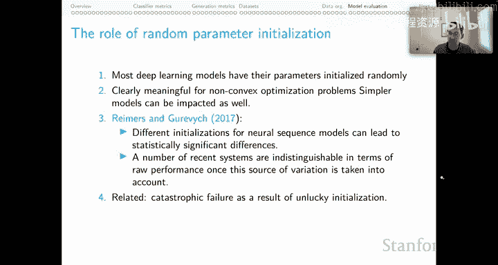
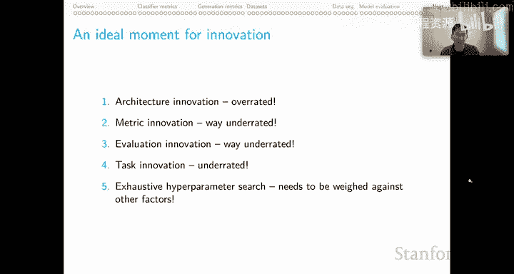

# 44：模型评估与结论 🧪

在本节课中，我们将学习模型评估的核心概念与实践方法。我们将探讨基线模型的重要性、超参数优化的挑战、分类器比较的策略，以及深度学习时代特有的评估问题，如模型收敛性和随机初始化。这些知识将帮助你为最终项目建立坚实的评估基础。

---

## 基线模型 📊

上一节我们讨论了各种评估指标，本节我们来看看如何为模型性能设定参考标准。基线模型为我们理解模型性能提供了至关重要的上下文。

以下是关于基线模型的核心要点：

*   **性能需要参照系**：评估分数本身没有绝对意义。一个获得0.95 F1分数的系统可能只是因为任务过于简单；一个获得0.6 F1分数的系统，如果人类表现也只有0.61，则可能意味着重大成功。
*   **基线是实验设计的核心**：定义基线不应是事后想法，而应是假设检验和实验设计的中心环节。思考简单的系统以及目标系统的消融实验。
*   **基线用于构建有说服力的论证**：它们帮助我们校准和理解所取得的成就，并能阐明问题的特定方面或所提出系统的特定优势。
*   **随机基线**：随机基线（如下限模型）可以提供性能的真实下限，有时它们可能出人意料地稳健，并且有助于早期调试系统。Scikit-learn提供了 `DummyClassifier` 和 `DummyRegressor` 来实现。
*   **任务特定基线**：某些任务存在能揭示问题本质的特定基线。例如，在自然语言推理任务中，“仅假设”基线（仅使用假设句进行预测的模型）表现可能很强，这揭示了数据构建过程中可能引入的偏差。

---

## 超参数优化 ⚙️

在设定了合适的基线后，我们需要优化模型本身以获得最佳性能。超参数优化旨在为模型找到最优的参数设置。

超参数优化主要有两个动机：
1.  获得模型的最佳版本。
2.  确保模型之间的公平比较。比较不同模型时，应为每个模型提供展现最佳性能的机会，而不是使用随机选择的参数设置。

**核心原则**：超参数调优必须**仅**在训练集和开发集上进行，绝不能基于测试数据进行任何形式的模型选择。这是保证评估泛化能力的基本原则。

然而，在模型训练耗时且昂贵的时代，穷举式网格搜索变得不可行。例如，如果有3个超参数，每个取5个值，进行5折交叉验证，就需要进行 `5 * 5 * 5 * 5 = 625` 次实验。如果每次实验需要一天，成本将无法承受。

因此，我们需要一些折中的策略。以下是按推荐程度降序排列的实用方法：

*   **随机采样与引导采样**：在固定预算内，随机或通过模型引导在超参数空间中进行采样，而非尝试所有组合。
*   **基于少量训练周期的搜索**：仅训练少数几个周期，根据早期性能选择超参数，假设学习曲线趋势一致。
*   **基于数据子集的搜索**：在小规模数据子集上进行搜索，但需注意某些超参数对数据规模敏感，这可能带来风险。
*   **启发式搜索**：手动设置影响较小的超参数，并证明其合理性，仅对关键超参数进行搜索。
*   **单次拆分确定参数**：在单个数据拆分上找到最优超参数，并将其应用于所有后续拆分，前提是假设各拆分相似。
*   **沿用他人选择**：直接采用其他研究或默认的超参数设置。这在资源有限或使用大型模型时可能是唯一选择。

工具方面，Scikit-learn 和 Scikit-optimize 提供了丰富的超参数搜索工具，后者支持更智能的模型引导搜索。

---

## 分类器比较 🔬

当我们评估了两个分类器模型并发现其性能存在差异时，如何确定这种差异是否具有统计意义？以下是几种方法：

*   **实际差异**：如果两个模型做出了大量不同的预测，并且这种差异能转化为有意义的实际结果，这是最直接的证据。
*   **置信区间**：计算性能得分的置信区间，可以显示两个系统差异的一致性程度。
*   **Wilcoxon 符号秩检验**：该方法是领域内比较分类器的常用统计检验方法，类似于T检验，但其假设更符合分类器比较的场景。使用此方法需要模型在多个不同设置下运行，以得到一系列分数（如10-20个）作为检验基础。
*   **McNemar 检验**：如果重复实验成本过高，可以使用McNemar检验。它基于两个已训练分类器的混淆矩阵进行比较，只需单次运行。虽然稳定性可能较差，但能在资源有限时提供统计参考。

---

## 深度学习的特殊考量 🧠

传统的线性模型通常会收敛到一个稳定的低损失值，但深度学习模型的行为更加复杂，这给评估带来了新的挑战。

### 如何评估未严格收敛的模型？

神经网络模型很少收敛到损失为 epsilon 的程度，且不同运行间的收敛速度可能不同。测试集性能与最终损失值的大小可能没有特别强的关联。因此，需要仔细思考停止训练的标准。

一种有效的方法是**增量开发集测试**：在训练过程中定期（如每100次迭代）在开发集上进行评估并记录性能。本课程提供的PyTorch模型包含了早停参数及相关设置，以帮助实现这一点。

观察整个性能曲线而非单一终点也至关重要。有时，损失曲线持续下降可能只是过拟合的迹象，而非模型在关心任务上变得更好。通过绘制不同模型在各个训练周期（X轴）的性能（如F1，Y轴）曲线，我们可以获得更全面的认识。例如，某个模型可能在训练早期表现最佳，但如果训练足够久，所有模型的差异可能会消失。

### 随机参数初始化的作用

大多数深度学习模型的参数在开始时是随机初始化的。对于非凸优化问题，不同的初始化可能导致截然不同的性能结果，甚至造成因“运气不佳”的初始化而导致的灾难性失败。

例如，对于一个简单的XOR问题，一个前馈网络可能10次运行中有8次成功，2次完全失败。这凸显了初始化的重要性。

由于我们无法从分析上完全理解这种差异，最好的应对策略（如果资源允许）是进行多次实验，并报告性能的统计分布（如均值、标准差），以反映初始化带来的方差。

---

## 总结与展望 🚀

本节课我们一起学习了模型评估的完整流程。我们从基线模型的重要性出发，探讨了如何为性能建立参照系。接着，我们深入分析了超参数优化的挑战与实用折中方案。然后，我们学习了如何对分类器进行有意义的统计比较。最后，我们讨论了深度学习模型评估中的两个特殊问题：非严格收敛下的评估策略，以及随机初始化对性能的影响。

展望未来，在当前的NLP领域，架构创新可能被高估，而**评估指标创新**和**评估方法创新**则被严重低估。我们需要仔细思考衡量成功的标准。同时，**任务创新**也值得更多关注。对于穷尽的超参数搜索，我们需要权衡其科学价值与实际成本，采取更务实的策略。

希望本系列关于方法与度量的内容，能帮助你批判性地思考你的项目方案，并为最终的成功奠定坚实的基础。