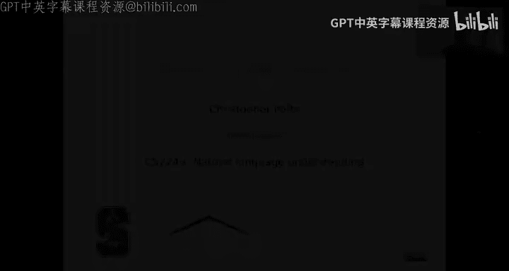
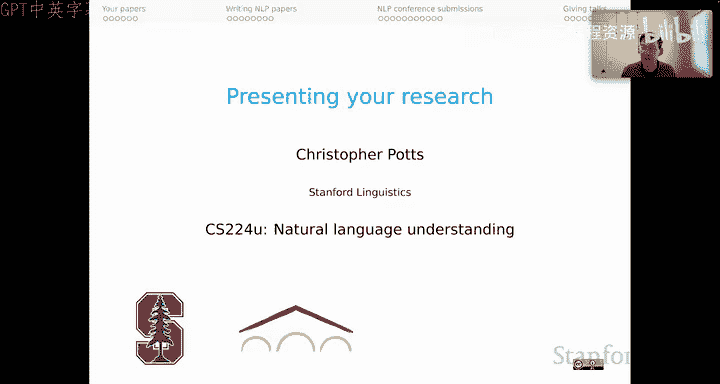
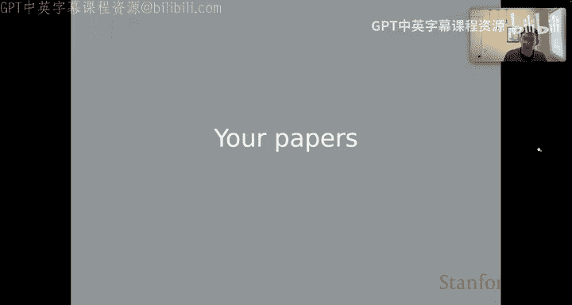
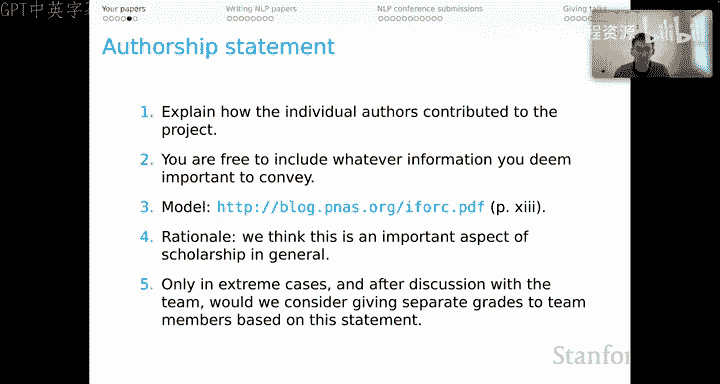
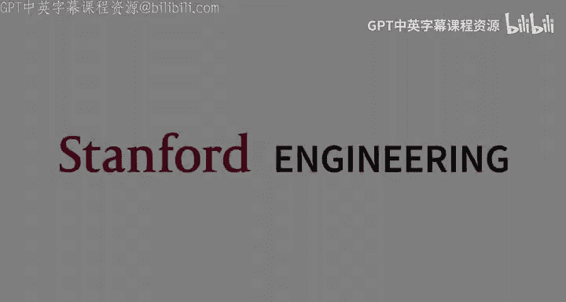

# 45：展示你的研究，第一部分：你的论文 📄

在本节课中，我们将学习如何为课程项目撰写论文。我们将重点介绍课程论文的特殊要求、核心评价标准，以及如何通过特定章节（如“已知项目局限性”和“作者贡献声明”）来提升论文的科学严谨性和透明度。

上一节我们介绍了研究展示的整体系列，本节中我们来看看课程论文的具体要求。

## 课程资源与核心视角

以下是一些有用的链接，包括课程网站和代码仓库中的项目页面。项目页面尤其有用，它包含了项目常见问题解答、各组成部分的建议，以及关于在该领域发表论文的一般性建议。它还列出了许多最初作为本课程作业而诞生、后来正式发表的论文清单，这非常鼓舞人心。

关于本课程项目工作的核心视角，需要再次强调。我们**永远不会**仅根据结果的好坏来评价一个项目。我们认识到，整个科学文献中存在对所谓“阳性结果”的偏好，而回避“阴性结果”。我们认为这种偏见是不幸的。

对于本课程，我们摆脱了所有这些偏见。我们不受任何可能激发这种偏见的限制。因此，我们可以做正确且有益的事：同等重视阳性结果、阴性结果以及介于两者之间的一切。

从根本上说，我们将根据以下标准评估你的工作：
*   所选**指标**的恰当性。
*   所采用**方法**的严谨性。
*   论文在多大程度上**公开、清晰**地认识到其发现的**局限性**。

这反映了我们的价值观。这意味着，如果你的论文报告了某个排行榜上的顶尖结果，但选择了奇怪的指标且动机不明，那么你的期末论文不一定能获得高分。反之，如果你尝试了真正有创意和雄心的想法，但在某个排行榜上的结果不尽如人意，这几乎完全不重要。你可能得到了一个非常有信息量的阴性结果，整个科学界都将从看到它而受益。我们会关注你方法的严谨性和你提供的证据，这才是决定性的。

## 论文的特殊章节

课程论文在结尾处有几个特殊章节。我们来回顾一下，特别是谈谈其动机。

### 已知项目局限性

这个部分的提示是：想象你的读者是一位善意的自然语言处理从业者，他正寻求将你的数据、模型或发现用于另一个学术项目、部署的系统或某种现实世界的干预中。心中想着这个人，然后问：这样的人应该了解你工作的哪些方面？

以下是你可以思考的内容：
*   工作的**益处与风险**。
*   对你的参与者、社会、地球等造成的**成本**。
*   对你的数据、模型和发现的**负责任使用**。
*   你可能想到的应归于此标题下的其他事项。

我想强调，我要求你们心中想着一位**善意**的自然语言处理从业者。思考如何触及一个打算作恶或有问题地使用你想法的人是非常困难的。把那种情况放在一边，只关注那些试图富有成效地基于你的想法在世界上做些好事的人。这个人可能意图最好，但并未真正意识到你想法局限所在。这是一个直接与那个人沟通局限性的机会。这样做，我认为可以为他们避免很多麻烦，也可以为他们的用户避免很多麻烦。最终，在我们的研究可能产生如此广泛影响的这个时代，这似乎是我们应该做的一件非常重要的事情。

本着这种精神，如果你真的深入思考，可以考虑制作诸如**数据说明书**、**模型卡片**和**影响声明**等更广泛的结构化文档。这些文档再次帮助你进行披露，主要是面向善意的用户。我没有在课程作业中强制要求这些，因为工作量很大。但如果你考虑向更广阔的世界发布数据和模型，我认为面对这类结构化文档要求你面对的所有问题将是非常有益的。

### 作者贡献声明

我们还要求一份作者贡献声明，这同样是关于我们的科学视角，而非评价。

从根本上说，这份声明应解释每位作者对项目的贡献。你可以包含任何你认为重要的信息。如果你需要一些例子，我推荐这份美国国家科学院院刊的出版指南，其中包含了一些关于撰写良好作者声明的小贴士。

其理由同样是科学性的：我们认为这是学术研究的一个重要方面，尤其是在我们拥有大型团队论文的时代。这与评分无关，也并非意在惩罚，只有在极端情况下，并在与整个团队讨论后，我们才会考虑根据此声明给团队成员不同的分数。这不是关于评分，而是关于我们如何发表、如何为我们的想法获得认可，以及如何解释每位科学家的贡献。

## 总结

本节课中，我们一起学习了如何为本课程撰写研究论文。我们明确了评价的核心在于方法的严谨性、指标的恰当性以及对局限性的坦诚，而非单纯的结果好坏。我们还介绍了论文末尾的两个关键特殊章节：“已知项目局限性”旨在帮助善意的同行负责任地使用你的工作；“作者贡献声明”则体现了对科学合作中个体贡献的认可。这些要求旨在培养严谨、透明和负责任的科研习惯。