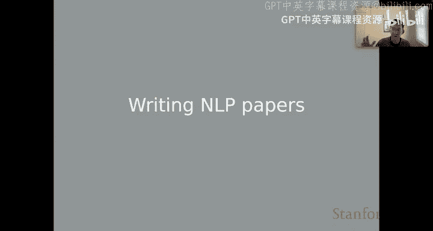
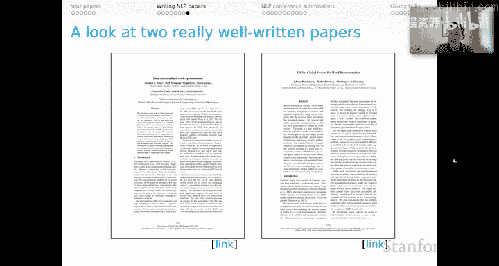
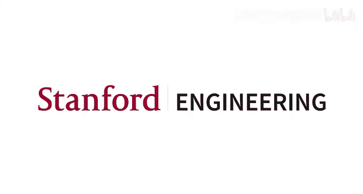

# 46：撰写 NLP 论文 📝

在本节课中，我们将学习如何撰写自然语言处理领域的学术论文。我们将探讨典型论文的结构、各部分的写作要点，并分享一些关于科学写作的宝贵建议。

---

## 📄 典型 NLP 论文结构

上一节我们介绍了研究展示的总体思路，本节中我们来看看一篇典型的 NLP 论文是如何组织的。虽然结构并非强制要求，但遵循大致框架有助于符合领域规范，让读者（尤其是会议审稿人）更容易理解你的思路。

我们通常讨论的是四页或八页的双栏论文，其中参考文献不计入页数限制。

以下是八页论文的典型组成部分：

*   **标题与摘要**：位于首页，提供论文的最高层次概述。
*   **引言**：可能延续到第二页，需要在较高层次上讲述论文的完整故事。
*   **相关工作**：用于将你的工作置于学术背景中。
*   **任务与数据**：论文的核心部分由此开始。
*   **模型**：阐述你的核心思想。
*   **方法与结果**：直接报告实验结果。
*   **分析**：对结果进行讨论。
*   **结论**：简短总结。

对于四页论文，你只需压缩上述所有部分，可能需要在相关工作部分节省篇幅，以集中解释自己的思想，但基本结构是相同的。

---

## 🔍 各部分写作详解

以下是关于论文各部分的更详细说明：

### 引言
在 NLP 论文的惯例中，引言需要在较高层次上讲述论文的完整故事。事实上，摘要提供了更高层次的完整概述，而引言则深入一层。读者读完引言后，应能基本了解论文将要做什么，剩下的只是细节。

### 相关工作
此部分旨在为你的工作提供背景，并阐述相关文献中的主要主题。利用每篇论文或每个主题来阐明你的论文有何特别之处。我倾向于采用一种模板化的格式：相关工作部分的每个子节或段落先提出某个主题性问题，然后列出属于该主题的相关论文，最后解释这些思想与当前论文思想的关联——是补充、冲突还是扩展了现有文献。这样做的整体效果是，为你的研究领域提出关键主题，帮助读者理解这些主题，并解释当前思想如何与这个复杂的背景相关联。相关工作部分既是引用文献的机会，也是以有益的方式将你的思想置于背景中的机会。

### 数据
如果数据集是新的、任务是新的、数据不常见，或者你以不常见的方式处理问题，这部分可能会非常详细。如果是熟悉的数据集和任务结构，这部分可以简短许多。

### 模型
这里指的是你思想的本质。你可能没有一个严格意义上的“模型”，但你应该有一些正在追求和评估的核心思想。这是你详细阐述这些思想的机会。你可以利用前面的部分来提供背景和强调，幸运的话，相关工作部分已经帮助我们理解了你为何要进行这样的建模或分析工作。

### 方法
这包括你的实验方法，例如评估指标、基线模型等。由于篇幅限制，你可以将超参数优化选择、计算细节等内容放入附录，以便将正文空间留给叙述的真正核心。

### 结果
最好能直接描述结果表格或图表中的内容，并说明其与前面章节的基本关联。

### 分析
这部分可以稍微展开，讨论结果的含义、未涵盖的方面、如何改进、局限性等。此部分的性质很大程度上取决于你的建模工作和结果的性质。对于包含多个实验、多个数据集甚至多个模型的论文，可以重复“方法-结果-分析”的结构，甚至在独立的子节中呈现“数据-方法-结果-分析”，形成自包含的实验报告单元。然后，可以有一个最终的分析或讨论部分，将所有内容编织在一起，并与引言和相关工作中的思想重新联系起来。

### 结论
你需要快速总结论文内容，这与摘要的作用类似。不过，这里有一个很好的机会：规划可能的未来方向，提出你遗留的开放性问题等，为他人指明下一步可能的研究方向。这样，你至少能在论文的最后几句话中，展现出前瞻性和更广阔的视野。

---

## 💡 科学写作建议

我想分享一些关于科学写作的有趣建议，供你思考。

以下是 NLP 学者 Stuart Shieber 提出的一种解构。他主张采用 **理性重构** 的方法。

他首先将其与 **大陆风格** 对比，在这种风格中，作者陈述解决方案时很少或根本不介绍动机，有时甚至不说问题是什么。他认为，读者若不付出巨大努力仔细阅读，将无法判断作者是否正确，但至少他们会认为作者是个天才。我认为他略带讽刺意味，我们应避免以这种模式写作。

另一个极端是他所谓的 **历史风格**。论文中充满了整个错误开端、错误尝试、接近成功和问题重新定义的历史。这比大陆风格好，因为细心的读者可能能跟随作者的推理思路，并将其作为动机。但读者可能会觉得作者有点糊涂。总的来说，这类论文也很难阅读，因为很难分辨什么重要、什么不重要。

因此，Shieber 提出 **理性重构** 是更好的模式。你不呈现实际经历的历史，而是呈现一个理想化的历史，完美地推动解决方案的每一步。追求理性重构风格的目标不是让读者认为你才华横溢或糊涂，而是让你的解决方案显得 **理所当然**。将这作为目标需要一定的品格力量。你的论文写得越好，读者就越会觉得：“这非常清晰明了，甚至我也能有那些想法。”这感觉有些矛盾，但却是最佳的操作模式。

有时，人们会感到理性重构方法与我在这些讲座中其他地方呼吁的“尽可能披露、对所做之事保持开放和诚实”之间存在张力。如果你开始感到这种张力，我鼓励你使用附录来真正列举每一个错误的开端（可能以列表形式），以便真正想了解发生了什么的人能获得所需的所有信息。这将允许你在论文中讲述一个能触及最多读者、让人感到有信息量、有进展的故事。

我也喜欢 David Goss 关于数学风格的建议。他的根本建议是 **体谅读者**。其中一部分就是时刻想着读者，撰写论文时仿佛自己是第一次接触这些思想的人，思考需要什么信息、可以省略什么，以及总体上什么最有助于向这位假想读者传达思想。

小说家 Cormac McCarthy 也有一篇出色的文章（链接在底部），充满了对科学作家的建议。我认为他实际上与圣塔菲研究所的许多科学家交往，可能学到了很多关于他们如何工作的方式。

我想强调的一条建议是：**确定你论文的主题和两到三个你希望每个读者都能记住的要点**。这些内容可以放在引言中，并可能围绕这些思想来构建引言。这个主题和这些要点构成了贯穿你文章的唯一主线。词语、句子、段落和章节是将其缝合在一起的针线活。如果某些内容无助于读者理解主题，就省略它。我发现这非常有启发性。一旦我弄清楚我的两三个主要要点是什么，并至少在引言中勾勒出来，那么在我写作、决定进行或放弃哪些实验时，我总是在思考它们是否服务于这些要点。这极大地帮助我做出决策，也帮助我以相对清晰的方式撰写这些论文。

这种策略不仅会产生更好的论文，而且写起来也会更容易，因为正如我所说，你选择的主题将决定包含和排除什么，并解决许多关于叙述的低层次问题。

我想在这里提供的最后一条建议来自 Patrick Blackburn，这实际上是关于做演讲的（我稍后会提到），但我认为它适用于任何类型的科学交流。其根本见解是：好的演讲或论文从何而来？答案是 **诚实**。一个好的演讲或一篇好的论文永远不应远离简单、诚实的交流。我在进行研究时，脑海中始终有这个短语，我发现它非常具有启发性和激励性。

---

## ✨ 优秀论文范例

为了完善本节内容，我想提两篇我认为写得特别好的论文。我能想到很多这样的论文，事实上，在课程代码仓库的 `papers.md` 文档中我有一个更长的列表，但我想重点介绍两篇很有趣的。链接已提供。

第一篇是 **ELMo 论文**：《Deep contextualized word representations》。我喜欢这篇论文的几乎每个方面。引言在背景化结果和开始激发上下文表示及预训练的核心思想方面做得非常出色。模型本身的呈现非常清晰，你获得了关于其结构所需的所有符号表示。它有点密集，但我想这是非常复杂模型的结果，所以我认为这没问题。然后，你会看到一个非常详尽的实验探索，以及后续的问题和假设，这些真正为你提供了关于 ELMo 及其优缺点的完整图景。这是一篇短文，但感觉充满了思想，仅仅通过阅读它就能学到很多。

我还想单独提一下 **GloVe 论文**。这是另一个非常有趣的例子。我认为整篇论文都写得很好，但我想特别指出的是模型本身的呈现部分，因为在 NLP 中，很少能看到作者从一个分析起点开始，逐步构建成一个模型。他们讨论了实现该模型的实际挑战，以及这为何导致他们做出某些实现选择。最终，你获得了关于最终实现中涉及的各种超参数的描述。读完这些，你不仅了解了 GloVe 模型本身的细节，还感觉真正学到了一些概念性的东西。当然，论文其他部分也写得很好，并且有令人难以置信的结果，这并无坏处。但我真的特别指出模型报告部分，认为这是一篇出色的写作范例，我们在思考自己建模思想的动机时都可以借鉴。

---

## 📚 总结

本节课中，我们一起学习了如何撰写 NLP 学术论文。我们剖析了典型论文的结构，从引言、相关工作、数据模型到方法结果与分析，并了解了每个部分的写作要点与目标。我们还探讨了理性重构、体谅读者、聚焦核心主题以及诚实交流等重要写作原则。最后，通过分析 ELMo 和 GloVe 两篇优秀论文，我们看到了这些原则的实际应用。掌握这些知识将帮助你更清晰、更有说服力地展示你的研究成果。