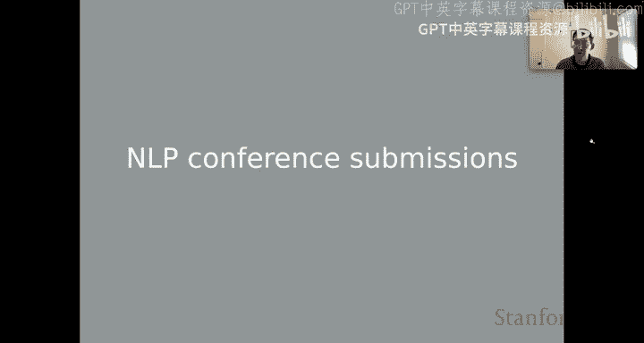
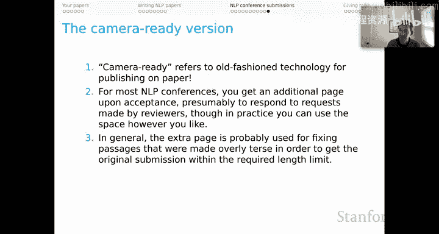
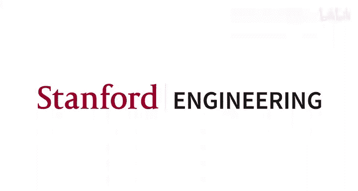

# 47：NLP会议投稿指南 📝

在本节课中，我们将学习如何向自然语言处理领域的顶级会议提交研究论文。我们将详细介绍从投稿前的准备到最终“定稿”的完整流程，并探讨其中的关键策略与注意事项。

## 概述：NLP会议投稿流程

上一节我们介绍了研究展示的核心要素，本节中我们来看看如何将你的研究正式提交给NLP会议。这个过程有其独特的规则和挑战。

## ACL匿名期政策

让我们从一个最不寻常的方面开始：ACL匿名期。ACL系列会议采用了一项统一政策，规定在**提交截止日期前一个月开始，直到评审结果公布期间**，投稿论文不能上传到ArXiv等公开库或以任何方式公开。

对于具体会议，请务必在其官网上核实政策生效的**精确日期和时间**。临近截止日期时，这些细节至关重要。

该政策旨在平衡**新思想、新成果的自由快速传播**与**双盲同行评审**的益处。其核心是防止评审人在看到论文标题后，通过社交媒体等渠道获知作者身份，从而产生潜在偏见。

关于该政策及其理由的更多信息，请参考本幻灯片底部链接的页面。

我个人认为，ACL匿名期是一个高尚的实验，但也是一个失败的实验。原因有三：
1.  围绕政策细节的讨论往往低效且混乱。
2.  如果论文发布后发现错误，在匿名期内无法更新，导致已知的错误结果无法及时纠正。
3.  它加剧了“抢发”现象，促使研究者在截止日期前匆忙发布未成熟的想法，不利于领域内的审慎思考。

## 投稿与评审流程

了解了匿名期，现在假设你准备提交论文。以下是典型的投稿与评审流程：

以下是投稿与评审流程的关键步骤：

1.  **提交论文与关键词**：提交论文时，需要选择领域关键词，这有助于决定由哪个委员会处理你的论文。最好能咨询专家，选择能为你论文匹配到最佳评审人的关键词。
2.  **填写清单**：越来越多会议要求填写关于伦理、可复现性等事项的冗长清单。建议找专家帮忙，判断哪些问题至关重要，哪些可以简要回答。
3.  **评审人投标**：所有提交完成后，评审人会浏览标题和摘要列表，并投标选择他们希望评审的论文。**此时，标题可能是决定投标的主要因素**，因为评审人可能面对数百篇提交，无暇细读所有摘要。
4.  **分配论文**：程序主席或领域主席根据投标情况（尽管投标的实际影响力可能有限）为评审人分配论文。
5.  **评审与评分**：评审人阅读论文，撰写评论并提供评分。
6.  **作者回复**：作者有一个短暂的时间窗口，可以用有限的文本对评审意见进行简要回应，以纠正错误、回答问题。
7.  **讨论与决策**：领域主席促进评审人之间的讨论，以澄清分歧或回应作者回复。最终，程序委员会综合所有信息，通过某种方式决定最终录用名单。这个过程在最后阶段可能相当不透明。

## 评审表格解析

以下是评审人通常需要填写的表格内容概览：

*   **论文概述**：要求评审人总结论文内容、贡献、主要优缺点。这有助于确保评审人真正理解了论文。
*   **录用理由与拒稿理由**：这两个通常是必填项。即使对于想支持的论文，评审人也可能被迫想出一些“拒稿理由”来填表。
*   **给作者的问题与反馈**：评审人可以在这里提出直接问题，希望能在作者回复期得到解答。
*   **缺失的参考文献**：遗漏相关文献可能让评审人感到被轻视，并导致扣分。
*   **格式与表达改进**：关于语法、风格和呈现的建议。
*   **评分**：包括**总体推荐意见**（可能是决定论文命运的主要数据点）和**评审人自信度**（用于校准推荐意见的权重）。
*   **保密信息**：用于与会议领导层直接沟通可能出现的问题。

## 如何撰写作者回复

作者回复是流程中复杂且常令人困惑的一环。许多会议允许作者对评审意见提交简短回复，但时间窗口紧，字数限制严格。

以下是关于作者回复的一些建议：

*   **态度至关重要**：尽管有观点认为评审人很少在回复后改变分数，但完全不提交回复会传递出“你不在乎”的信号，这很不利。
*   **对领域主席的价值**：对于设有领域主席的会议，作者回复可能产生重大影响。领域主席会综合评审意见、论文和作者回复来推动讨论并形成最终建议。
*   **遵守规则**：仔细阅读会议关于作者回复的说明。通常有规则禁止报告**新结果**。如果不确定，应咨询专家。
*   **保持礼貌与策略**：始终保持礼貌。可以坚定、直接地回应，但要有策略地强调你最坚持的观点。**绝对不要**写下攻击性语言（如“你的疏忽令人尴尬”）。可以换一种方式表达，例如：“感谢指出。您所询问的信息已在第6节中提供。我们将在修订版中使其更加突出。”
*   **目标**：通过礼貌且富有成效的回应，让各方都感到被尊重，从而有望提升你的评分。

## 报告类型与会议场所

录用后，涉及两个维度：报告类型和会议场所。

**报告类型**分为口头报告和海报展示。分配方式通常不透明，由会议方决定。目前，论文本身比报告形式更重要。

**会议场所**分为研讨会和主会。这是一个重要的区别，各有优劣：
*   **研讨会**：通常声望和选择性较低。**优点**是能与志同道合的社群深入交流，可能建立长期的合作关系。
*   **主会**：选择性高，声望高。**缺点**是规模庞大，可能难以找到特定领域的研究者，你的报告也可能淹没在众多报告中。

你需要根据自己的目标和期望的体验来做决定。

## 相关会议列表

以下是一些主要的NLP及相关领域会议：

*   **顶级ACL会议**：ACL、NAACL、EMNLP通常被认为是领域内最顶级的会议。
*   **其他重要ACL会议**：AACL、EACL也极具影响力。
*   **优秀次级会议**：CoNLL、COLING是出色的第二梯队会议，发表了大量重要工作，兼具研讨会和主会的优点。
*   **其他领域顶级会议**：WWW、WSDM、AAAI、IJCAI、CogSci等也欢迎NLP方向的投稿。
*   **顶级机器学习会议**：NeurIPS、ICML、ICLR是公认的三大机器学习顶会，都非常欢迎NLP研究，但可能需要面向更广泛的受众。

## 对NLP评审的个人看法

以下是我对当前NLP评审生态的一些观察：

*   **会议主导的积极面**：以会议论文为中心有利于领域快速发展，保持了学术活力。
*   **评审质量的变化**：在2010年之前（尤其是深度学习时代之前），NLP领域的评审质量相比其他领域非常出色和严谨。近年来，随着领域规模急剧扩大，提交量和评审人数激增，评审的总体质量有所下降。
*   **评审人的态度问题**：**评审人有时会非常刻薄**。你需要对此脱敏。一个方法是与有经验的同行分享你的评审意见和经历。他们很可能会告诉你：“别往心里去，我们都经历过。”请记住，刻薄的评审更多反映了评审人自身的问题，而不是你的问题。**如果你受邀评审，请务必保持友善**。
*   **格式限制**：强制将论文限制在4或8页（长短文）并不理想。幸运的是，通过更多地使用**补充材料**，这个问题正在得到有效解决。现在流行“短文+长附录”的模式，兼顾了可读性和细节完整性。
*   **最大的缺失环节**：当前会议流程缺乏作者向编辑申诉并与之互动的机会，而这正是期刊模式的优势。**《Transactions of the ACL》** 这本期刊遵循ACL会议模式，但允许期刊式的编辑互动，是领域内评审模式的一个优秀范例。

## 论文标题与摘要写作

**标题**至关重要，尤其是在评审人投标阶段。请根据你贡献的范围来校准标题，并考虑它可能吸引的评审人类型。避免使用特殊字体或格式，因为它们可能在传输中丢失（尽管我个人对近来标题中使用的一些表情符号抱有亲切感）。

**摘要**为你的工作创造第一印象。可以遵循以下模板构思：
1.  **开篇**：概述广阔背景，点明核心问题。
2.  **中段**：详细阐述开篇提到的概念，通常通过连接论文中的具体实验和结果来实现。这是摘要的主体。
3.  **结尾**：建立你的研究与更广泛理论关切之间的联系，让评审人能判断摘要是否提出了实质性的原创贡献。

例如：
> **开篇句**：本研究旨在解决以下核心问题……（定位读者）。
> **我们的方法**：我们采用了……技术。
> **实验与结果**：我们的实验表明……
> **总结与意义**：总体而言，我们的方法具有以下特性，其意义在于……

## 其他实用建议

最后，还有一些虽平凡但重要的注意事项：

*   **避免“桌面拒稿”**：仔细阅读征稿启事中的**格式要求**和其他规定。这些细节经常变化。违反任何一条规则都可能导致可怕的“桌面拒稿”，让你本轮投稿迅速终结。
*   **理解“定稿”版本**：“Camera Ready”是一个过时的术语，指最终用于出版的版本。如今它只是一个奇怪的惯用语。
*   **利用额外篇幅**：大多数NLP会议在录用后会给予**额外一页**的篇幅，本意是用于回应评审人的要求。在实践中，你可以自由使用这部分空间。**明智而审慎地使用它**。通常，这额外的篇幅更适合用于扩展因压缩篇幅而过于简略的内容，而不是加入全新的结果。将全新的发现留待后续发表通常是更佳选择。

## 总结

本节课中，我们一起学习了NLP会议投稿的完整流程。我们从ACL匿名期政策谈起，逐步分析了投稿、评审、作者回复等关键环节，探讨了不同会议场所的特点，并提供了关于撰写标题、摘要以及应对评审的实用建议。记住，这个过程虽有挑战，但通过精心准备、遵守规则并保持建设性的沟通，你可以有效地展示你的研究成果。