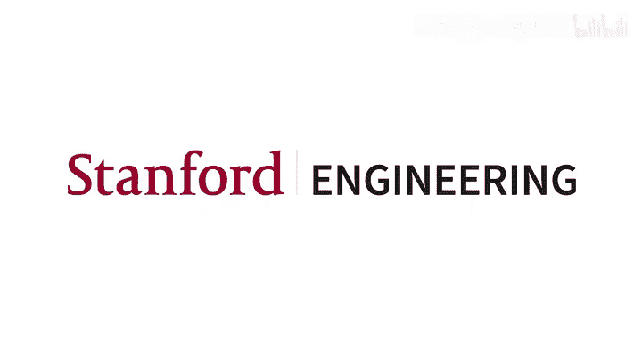
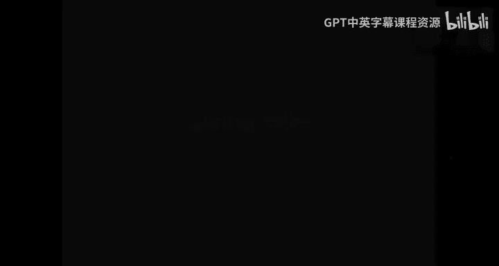
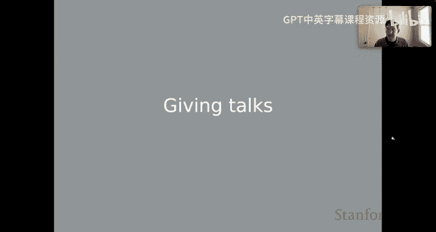
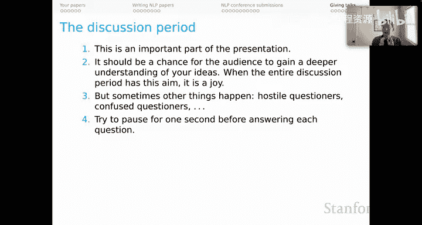
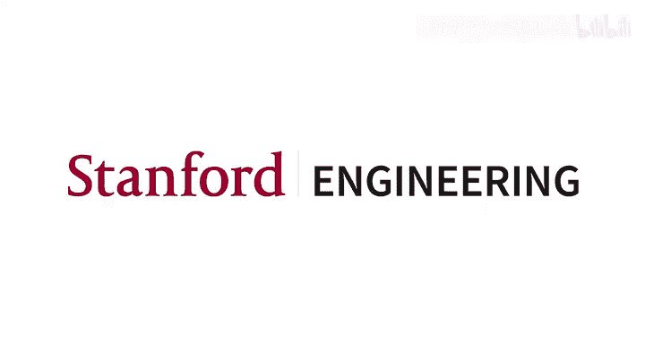

# 48：如何做学术报告（第四部分）🎤

在本节课中，我们将学习如何有效地进行学术报告，特别是在NLP研讨会或会议上做报告。我们将探讨报告的结构、幻灯片设计、现场技巧以及与听众的互动讨论。

上一节我们介绍了如何组织报告内容，本节中我们来看看具体的演讲技巧和现场注意事项。

## 报告结构与核心原则

一个好的学术报告结构应反映论文结构，但必须更加简化。报告的目标是传达思想的精髓，激发听众阅读论文的兴趣。

以下是报告的标准结构：
1.  **开场与背景**：说明要解决的问题、其重要性、前人工作及其不足。
2.  **核心内容**：介绍你的方法、数据、任务结构和核心思想。
3.  **支持性结果**：展示定量结果、消融研究和错误分析。
4.  **总结与展望**：快速总结，并展望未来工作和开放性问题。

Jeff Pullham提出了做报告的“黄金法则”，以下是这些法则的要点：

*   **不要以道歉开场**：以自信有力的开场代替道歉。
*   **不要低估听众的智慧**：将听众视为能够理解你核心思想的同行。
*   **严格遵守时间限制**：通过大量练习来确保不超时。
*   **不要全面综述整个领域**：只提供理解你工作所必需的背景。
*   **记住你是倡导者，而非被告**：你是在为你的思想辩护，但个人并未受审。
*   **准备好被问倒的问题**：将具有挑战性的问题视为探索和学习的一部分。

Patrick Blackburn关于报告的根本见解是：**诚实**。好的报告不应偏离简单、诚实的交流。从教育的角度出发，真诚地尝试向听众传授你的思想。

## 幻灯片设计：极简主义与比较主义

在使用幻灯片（如PowerPoint）时，需要注意其使用方式。通常有两种设计哲学：

*   **极简主义**：幻灯片应尽可能简洁，听众大部分时间应听你讲并看着你。幻灯片只是演讲的标点。
*   **比较主义**：幻灯片在保持清晰的前提下应尽可能信息丰富，便于听众长时间研读、进行比较和建立联系。

无论你属于哪个阵营，**引导听众注意力**都至关重要。避免一次性展示所有信息，而应按照讲解顺序逐步呈现。可以使用以下工具：
*   **叠加动画**：逐步展示内容。
*   **系统性的颜色**：用于区分（需考虑色盲和投影效果）。
*   **大小、粗体、箭头和方框**：用于突出关键部分，引导听众视线。

选择适合你个人风格和报告目标的幻灯片风格。极简主义适合在时间有限时讲述故事；比较主义则更像一块组织良好的黑板，适合深入教学。

## 演讲前的技术准备

为确保演讲顺利进行，以下是一些务实的准备工作：

*   **关闭屏幕通知**：避免个人消息等通知在演讲时弹出。
*   **关闭电脑休眠模式**：防止屏幕在演讲中途熄灭。
*   **关闭无关应用程序**：避免其占用内存或弹出更新提示。
*   **清理桌面文件**：确保投影时不会显示你不想公开的文件或笔记。
*   **准备PDF备份**：如果使用依赖网络的演示软件，务必准备离线PDF版本。
*   **做好无幻灯片演讲的准备**：投影仪可能故障，要准备好仅凭口述完成报告。

## 讨论环节的处理

讨论环节（常被误称为“问答环节”）可能是最令人焦虑的部分。其本质应是**讨论**，旨在让听众更深入地理解你的思想。

处理问题时的建议如下：
*   **回答前稍作停顿**：确保提问者已说完，并显得你经过深思熟虑。
*   **避免只说“我不知道”**：可以尝试说“我不知道，但我们可以朝某个方向思考……”，以此开启对话。
*   **理解问题可能不清晰**：提问者可能刚接触你的思想，需要你帮忙理清问题，使其富有成效。
*   **转化每个问题**：无论问题是否清晰或带有敌意，都设法将其转化为一个有意义、能让提问者感到受重视的讨论点。

本节课中我们一起学习了如何组织和进行有效的学术报告。关键点包括：构建清晰简化的报告结构、根据个人风格设计幻灯片、做好充分的技术准备，以及以讨论的心态积极应对听众提问。最终，提升演讲能力的最佳途径是不断实践并进行深刻的自我反思。