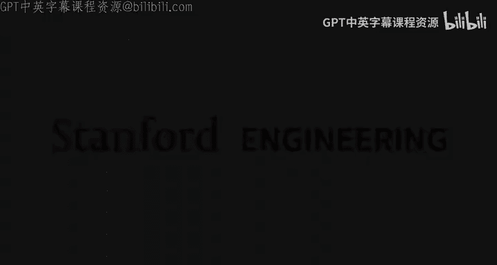
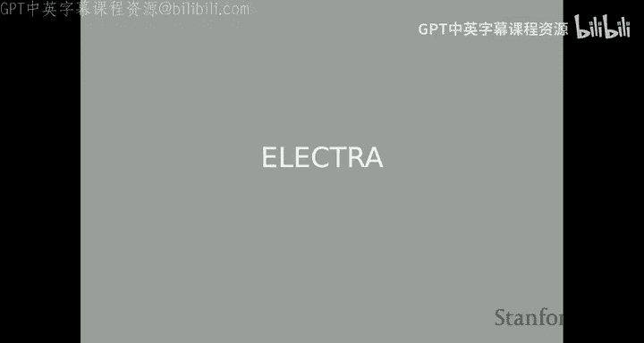
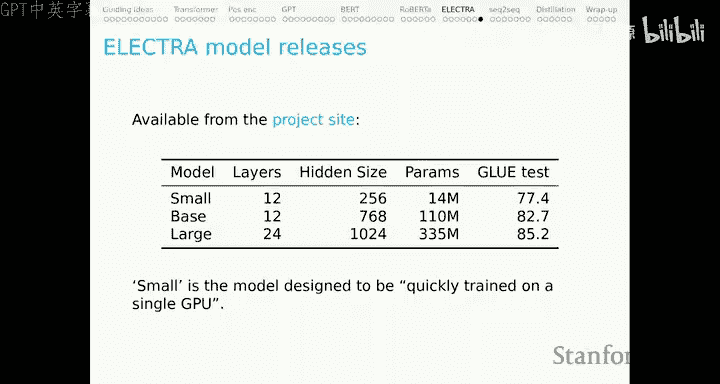
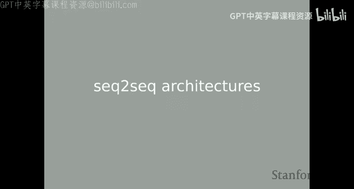
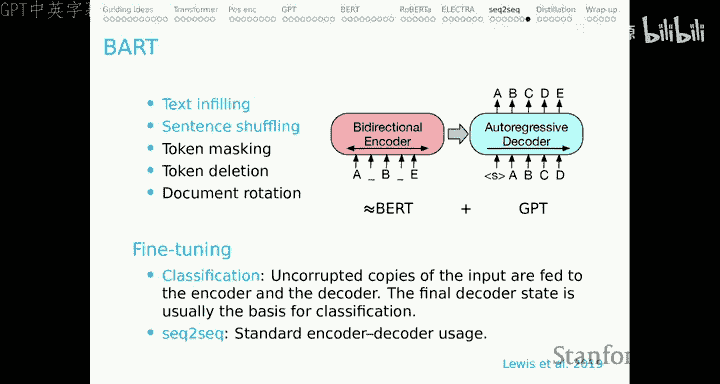
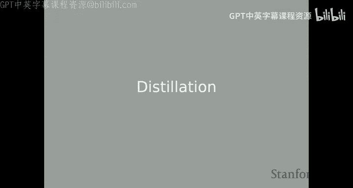
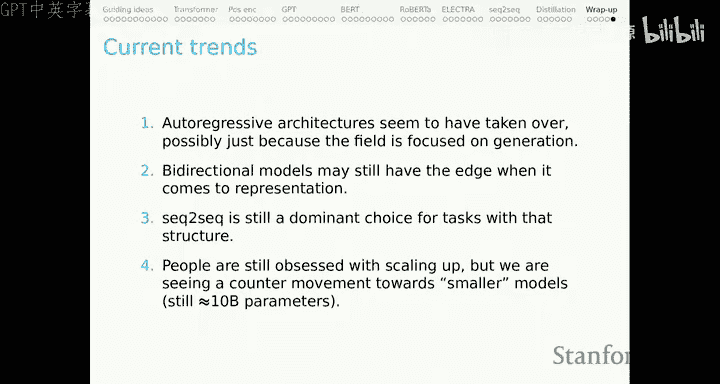
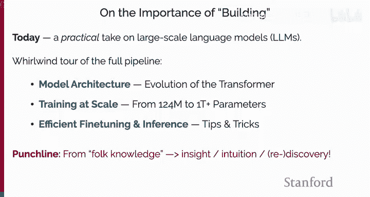
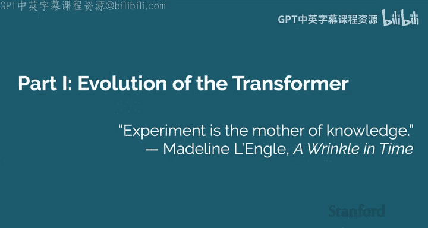
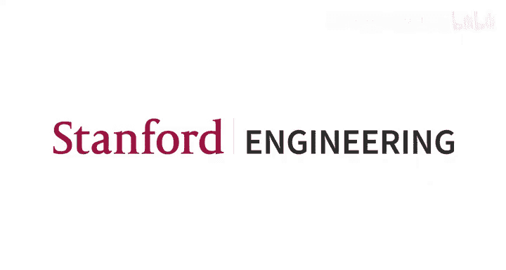

# 49：神奇的语言模型与构建方法（第一部分）🚀

在本节课中，我们将学习两种创新的语言模型架构：ELECTRA 和序列到序列模型（如 T5 和 BART）。我们还将探讨模型蒸馏技术，并深入了解 Transformer 架构的核心设计思想及其演变过程。

---

## ELECTRA 模型 🧠

上一节我们介绍了 BERT 模型的一些已知局限性。本节中，我们来看看 ELECTRA 模型如何巧妙地解决其中两个问题：预训练与微调阶段词汇不匹配的问题，以及 BERT 学习数据效率低下的问题。

ELECTRA 的核心思想是使用一个“生成器-判别器”框架进行对比学习。

### 模型结构与训练目标

1.  **输入与掩码**：首先，我们有一个输入序列 `X`（例如 “the chef cooked the meal”）。我们随机掩码其中约 15% 的标记（token），这与 BERT 类似。
2.  **生成器**：我们使用一个小型的 BERT 模型作为生成器，其目标是进行掩码语言建模。它接收掩码后的序列，并尝试预测被掩码的标记。
3.  **构造损坏序列**：关键的一步是，我们**不直接**使用生成器最可能的预测结果，而是**采样**一个标记来替换原输入中被掩码的位置。这样就得到了一个“损坏的”序列 `X_corrupt`。
4.  **判别器（ELECTRA 核心）**：判别器（即我们最终要使用的 ELECTRA 模型）接收这个损坏的序列 `X_corrupt`。它的任务是判断序列中的**每一个**标记是原始输入中的（original），还是由生成器替换的（replaced）。
5.  **联合训练**：模型的总体损失是生成器的标准 MLM 损失与判别器的对比损失（带权重）之和。

一旦预训练完成，我们可以**丢弃生成器**，仅使用判别器进行下游任务的微调。这解决了 BERT 中因引入 `[MASK]` 标记而导致的词汇不匹配问题，因为判别器从未见过 `[MASK]` 标记。

### 核心优势与实验分析

ELECTRA 的设计带来了几个显著优势：

*   **数据利用效率高**：判别器从序列中的**每一个**标记获取学习信号，而不像 BERT 只从 15% 的掩码标记学习，计算资源利用率更高。
*   **小生成器，大判别器**：实验表明，当生成器小于判别器时（例如，生成器维度为 256，判别器为 768），模型性能最佳。这可能是因为一个“有噪声”的生成器能为判别器提供更具挑战性的学习任务。
*   **性能与效率**：在相同的计算预算（FLOPs）下，ELECTRA 在 GLUE 基准测试上的表现 consistently 优于 BERT 和 RoBERTa。

以下是论文中的一些消融实验，展示了 ELECTRA 各组成部分的贡献：
*   **Full ELECTRA**：完整的 ELECTRA 模型，性能最佳。
*   **All Tokens MLM**：使用 BERT 架构，但对所有标记（而不仅是掩码标记）计算 MLM 损失。这证明了 BERT 本可以通过更高效地利用数据来获得更好性能。
*   **Replace MLM**：一种 BERT 变体，不使用 `[MASK]` 标记，而是直接用随机标记替换，解决了预训练-微调不匹配问题。
*   **ELECTRA 15%**：仅对 15% 的标记（即被替换的部分）进行判别任务。
*   **BERT**：原始 BERT 模型，作为基线。

这些结果验证了 ELECTRA 设计思路的有效性。

---

## 序列到序列（Seq2Seq）模型 🔄

本节我们将目光转向另一类重要模型：序列到序列模型。这类模型适用于输入和输出均为序列的任务。

### 常见的 Seq2Seq 任务
以下是自然落入 Seq2Seq 框架的任务示例：
*   机器翻译（源语言 -> 目标语言）
*   文本摘要（长文本 -> 短文本）
*   开放式问答（问题 -> 生成答案）
*   对话系统
*   语义解析（句子 -> 逻辑形式）
*   代码生成

### 架构选择

对于 Seq2Seq 问题，主要有三种架构思路：

1.  **编码器-解码器（Encoder-Decoder）**：这是经典框架。编码器（如 Transformer Encoder）双向编码整个输入序列；解码器（如 Transformer Decoder）以自回归方式（只能看到已生成的部分）生成输出序列，并可以随时关注编码器的全部输出。
2.  **仅语言模型（Language Model Only）**：将整个任务（包括输入和输出）拼接成一个长序列，使用纯自回归语言模型（如 GPT）从左到右生成。例如：`“翻译成中文：Hello world -> 你好世界”`。
3.  **前缀语言模型（Prefix LM）**：输入部分可以进行双向编码（类似编码器），输出部分则以自回归方式生成（类似解码器），但共享同一套模型参数。

目前，这三种变体在实践中都有广泛应用。

### 代表性模型：T5 与 BART

**T5 (Text-To-Text Transfer Transformer)**
*   **架构**：采用标准的编码器-解码器 Transformer。
*   **核心思想**：将所有 NLP 任务都统一转化为“文本到文本”的格式。通过**任务前缀**（如 `“translate English to German: ”`）来指导模型执行特定任务。
*   **训练**：进行了大规模的**多任务**预训练，混合了无监督（如掩码语言建模）和有监督任务。

**BART (Bidirectional and Auto-Regressive Transformers)**
*   **架构**：同样是编码器-解码器结构，编码器类似 BERT（双向），解码器类似 GPT（自回归）。
*   **核心创新：去噪预训练**：在预训练阶段，使用多种方式**破坏**输入文本（如文本填充、句子重排、令牌删除、文档旋转等），然后训练模型**重建**出原始的、未损坏的文本。
*   **适用性**：这种预训练目标使得 BART 在需要“纠正”或“复原”的任务上表现突出，例如语法纠错、文本去噪等。

---

## 模型蒸馏技术 🫙

随着模型变得越来越大，如何让它们更高效地运行成为一个关键问题。模型蒸馏（Distillation）就是一种“以小博大”的技术，旨在训练一个小的“学生”模型来模仿大的“教师”模型的行为。

### 蒸馏目标

我们可以从浅到深地让学生模型对齐教师模型：

1.  **任务黄金标签**：使用原始标注数据训练学生（基础方法）。
2.  **教师输出标签**：使用教师模型预测的**硬标签**（如分类结果）作为监督信号。
3.  **教师输出分布（Logits）**：使用教师模型预测的**完整概率分布**（而不仅是最大概率的标签）作为“软标签”。这包含了类别间的关系信息，是早期蒸馏论文的核心。
4.  **内部表示对齐**：强制让学生模型的某一层（如最终输出层）的表示与教师模型对应层的表示（例如，通过余弦相似度）尽可能接近。这需要访问教师模型的内部状态。
5.  **更深入的对齐**：尝试让学生模型在多种输入变化下模仿教师模型的行为。

### 蒸馏范式

*   **标准蒸馏**：教师模型固定，学生模型向其学习。
*   **多教师蒸馏**：多个大型教师模型共同指导一个学生模型。
*   **协同蒸馏/在线蒸馏**：教师模型和学生模型**共同学习**，相互促进。
*   **自蒸馏**：让同一模型的较浅层去模仿较深层的表示。

### 为什么蒸馏有效？

一个有趣的问题是：如果教师模型只是在原始数据上训练得到的，那么直接用相同数据训练一个小的学生模型不就行了吗？为什么通过教师模型“过滤”一遍的数据会更有效？
一种可能的解释是，教师模型作为一种强大的**正则化器**，其复杂的决策边界和**甚至其错误**，都能为学生模型提供更丰富、更平滑的学习信号，帮助学生模型更好地泛化。有时，蒸馏后的学生模型性能甚至能超越教师模型。

---

## Transformer 架构的演进 🏗️

最后，我们回到基础，探讨 Transformer 这一现代语言模型基石是如何演化而来的。其设计遵循两个核心原则：**需要海量、易获取的数据**，以及**需要简单、高吞吐量的方式来消费这些数据**。

### 从 RNN 和 CNN 到 Transformer

*   **RNN（循环神经网络）**：
    *   **优势**：理论上能处理任意长序列，并催生了注意力机制的早期应用。
    *   **劣势**：难以并行化（必须按顺序计算），训练不稳定（难以加深），难以快速处理海量数据。
*   **CNN（卷积神经网络）**：
    *   **优势**：高度**可并行化**（每个卷积核窗口独立计算），通过残差连接可以构建**极深**的网络，非常适合现代硬件。
    *   **劣势**：需要堆叠很多层才能获得较大的感受野，捕获长距离依赖较慢。

Transformer 巧妙地融合了二者的思想：
*   **自注意力机制**：来自 RNN+注意力。其核心是让序列中的**每个标记**都能直接与所有其他标记交互，计算它们之间的相关性权重。
*   **多头注意力与并行化**：来自 CNN。将输入投影到多个子空间（“头”），每个头独立进行注意力计算，这类似于 CNN 中使用多个不同的卷积核从不同视角提取特征。整个过程是高度并行化的。
    *   **代码示例**：在实现中，我们通常通过一个大的权重矩阵 `W`（形状为 `[embed_dim, 3 * embed_dim]`）来同时生成查询（Q）、键（K）、值（V）向量。然后将其“切分”为多个头，每个头独立进行注意力运算。

### Transformer 的关键组件：MLP 层

然而，仅有多头自注意力还不够。自注意力本质上是**加权平均**，缺乏非线性变换。为了引入非线性表达能力，Transformer 在每个注意力层后加入了 **MLP（前馈网络）层**。

一个标准的 MLP 层通常进行以下操作：
`output = DownProject(Activation(UpProject(input)))`
其中，`UpProject` 通常将维度扩大 4 倍（例如从 512 到 2048），然后经过激活函数（如 GELU），最后 `DownProject` 回原始维度。

**MLP 层的作用**：
*   **提供非线性**：这是深度学习表达能力的核心来源。
*   **特征空间变换**：类似于 SVM 中的核函数，MLP 将特征投影到更高维空间，以便学习更复杂的模式，然后再压缩回来。
*   **与残差连接的分工**：残差连接负责“记住”重要信息（恒等映射），而 MLP 层则负责“忘记”或“过滤”掉不重要的信息，共同塑造最终的上下文表示。

---

## 总结 📚

本节课我们一起深入学习了：
1.  **ELECTRA 模型**：通过“生成器-判别器”的对比学习框架，更高效地利用数据，并解决了 BERT 预训练与微调的词汇不匹配问题。
2.  **序列到序列模型**：了解了 T5（统一文本到文本框架）和 BART（去噪自编码预训练）这两种重要 Seq2Seq 模型的设计理念与适用场景。
3.  **模型蒸馏技术**：探索了如何通过让小型学生模型模仿大型教师模型，来获得高性能、高效率的模型部署方案。
4.  **Transformer 架构演进**：回顾了从 RNN、CNN 到 Transformer 的设计思路融合，并深入理解了多头注意力和 MLP 层在 Transformer 中的核心作用。

这些知识为我们理解、使用乃至设计下一代语言模型奠定了坚实的基础。