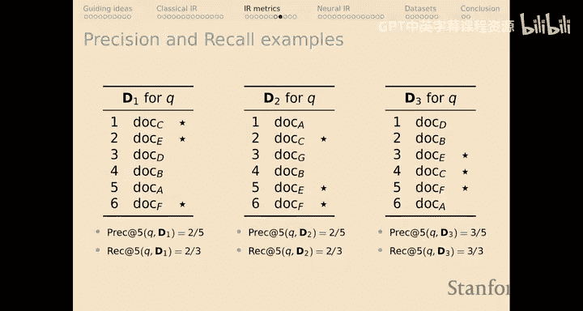
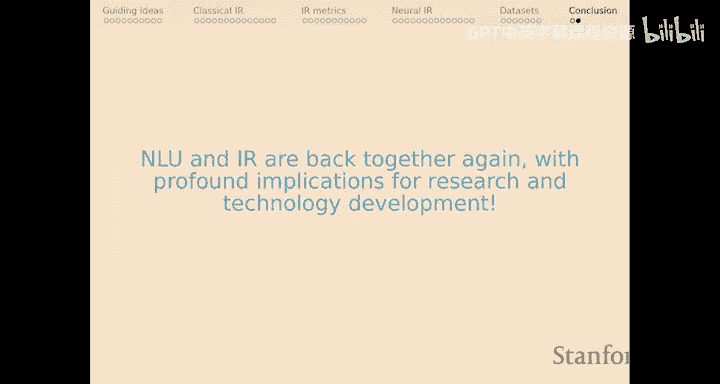
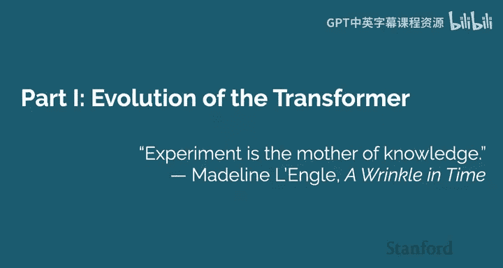

# 50：构建卓越语言模型（第二部分）🚀

在本节课中，我们将继续学习信息检索的核心概念，并深入探讨神经信息检索模型。随后，我们将回顾语言模型的发展历程，并学习如何高效地训练大型模型。

## 信息检索评估指标回顾

上一节我们介绍了信息检索评估的多维性。虽然我们主要关注了准确性指标，但其他维度（如延迟、索引大小）同样至关重要。本节我们将继续探讨几种关键的准确性评估指标。

### 成功率和倒数排名

以下是两种基础的评估指标：

*   **成功率 @K**：对于选定的K值，判断排名前K的文档中是否存在相关文档（即“星标”文档）。它是一个非常粗略的度量。
*   **倒数排名 @K**：同样关注前K个文档，但会考虑第一个相关文档出现的位置。其值为1除以第一个相关文档的排名。它比成功率更细致一些。

### 精确率和召回率

这两种经典指标对多个相关文档敏感。

*   **精确率 @K**：在前K个返回的文档中，相关文档所占的比例。它衡量了结果的“纯度”。
*   **召回率 @K**：在前K个返回的文档中，包含了多少比例的全部相关文档。它衡量了找到所有相关文档的能力。

选择K值需要谨慎，因为它可能极大地影响系统排名。例如，一个将所有相关文档都排在K值附近（但不在顶部）的系统，在特定K值下可能优于一个将部分相关文档排在顶部但其余排在很后面的系统。

### 平均精确率

平均精确率是我们最细致的指标，它不再依赖一个固定的K值。

**公式**：`AP = (Σ Precision@每个相关文档位置) / (相关文档总数)`

它的计算方式是：对于排名列表中的每一个相关文档出现的位置，计算该位置对应的精确率（即该位置之前所有文档的精确率），然后将所有这些精确率值求和，最后除以相关文档的总数。这种方法抽象掉了K值，并检查了排名产生的每一个相关点，从而能更细致地区分不同系统的表现。

### 超越准确性：多维度评估

在实际应用中，我们不能只关注准确性。系统在查询延迟、索引大小、内存需求等维度上差异巨大。例如，一个模型可能平均倒数排名很高，但查询延迟长达691毫秒，或者索引大小高达154GB。最佳的系统选择取决于具体的应用场景、预算和对不同维度的重视程度。

## 神经信息检索模型

传统基于词项的检索模型（如BM25）在处理语义匹配时可能显得脆弱。神经信息检索模型因其丰富的语义表示能力，在这方面表现出色。

### 交叉编码器

这是一种直观但计算昂贵的架构。

**核心思想**：将查询和文档文本拼接在一起，输入一个大型Transformer模型（如BERT）进行联合编码，然后在模型顶部添加一个评分函数来评估文档的相关性。

**优点**：充分利用了查询和文档之间所有可能的交互，准确性高。
**缺点**：无法扩展。每次查询都需要与整个文档库中的所有文档进行实时交互计算，耗时过长，无法用于大规模检索。通常仅用于对初步检索结果（如Top 1000）进行重新排序。

### 密集段落检索

这是一种更高效的架构，旨在解决交叉编码器的扩展性问题。

**核心思想**：使用两个独立的编码器（可以是同一模型）分别处理查询和文档，生成对应的密集向量表示（例如，取[CLS]标记的向量）。然后通过计算两个向量的点积或余弦相似度来评分。

**公式**：`score(q, d) = dot_product(Encoder_query(q), Encoder_doc(d))`

**优点**：高度可扩展。所有文档可以预先编码成向量并存储。查询时，只需编码查询并执行快速的向量相似度搜索（如使用近似最近邻算法）。
**缺点**：查询和文档之间几乎没有直接的交互，语义匹配能力可能弱于交叉编码器。

### ColBERT模型

ColBERT在可扩展性和表达能力之间取得了巧妙的平衡。

**核心思想**：仍然使用编码器分别处理查询和文档，但保留每个标记的最终层向量表示。然后，计算每个查询标记向量与所有文档标记向量之间的相似度矩阵，并对每个查询标记取与之最相似的文档标记的分数，最后将这些最大分数求和作为最终相关性得分。

**公式**：`score(q, d) = Σ_{i in q_tokens} max_{j in d_tokens} (sim(q_i, d_j))`

**优点**：
1.  **可扩展**：文档标记向量可以预先计算并索引。
2.  **表达力强**：允许细粒度的、基于标记的“软”对齐，能捕捉深层的语义相似性（例如，“come out”与“released”的匹配）。
3.  **直观**：其对齐方式类似于传统IR中的词项匹配，但发生在语义空间。

**挑战与优化**：原始的ColBERT索引庞大（需存储每个标记的向量）。通过以下技术可以大幅优化：
*   **作为重排序器**：先用BM25等快速检索器获取候选文档，再用ColBERT重排序。
*   **分阶段检索**：先通过快速相似性搜索缩小候选文档范围，再使用完整的ColBERT评分。
*   **向量聚类与量化**：对标记向量进行聚类和量化，显著减少存储和计算开销。经过Plaid框架等优化，ColBERT的延迟已可降至毫秒级，变得实用。

### SPLADE模型

SPLADE提供了一种全新的神经检索视角。

**核心思想**：将查询和文档分别输入模型，模型会输出一个针对整个词汇表的稀疏激活向量。这个向量的每个维度对应一个词汇，其值表示该词汇与输入文本的语义相关性强度。然后，通过计算查询和文档的稀疏向量的点积来得到相关性分数。

**优点**：
1.  生成的表示是稀疏的，便于高效存储和检索。
2.  兼具语义匹配能力和可扩展性。
3.  其输出类似于传统的TF-IDF向量，但建立在深度语义模型之上，性能出色。

## 构建与训练大型语言模型

现在，让我们将焦点转向如何构建和训练大型语言模型。

### Transformer架构的演进与稳定化

原始的Transformer块结合了自注意力机制和前馈网络。然而，直接堆叠会导致激活值爆炸。

**解决方案**：引入层归一化。在每个子层（自注意力和前馈网络）之前对输入进行归一化，以稳定激活值。

**新问题**：层归一化与Adam优化器结合时，在训练初期会导致梯度不稳定。

**解决方案**：采用学习率预热策略。在训练开始时使用一个较小的学习率，然后逐步增加到预设值，之后再衰减。这通常能稳定训练过程。

### 现代Transformer的改进

为了提升性能和效率，现代Transformer进行了一些改进：

1.  **移除偏置项**：在注意力层的线性投影中移除偏置项，节省计算量。
2.  **激活函数**：使用Swish-GLU等更高效的激活函数替代ReLU。
3.  **前置层归一化**：将层归一化移到残差连接之前（即“Pre-Norm”），这通常能带来更稳定的训练。
4.  **RMSNorm**：一种更简单的归一化方法，无需可学习参数，计算为 `x / sqrt(mean(x^2))`。

### 大规模训练技术

当模型参数达到数亿甚至数十亿时，单GPU训练变得不切实际。我们需要分布式训练技术。

**1. 数据并行**
*   **思想**：将训练数据批次分割到多个GPU上，每个GPU持有完整的模型副本，独立计算梯度，然后同步梯度并更新所有副本的模型参数。
*   **PyTorch实现**：使用 `DistributedDataParallel` 包装模型，并配合 `torchrun` 启动脚本。

**2. 混合精度训练**
*   **思想**：在前向传播和大部分反向传播中使用16位浮点数，以减少内存占用并利用GPU张量核心加速计算。优化器状态和主模型参数副本仍保留为32位以保证数值稳定性。
*   **优势**：显著减少内存使用，大幅提升训练速度。

**3. ZeRO冗余优化器**
*   **思想**：在数据并行的基础上，将优化器状态、梯度和模型参数在多个GPU间进行分区存储，而不是在每个GPU上保存完整副本。这可以极大降低每个GPU的内存需求。
*   **效果**：使得在有限显存的GPU集群上训练超大模型成为可能。

**内存占用估算**：
*   **全精度训练**：每个参数约占用 `20字节 = 4(参数) + 4(梯度) + 4(优化器参数副本) + 4(一阶动量) + 4(二阶动量)`。
*   **混合精度训练**：参数和梯度占用减半，但优化器状态仍是32位。

通过结合数据并行、混合精度和ZeRO技术，可以将训练时间从单GPU上的上百天缩短到多GPU上的几天。

### 高效微调

对于预训练好的大模型，全参数微调成本高昂。参数高效微调技术应运而生。

*   **代表方法**：LoRA、Adapter、Prefix-Tuning等。
*   **核心思想**：冻结预训练模型的大部分参数，只引入少量可训练的新参数（如低秩适配矩阵）来适应下游任务。这能大幅减少训练开销和存储需求。
*   **推荐工具**：Hugging Face的PEFT库。

## 总结

本节课我们一起深入学习了信息检索的核心评估指标，并探讨了交叉编码器、DPR、ColBERT和SPLADE等神经信息检索模型，理解了它们在准确性、语义能力和可扩展性之间的权衡。随后，我们回顾了Transformer架构的稳定化过程，并学习了数据并行、混合精度训练和ZeRO等关键技术，这些是构建和训练当今大规模语言模型的基石。最后，我们了解了参数高效微调技术，为在实际项目中应用大模型提供了实用指导。