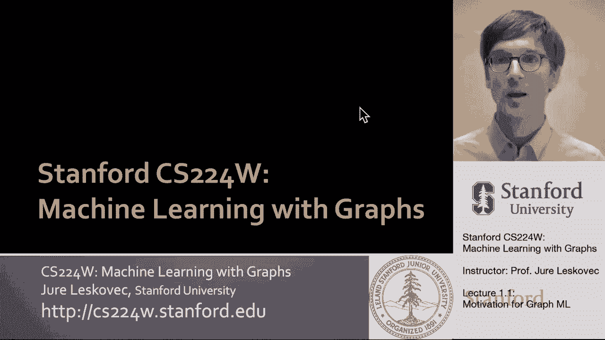
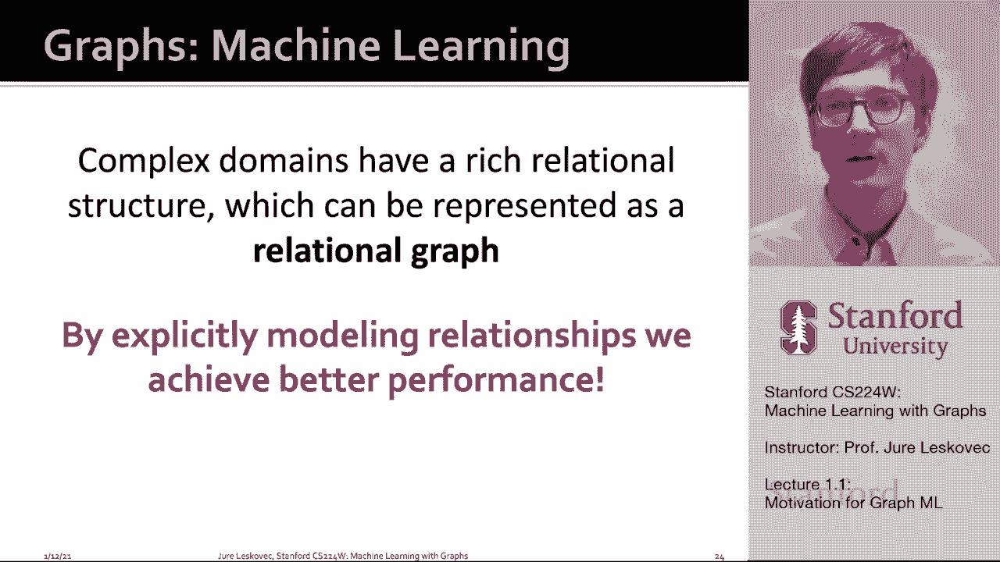
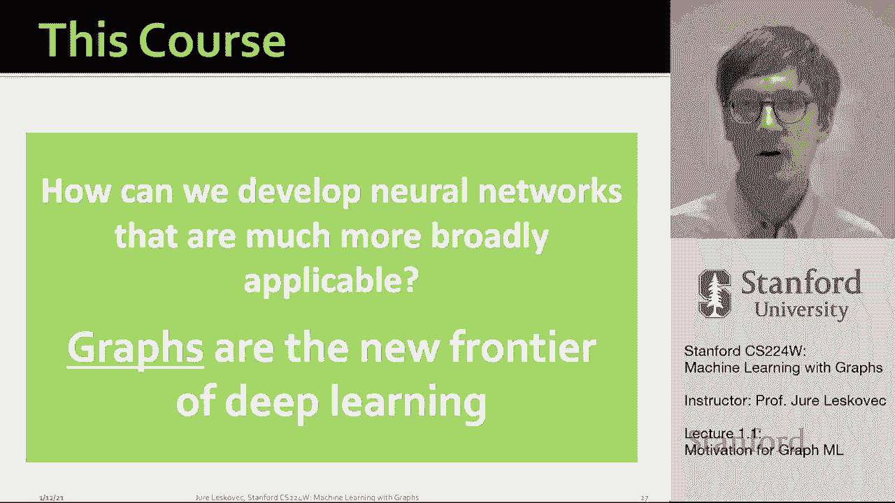

# P1：1.1 - Why Graphs - 爱可可-爱生活 - BV1RZ4y1c7Co

欢迎来到CS 2 2 4 W带图形的机器学习，我叫尤里奥维兹，我是斯坦福大学计算机科学副教授，我将是你的导师，我在第一节课要做的是激励，让你对图形结构化数据感到兴奋，我们如何将新的机器学习方法应用于它。

那么为什么图形，图是描述和分析具有交互关系的实体的通用语言，这意味着不是考虑世界或给定的领域，作为一组孤立的数据点，我们真的是从这些实体之间的网络和关系的角度来看待它的。

所以这意味着实体之间有一个潜在的关系图，这些实体是相关的，呃，彼此，呃，根据这些连接或图形的结构，有许多类型的数据可以自然地表示为图表，并对这些图形关系建模，底层域的这种关系结构允许我们。

建立更多的忠诚，准确得多，呃，基础模型，呃，数据背后的现象，例如，我们可以想到一个计算机网络，疾病途径，物理学中的粒子网络，呃，食物中的生物网络，网，基础设施，以及事件都可以用图来表示，同样。

我们可以想到社交网络，呃，经济网络，通信网络，不同论文之间的引文，互联网作为一个巨大的通信网络，以及我们大脑中的神经元是如何重新连接的，所有这些域本质上都是网络或图形。

这种表示允许我们捕捉不同对象或实体之间的关系，呃，在这些不同的，呃，域，最后一个，我们可以把知识和事实表现为不同实体之间的关系，我们可以描述我们细胞中的调节机制，嗯，作为由不同实体之间的连接控制的过程。

我们甚至可以从现实世界中提取场景，并将其表示为图表，场景中物体之间的关系，这些被称为场景图，我们可以把计算机代码软件表示为，让我们说，不同函数之间的调用，或者作为代码的结构，通过抽象语法树捕获。

我们也可以自然地把分子，由节点组成，呃，原子和键作为一组图表，嗯，我们把原子表示为节点，它们的纽带是它们之间的边缘，当然啦，在计算机图形学中，我们可以取三维形状并表示它们，嗯作为图形。

所以在所有这些领域，图形结构是，是让我们建模下的重要部分，潜在的领域以致命的方式潜在的现象，所以我们思考图形的方式，这个类中的关系数据本质上太大了，呃，零件，呃，可以表示为图形的数据。

首先是所谓的自然图或网络，其中底层域可以自然地表示为图，比如说，社交网络，社会是70亿人的集合以及他们之间的联系，电子设备之间的通信和交易，电话，金融交易都是自然形成的，呃，生物医学图形，我们有基因。

调节生物过程的蛋白质，我们可以表示这些不同的相互作用，生物实体，呃，用图表，正如我提到的，我们大脑神经元之间的联系，本质上是一个网络呃，连接，如果我们想对这些域建模，我们把它们呈现为网络。

也具有关系结构的域的第二个示例，嗯，我们可以用图来表示关系结构，例如，信息和知识被多次组织，链接的软件可以表示为一个图形，我们可以多次提取数据点并连接相似的数据点，这将创建一个图形，相似网络。

我们可以拿其他的，嗯，呃，具有自然关系结构的域，像分子一样，场景图，三个D形，你也知道，在物理学中，我们可以用基于粒子的模拟来模拟，粒子之间是通过，嗯，并用一个图表来表示这一点。

所以这意味着有许多不同的领域，U作为自然图或自然网络，以及其他可以自然建模为图的域，捕捉它们的关系结构，这节课我们要讨论的主要问题是，我们如何利用这种关系结构，更准确，这一点尤其重要。

因为耦合域具有丰富的关系结构，可以表示，呃，用图表，通过显式地建模这些关系，我们将能够实现呃，更好的性能，建造更多，呃，准确。

呃，模型，做出更准确的预测，今天的深度学习现代工具箱专门用于简单的数据类型，它专门用于简单序列，呃，和网格，序列是，呃，像文本或语音都有这种线性结构，曾经有过，为分析这种结构而开发的惊人工具。

图像都可以调整大小，并具有这些空间位置，所以它们可以表示为固定尺寸的网格或固定尺寸的张量，深度学习方法非常擅长处理这种固定尺寸的图像，然而，嗯，图网络更难处理，因为它们更复杂，首先。

它们具有任意的大小和ARB以及复杂的拓扑结构，嗯，也没有空间局部性，就像网格一样，或者像在文本中一样，在文本中，我们知道左边和右边，在网格中，我们有上上下下，呃，左右，但在网络中没有参考点，没有概念。

呃，呃，空间局部性，第二个重要的是，没有参考点，没有固定的节点排序可以让我们，呃，呃，要做的事，呃，做深度学习，这些网络通常是动态的，具有多模态特征，所以在这门课中，我们真的要，呃，谈论。

我们如何开发更广泛适用的神经网络，我们如何开发适用于复杂数据类型如图形的神经网络，实际上，关系数据图是新的前沿，呃。

深度学习和表征学习，呃，如此直观地研究，我们想做的是我们想做的，呃，建立神经网络，根据我们将接受的输入，呃，呃，图表，在输出上，他们将能够做出预测，然后呃，这些预测可以在单个节点的级别上。

可以在节点对或链接的级别，也可以是更复杂的东西，就像一个全新生成的图形，或者对给定分子的一种性质的预测，这种性质可以被表示，嗯，作为输入上的图形，问题是我们如何设计这个神经网络架构。

这将使我们能够首尾相连地做到这一点，意味着不会有人类特征工程，呃需要，所以我的意思是，在传统机器学习方法中，在设计适当的功能方面付出了很多努力，捕获数据结构的适当方法，这样机器学习模型就可以利用它。

所以我们在这节课上想做的是，我们将主要讨论表征学习，在那里这个特性工程步骤被拿走了，基本上只要我们有一个图表，呃，图形数据，我们可以自动学习该图的良好表示，使其可用于下游机器学习算法。

所以表示学习是关于自动提取或学习特征，呃，在图中，我们认为表示学习的方法是映射图的节点，到D维，嵌入到D维向量，这样，网络中相似的节点紧密地嵌入在嵌入空间中，所以目标是学习这个函数。

它将把节点映射到这些d维实值向量中，这个向量将调用的是表示或特征表示，或嵌入给定节点，整个图的嵌入，给定链接的嵌入，嗯等等，所以我们班的很大一部分将是调查和学习最新的表征学习。

可以应用于图形的深度学习方法，呃，结构化数据，我们要呃，讨论图结构数据的机器学习和表示学习中的许多不同主题，所以首先我们要谈谈机器学习的传统方法，在图中，如图形和图核。

然后我们将讨论生成通用节点嵌入的方法，呃，像深度行走和节点到后面这样的方法，我们会花很多时间讨论图神经网络，和流行的图神经网络体系结构，如图卷积神经网络，图圣人结构或图注意网络，呃建筑。

我们还将研究图神经网络的表达能力，嗯，呃，它们背后的理论，我们如何将它们扩展到非常大的图形，然后在本课程的第二部分，我们还将讨论异构图，知识图和应用，呃，到逻辑推理。

我们学习像Trane和beta e这样的方法，我们还将讨论如何为图形建立深度生成模型，我们可以把模型的预测看作是一个完整的新生成的图，我们还将讨论在生物医学中的应用，嗯，各种科学应用，以及工业应用。

在推荐系统方面，呃，欺诈检测等，所以这是这门课的大纲，呃，一周又一周，呃，十周开始，嗯，从今天开始，一直到三月中旬，呃哪里呃，的，课程就会结束，我们将有20节课，我们将涵盖所有的主题，呃。

我已经讨论过了，特别是。

