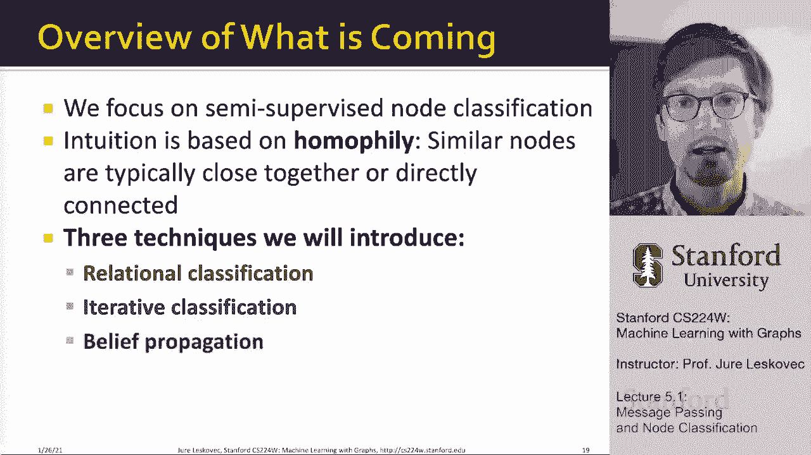

# P14：5.1 - Message passing and Node Classification - 爱可可-爱生活 - BV1RZ4y1c7Co

 Thank you so much everyone for attending。

 exciting to be here and to talk about， the next topic in this class。 Today we are going to discuss。

 message passing and node classification。 This is an intermediate topic， that we are going to use。

 so that we can then move to graph neural networks。

 So let's talk about how we are going to think about this。

 So the idea for today is that we are given， a network with labels on some nodes。

 and the question is how do we assign labels， to all other nodes in the network？

 So the example is that in a network， some nodes are let's say fraudsters or untrustworthy nodes。

 and some other nodes are trusted， fully trusted。 The question becomes how do we find。

 other fraudsters or trustworthy nodes in the network？

 We have already for example discussed node embeddings method， in lecture three and we could say。

 let's use this node embedding methods to simply build。

 a classifier that predicts which node is trusted， and which node is not trusted。 However。

 today we are going to think about this a bit differently。

 We are going to think about this in what is called， semi-supervised node classification。

 where we will be given both some nodes that are labeled。

 let's say labeled with a green and a red color， and some other nodes that are unlabeled。

 and they will be all part of the same network。 So the question will be how do we predict labels。

 of the unlabeled node？ And this is called semi-supervised node classification。

 semi-supervised because we are both given the supervised。

 signals so the labels as well as the unsupervised signal。

 as well as the non-labels all at the same time。 And the idea is that we wanna do this in what is called。

 a message passing framework， right？ We would like to basically given one big network。

 partially labeled， we'd like to infer the labels， of the unlabeled nodes and we are going to do this。

 by doing what is called message passing over the network。

 And the intuition here will be that we wanna exploit， correlations that exist in the network。

 So what I mean by correlations， I mean that nodes that share labels tend to be connected， right？

 So we will have this notion of collective classification。

 where basically the idea will be that nodes are going to。

 update what they believe is their own labels， based on the labels of the neighbors in the network。

 And here conceptually this is also similar， to what we were discussing in page rank lecture。

 where the page rank score was updated， based on the scores of the neighbors。

 But here we are not going to update the score， we are going to update the belief。

 the prediction about what is the label about a given node。

 And we are going to talk about three classical techniques。 One is called relational classification。

 the other one is iterative classification， and then last we are going to talk about belief propagation。

 And all these methods are kind of a bit old school methods， but they give us a lot of intuition。

 for what we are going to talk in the next few weeks。

 when we are going to focus on deep learning on graphs， and in particular graph neural networks。

 So today kind of as a starter topic into that， we are going to talk about these three topics。

 of collective classification。 So when I set correlations existing networks。

 what I mean by this is that individual behaviors， are often correlated in the network structure。

 And correlation means that nearby nodes， tend to have the same color， tend to have the same label。

 they tend to belong to the same class。 And there are two reasons。

 especially for example in social networks， but also in other types of networks。

 for why this might be happening。 First is this notion of homophily。

 where basically individual characteristics， mean that people of similar characteristics。

 tend to link each other。 This is notion of homophily from social science。

 And then there is also this notion of influence， where the idea is that social connections influence。

 our own characteristics or our own behaviors。 So let me kind of give you a bit of a motivation。

 from the social science point of view， why these correlations exist in networks。

 and why network data is so useful。 So homophily is defined as the tendency of individuals。

 to associate or bond with similar others。 And one way to think of this is to say。

 birds of feather flock together。 So right， people that are similar tend to bond。

 they tend to link with each other。 And this phenomena has been observed。

 in a vast array of different social network studies， on a variety of attributes in terms of age。

 gender， organizational role， social status， any kind of preferences， political preferences。

 food preferences and so on。 And one example would be， for example。

 that researchers who focus on the same research area。

 are more likely to collaborate with each other。 Or researchers who focus on the same area。

 are more likely to know each other， or be friends with each other。

 naturally because they attend the same conference， they interact with each other。

 and connections between them get formed。 So this is in terms of homophily。

 And to give you an example， this is an online social network from a high school。

 where nodes are people， edges are friendships， and color denotes their interests。

 in terms of sports and arts。 And what you notice immediately from this visualization。

 is that there seem to be kind of four groups of people。

 And it seems that they are very much grouped， based on this note color or based on interest。

 Is that green nodes tend to link with each other， and yellow nodes tend to link with each other。

 So it means that people with same interests， are more likely or more closely connected。

 due to this effect of or this phenomena called homophily。 Another phenomenon or another force。

 that creates this correlation in networks， is kind of the other way around。

 If in homophily we say people have characteristics， and people with similar characteristics。

 tend to link to each other， the notion of social influence kind of flips， the arrow in some sense。

 So it says that social connections， can influence the individual characteristics of a person。

 So for example， if I recommend my musical preferences， to my friends and I'm very， very persistent。

 perhaps one of them will grow to like my favorite genres， my favorite music。

 So this means that now this person， just became more similar to me， right？

 It means we were connected and I influenced them， to kind of change their behavior。

 to change their preference so that the two of us， are more similar。

 which one explanation would be is， this makes our bond even stronger， even easier to maintain。

 So here it was the social connection， that affected or influenced the individual characteristic。

 And both of these phenomena are very， very common， and very strong in social networks。

 And the correlations also exist， in many other types of networks。

 And this is really the main intuition， that we are going to exploit in today's lecture。

 So the question will be， how do we leverage this notion of correlation。

 across the edges of the network， observe the networks to help to predict node labels， right？

 When I say correlation， I mean nodes that are connected， tend to have the same label。

 tend to have the same preferences。 So the question is， given this partially labeled network。

 you know， green， let's call that a positive class。

 a label one and red will be what I'll call a negative class， and let's label it with label zero。

 And the gray nodes are the nodes， that don't have the color yet and the question is。

 how would I come up with an algorithm， to learn or to predict the colors of gray nodes？

 So the motivation is that similar nodes， are typically close together。

 or directly connected in the network。 So the principle we are going to use。

 is also known as guild by association， in a sense that if I'm connected to a node with label X。

 then I'm likely to have that label X as well。 And that's this notion of correlation I was saying about。

 right？ So if you could say about， let's say， malicious and benign web pages。

 you could say malicious web pages， tend to link to one another。

 to increase visibility and look credible， and rank higher in the search engines。

 So if I know that one web page is malicious， then perhaps other pages that link towards it。

 also tend to be malicious， right？ That's intuition。 So the way we are going to think of this。

 is that we are going to determine， the classification label of a node V in the network。

 that it will depend on two factors。 It will depend on the properties， features of the node V。

 And it will also depend on the labels， of the neighbors of the node V of interest。 And of course。

 because these label depends， on the labels of nodes in the neighborhood。

 those labels will also depend on the features， of those nodes in the neighborhood。 So kind of。

 this means that also the label of node V， will depend on the features of the nodes。

 in its neighborhood。 So here is how we are thinking about this graphically。

 Given a graph and a few labeled nodes， right， we want to find a label class of remaining nodes。

 When I say label， in this case， it will be positive or negative， it will be green or it will be red。

 And the main assumption， the main modeling assumption， the main inductive bias in our approach。

 will be to assume that there is some degree， of homophily in the network。

 So that basically these labels tend to cluster， meaning that nodes of the same label。

 tend to link to each other。 So to give you an example task。

 let A be an adjacency matrix over N nodes， this is basically captures the structure of the graph。

 This adjacency matrix can be unweighted， can be also weighted。

 all methods generalize to weighted graphs as well， can be undirected or directed。

 all the methods generalize to both types of graphs。

 And we will use the Y as a vector of node labels， right？ So we'll say Y sub V equals one。

 if the node V belongs to class one， to the green color。

 and Y sub V equals zero if the node V belongs， to the class zero。

 meaning it is labeled with a red color。 And of course， there will be also other unlabeled nodes。

 that need to be whose label needs to be predicted， whose label needs to be classified。

 and right now we don't know their label。 The goal is predict which labeled nodes。

 are likely to be of class one， and which ones are likely to be of class zero。

 So that's the idea of what we wanna do。 There are many examples of this notion。

 of collective classification， right？ You can think about， I wanna do document classification。

 and documents linked to each other。 I wanna do link prediction in graphs。

 and the links will depend on the properties labels， of the neighbors。

 Even like you can take certain other domains， where you have optical character recognition。

 and you can represent that as a graph， and say the label of what character I am。

 also depends on the labels， what are the characters around me， meaning that I know how to form。

 let's say English words， and some random sequence of characters is very unlikely。

 So whether I'm letter A or a letter G， will depends what my neighbors here， in the， let's say。

 the line graph think about。 So there is a lot of different cases。

 where it basically wants to make prediction， about one object based on the relationships。

 of the object to its nearby objects， in terms of nodes， images， letters in OCR。

 part of speech tagging， in many other cases， knowing what are the labels of the nodes around you。

 helps you determine your own label。 That's essentially the idea。 So collective classification。

 that we are going to talk about today， is going to have three different parts。

 So the intuition we are going to have， is that we want to simultaneously classify。

 linked nodes using edges， and propagate information across the edges of the network。

 And this will be a probabilistic framework， where we will be making what is called a Marko assumption。

 And a Marko assumption means that the label of a node， only depends on the labels of its neighbors。

 So this is a first order Marko assumption， because we only assume that a label depends。

 on the label of the neighbors。 And we don't， for example。

 assume that the label depends on the label， of neighbors of neighbors， right？

 Like degree to neighborhood。 We only look at the degree one neighborhood。

 And this notion of collective classification， the reason why we use this term is because we are。

 we will be all together classifying， all the nodes on the graph， because every。

 every node's label depends， on other nodes labeled。 So we are going to iteratively reclassify。

 reclassify nodes。 Nodes are going to update the belief， or prediction about their labels。

 until the process will converge。 And in order for us to do this kind of collective。

 iterative classification， we will need three types of classifiers。 We'll have this local classifier。

 that assigns the initial label to the node。 We'll then have what we call a relational classifier。

 that captures between correlations between nodes， and we'll basically say， "Huh。

 what are the labels of other nodes in the network， of the neighbors of the node of interest？"。

 And then we'll have this notion of collective inference。

 where we will be propagating these correlations， these beliefs over the network。

 until the labels will converge to some stable state。

 or until some fixed number of iterations will be achieved。

 So what are these three pieces that we need to define？ First。

 we have this notion of a local classifier， that will assign initial labels to unlabeled nodes。

 So this is used for initial label assignment， and it will predict label of a node。

 based on its attributes or features。 It is just a standard classification task。

 where given a set of given features of a node， we wanna predict its label。

 And this does not use the network information yet。 So this is applied only once at the beginning。

 to give initial labels to the gray nodes。 Then we will define this notion of a relational classifier。

 that will capture the correlations between the nodes。

 So what does this mean is that we learn another predictor， that will predict a label of one node。

 based on the labels or attributes of other nodes， in its neighborhood。

 And this is where the network information will be used， because this relational classifier will say。

 what is given nodes label based on the labels， of the nodes that are connected to it。

 And this is where the network information is used。

 And then we won't only apply this relational classifier once。

 but we are going to apply it in rounds。 So we will have this collective inference stretch。

 where we are going to keep updating the predictions。

 based on the updated predictions on the neighbors。 So we are going to apply a relational classifier。

 to each node iteratively and iterate until the inconsistency。

 between neighboring nodes is minimized， meaning network structure is going to affect the predictions。

 and these predictions are going to converge， and the predictions are going to stabilize。

 And usually we will either run this iteration， until it stabilizes or until some maximum number。

 of iterations is reached。 And I will give you specific examples of what I mean by that。

 So the problem setting is how do we predict labels？ Why sub v of unlabeled nodes v？

 Here the notating gray color。 Each node v will have a feature vector f sub v。

 Labels of some nodes will be given to us。 We'll use label one for green nodes。

 and label zero for red nodes。 And the task is find the probability， that a given node is， let's say。

 positive is green， based on the features it has， as well as the network structure and the colors。

 of the nodes around it。 So that's the problem we are trying to solve。

 And we are going to solve this by propagating the beliefs。

 the propagating the information across the underlying， network structure in an iterative way。

 So what's the overview of what is coming？ We are going to focus on this notion。

 of semi-supervised node classification， semi-supervised in a sense that we are given both labeled。

 and unlabeled data at the same time。 We are given a partially labeled network。

 We are going to use this notion， this intuition of the notion of homophily。

 that similar nodes are typically close together， or directly connected in the network。

 And we are going to talk about three techniques， about relational classification。

 iterative classification。 And then last， I'm going to talk about belief propagation。

 [ Silence ]。

