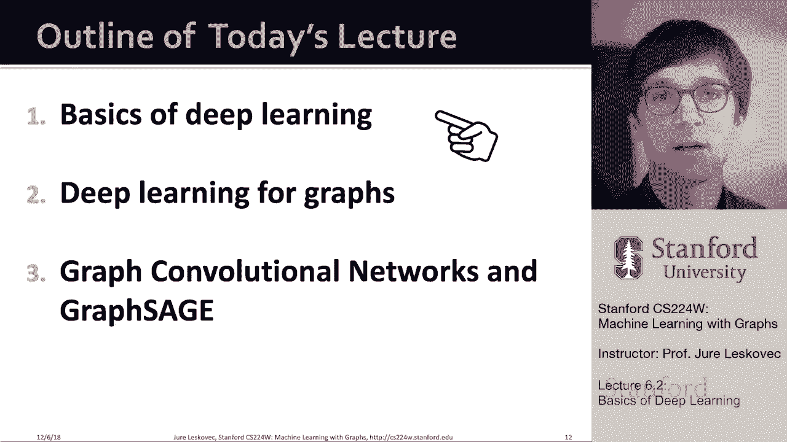
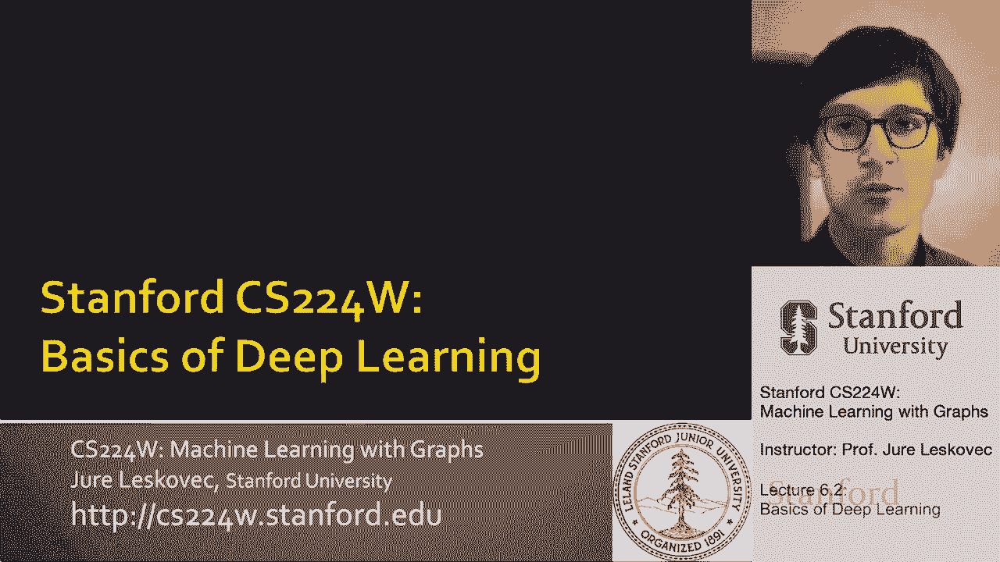
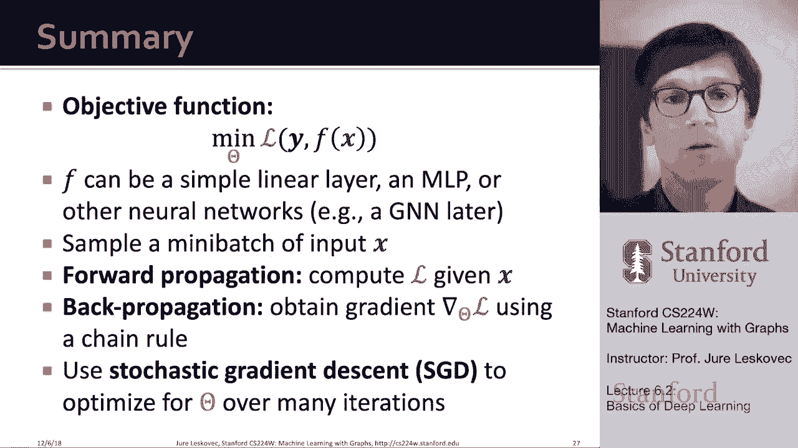

# P18：6.2 - Basics of Deep Learning - 爱可可-爱生活 - BV1RZ4y1c7Co

我们今天要讨论的是三个话题，首先，我将给出一个基本的概述，深度学习神经网络概念，这将是重要的，这样我们就能达成一致，然后我会花大部分时间谈论，图的深度学习，图神经网络的概念。

然后我要讨论两个具体的呃架构，一种叫做图卷积神经网络，另一个叫做图表年龄给你一些直觉，然后通过呃呃，通过接下来的一系列讲座，然后我们将更深入地研究这个理论，更多，深入不同的应用程序，不同的不同架构。

不同的设计选择，嗯等等，所以我们要讨论这个图神经网络的话题，接下来的几堂课。

让我们谈谈基础知识或做一个快速的教程介绍。

对深度学习和深度神经网络，所以我们会想到机器学习，监督学习作为一个优化问题，所以我们的想法是给我们一些输入x，目标是预测或产生输出，呃，这些输出，我们将调用标签或类，等等，um和x可以用不同的方式表示。

x可以是实数的向量，呃，x可以是像自然语言序列一样的序列，词序，令牌序列，声音，它可以是矩阵，这意味着它可以是一个固定大小的矩阵，就像呃，都调整为相同大小的图像，也可以是一个完整的图，um或图中的节点。

这就是我们将成为的样子，呃，感兴趣的，呃，后来下来，呃，在今天的讲座中，然后向右，目标是我们要映射这个抽象的X，不管它是什么进入标签Y，所以我们希望能够预测，呃，标签Y，我们需要学习这个函数。

它使这个映射，我们将把这个函数的学习表述为一个优化问题，所以我们把它表述为一个优化问题，从某种意义上说，我们说这个我们感兴趣的函数f，它将接受输入x并产生产生输出y将被一些参数参数化，θ。

我们的目标是我们将定义损失的概念，嗯，这将说明预测值和真实值之间的差异是什么，所以有两个重要的，呃，这里的东西就在这里，首先我们要说，让我们最小化，呃，在这些模型参数上，呃，θ，使得这种差异。

这种损失是最小的，所以说，呃，θ是一组参数，呃，我们想优化，你知道，这可能是一个标量值，矢量，整个矩阵，或者一组矩阵，例如，如果你认为在这个，呃，呃，基于法律的框架，嗯，像呃这样的浅编码器。

在这些情况下，深度行走和节点在他们的行动中发挥作用，我们的参数矩阵θ实际上是嵌入矩阵z，在较浅的编码器情况下，对呀，所以θ只是一个泛型，描述模型参数的符号，损失函数，正如我所说的测量，或量化预测值与。

真正的价值，例如，嗯，如果你考虑回归，所以预测实值数字，那么Y是正确的预测，x的f是我们的模型返回的预测，L 2的损失是一个平方，两个数字之间差的距离，对呀，所以我们会说我想，我想找到模型参数θ。

使得差的平方和尽可能小，真值与预测值之差的平方，当然还有很多不同类型的损失，呃使用，取决于问题，不管是回归，不管是分类，不管是你知道这个，嗯，不管是排名任务，不管是分类任务，嗯和嗯，这里是你可以，呃。

呃，呃，了解有关各种类型损失的更多信息，呃，我就不多说细节了，但你知道我们主要是和，呃我两败俱伤，它是用来呃，最常回归，所以当我们试图预测，呃，实际价值，呃或交叉熵损失，我稍后会定义，都是关于分类的。

这就像把节点分成颜色，比如说，现在让我给你们一个损失函数的例子，对一个常见的呃，我们感兴趣的损失函数叫做交叉熵，假设我们在讨论多类分类，所以我们可以有多种颜色，在这种情况下，假设我们有五节课。

五种不同的颜色，所以呃，这意味着我们将使用，所谓的一个热编码，这意味着我们会说，啊哈，现在我们试图预测的是，我们试图预测一个维数为五的向量，你知道第一维度可能对应于蓝色，第二个对应红色，第三个对应绿色。

第四个对应黑色，我不知道，呃，最后一个对应白色，所以现在我有，如果给定的感兴趣节点是，呃是呃绿色，然后你知道这个向量的第三个条目被设置为1，所以这就是我现在如何编码，使用这个的颜色，所谓的一个热编码。

因为有一个，剩下的是零，然后我可以说，嗯哼，我现在要做的是给它建模，在某种意义上，用函数f在颜色上的概率分布，这将是某个函数g的软最大值，你知道在第三讲，我们定义了SoftMax的概念。

也就是你从最后走过去，在条目上，你把它们指数化，然后呃，你要确保它们加起来是一个对的，例如，在我们的例子中，可能是f的x嗯，我们把它放进去之后，嗯嗯嗯，呃那个，节点x，我们会产生这组数字。

基本上它会说习惯概率点1，你知道我们认为颜色是蓝色的点三，它是红色的，第四点是绿色的，以此类推，等等，所以现在我们要做的是，我们想测量这个预测的质量，对呀，我们想说，预测的绿色概率和，项目真正是绿色的。

我们计算的方式，这是不是呃表示或称为交叉熵损失，但基本上我们是说，让我们把所有的课程都总结一下，嗯，你知道我们这里有五节课，所以C升到五，我们说我为什么，那个课时做的概率是多少，锁预测的概率是正右。

所以从这个意义上说，这意味着Y是实际的，然后呃，x的f是第i个玻璃或第i个颜色的预测值，直觉是损失越低，预测越接近一个热点，如果这里的值是1，那么1的对数为零，所以我们做了正确的呃。

预测所以现在我们有损失，定义个别例子或个别数据点的损失或差异，然后我们可以定义完全损失的概念，这只是一个损失，总结了所有的训练例子，所以这是预测值之间的总差异，从所有的训练例子中总结出的真正价值。

对和我们想要的对，我们想找到参数的函数，这样，真值和预测值之间的总差异最小化，在这种情况下，我们测量差异，呃为了呃，每个呃，每个预测的数据点，使用交叉熵损失的概念，所以基本上，这个想法。

既然我们已经定义了损失的概念，我们定义了这个概念，嗯的嗯，优化问题基本上是试图找到最小化损失的模型参数，下一个问题是我们如何优化这个目标函数，最小化目标函数的正确而经典的方法。

经历了各种或多或少先进的梯度下降概念，所以梯度的概念，导数的概念成为中心和最重要的，对呀，所以回想一下梯度向量，呃，在给定点是一个方向，和最快的速度，呃，函数的增加，所以我可以说啊哈，我有我的损失函数。

现在我可以问我的损失函数，我可以评估一下，嗯，关于我的参数，我可以，这会告诉我，如果我是对的，如果我的参数现在有一定的值，嗯，它的方向是什么，嗯，这个，呃，这个呃，目标函数，这个损失函数，会增加得最快。

嗯，这是非常重要的，因为这意味着我可以考虑所谓的方向导数，它是一个多变量函数的倍数，就像，比如说，损失函数，就是嗯，其中变量在，我们的模型参数θ，基本上它，呃，它基本上告诉我们，在给定的点上，很多。

较长的给定向量表示函数沿，呃，在那个矢量，所以这意味着我现在可以说，考虑到我目前的情况，我应该往哪个方向换，这样损失就会减少得最多，这基本上是，呃，我们正在努力做对的事情。

我们会说我们有一个参数的当前估计，让我们计算损失函数曲面的方向导数，在我们所处的那个点，然后我们要进入方向，损失减少最快的um，希望能在当地找到一些好的，呃解决方案或全局最小解决方案。

所以在给定点计算的梯度是方向导数，这给了我最大增长的方向，对嗯，我们对增加不感兴趣，我们对下降感兴趣，所以我们要沿着梯度相反的方向走，我们要走下去，在渐变更新方面不向上走，对呀。

所以我们思考这个问题的一个方法是使用叫做梯度的算法，呃，血统，这是最基础的版本，然后一切都是用同样的直觉，但它只是比这个改进了，本质上这是在说，让我来，呃，反复更新模型参数的权重，在梯度的相反方向。

直到我向右收敛，所以我说我有我目前对参数等级的估计，让我计算一下梯度，呃，损失函数的导数，在那个，在我的参数当前所在的点上的一组参数，然后你知道，让我向与渐变相反的方向迈一步。

这就是为什么我在这里有负号，这个常数eta，这是学习率，对呀，它说我想迈出多大的一步，然后这给了我新的更新参数集，现在我又把它们放在这里，我评估了梯度，我做了一个物体，所以基本上是在训练中。

我们说你知道我们迭代优化这个参数，一次迭代是梯度下降的一步，正如我所说，呃，呃，θ，这是学习率，这是一个超参数，控制步骤的大小，对呀，呃，这个想法是，通常在开始的时候，你可以迈出更大的一步。

但当你接近最小值时，你想做更小的步骤，因为你不想越界，你不想跳过这个值，你想慢慢下降到值，如果你想到这样的函数，对吧，你不想跳过去，理想的终止条件是梯度为零时，这意味着你陷入了函数平坦的局部极小值。

所以你知道你在练习中垫底，嗯，如果它不再提高验证集上的性能，我们将停止训练，所以当梯度为零时，而不是停止，在实践中，我们有一个单独的验证集，在此基础上我们验证了模型的预测，但我们不用它来计算梯度。

然后嗯，一旦我们在验证集上的性能停止改进，我们停止训练通常都是这样，即使你知道它仍然有可能保持呃，优化你的呃，目标函数，这个一般梯度下降思想的问题是，计算精确的梯度需要遍历整个数据集，情况是这样的。

因为如果你还记得早些时候我定义损失的时候，我说损失衡量的是数据点之间的差异，预测值和真实值，总损失是所有训练示例损失的总和，所以现在这意味着这个，即使你在计算损失的梯度，这意味着你必须传播内部的渐变。

所有训练示例的总和，所以这意味着当你计算梯度时，每项差异，每个训练示例值，在训练示例中评估的损失将对呃，总梯度，所以这意味着在这种情况下，梯度下降的一次迭代将允许，需要你对整个，呃，训练数据集。

这是有问题的，因为现代数据集通常有或通常包含数十亿个数据点，这可能会变得非常昂贵和缓慢，所以解决方案，加速比称为随机梯度下降或SGD，这个想法是，与其计算所有训练例子的损失，2。

我们打算先把损失计算一下，以及在所谓的小批量生产中损失的梯度，迷你批处理只是数据的一个小子集，这就是我们所说的X，所以现在让我，呃，定义几个非常重要的概念，你会一遍又一遍地听到。

所以首先我们讨论了哪个是数据的子集的概念，我们在上面计算梯度，而不是在整个训练数据集中评估它，我们将在训练数据集的一小部分上评估它，也许一百个，也许有一千个例子，批处理大小是小批处理中的数据点数，对嗯。

所以这是一个重要的，通常我们喜欢把批量做得更大，但是更大的批处理会使优化变得更慢，因为我们需要计算的每一步，呃，结束，呃，根据随机梯度下降的较大批量迭代是，然后一步，呃，随机梯度下降。

其中我们计算给定小批处理上的梯度，我们称之为迭代，然后一个历元基本上是对数据集的完整传递，所以基本上这意味着我们一直在处理一二三四五批，直到我们耗尽训练数据集，所以如果我们有我不知道一百万个例子。

我们有我不知道，呃，十万批，每一个都是十号的，所以基本上我们经过预处理之后，呃，十万批，这是一个时代，然后我们从头开始，从头开始，对呀，因此迭代次数等于数据集大小的比值，嗯和批量大小，正如我提到的。

如果您创建这些批处理，呃，呃，均匀地，均匀地，均匀地，则SGD是全梯度的无偏估计器，对嗯，当然不能保证收敛速度，实际上，这意味着它需要调整学习速率，这个SGD的想法是一个共同的核心理念。

然后许多其他um优化器，呃改进一下，像其他毕业生一样，其他德尔塔艾玛的道具等等，他们基本上，我们就用这个核心理念，选择数据子集的子集，计算它上面的梯度，现在进行步骤细节根据数据点的不同而变化，您选择。

你迈出了多大的一步，你怎么决定步长，嗯等等，等等，但本质上这个迷你批，随机梯度下降是深度学习中um优化的核心，既然我们已经讨论了目标函数，我们讨论了迷你批的概念，我们讨论了随机梯度下降的概念。

现在我们需要，呃谈谈，这实际上是怎么做到的，这些梯度是如何，呃计算评估，对呀，因为在深度学习之前的旧时代，你实际上必须用一组方程写下模型，然后你必须手工计算这些梯度，基本上。

就像我们在高中做的那样当你手工计算梯度时，手工在白板上，所以基本上你必须手工计算这些梯度，然后把它们编码到你的软件c+python matlab中，不管是什么，然后能够呃，运行优化，嗯，有趣的是。

在深度学习中写深度学习，这个预测函数f可能非常复杂，对呀，它可以是这个复杂的多层深度神经网络，我现在要给你看的是，基本上这些深度学习方法的好处是，梯度计算实际上非常简单，然后嗯，从某种意义上说。

它是免费的，当你制作更复杂的模型时，你要做的是梯度计算的复杂性，作为一名程序员，嗯并不真的影响你，所以这个想法是下面的对吧，让我们从一个非常简单的函数开始，把输入x乘以w，我们的模型参数θ是这个物体w。

如果f返回标量，如果f返回一个数字，那么w应该是一个向量，对呀，x是向量，乘以矢量得到标量，所以比如说，相对于呃的梯度，呃，f关于w的v只是一个向量，我们区分的地方，呃，f相对于w 1 w 2，W三。

它们是我们的组件，呃矢量w，这个和渐变是，然后简单地求出在特定点的导数，呃，所以基本上我们必须计算出这些导数是什么，然后插入w的具体数字，得到值，这就是现在点w处的梯度，比如说，如果f返回一个向量。

所以说，如果f是一个更复杂的函数，那么w将是一个矩阵对，我们有矩阵乘以一个向量给我一个向量，所以在这种情况下，w是所谓的权重矩阵，它也被称为雅可比矩阵，然后你计算梯度的方法是完全相同的。

但现在你会对w的每个项求导，所以关于W 1 1，一二，哇一三，然后你知道到第一排的末尾，然后是两个，一个到两个，以此类推，对呀，但本质上是，呃，都一样，所以现在梯度是，呃，矩阵。

我们只是有一个非常简单的，呃预测器，它只接受输入，并将其乘以W，但现在如果我们想创建更复杂的预测器呢，为了这个例子，想象一下，我想有这个复杂的预测器，首先输入x，将它与w相乘，然后乘以w 1。

然后乘以w 2，所以这现在看起来更复杂了，因为首先我们用一个权重矩阵相乘，然后我们用第二个权重矩阵相乘，在这种情况下，模型的参数是两个，比如说重量，呃矩阵，现在我们要做的是，我们要计算导数。

都与w 1和w 2有关，这里发生的事情是，我们实际上可以正确地应用链式法则，链式法则说如果你求导，如果你想对变量求导，关于某个变量x，但是嗯，呃，变量z取决于变量y，那么你可以做的方法是，你说，啊哈。

我对y取z，然后我得带你和呃，对它对x求导，所以基本上这就是我如何应用这个链式法则来创建这个，呃导数，这些衍生物嗯，并根据依赖关系将它们链接在一起，所以在我们的情况下，如果我想把我的函数f。

并计算它对x的导数，我可以先接这个活，并对它对w 1 x求导，然后我取w 1 x，对x求导，反向传播的概念，使用链式法则传播中间梯度，最终得到关于损失的梯度，关于模型参数，这很有趣。

因为这意味着我们可以机械地计算，呃渐变，所以让我呃，给你举个例子吧，所以我们仍然在使用这个简单的两层线性网络，这里是这个的神经网络表示，但本质上需要，假设二维输入x乘以w 1，这是在这里发生的。

然后乘以w 2得到一个输出，想象我有一些损失函数，假设我输了两个，平方损失，简单地说，预测值和真实值之间有什么差异，然后嗯，你知道，我在迷你B批上评估了这个，然后我也有一个隐藏层的概念。

隐藏层是输入x的中间表示，所以这里，我用这个，x的h是w乘以x表示隐藏层，对呀，这是x的一些变换，但还没有，呃最终输出，网络的，当然我可以把它改写成，你知道的，x的h是第一个积，然后评估它，嗯，嗯。

在G的G的H，呃是乘法，呃两个，这现在意味着什么，如果我想做所谓的向前传球，我从X开始，i与w乘1，然后i与w 2相乘得到输出，所以我可以想到的是，我从x开始，我把W 1应用到基本计算H。

现在我把h代入，然后应用函数g，这又是，i与w 2相乘，我得到了，我现在得到输出f，所以我们有这种功能的嵌套或链接，如果我想做反向传播，现在反向传播意味着我现在必须计算导数，这个渐变，我想向后工作。

这意味着如果这些是我的模型参数，我从损失开始，向后计算梯度，所以我会从损失开始，比如说，我很想计算一下损失的梯度，关于W二，那我就得从损失中走出来，计算，对f求导，然后我得，对w 2求导。

所以我从失败到失败再到失败，例如计算损失的导数，呃，关于W一个，我得承担损失，计算f，关于f的导数，计算关于w 2的导数，然后取W2的结果，对1求导，你可以看到我是如何向后工作的，如何呃，当我深入网络。

我可以再利用，先前的计算，这就是为什么这被称为反向传播，因为我有点呃工作倒退，嗯，从输出一直到，呃输入，然后告诉我如何更新参数值，所以这个差异，损失的价值会更小，在我的案例中，我已经向你展示了。

我们使用了一个非常简单的两层神经网络，如果你仔细看的话，嗯仍然是线性的，因为w 1乘以w 2，呃是另一个矩阵或者向量，但基本上它意味着通过把东西锁起来，我们没有得到更多的表现力，这仍然是一个线性模型。

对呀，所以嗯，在这个简单的例子中，f现在仍然是关于x的线性模型，不管我们组成多少个权重矩阵，我们有多少个W，但是如果我们引入非线性，比如说，嗯，像这样定义的整流线性单位，这是它的样子。

或者像这样定义的乙状结肠函数，这是它的图片版本，那么嗯，这些事情变得有趣多了，因为现在通过引入非线性，我们实际上增加了表现力，呃我们的模型，我们锁得越多，嗯，模型就越有表现力。

这就把我们引向了一个叫做多层感知器的模型，在多层感知器的每一层中，我们把线性变换和非线性结合起来，如此意味深长，到目前为止，我们讨论了w乘以x，我们现在做的是，呃也对它应用一个非线性，例如乙状结肠。

呃或一个或一个，呃，这里是雷卢姆，B只是对A的偏见，一个常数来显式地取出它，一种方法是假设特征向量是一个元素，或多一个条目，该条目总是值1，然后这种偏见就成了，b成为a，呃呃，呃，一排，b中的一行。

所以嗯，这就是多层感知器的工作原理，和我们以前一样，但我只是通过非线性发送东西，激活功能，现在你知道了，如果我现在想，我可以在给定的层进行访问，我可以，呃，保持呃，呃，通过与另一个繁殖来锁住他们。

通过另一个发送，um非线性层，与另一个W相乘另一个非线性层，我可以做得越来越深越来越复杂，呃，神经网络，但在优化它们方面，因为链式法则，我们在这里解释过，嗯，梯度计算基本上可以机械地完成。

通过深度学习框架，我们不需要担心把它们写下来，我们在担心如何进行优化，呃，你知道吗，这是伟大的，真正加快了呃的发展，机器学习算法，所以总结一下，我们讨论了如何定义机器学习。

利用模型参数损失最小化的目标函数，呃f，就像我们说的，这个预测函数可以是一个简单的线性层，只需w乘以x或多层感知器，这里是w乘以x，呃通过了一个非线性，或，你知道吗，其他一些更复杂的神经网络。

我们的想法是取样一批，输入额，呃x，我们称之为迷你批，然后我们做正向传播，嗯计算呃，流量的价值。

然后我们做反向传播，其中，我们使用链式法则获得损失相对于模型参数的梯度，然后那个，现在我们已经计算了关于模型参数的梯度，我们用随机梯度下降，嗯，呃，在这些小批处理中，在多次迭代中优化我们的参数。

你知道现在我们的结论是，UM深度学习教程，我们接下来要讨论的实际上是，呃。

