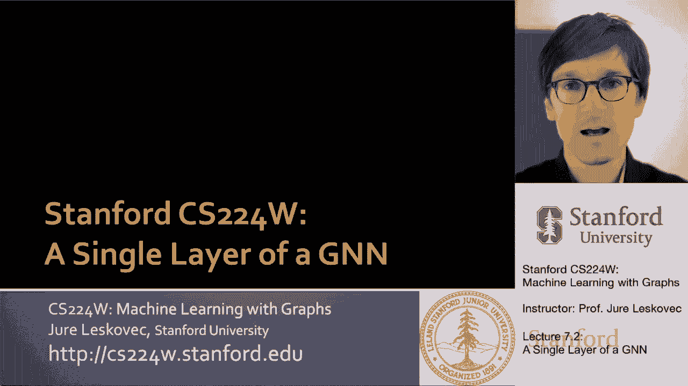
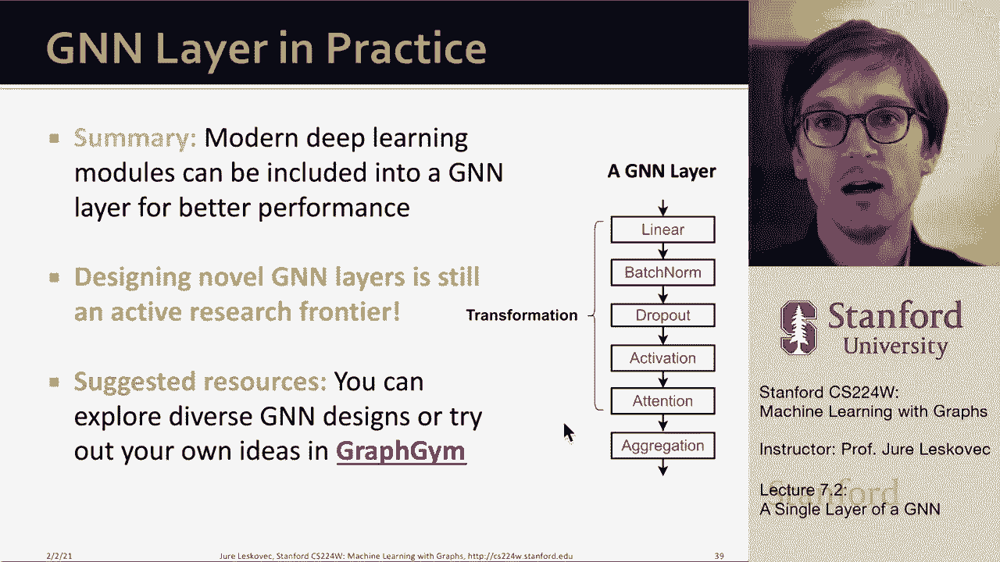

# P21：7.2 - A Single Layer of a GNN - 爱可可-爱生活 - BV1RZ4y1c7Co

所以首先，让我们讨论如何定义图神经网络的单层。

对呀，那么进入单层的是什么，单层有两个组件，它有一个消息的组件，呃，转化，它有一个消息聚合的组件，正如我提到的，不同的图神经网络架构在这些操作上基本上是不同的，呃正在做，在其他类型的事情中，呃。

他们之间的差异，那么单GNN层的想法是什么，我们的想法是压缩一组消息，一组来自孩子们的向量，你知道的，从神经网络的底层，在某种意义上，通过聚合它们来压缩它们，我们将把这作为一个两步过程来做。

作为消息转换和消息聚合，对呀，所以如果我们想想这个，我们在，在底部，我们有一组输入，呃，我们有一个输出，我们要做的是从每个孩子身上得到信息并将其转化为，然后我们必须将这些消息聚合成一条消息并将其传递给。

所以你可以这样想，我们得到的信息被表示为圆圈，这里，从上一层的三个邻居，我们也有自己的信息，节点的正确消息，v，从上一层，不知何故，我们想把这些信息结合起来，嗯，创建下一层嵌入，或者此节点的下一级消息。

呃感兴趣，这里要注意的是，这是一套，所以我们从孩子们那里聚合这些信息的顺序，不重要或武断，因此，这些聚合函数聚合了，呃，压缩，在某种意义上，来自孩子的消息必须是顺序不变的，因为他们不应该依赖，你知道吗。

其中的顺序，我在考虑邻居吗，因为对邻居没有特别的命令，呃，到下层给孩子们，呃，在网络中，那是很重要的，呃重要的细节，当然啦，另一个重要的细节是我们想结合来自邻居的信息，从邻居一起呃。

节点自己来自上一层的信息，如这里所示，创建L级消息，我正在从邻居那里收集信息，呃，从上一层，以及该节点本身的表示，呃，上一次，呃层，所以现在让我把事情做得更多一点，呃，呃精确。

所以我们将把消息计算作为我们需要决定的第一个操作来讨论，基本上，消息计算采用上一层节点的表示形式，不知何故改变了，将其转换为此消息，呃，消息信息，所以每个节点都创建一条消息。

该消息将被发送到下一层的其他节点，简单消息转换的一个例子是，您将上一层，节点的嵌入与矩阵W的乘法，所以这是一个简单的线性层线性变换，呃，这就是你知道我们谈过的，呃，在上一个，呃演讲对吧，所以这就是。

这是第一部分，我们需要决定这个消息函数，在这种情况下，就是这个矩阵，呃乘以，第二个问题是关于聚合，这里的直觉是，每个节点将聚合来自其邻居的消息，所以我的想法是，我现在把这些转换后的信息。

我们刚刚在上一张幻灯片上定义了，对呀，所以我把这些来自节点的转换消息，你从我改造的前一个层次，让我们说，在这个例子中，我想把它们聚合成一条消息，对呀，我想把这个东西压缩一下，聚合它。

聚合函数的一些例子是什么，求和是一个简单的聚合函数，平均值是序不变的聚合函数，以及例如，max，我们取最大消息或最大坐标智能值，这就是我们聚合的方式，一次又一次，所有这些所有这些，聚合函数是，呃。

序不变量，例如，你能做到这一点的一个具体方法是说，嗯嗯，节点V的L um级嵌入，只是来自邻居的转换消息的总和，呃那个呃，感兴趣的节点，V你知道这就是上一层的信息被转换的地方，现在我们简单地把它们加起来。

呃在L层嵌入节点，当然，现在L级的这个节点要发送到，为L级创建消息，加一个，现在需要WL加1，把它和h相乘，送给在他们之上的人，呃，在图神经网络中，呃结构，所以这现在是一个信息，呃呃，操作。

消息转换和消息，呃，聚合，一个重要的问题是，如果你按照我目前定义的方式来做，来自节点本身的信息，呃可能会迷路对吧，基本上消息的计算，呃为了水平，呃，对于节点V，对于L级并不直接取决于我们已经计算过的。

呃那个结节，与上一级右相同的节点V，例如，如果我简单地做，正如我在这里展示的那样，我们只是在聚合关于邻居的信息，但我们并不真的说，好的，但是这个节点V是谁，我们以前对节点V了解多少。

所以这里的一个机会是，包括节点V的前一层嵌入，当我们计算下一级V的嵌入时，所以通常会执行不同的消息计算，我这么说是什么意思，比如说，A消息转换矩阵W将应用于邻居U，同时有一个不同的消息聚合函数。

B将应用于节点V的嵌入，呃本身，所以这是第一个区别，嗯对，以便来自节点本身的消息，从上一层乘以b，而来自上一层邻居的消息将乘以w，第二个区别是从邻居聚合后，我们也可以聚合来自V本身的消息。

通常这是通过串联或求和来完成的，所以给大家看一个例子，我们可以的方式，我们可以这样做是说，啊哈，我把邻居给我的信息汇总起来，假设用带有求和运算符的A，我从v本身得到的信息是对的，就像我在这里定义的那样。

然后我要把这两条信息连接起来，就像把它们一个接一个地连接起来，这是我对节点V的下一层嵌入，所以我说，简单地说，我是说，我在收集邻居的信息，加上保留关于我已经有的节点的信息，这现在是一种方式。

如何跟踪节点已经计算过的关于自己的信息，这样它就不会在层层的，呃，传播，它是，让我们说通过这里的串联或通过，呃，求和，那是另一个受欢迎的选择，所以把这一切放在一起，我们学到了什么。

我们了解到我们有一个消息，在这个消息中，上一层的每个节点都有自己的，嵌入自己的信息，转换并发送，将其发送到父级，这是在这里通过这个消息转换函数表示的，通常这只是一个线性函数，像矩阵乘法。

然后我们有这个消息聚合步骤，在那里我们聚合来自邻居的转换消息，对呀，所以我们把这些信息m，我们在这里计算过，我们把它们聚合在一起，我们把它们和平均数加起来，或者使用最大池类型方法，然后我们还可以做的是。

呃，这里的另一个扩展是添加一条自消息并将其连接起来，然后在我们做完这一切之后，我们通过一个非线性，通过非线性激活函数，最后一步很重要因为它增加了表现力，通常你知道这个非线性被写成sigma，嗯。

在现实中，这可以是一个整流的线性单位，或者乙状结肠，或任何其他特定类型的，嗯，呃非线性激活函数，在其他类型的神经网络中也很流行，但这就是图神经网络的单层，呃看起来像，所以现在我们已经抽象地看到了这一点。

我想提一下，已经开发的一些开创性的图神经网络体系结构，并在这个统一的消息转换消息聚合中解释它们，呃框架，上一节课我们讲了图卷积神经网络，或者GCN，我写了这个方程，我说啊哈，在节点V的嵌入处。

在L层只是，呃，呃，与v相邻的节点u的uh，由节点v的in度归一化并变换，用矩阵W变换并通过非线性发送，所以现在的问题是，我怎么把我写在这里的方程，并将其写入此消息转换加聚合函数中，你可以的方式，呃。

你可以这样做，就是简单地把这个W分配到里面，所以基本上现在w乘以h除以邻居数，是消息转换函数，然后消息聚合函数只是一个求和，然后我们这里有一个非线性，所以这就是图的卷积，呃。

神经网络是在信息聚合和信息转换方面，嗯，所以要写得更明确，每个邻居都通过说我带我的呃来转换信息，上一层嵌入，将其与w相乘，除以v的节点度，所以呃，这是按节点度进行的正常归一化，然后聚合是邻居上的求和。

节点V的uh，然后应用呃，这里表示为sigma的非线性激活函数，所以这现在是一个gcn，作为消息转换和消息聚合编写，呃型操作，所以那是嗯数字，呃，第一座古典建筑，呃，我想提到的第二个架构叫做图鼠尾草。

鼠尾草构建在gcn之上，而是把它伸进去，呃，几个重要的，呃方面，第一个方面是它实现了这个聚合函数是一个任意的，呃，聚合函数，因此它允许多种不同的聚合函数选择，不仅仅是平均，第二件事是它谈到了呃。

从节点本身获取消息，改造它，然后将其与聚合的聚合消息连接起来，增加了很多表现力，所以现在让我们在这个消息中写出图形鼠尾草方程，加上呃，聚合类型操作，对呀，消息是通过，呃，呃，聚合算子，agg，这里。

我们可以认为这是一种两阶段的方法，首先是嗯，我们嗯，我们接收单个信息，嗯，并改造他们，让我们说通过呃，线性运算，然后我们应用聚合运算符，它基本上给了我消息的摘要，来自邻居的声音。

然后第二个重要的步骤是我，消息来自已经聚合的邻居，我把它和V自己的连接起来，嗯嗯，来自上一层的消息或嵌入，把这两个连接在一起，用变换矩阵将它们与A相乘，并通过一个非线性，对呀。

所以GCN在这里和另一个之间的区别是，更重要的区别在于，我们将自己的，呃嵌入，呃也是，所以嗯到现在要说，我们可以使用什么样的聚合函数，我们可以简单的，比如说，邻居加权平均数，这是什么呃，呃。

gcn正在做，例如，我们可以采取任何形式的池，也就是，呃，你知道吗，拿着呃，进行转换，邻居向量并应用对称向量函数，像最小或最大，所以你甚至可以，比如说，在这里作为一种转变，你不必有线性变换。

你可以有一个多层感知器，作为消息转换函数，然后是聚合，你也可以不取消息的平均值，但你总结了这些信息，然后呃，这些不同的um聚集函数具有不同的理论性质，我们实际上要讨论的是。

基于模型表达能力的聚合函数的选择，嗯，在未来的一次讲座中，如果你愿意，你甚至可以做的是，您可以应用LSTM，所以基本上你可以应用一个序列模型，呃，到邻居发来的信息，嗯，这里重要的是。

序列模型不是顺序不变的，所以当你训练它的时候，你想排列顺序，这样你就教序列模型不要保持，呃，有点忽略，呃，它接收到的消息的顺序，但你可以用这样的东西，嗯，作为聚合，呃，呃，算子，所以很多自由，呃。

在这里选择，关于图形最后要提到的是，增加了l 2归一化的概念，所以说，这个想法是我们想把L应用于归一化，到每一层的嵌入，当我说L两个正常化，我的意思是我们要测量距离，给定嵌入项的某些平方值，给定节点的。

把它的平方根，然后除以距离，所以基本上，这意味着，这个嵌入向量的欧几里得长度总是等于1，有时这很重要，带来了巨大的性能提升，因为如果没有L 2正常化，嵌入呃，节点的向量可以有不同的尺度，不同长度。

在某些情况下，嵌入的规范化导致性能改进，所以在L两个归一化步骤之后，当我在这里介绍它的时候，所有的向量都有相同的，l两个标准，它们的长度是一样的，也就是一个的长度，这就是呃，这是定义的，呃如果你想。

呃真的看到了，因此，在决定设计决策时，L 2归一化也是一个重要的组成部分，关于图神经网络的具体架构，然后最后一个呃，我想讲的古典建筑叫做图注意网络，在这里我们将学习注意力的概念。

所以让我先告诉你什么是图形注意力网络，然后我将定义注意力的概念，然后呃，我们怎么学，它直觉上意味着什么，所以动机是图注意网络中的以下权利，当我们聚合来自邻居的消息时，我们有一个重量，每个邻居都对。

所以对于节点v的每一个邻居u，我们有一个权重阿尔法，这个重量我们称之为注意力重量，这个重量现在可以告诉我邻居有多重要，um是给定的是给定的节点，或者在某种意义上对给定的事物给予多少关注。

到来自给定节点的消息，你因为如果这些重量不同，那么来自不同节点的消息在此求和中将具有不同的权重，就是这个意思，所以现在让我们后退一步，解释为什么这是如何激发的，为什么这是个好主意，以及如何学习这些重量。

所以如果你想想我们到目前为止讨论过的两个架构，所以gcn和graph的年龄已经是这个alpha的一个隐含概念，所以呃，αuv是节点v度数的1，所以基本上这是一个体重因素。

或者来自你的消息对节点V和呃的重要性，到目前为止，你知道这个alpha是隐式定义的，嗯和嗯，我们实际上可以定义它，嗯，更明确地说，或者我们实际上可以学习它，在我们的案例中阿尔法实际上是，传入节点，呃。

节点，U阿尔法是一样的，它只取决于节点V的程度，但并不真正依赖于U本身，所以这是一种非常有限的注意力权概念，所以在图表中，鼠尾草或gcn，在聚合消息时，所有邻居对节点V同样重要，问题是。

我们能概括一下吗，我们能概括一下吗，这样我们就可以了解从给定节点到节点的消息有多重要，那就是聚合消息，对呀，所以你想了解信息的重要性，这种重要性的概念被称为注意和注意，注意这个词的灵感来自于。

在某种意义上有认知注意权，所以注意力阿尔法集中在输入数据的重要部分，淡出或忽略，呃，剩下的，所以这个想法是神经网络应该投入更多的计算能力，更多地关注输入的那一小部分重要部分，嗯，也许你知道，忽略。

选择忽略其余的，嗯，数据的哪一部分更重要取决于上下文，这个想法是我们将了解数据的哪一部分是重要的，通过模型训练过程，所以我们允许模型学习不同输入的重要性，呃接收，所以在我们的情况下。

我们想了解这个注意力权重，这将告诉我们来自节点U的消息有多重要，呃对这个，呃节点，我们想要这种关注，当然取决于u和v，所以问题是对的，我们如何学习，呃，这个，呃，注意力权重这些权重因素，呃阿尔法。

因此目标是指定任意的重要性，嗯之间嗯，邻居之间，嗯，当我们进行消息聚合时，这个想法是我们可以计算嵌入呃，图中每个节点的，遵循这些注意力策略，节点通过手工处理来自邻居的消息，我的意思是给他们不同的重要性。

然后我们将隐式地为不同的节点指定不同的权重，在附近，我们要学习这些重量，这些重要性，我们要做的是把它计算成，注意机制的副产品，我们将在哪里定义注意机制的概念，会给我们这些注意力分数或注意力权重。

所以让我们考虑一下这种关注，首先计算注意系数，跨节点对的e u vu，呃U和V根据他们的信息，所以我的想法是，我想定义一些函数，A将在上一层嵌入节点U，节点V在上一层的嵌入，也许把这两个嵌入。

然后把这个作为输入给我一个权重，这个重量会告诉我，呃在，呃在节点上，例如，只是为了具体，对呀，如果我想说，注意力系数是多少，它只是某种功能，节点A在上一步的嵌入，以及在上一步嵌入节点B。

在图神经网络的前一层，这会给我这个的重量，呃或这个特殊的重要性，呃边缘，现在我有了这些系数，我想让他们正常化，以获得最终的关注权重，那么我说的是什么意思，比如说，规范化就是我们可以应用一个软最大值函数。

对他们来说，所以这些注意力权重总和为1，所以我取系数，我们刚刚定义的，我呃，将它们指数化，然后你知道，除以指数，他们中的一些人，所以这些注意力砝码，现在α和为1，然后就在我做消息聚合的时候。

我现在可以根据注意力权重做一个加权和，呃阿尔法，这是阿尔法，这些是依赖E的阿尔法，E是呃是取决于前一层，节点嵌入，呃u和v所以，比如说，如果我现在说节点A的聚合，看起来我会这么做的方式是。

我会计算这些注意力权重，呃αa bαac和αa d，因为b c和d是它的邻居，当我出现在这里时，这些阿尔法将以i的形式计算，它们将通过以前的层嵌入来计算，呃这些，边缘端点上的呃节点。

然后我的聚合函数只是一个加权的，来自邻居的消息的平均值，信息乘以我们拥有的权重，在这里计算和定义，所以那是嗯，基本上注意机制的思想，嗯，现在这种注意机制是什么形式的，我们还没有决定。

如何将一个节点的嵌入和另一个节点的嵌入结合起来，计算到这个，呃，呃重量，呃呃，通常的做法是你，你有很多不同的选择，就像你可以用一个简单的，呃线性层，嗯，一层神经网络来做到这一点，嗯或者呃有阿尔法。

此函数a具有可训练的参数，例如，一个流行的选择是简单地说，让我把节点A和B在上一层的嵌入，也许让我把它们改造一下，让我把它们串联起来，然后在上面涂一个线性层，这会给我这个重量，呃AAA B。

然后我可以应用Softmax，嗯，然后基于那个呃，我用那个重量作为一个，在聚合函数中，重要的一点是这些参数的作用是这种注意力机制，这些函数的基本参数是联合训练的，所以我们学习注意机制的参数和权重矩阵。

所以消息转换矩阵，消息聚合步骤中的um，所以我们从头到尾进行所有这些训练，呃时尚这在实践中意味着什么，使用这种注意力机制可能很棘手，因为呃，这可能很挑剔，在某种意义上，有时候很难学会很难让它收敛。

所以我们还可以做的是，到呃，将这种注意力的概念扩展到所谓的多头注意力，多头注意是稳定注意机制学习过程的一种方法，这个想法很简单，这个想法是我们会有多个注意力得分，所以我们将有多种注意力机制，啊嗯。

每一个我们都要训练，全部学会，呃同时，所以我们的想法是，我们将有不同的功能，比如说，在这种情况下，我们将有三个不同的函数a，这意味着我会我们会得到三个不同的，呃，注意系数，给定边缘VU的注意力权重。

然后我们将进行聚合，呃，三次获取来自邻居的聚合消息，现在我们可以进一步将这些消息聚合成一个，呃，聚合消息，这里的重点是，当我们学习这些函数时，一二三，我们将随机初始化它们中每一个的参数，并通过学习过程。

它们中的每一个都会收敛到某个局部极小值，而是因为我们使用了其中的多个，我们将它们的转换平均在一起，这将基本上允许我们的模型更加健壮，它会让我们的学习过程不会卡住，在优化空间的某个奇怪的部分，嗯。

它会起作用的，呃，更好，呃，平均，所以这种多头注意力的想法很简单总结，我们将在同一边缘有多个注意力权重，我们要用它们，呃，在消息聚合中单独，然后我们得到的最后一条信息，对于节点来说，将只是聚合。

就像这些基于个人注意力的平均值，呃，合计数，这里的一个重要细节是这些不同的呃，阿尔法必须用不同的函数来预测，这些函数中的每一个都必须用随机的，呃，不同的起动参数集，这样每一个都有机会收敛到一些，呃。

当地，呃，极小，呃，就是这个意思，这增加了健壮性和稳定性，呃，学习过程，这就是我想说的关于注意力机制，我们如何定义它，所以接下来，让我来，让我来讨论一下注意力机制的好处，关键的好处是。

这允许隐式地为不同的邻居指定不同的重要性值，它在计算上是有效的，从某种意义上说，注意系数的计算可以在所有传入消息中并行进行，对每个传入消息都正确，我计算注意力权重，嗯，通过应用函数a。

这只取决于一个节点的嵌入，和另一个节点的嵌入，呃，在上一层，所以这很好，它是，呃，从某种意义上说，存储效率，因为稀疏矩阵运算符不需要um，太多的非零元素，基本上我需要每个节点一个条目，每个边缘一个条目。

所以呃，你知道那很便宜，这与我们拥有的数据量是线性的，它有固定数量的参数，意思是网格注意机制功能A有固定数量的参数，与图的大小无关，另一个重要的方面是，注意力权重是本地化的，他们关注当地的网络社区。

所以基本上可以让你告诉你应该关注社区的哪个部分，他们概括的意思是他们给了我这个归纳，呃能力，这意味着嗯，这是一个共享边沿机制，不依赖于图结构，所以在全局图结构上，所以这意味着我可以把它转移到图表上。

所以这个函数a可以在图之间转移，或者从图形的一部分，到图表的下一部分，所以嗯，这些是讨论的好处和种类，注意机制给你举个例子，嗯，这里是嗯，呃，一个网络的um的示例，呃叫Quora。

这是一个不同论文的引用网络，来自不同的学科和不同的学科，这里不同的发布类以不同的颜色着色，呃颜色和呃，我们在这里试图展示的是不同的边缘厚度，是注意力得分，在一对节点之间，i和j。

所以这只是一个正常化的注意力评分，基本上说，i对j的注意力是什么？穿过不同的层次，注意注意力可能是不对称的，正确的一条信息，那个呃，你给我的信息可能很重要，而我给你的信息可能不那么重要，所以不一定要。

呃，对称的，对称的，嗯，如果你看看，你知道吗，在改进方面，比如说，图形注意力网络可以给你相当多的改进，比如说图卷积神经网络，呃，因为呃，因为这种注意力机制，让你学会关注什么，呃，关注什么。

以及网络的哪些子部分，呃学习，这是一个图注意网络的例子，它是如何学会注意的，当然有很多升级，这种注意思想在图神经网络上的迭代，但是图形关注网络，你知道吗，呃，两年前是，呃，是最早发展起来的，然后呃提议。

所以嗯，这是呃，挺刺激的，总结一下到目前为止我们学到了什么，我们了解到，关于经典图神经网络层，以及它们是如何定义的，它们包括什么样的组件，嗯，他们经常可以，你知道吗，我们经常可以得到更好的性能，啊啊啊。

结合不同的方面，呃在设计方面，嗯，我们还可以包括，正如我将要谈论的，就像，比如说，我们将更多地讨论批处理规范化，辍学，可以选择不同的激活功能，注意，还有呃，合计数，所以这些是转换和组件，你可以选择，嗯。

为了设计一个有效的体系结构，呃为了你的，呃你的问题，所以正如我提到的，多种现代深度学习模块，或技术可以合并或推广到图神经网络，嗯，有一个赞，比如说，我接下来要讲的是批处理规范化，稳定了神经网络训练。

我要谈谈辍学的问题，这让我们可以，呃，防止过装，嗯，我们谈到了对，注意机制控制来自社区不同部分的信息的重要性，嗯，我们也可以谈谈跳过连接，呃等等，所以，嗯，让我谈谈这些概念中的一些，呃再过一会儿。

呃细节，所以首先我想谈谈批处理规范化的概念，批量归一化的目标是稳定图神经网络的训练，这个想法是给定一批输入，给定一批数据点，在我们的例子中，一批节点嵌入，我们希望将中心节点嵌入重新为零。

均值并缩放它们以具有单位方差，所以非常准确地说，我们所说的这个是什么意思，我得到了一组输入，在我们的例子中，这将是呃的向量，节点嵌入，然后我就可以计算出我们的每个坐标，那个坐标的平均值是多少。

沿着向量坐标的方差是多少，穿过n个输入点，呃X是迷你批的一部分，然后我也可以有，嗯，在这种情况下，我可以，嗯，那么呃，你知道有输入，有两个输出，呃，可训练参数，呃伽马，呃和贝塔，我可以呃。

想出简单的输出，嗯，我把这些输入，x我呃，把它们标准化，从某种意义上说，我减去平均值，除以沿那个维度的方差，所以现在这些x有零均值和单位方差，然后我可以进一步学习如何通过。

基本上是通过与伽马相乘来线性变换它们，添加偏见，呃因素，呃呃，偏差项，我和贝塔在每个坐标上都是独立的，对于的每一个维度，呃每个呃，每个嵌入的数据点，我在迷你批中，所以总结一批，规范化稳定训练。

它首先将数据标准化，所以要规范手段，减去平均值，除以标准差，所以这意味着x的均值为零，方差为1，所以单位方差，然后我也可以学习这些参数，现在沿着每个维度线性变换x，这是批处理规范化的输出，嗯。

我想讨论的第二个技术叫做呃，辍学，嗯，这个想法，这使得我们在神经网络中可以防止过拟合，这个想法是，在训练过程中，有一些小概率p，一组随机的神经元将被设置为零，在测试期间，我们将使用网络的所有神经元。

所以这个想法是如果你有一个，让我们说，前馈神经网络，这个想法是，你设置为零的一些神经元，因此，信息现在只在没有设置为零的神经元之间流动，这里的想法是这迫使神经网络更加健壮，损坏的数据或损坏的输入。

那是呃，这个想法，因为神经网络现在更健壮了，它防止神经网络，呃，从图表中的过拟合，将神经网络退出应用于消息函数中的线性层，所以我们的想法是当我们从，上一层的节点U，我们把它乘以这个矩阵w，呃，到这个。

呃，到这个W的线性层，我们现在可以申请退学了，而不是说这里的输入乘以w得到输出，嗯嗯，你现在基本上可以设置一些部分，呃，输入的，呃，嗯，呃，以及输出，呃，归零，呃，这样模仿，辍学者，呃，那是。

就是这个意思，然后呃，正如我所说，辍学率，它的作用是，它有助于嗯，防止，呃，神经网络，一个呃的下一个呃组件，图神经网络层是根据非线性激活函数，嗯对，我们的想法是把这种激活应用到，嵌入呃X的。

我们可以做的是应用一个整流的线性单元，它被简单地定义为x和0的最大值，所以你可以根据输入x来思考它，红线给你输出，所以如果x是负的，输出为零，如果x为正，输出是呃，x本身，这是最常用的激活功能。

我们也可以应用乙状结肠激活函数，这里定义了一个乙状结肠，它的形状，所以作为输入的函数，输出将为0到1的值，这基本上意味着你可以取一个X，它的定义域从负无穷大到正无穷大，把它转换成有界输出，零到一。

这个是用，当您想限制嵌入的范围时，当您想限制输出的范围时，经验上最有效的叫做呃，参数值和参数relu定义为x和0的最大值，加上一些可训练的参数alpha，最低额，x和呃零。

所以这基本上意味着从经验上来说，呃，如果x大于零，呃呃，输出x本身，如果它小于零，你输出x乘以某个系数，呃一个，在这种情况下呃，这不是注意力重量，这是一个不同的系数，呃，我们训练。

现在参数Relu的形状看起来像我在这里显示的嗯，从经验上看，这比价值更有效，因为你可以训练这个参数，呃一个，所以呃，总结一下我们到目前为止所讨论的和所学到的，我们说过，呃，现代深度学习模块。

可以包含在图神经网络层中，以实现更好的，呃表演，我们讨论了线性变换，批量归一化，辍学，呃，不同的激活功能，我们还讨论了注意力机制以及不同的方法，然后收集信息，如果你想，呃，玩这些不同的。

以一种简单的方式进行体系结构选择，我们实际上开发了一个叫做呃的包，图形健身房，呃，这基本上可以让你快速轻松地尝试，测试不同的设计选择以找到最有效的，呃在你的，呃个人，呃问题，所以说，如果你点击这个。

这是一个链接，它会带你去GitHub，嗯和嗯，你可以玩，用这个代码来看看不同的设计选择是如何产生实际差异的，呃你自己的。

