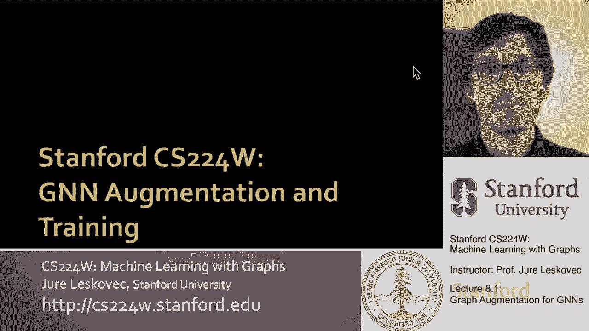
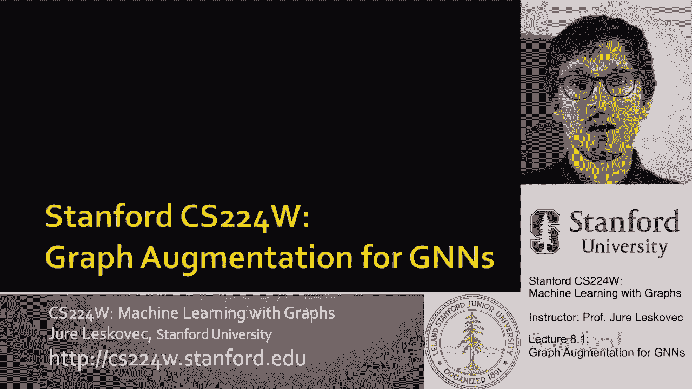
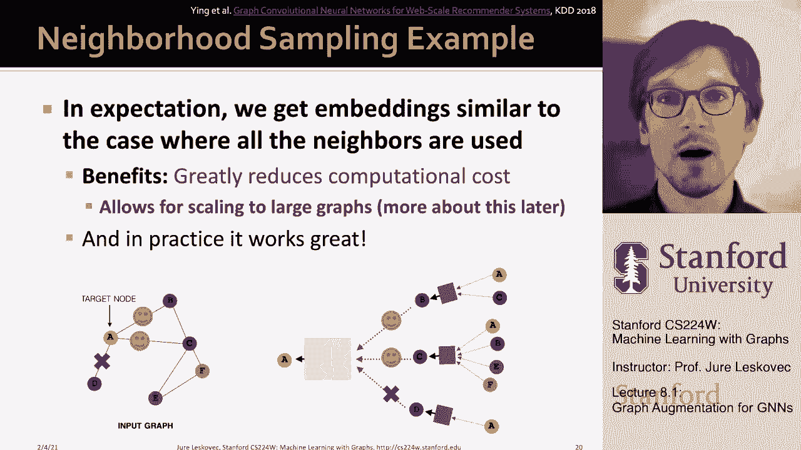

# P23：8.1 - Graph Augmentation for GNNs - 爱可可-爱生活 - BV1RZ4y1c7Co

欢迎大家来上课，嗯，我们将继续讨论，呃，呃，我们有什么样的设计选择，训练或呃设计图神经网络，然后在今天讲座的最后一部分，我们要讲的是图神经网络训练，以及我们如何制作这些模型的其他各个方面，呃工作。

所以要开始，嗯，提醒大家，我们在讨论深图，呃，编码器特别是图神经网络，其中的思想是给定输入图，呃，在左边，我们想通过几层非线性的，呃变换，神经网络的几层，在节点边缘的层面上做出好的预测，以及整个图。

其中基本上对于网络中的每个节点，我们定义基于给定目标节点周围网络邻域的计算图，所以本质上这意味着输入图，围绕目标节点的UM网络结构定义了神经网络结构。

然后我们讨论了这个问题为了让这个神经网络架构发挥作用，因为每个节点都可以定义自己的神经网络架构，它自己的计算图，这将取决于节点在网络中的位置，那么我们在嗯能做什么，要做到这一点。

我们必须定义几个不同的运算符，嗯在建筑中，所以首先我们说我们需要定义我们所说的消息传递函数，一个消息转换函数，它将从子消息中获取消息，转换它并将其传递给父级，我们必须定义消息聚合的概念。

这将从孩子们那里获得转换后的信息，呃，并以顺序不变的方式聚合它们，以产生呃，孩子们的一个综合信息，然后我们说当这个信息，呃，到达，呃，给父母，我们需要决定如何将它与父母自己的信息结合起来。

从上一个级别创建节点的嵌入呃，然后可以呃传递，这就是我们如何定义图的单层，神经网络，然后我们讨论了如何结合，或者如何链接堆栈，呃，多层在一起，我们今天要讨论的是第四点，围绕什么样的图形和特征增强。

我们能创造来塑造这个神经网络的结构吗，还有呃，我们要讲的是，呃，所以那是呃，今天的计划，所以首先，让我们来谈谈呃的图形增强。

图神经网络，所以这个想法是原始输入图，不一定需要显示底层计算图，对呀，所以到目前为止我讨论的是，如果我想为网络中给定的目标节点创建一个图神经网络，然后我从它的邻居那里获取信息，邻居来了。

然后每个邻居从自己的邻居那里获取信息，这定义了图神经网络，然而，嗯，从输入图结构到图的转换，神经网络结构不需要一对一，我不需要取原始输入图，把它解释为计算图，我可以用嗯，创建图神经网络计算图的各种技术。

我们将要讨论的两种技术是图特征增强，就我所说的我们所假设的，原始输入图直接定义了图的计算图，神经网络，我们有很多很好的理由为什么我们想打破这个假设，所以嗯，我们想在节点特征的层面上打破它，嗯，很多次。

比如说，输入图可能缺乏，um，呃，特征属性，um，也许你想，呃，有时候，嗯，功能也是，难以编码，然后在图形结构方面，有时图形，输入图往往太稀疏，在非常稀疏的图上传递消息是低效的，这需要大量的迭代。

大量的GNN深度，有时候太密了，传递信息变得过于昂贵，如果你觉得，比如说，在Instagram或Twitter网络上传递信息，你打了，呃，你知道的，金·卡戴珊节点。

那么你需要从她的无数追随者中聚集起来对吧，所以那很贵，所以问题是当你击中一个高度节点时，你是做什么的，你是做什么的，您真的需要从那个高度节点的所有邻居聚合，或者你可以选择一个子集，呃，邻居的，然后呃。

另一个重要的考虑是，有时这个图太大了，因此，我们无法将计算图拟合到GPU内存中，一次又一次，嗯，需要某些增强技术，基本上重点是，有时，输入图不太可能碰巧是计算的最佳计算图。

基于gnn的嵌入和我们接下来要讨论的技术，我们会给你一些想法，我们可以做些什么来改进图的结构，从而更好地用于图神经网络的嵌入，所以我们要谈谈，呃，增强办法，我们将特别讨论图形特征的增强，嗯在哪里，它是。

输入图缺乏属性的情况可能是这样，缺乏特征，我们要创造呃，特征，所以呃，然后我们还将讨论图结构的增强，正如我所说，如果图形太稀疏，我们可以，我们将能够添加虚拟节点和边，如果密度太大。

我们可以决定在进行消息传递时对邻居进行某种采样，如果图形太大，然后我们可以再取样，子图，呃，计算嵌入，然后呃，最后一点，我们将在讨论时更详细地讨论，呃，扩大规模，呃gnns，那么我们为什么需要，呃。

特征增强，对呀，首先我想谈谈图形特性的增强，呃，所以我们来讨论一下，我们为什么需要这个，有时输入图没有任何节点特征，呃，这很常见，对呀，如果输入只是图邻接矩阵，我接下来要讨论的是几种标准方法，1。

你是怎样处理这种情况的？你能这样做什么，第一个想法是你简单地分配一个常量值，每个节点的常量特征，所以基本上所有的节点都有相同的特征值，呃，1的值，然后如果你想到聚合的作用，它基本上算数，有多少邻居。

怎么办，节点是否有一级的级别，他们有多少人在第二级，他们有多少人在第三级，所以从某种意义上说，这仍然可以让你捕捉到一些概念，关于给定节点的网络邻域结构是什么样子的，尽管所有的节点都有相同的特征。

它有一个价值的，您可以做的另一个想法是为节点分配唯一的ID，所以基本上这些ID然后被转换为一个热向量，对呀，所以基本上这意味着如果你有一个六个节点的网络，那么这个想法是。

您可以为网络中的每个节点分配一个热编码，所以我的意思是，呃，现在网络中每个节点的特征向量只是一个六维二进制向量，在你知道的地方，节点ID号五，这里的a的值是1，如果这是第5个节点，还要注意。

节点的这种呃顺序是完全任意的，嗯，所以一个热编码有一些问题，因为在不同的图中推广它们可能很难或不可能，但是如果你用一个图，那么呃，这种方法可能没问题，因为每个节点基本上都有一个独特的热点，呃编码。

在单个节点的思想上有一个标志值-1，因为模型实际上知道节点邻居的ID是什么，呃在网络里，当然可能会很贵，因为现在你的特征表示，你的你的属性数，节点具有许多特性，该节点的节点数等于网络中的节点数。

所以这对于一个节点来说是一个相当昂贵的特性表示，嗯，如果网络很大，那么这些呃，两种方法比较对，这如何添加一个不变的特性而不是一个热编码，他们在表现力不变的特征方面如何比较，所以每个值为1的节点。

嗯有一种中等的表现力，对呀，所有节点都是相同的，但正如我们稍后将讨论的那样，GNN仍然可以了解节点周围的图结构和邻域结构，对呀，在某种意义上，假设像求和这样的聚合函数允许您说，嗨，我有三个。

如果这是感兴趣的节点，我有三个邻居在第一层，我有，让我们说呃二一二，第二层的邻居，以此类推，对吧，所以这就是它能学到的，所以它仍然能够捕捉到图形的一些简单部分，呃结构一个热编码，呃有很高的表达能力。

对呀，每个节点都有一个唯一的ID，所以一个节点，哦，我有个邻居身份证号码是2，也许这对确定你自己的标签很重要，所以嗯，表现力很高，你知道我们允许，这种方法是否允许，呃，但这意味着对看不见的节点的泛化。

或泛化到尚未成为网络一部分的节点，或者对一个我在训练中从未见过的新图形的概括，呃能力，因为推广到新节点很简单，到新图形，我们为它们分配不变的特性，并在同时应用GNN，比如说，在嗯。

在一个热门的编码案例中，呃，我们真的做不好，因为呃，我们不能推广到新节点，对呀，新节点引入新ID，这些身份证不是训练的一部分，GNN不知道如何，呃，嵌入看不见的节点，嗯，这是，这是一个热门编码的问题。

您需要知道训练时的整个节点集，你需要知道训练时节点的边缘，在计算成本方面，嗯，就像我说的，呃，常节点特性非常便宜，每个节点只有一个值，而一个热编码有很高的，因为每个节点都有一个特征向量。

它的长度等于网络的大小，对呀，它是许多顶点，是特征向量的维数，所以我们不能将此应用于大型图，然后你知道，你什么时候会应用其中一个或另一个，你就会，嗯，您可以将常数特性本质上应用于任何图形。

当您关心归纳设置和泛化到新节点时，呃，但是呃，模型的表现力就会受到限制，另一方面，一个热编码非常强大，允许您了解网络周围更复杂的结构，但它只能应用于小图和事务设置，基本上，其中所有的节点和边都是已知的。

在模型训练时，所以这是关于呃，特征增强的一种思想，当我们没有特征的时候，呃，在节点上，我们想做一些功能增强的另一个动机是有时，对于GNN来说，某些结构是很难学的。

所以有时我们实际上想把一个图结构编码到节点中，属性向量，所以呃，这个想法，比如说，是那个嗯，给大家举个例子，就像一种边缘，例如，GNN很难计数，呃，你知道的，一个循环的长度是多少，一个节点在所以嗯。

问题是，你知道的，GNN能知道一个周期的长度吗，给定节点，呃居住在，除非你有判别节点特征，呃，这是不可能的，对呀，所以我的意思是，比如说，在这个例子中，节点v位于长度为3的循环上。

而这里节点v 1位于长度为4的循环上，在这两种情况下，右v一都是二级，它的邻居有程度，所以问题是，你知道的，我怎么做，这个节点怎么知道现在它处于一个循环中，呃，长度，呃，四对三，像这样的事情很重要。

例如在化学方面，因为这些可能是不同种类的化学结构，或者不同种类的环形结构，然后呃，为什么呃，呃，普通GNN不能区分，你知道吗，长度为3的循环中的节点一，相对于长度为4的循环，如果你看GNN计算图，呃。

两者都适用于这两个节点，v1和v2，计算图的含义完全相同，v一，v 1和v 2有两个邻域，嗯每个，然后你知道这些邻居有，呃，每个邻居一个，计算图总是这样，呃除非是对的。

您有一些方法可以根据特征来区分节点，但是如果节点有相同的，嗯一套呃，不是，你不能根据他们的属性来区分他们，那你就学不会，区分节点，我们想从V2，从GNN的角度来看，他们会，他们都会，呃，看起来一样。

我要去更多，这里的深度，呃，这个例子和呃，它的一些非常重要的含义和后果是什么，当我们要讨论图神经网络的理论时，但就目前而言，重要的是要了解GNN很难捕捉，或者无法捕获。

节点是在长度为3个周期还是长度为4个周期上，除非这些节点，嗯，在网站上，会有一些区别的特征，我们无法区分这两个节点的原因，或者为什么GNN不能区分呃，在这些节点之间是因为计算图看起来呃，同样的。

在这两种情况下，对呀，一个节点有两个邻居，然后这些邻居中的每一个都有另外两个邻居，如果所有的邻居看起来都一样，它们没有任何区别的颜色，那么所有情况下的计算图看起来都是一样的，所以呃，嵌入将是相同的。

所以没关系，不管你是循环的一部分，或者你是无限长度的一部分，呃，链条，计算图总是相同的，所以GNN将无法再次区分节点，除非节点之间有一定的区别，所以如果节点有不同的颜色，那么GNN可以呃，捕捉模式。

所以嗯，解决办法是什么，解决方案是为每个节点创建一个特征向量，那就会，呃，那就会，比如说，把循环数告诉我，所以基本上我会用循环计数信息来增强节点功能，所以一个想法，比如创建一个矢量。

这是长度为零的循环数，节点参与长度为一长二长三右的循环数，这么长，一个是自环镜头，两个就是嗯，如果在有向图中，呃往复连接长度，三是一个嗯一个三角形，你知道长度四是一个正方形，对和呃，你可以，现在，呃。

将这种类型的特征向量追加到您已经拥有的任何特征向量，呃为了节点，这样增加了图神经网络的表达能力，尤其是如果你的直觉是，比如说循环信息，呃很重要，当然还有很多其他的，呃常用的，呃，增强特性的技术。

这是一个非常简单的计算特征，但再次允许您区分不同的节点，节点参与，所以这是嗯，您还可以添加其他类型的uh功能，如pagerank或uh，节点中心性度量，对呀，所以从本质上讲，我们在第二讲介绍的任何特征。

嗯，更好更快对吧，所以在某种意义上，在许多情况下，机器的目标，也许我们作为领域科学家会知道，并通过多次编码一些图形特征，你可以非常，呃加快和提高模型的性能，因为这有点帮助，你知道的。

你把模型指向可能有好信号的地方，所以这是关于增加功能，节点的呃，我们谈到了添加一个不变的特性，我们说过增加，嗯一个热编码，我们还谈到了添加各种图形，呃结构信息，比如循环计数或节点度，以增加节点特征信息。

我要换一下，齿轮，我将讨论和改变图形结构信息，所以我们将再次增强底层的图形结构，来帮忙，呃，我们要做的是添加虚拟节点和虚拟边，所以我们要讨论的第一个动机，我们想增加稀疏图，所以我们想加上，虚边。

共同办法，比如说，将是通过虚拟边缘连接两个跳跃邻居，所以直觉是，或者一种说法是，与其使用邻接矩阵，用于GNN计算的a的a，我们要用a加a的平方，好吧，如果你再来一次，呃，记得在课程的早期。

可能在第2-3节课，呃，我们讨论过给邻接矩阵供电，嗯，呃的数量，作为第二级邻居的节点，三级等等，所以基本上通过增加矩阵的能量，将其添加到邻接矩阵中，现在基本上我们连接所有两个跳邻居的节点，嗯，这很有趣。

比如说，特别是在二部图中，因为如果在二分图中，比如说，作者及其撰写的论文，您创建一个平方，然后基本上你创建一个投影，你创造它，论文合作网络或作者合作网络，对呀。

所以这意味着你要么把两个至少写了一篇论文的作者联系在一起，或者你把两张纸连接起来，如果它们是写的，呃作者是同一个人，这取决于，你做，嗯，你知道a a乘以转置，还是你有，呃一个，呃，转置。

在二部图的情况下乘以a，因为邻接矩阵，呃不会是正方形，所以这是一个想法，这对图神经网络有帮助的是，你不知道，如果你考虑传递消息给作者向报纸发送信息，然后通过连接两个作者把它发回给作者。

他们将能够直接交换消息，这意味着深度，图神经网络的层数将是，呃，能够变小，嗯，你可以训练它，呃，更快，呃，当然啦，嗯嗯，问题会变成什么，你的太少了，您将有太多的邻居无法聚合，这可能会增加更多的复杂性。

但我们会讨论如何解决这个问题，嗯，呃稍后，所以如果图太稀疏，呃，正如我所说，一个想法是连接节点，呃，在两个镜头或三个镜头连接的节点之间添加这个虚拟边缘，另一个想法是添加一个虚拟节点。

然后虚拟节点将连接到，让我们说，图中所有或一些精心选择的节点子集，所以说，比如说，想象你有一个超级稀疏的图，图中两个节点相距很远，他们是，让我们假设现在相隔十跳，如果一个节点需要向另一个节点发送消息。

你需要一个镜头，呃，你需要一个十层图神经网络来允许这种通信，但在某些情况下，您可能知道这两个节点实际上需要通信，即使它们在原始图中相距更远，他们需要互相发送信息，对一个依赖另一个。

所以在这种情况下你能做的是，您可以创建一个虚拟的，呃，节点，然后连接，比如说，它的几个节点，通过这种方式，您可以连接原始图结构中非常远的节点，能够互相交流，效率要高得多对吧。

所以基本上在添加了一个虚拟节点之后，所有节点之间的距离都会变小，所以你，呃，传递的信息将是一个更多的，呃，更有效率，它会发生得更快，图神经网络的深度不必，呃这么大，嗯，这是另一种技术，有时，嗯是，呃。

是工具箱里的好主意，嗯，如果基本方法，呃不工作，然后呃，关于图形结构信息，我想说的最后一件事不是，当你在图中的边太少时，你想让信息传递更有效，问题变成了什么，如果你有太多的边缘，如果图形太大怎么办。

嗯又对了，想想我的，呃，卡戴珊国王的例子，对还是呃，Lady Gaga，几年前曾是Twitter网络中学位最高的节点，但我想她不再是第一了，但重点是对的，你在网络中有这么高的节点，呃。

并聚合来自数百万到数千万的消息，或者与之相关的数亿人可以成为，呃，相当呃，这么贵嗯，到目前为止右，我们说过，让我们使用所有的节点，所有的邻居，在定义图神经网络时用于消息传递。

我们要在这里探索和介绍的想法是，如果我对节点进行采样呢，邻居，呃为了传递信息，当然，我可以随机抽样，但事实证明，有更好的启发式，它允许您仔细选择要从哪些邻居收集信息，忽略哪些邻居，我的想法是这样的。

这个想法是，比如说，如果我们在给定的层中随机选择两个邻居来传递消息呢，嗯层所以，比如说，对于我们节点A的邻居，我们可以决定从三个邻居中，我们只选择其中的两个而忽略第三个，例如，这将。

在本例中意味着A只从B和D收集信息，但忽略了C，现在我们的消息传递计算图如下所示，嗯，为什么这个好，这很好，因为现在计算图更小了，嗯，当然啦，为什么不好，是因为节点C可能有非常重要的信息。

这将使我们能够打赌在节点A做出更好的预测，而是因为我们忽略了它，嗯，这将是，嗯，呃，神经网络会更难，呃，对呀，所以这是一种权衡，这里是是的，您获得了计算效率，但在最坏的情况下你会失去一些表达能力，呃。

因为你你你掉了一些边缘，你漏掉了一些可能很重要的信息，当然在实践中，嗯，如果你有一个超高度节点，你真的可以细分你有多少邻居，呃来自，因为你真的想从重要的邻居那里聚集，从所有嘈杂的不重要的，呃，你可以。

你可以忽略他们，这是一种直觉，所以我们当然可以，嗯，做这个采样，呃，不同的，呃，每次我们都能做到，呃，使得采样在层之间发生变化，这样，网络的聚合功能实际上变成了，呃，强壮到你做了多少邻居。

你从右边收集信息，所以这个想法是，比如说，在下一层，或者在下一个，呃，呃，迷你，呃，在下一个，呃，呃，训练时代，我们可以对不同的节点进行采样，呃为了同样的呃，节点数据权，所以这意味着，例如。

现在我们重新采样，我们决定从C和D那里收集，但是忽略b，这就是现在计算图的样子，这也很好，因为它增加了呃，对神经网络的鲁棒性，呃，培训方法，对了，对了，呃，现在意味着呃A将能够收集信息，它的邻居。

不会吃太多苦头，例如，如果网络中缺少一个边缘，所以这也是，原因之一，邻里抽样是一种很好的方法，然后呃，为什么这很有趣是因为在很多不同的呃，随机抽样，我们将得到类似于使用所有节点时的嵌入，呃，你知道。

在这些小图表中，这可能不是，太明显了，但是如果你，如果你知道节点A有三千万，呃，邻居，那我们就不能从三千万加起来，问题是，我们能决定前100名，可能是前一千，最重要的节点，最重要的，我们说朋友。

如果这是一个社交网络，或者这个人真正的朋友，我们想聚合信息，呃，从他们那里，而不是从所有的呃，随机追随者，呃，全世界，对，通过做这个子采样，我们可以把计算图做得更多，小得多。

它允许我们将Gen ns缩放到大质量图，这在工业应用中非常重要，比如社交网络中的推荐系统，你有的地方，你知道，数十亿和数百亿的网络，节点和边，你需要这种，嗯嗯，能够伸缩的技术，在实践中。

这是一个很好的方法来扩大规模，呃，扩展图神经网络，所以呃，这就是我想说的关于邻里抽样。

呃，给你这个，呃。

