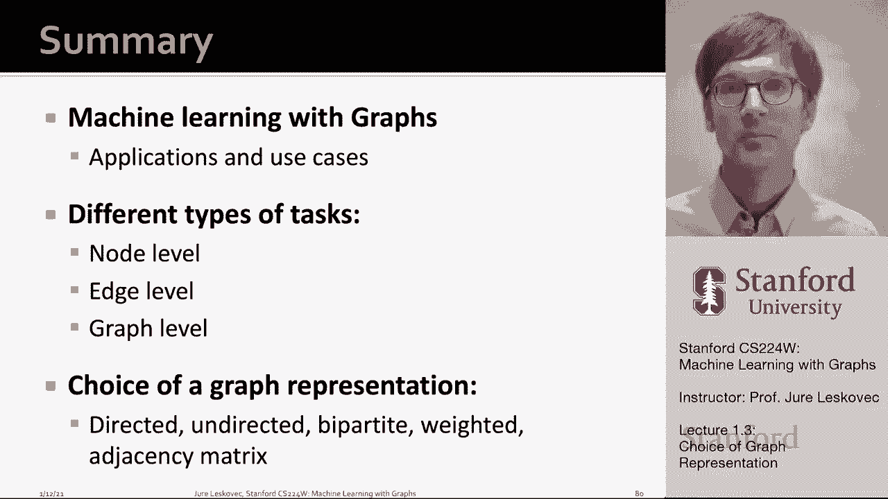

# P3：1.3 - Choice of Graph Representation - 爱可可-爱生活 - BV1RZ4y1c7Co

这一部分呃，斯坦福CS二二四W呃机器学习与图形课程，我想谈谈图形表示的选择。

图或网络的组成部分是什么，所以网络是由两种类型的对象组成的，我们首先有对象或实体本身，叫呃，被称为节点，呃和顶点，然后我们在它们之间有相互作用或边缘，呃叫做链接，或者呃，边，然后整个系统，整个A域。

然后我们叫呃，网络，呃或者图表，通常用于节点，我们就用，呃，呃，这个词，字母大写n或大写v um，然后对于边缘，我们通常使用，呃，字母大写e，这样图G就由一组节点组成，嗯n和一组边缘，呃呃。

图形的重要之处，图是一种通用语言，意思是我可以，比如说，呃，演员，并根据他们出演的电影将他们联系起来，或者我可以根据人们之间的关系，或者我可以拿蛋白质之类的分子，并建立一个基于蛋白质相互作用的网络。

如果我看看这个网络的结构，什么是潜在的数学表示，在所有这些情况下，我们有相同的潜在数学表示，这意味着同样的机器学习算法将能够做出预测，就是这些节点，嗯嗯，与演员相对应，对应于，呃，人。

或者它们对应于蛋白质等分子，当然啦，选择合适的图形表示是非常重要的，例如，如果我们有一组人，我们可以把彼此工作的人联系起来我们将有一个专业的网络，然而，我们也可以把同一组个体，根据性关系将他们联系起来。

但我们会建立一个性网络，或者例如，如果我们有一套科学论文，我们可以根据引文将它们联系起来，论文引用的，还有哪张纸，但例如，如果我们根据他们在标题中是否使用相同的单词来连接他们，的。

潜在网络的质量和潜在的呃表示可能是，呃，更糟的是，所以节点和链接的选择非常重要，所以每当我们得到一个数据集，然后我们需要决定如何设计底层图，感兴趣的对象节点是什么，它们之间会有什么关系，边缘会是什么。

以及这个合适的网络的选择，给定域或给定问题的表示将决定我们使用网络的能力，呃成功，在某些情况下，会有一种独特的明确的方式来表示这一点，嗯问题，这个域作为一个图，而在其他情况下，这种表示绝不是唯一的。

我们在物体之间分配链接的方式将决定问题的性质，我们将能够学习，以及我们能够做出的嗯预测的性质，所以向你们展示一些我们面临的设计选择的例子，当共同创建图形时，我现在将介绍一些概念和不同类型的图形。

呃我们可以我们可以先从数据中创建，我将区分有向图和无向图，对呀，无向图有链接，嗯，这是没有方向的，这意味着它们对于对称建模很有用，嗯和蛋白质之间的相互作用等等，而定向um则由定向链接捕获。

每个环节都有一个方向，具有源和目的地，用箭头表示，现实世界中发生的这种联系的例子是电话，金融交易，呃，在推特上关注，哪里有源头，哪里有目的地，第二种嗯嗯，呃，我们要去的图，然后我们说的是。

因为我们已经创建了无向图，然后我们可以讨论节点度的概念，节点度就是边数，与给定的节点相邻，例如，本例中的节点A具有四次，平均节点度简单地说就是，就是网络中所有节点度数的平均值，如果你解决了这个问题。

原来是两次，边数除以节点数，呃，在网络中，之所以有这个数字二是因为，当我们计算节点的度数时，每条边都被计算两次，边的每个端点计算一次，因为边缘有两个端点，每条边都被计算两次。

这也意味着有一个自我边缘或自我循环，um向节点添加二度，不是节点的一度，因为两个端点都连接到同一个节点上，这适用于有向网络中的无向网络，我们区分，在程度上和外在程度上，度的意义是指向节点的边数，比如说。

节点C的内度数为2，外度数为2，嗯一个，它是从节点向外指向外部的边数，呃，再来一杯，呃，非常流行的图形结构类型，那是用得很多的，在不同的领域是非常自然的，它叫做二部图，二部图是一个图。

一般指两种不同类型的节点，其中节点只与其他类型的节点交互，但不是和对方在一起，例如，二分图是节点可以分成两个分区的图，边缘只从左边开始，呃，到右边的分区，而不是在同一个分区内，呃的例子。

自然出现的二部图是，比如说，呃，与论文相关的科学作者，他们写了，与电影有关的演员，它们出现在与他们评分或观看的电影链接的用户中，嗯，等等，例如，购买产品的顾客，呃也是一个二分图，我们可以有一组客户。

一套产品，我们把客户和产品联系起来，她买的，既然我们已经定义了一个双边网络，我们还可以定义折叠或投影网络的概念，在那里我们可以创造，例如，作者合作网络或电影涂布，呃，网络和想法如下，如果我有一个二分图。

然后我可以把这个二分图投影到左边的任何一个，或者向右边，当我投射它的时候，基本上，我只使用投影图中一侧的节点，我连接节点的方式是说，我将在一对节点之间创建连接，如果他们至少有一个共同的邻居。

所以如果这些是作者，这些是科学论文，然后基本上它说我将创建一个合作或合作作者图，在那里我将连接一对作者，如果他们至少共同撰写了一篇论文，例如，一二三合著了这篇论文，所以它们都是相互联系的，例如。

三和四没有合著一篇论文，所以它们之间没有联系，但是，例如，五号和二号合著了这篇论文，所以它们之间有联系，因为他们合著了这个，呃，这里的这张纸，以类似的方式，您还可以创建这个二部网络的投影到，向右手边。

然后你会得到一个像这样的图表，正如我所说，二部图或多部图，如果你有多种类型的边缘是很受欢迎的，尤其是如果您有两种不同类型的节点，比如，呃，用户和电影，呃，作者和论文，嗯，等等，等等。

关于图的另一个有趣的点是我们如何表示它们，嗯，表示图形是一个有趣的问题，表示图的一种方法是用邻接矩阵表示图，所以本质上如果对于给定的呃无定向，比如说，在本例中，图形在n个节点上，呃，在我们的情况下。

四个，我们将创建一个方阵，其中矩阵将是二进制的，它只接受零和一的条目，本质上是矩阵的一个条目，如果节点i和j连接，ij将被设置为1，如果它们没有连接，它将被设置为零，所以说，比如说，一个和两个是相连的。

所以在入口一行，一列二，有一个，也因为2在第2行与第1行相连，我们还有一个，所以这意味着呃的邻接矩阵，无向图自然对称，如果图形是有向的，那么矩阵就不对称了，因为两个链接到一个，我们这里有一个。

但一个不能链接回两个，所以有一个零，以类似的方式，然后我们可以想到节点度，嗯，呃，简单地作为图的给定行或给定列的求和，呃，邻接矩阵，所以与其在这里思考，有多少边相邻，我们可以直接去，有些基本上算数。

1的数量，此给定节点连接到的其他节点数，嗯，这是针对无向图的，对于有向图，呃，输入和输出度将是列上的和和行上的和，呃，图邻接矩阵的，正如我在这里说明的那样，呃，用这个，嗯，呃，插图。

现实世界网络的一个重要后果是它们非常稀疏，这意味着如果你看邻接矩阵，这是一个真实世界网络的邻接矩阵，基本上每一行，i列j，如果有边缘，我们把一个点，否则单元格为空，你会得到这些类型的超稀疏矩阵。

其中矩阵的大部分是空的，是白色的，嗯，这对这些矩阵的性质有重要的影响，因为它们非常稀疏，可以给你看一个例子，对呀，呃，如果您在n个节点上有一个网络，节点，然后节点的最大度，节点的连接数是n减1。

因为你可以连接到其他人，原则上连接到网络中的每一个其他节点，例如，如果你是人类，你想想人类的社交网络，呃，你可以有最多朋友的最大程度，你可以拥有世界上所有其他人，然而，没有人有70亿朋友，对呀。

我们的友谊要少得多，所以这意味着假设人类的社交网络非常稀疏，事实证明，许多其他不同类型的网络，你知道的，电网，呃，因特网连接，科学合作，电子邮件图表等等都非常稀疏，他们的平均程度是，你知道大约十点。

可能到呃，最多100，所以呃，后果是什么，结果是底层邻接矩阵非常稀疏，所以我们永远不会表示矩阵，作为密集矩阵，但我们总是把它表示为稀疏矩阵，还有另外两种表示图的方法，一种是简单地将其表示为边缘列表。

简单地作为边缘的列表，这是一个很受欢迎的表示，嗯，在深度学习框架中，因为我们可以简单地把它表示为一个二维矩阵，这个表示的问题是，很难进行任何形式的图形操作，或对图形的任何分析。

因为即使计算给定节点的度数也不是微不足道的，在这种情况下，呃好多了，呃，图分析和操作的表示是邻接表的概念，嗯，邻接列表很好，因为它们更容易使用，如果对于大型稀疏网络，和，邻接表。

简单地允许我们快速检索给定节点的所有邻居，所以你可以认为对于每个节点，您只需存储它的邻居列表，因此，给定节点连接到的节点列表，如果图是无向的，你可以储存你的邻居，如果图形是连通的。

你可以储存外出的邻居以及呃，进来的呃，基于边缘方向的邻居，我想在这里提到的最后一件重要的事情是，当然这个图可以有附加的属性，所以节点，边，以及整个图可以有附加到它们的属性或属性，所以说，例如。

边可以有一个重量，这种关系有多牢固，也许它可以有一个排名，它可以有一个类型，它可以有一个标志，这是不是以朋友为基础的关系，还是敌意，敌人的不信任，比如说，基于关系，嗯和边可以有许多不同类型的属性。

就像一个电话，它是它的持续时间，例如，节点可以在，如果这些人，可能是年龄，性别，利益，地点，等等，如果一个节点是A是化学物质，也许是化学的，质量，化学式，和化学物质的其他性质可以表示为节点的属性，当然。

整个图也可以有，或者呃，基于u的属性，图形结构所建模的底层对象的属性，所以说，这意味着我们将要考虑的图不仅仅是拓扑，节点和边，但这也是他们的属性，嗯，正如我提到的。

其中一些性质实际上也可以直接用邻接矩阵表示，所以说，比如说，像权重这样的边的性质可以简单地用邻接矩阵来表示，而不是有邻接矩阵是二进制的，我们现在可以有邻接矩阵来获得实值，其中连接的强度简单地对应于值。

呃，在那个条目中，所以二和四的联系更紧密，所以值是四，当，比如说，1和3通过一个只有5点重量的弱连接连接在一起，嗯，作为一个，嗯，另一件重要的事情是，当我们创建图表时，我们也可以考虑节点具有自循环，嗯。

比如说，这里，节点四有一个自循环，呃，现在节点四的度数等于，呃，三个，嗯，自我，循环只是与条目相对应，在邻接矩阵的对角线上，在某些情况下，我们实际上可以创建一个多图，其中我们允许一对节点之间的多条边。

有时候我们可以，我们可以把多图看作加权图，其中矩阵上的项计算边数，但有时你想单独表示每一条边，因为这些边可能有不同的性质，um和不同的um属性，呃，都是嗯，自循环，以及多图，呃，在自然界中发生得很频繁。

比如说，如果你想想电话交易，一对节点之间可以有多个事务，我们实际上可以把它表示为一个多图，嗯，因为我们有这些图表，我还想谈谈连通性的概念，在某种意义上，图形是连通的还是不连通的，和图是连通的。

如果中的任何对节点，呃，在这个呃，图形可以是，呃，可以通过沿着图形边缘的路径连接，例如，这个特定的图是连接的，而另一个图不连通，它有三个相连的组件，这是一个连接的组件，第二连接组件和第三连接组件。

节点h，它是一个孤立的节点，这就是无向图连通性的概念，嗯和嗯，这个概念中有趣的是，当我们有，比如说，断开连接，看看呃的结构是什么，底层邻接矩阵，我们会有这个块对角线结构，基本上。

如果这是一个由两个分量组成的图，然后我们就会有一个块对角线结构，其中边只在同一um连接组件内的um节点之间，对角线外的部分没有边，这就意味着，红色和蓝色，呃，图的一部分，连通性的概念也推广到有向图。

这里我们讨论的是两种类型的连接，强弱连通性，弱连通有向图只是连通的图，呃在，如果我们忽略边缘的方向，强连通图，嗯，或者图是强连通的，如果对于每对节点，它们之间存在一条有向路径，所以嗯。

这意味着必须存在一个从，例如从节点a到节点b以及从节点b回到呃，节点a，如果图是强连通的，这也意味着我们可以讨论强连通分量的概念，其中强连接组件，呃，图中的节点集，使每个节点，呃。

在该集合中可以通过有向路径相互访问，例如，在这种情况下，这里的节点呃，a，b和c形成强连通分量，因为他们在一个循环中，所以我们可以从任何节点访问，呃，任何其他节点，呃。

这里的例子再次显示了两个强连通分量的有向图，两个循环，三个节点，所以这个，图表示的讨论，嗯那个，以及如何从真实数据中创建图表，嗯，在这个讲座中，我们首先讨论了用图形和各种应用程序和用例进行机器学习。

我们谈到了节点级，边缘级和图级机器学习预测任务，然后我们讨论了用有向无向图表示图的选择，二部图，加权，呃，未加权图，邻接矩阵，以及图论中的一些定义，就像图的连通性，弱连通性，强连通性，以及节点度的概念。

嗯。

