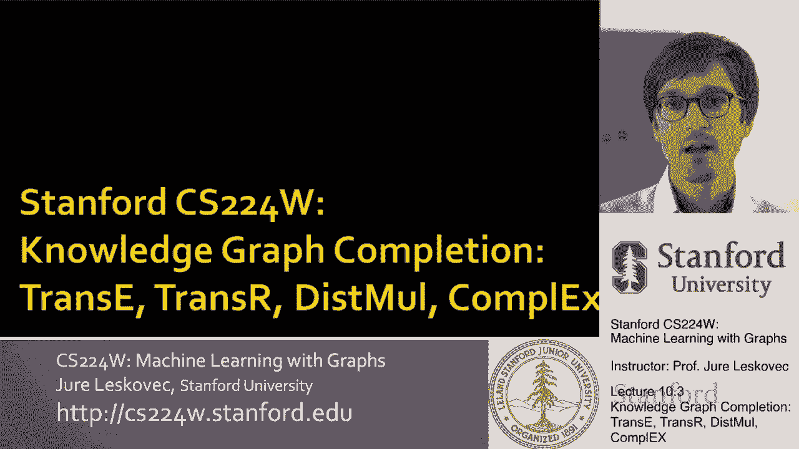
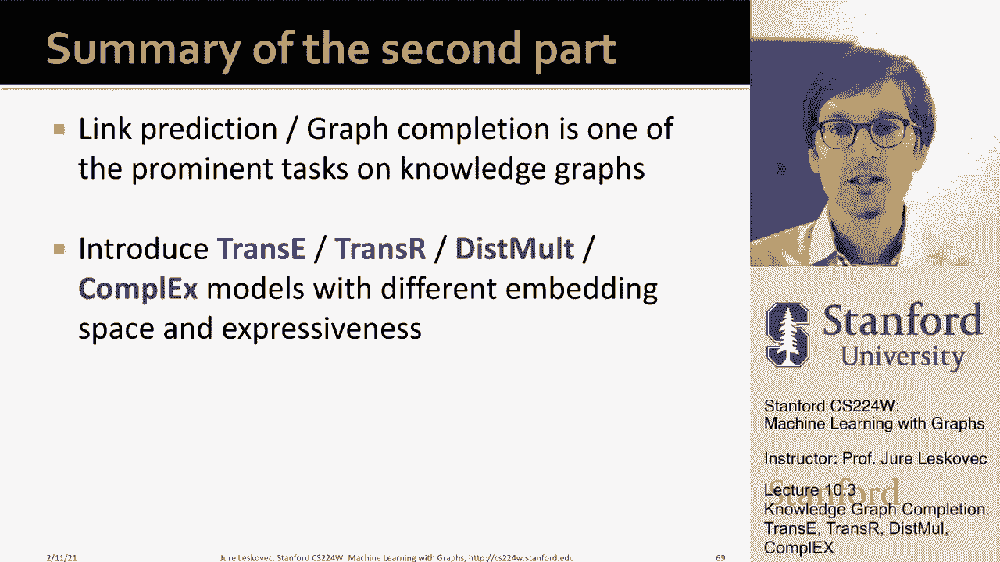

# P30：10.3 - Knowledge Graph Completion - 爱可可-爱生活 - BV1RZ4y1c7Co

 So， let's talk next about knowledge graph completion task and various methods to accomplish knowledge。

 graph completion。 In particular， we'll talk about methods that are- that right now we'll。

 have cryptic names but it will become clear， trans-Z， trans-R， this small and complex。

 So I'll introduce what these methods are and we'll be in particular interested what。

 kind of relationships can this method capture and predict。

 So let's think about knowledge graph completion task where basically we are given an enormous。

 knowledge graph and the question is can we impute， can we predict missing information。

 because the knowledge graph is incomplete。 And the way the knowledge graph completion task。

 works is that we are given the head node， we are given the relation type and we'd like。

 to predict the missing tail。 So notice that this is slightly different from classical link。

 prediction task where nothing is given， we just say predict what links are missing in。

 the entire graph。 Here we would actually say， "Uh-huh， we are interested in this particular， node。

 we are interested in this particular relation type and we want to ask， you know。

 where is this particular author which other， let's say， genres is this author connected， to？

" So for example， JK Rowling， right， the Harry Potter author is connected to， let's， say。

 genre science fiction。 So that would basically be something we would want to predict。

 So what we are given is the head node， we are given the relation type and we want to。

 predict the tail。 The way we are going to do this is we are going to do through the。

 node embeddings， right？ So every node， every entity in the knowledge graph will have an。

 embedding and we are going just to use shallow embeddings。 So basically it means we will。

 want to learn an embedding vector for every entity type in the knowledge graph so that。

 we can then do prediction well。 So the point is we won't be using GNNs， we'll just assume。

 we are doing shallow encodings but you could also use GNNs if you would like。 So knowledge。

 graph representation will be such that knowledge graph is represented as a set of triples head。

 relation tail， right？ So head is the source， relation is the type of a relation and tail。

 is the end point of the relation。 So head could be， you know， I don't know， Barack Obama。

 and relations would be nationality and the tail would be United States。 So the key idea how。

 we want to do this is that we want to model entities and relations as embedding points。

 and vectors in the embedding space。 And we want to associate entities and relations with。

 shallow embeddings as I mentioned。 So we are not using GNNs just for simplicity to keep。

 our life simple。 And then the idea is that given a true triple head relation tail， the。

 goal is that the embedding of head comma relation should be close to the embedding of the tail。

 So I know this is a bit abstract right now。 So let me give you explanations how can we。

 embed head comma relation and how do we define this closeness that the embedding of head。

 comma relation should be close to the tail。 And really all different methods will talk。

 about differ how this closeness and how this embedding is produced。 The simplest idea and。

 kind of the most natural one is called trans-Z。 And trans-Z basically has this intuition of。

 translation。 Where basically the idea is that for a triple head relation tail， we want to。

 learn the embedding of the head， we want to learn the embedding of the tail and we want。

 to learn also the embedding vector R。 And the idea would be that we want to find these。

 embeddings in such a way that head plus the plus vector R gives me the point where the。

 T is embedded。 Right？ So for example， if Barack Obama nationality United States， then I want。

 I want them to be embedded in such a way that if I start with the head， with I start with。

 Barack Obama， I move according to this relation vector R， I would end at the point where United。

 States is embedded。 And of course， I don't want this to only work for let's say Barack， Obama。

 I like this to work to be true for any person and their country of birth。 Right？ So for example。

 if in this graph， I know it would be myself here as well， maybe on a point， here。

 then if I would move according to this vector R here， I'm from Slovenia， so my nationality。

 should be Slovenian， so the country of Slovenia should be mapped somewhere here。 Right？ Basically。

 I would apply the same translation and hopefully the country that is embedded close to that。

 point is the country of my nationality。 Right？ So here is the idea。 So the scoring function。

 that would measure proximity between the head and tail would simply be head plus this vector。

 R minus the tail。 Right？ It basically says what is the distance between H plus R and the， point T。

 And here I could use let's say Euclidean distance if I would like。 So this is what is， trans Z。

 Basically， wants to learn these translations in the embedding space so that you can get from。

 head according to a translation that is the relation specific to the tail of that relation。

 I won't go into details basically of the learning algorithm， but essentially the idea。

 is that you want to have entities and relations that are first initialized uniformly。 Right？

 You want an embedding for an entity。 You want to learn the translation vector for a relation。

 These are all the parameters of your model。 You would sample a positive example， a positive。

 triplet。 You would for example sample what is called a corrupted triplet where you would。

 have the head， the relation the same， but you would pick kind of a random tail。 You would。

 pick a country that is not the true country of nationality。 And then you would say let。

 me try to find the embeddings， the values for head， the relation and tail， such a distance。

 between the real tail and the corrupted tail， the real tail and the embedding of H plus。

 R is smaller than the distance between the H plus R and the corrupted tail， which basically。

 means a country that is not the true nationality。 And you can basically do the learning。 So now。

 that we have done this， this sounds like a great very natural idea。 What is cool about。

 it is that now we don't only think of the embeddings as points in the space， but we。

 also learn this vector R that allows us to move or translate between different points。

 It allows us to move in a given direction。 And of course the question is what kind of。

 relationships is this type of approach able to learn。 And when I say what kind of relationships。

 I really mean relationships with different properties。 For example， some properties might。

 be symmetric or reciprocal。 If person one is a roommate of person two， then person two。

 is also a roommate of person one。 It's mutual。 For example， then there might be relations。

 that are called inverse。 If I am someone's advisor， then that other person is my advisor。

 So advisor and advisor are kind of inverse relations。 Whoever is in relation of advisor， in one way。

 advisor is in the other direction。 So the question then becomes， can we categorize。

 this type of relation patterns or relation properties？ And are these knowledge graph。

 embedding methods like the trans-Z that I discussed？ Are they expressive enough to model。

 these patterns？ So the relation patterns we are going to discuss are four。 First is symmetric。

 and anti-symmetric relations。 Like family， roommate are what we call symmetric because。

 they are reciprocal。 If I'm your roommate， you are also my roommate， it cannot be only， one way。

 Anti-symmetric would be part of hyper-meme， hyponem。 So it's basically one。

 is with relation with the other， but not the other way。 Inverse relations would be like， advisor。

 advicey， where if I'm related to you with one relation， you are automatically。

 related to me with a different relation， then it would be transitive relations。 For example。

 friend off， which would be if x is friend with y and y is friend with z， then x and z。

 are also friends。 So this would be one way of having the notion of transitive relations。

 or if you think about relationship type transitive， those are also transitive。 That， for example。

 I say my mother's husband is my father。 So that's also saying， "If you start with me。

 and you transform according to the mother relation， and then you take the mother point。

 and transform according to the husband relation， you should arrive to the same place if you。

 take myself and transform me according to the father relation。 The two embeddings should， meet。

" And then another important thing is that there are one-to-end relations。 For example， student off。

 I can have multiple students or I can have multiple advisees， so I can have， one-to-end relations。

 So these are different relation patterns we are going to consider。

 And what we are going to do next is we are going to look whether trans Z is able to capture。

 this type of relations。 So for example， let's first talk about anti-symmetric relations。

 What we this mean is H is related with T。 T cannot be related with H according to the。

 same relation。 Part of hyperim is an example。 And trans Z captures this， because if I go。

 from head according to the relation vector R， I arrive to the tail， but now if I'm at。

 the tail and again apply this relation transformation R， I don't get back to H。 I get to some other。

 point。 So this means that trans Z naturally capture this anti-symmetry of relations that。

 have this property。 Another question is can trans Z capture inverse relations like advisor。

 and vice-year？ So if H and T are related by R2， then there is some other R1 that makes。

 tail and the head related。 Can we model inverse relations？ Yes， we can simply the R2， the vector。

 R2， should simply be the negative of the vector R1。 So it means that from head according to， R1。

 I move to tail。 Then if I want to move from tail back to head， I just move in the。

 opposite direction。 So in trans Z， this is naturally captured， naturally doable， so inverse。

 relationships are possible。 How about composite or transitive relations？ Where I say if X and。

 Y are related and Y and Z are related， then X and Z should be related as well。 So in trans Z。

 you can simply do this by saying R3 is simply a summation of R1 and R2。 So if I go from X。

 via R1 to Y and then I go from Y via R2 to Z， then I can basically simply go from X to Z。

 according to R3。 And R3 is simply the vector R1 plus vector R2。 So again， we can do composite。

 relationships with trans Z easily。 So how about some relationships types that are that trans。

 Z cannot capture？ So for example， interestingly， trans Z cannot capture symmetric relationships。

 relationships where it's like family or roommate that are reciprocated。 Basically saying if H。

 is related with R2T， then T should be related to H with R as well。 And the point is this。

 if you go from H according to R2T， then what you'd like to do is apply the same R2T as。

 well and get back to H。 And the only way you are able to do this is to make R2B0， which。

 basically means that H and T are embedded on top of each other。 But that is not good because。

 H and T are different entities。 They are distinct entities with distinct properties。 So this。

 means that trans Z cannot embed and cannot do this kind of symmetric reasoning or it cannot。

 model symmetric relations。 And then another part that trans Z cannot do is 1 to N relations。

 The idea is that if I have a head and a relation and maybe this is a 1 to N relation。

 then basically， I want to go from head according to relation R to T1。

 And I also want to be able to go from， head according to relation 1 to T2。

 Both exist in the knowledge graph。 For example， student off。

 I can be a mentor or I can have two students simultaneously。 And again， trans。

 Z cannot model this type of relations。 Because again， the only way for this to work would。

 be that T1 and T2 map into the same vector。 They map into the same point in the embedding， space。

 So that when you go from H according to R， you arrive to the same point。 But again。

 this is not good because this would mean that T1 and T2 are the entities embedded in the。

 same point。 So they are indistinguishable from one another。 But in reality， T1 and T2 are。

 completely different entities。 So this is what trans Z cannot model。 So let's look at。

 a different method called trans R that will allow us to fix some of these issues。 So what。

 we have seen so far is that trans Z models translation of any relation in the same embedding， space。

 So the question is， can you design a new space for each relation and do the translation。

 in a relation specific space。 And the method that has proposed this idea is called trans。

 Z R and it models entities as vectors in the entity space。 So entities as points and models。

 each relation as a vector in the relation space together with a relation specific transformation。

 or projection matrix。 So let me give you the idea of how this works。 So the idea is， as， I said。

 trans R models entities as points。 And for every relation， we are actually going。

 to learn two things。 We are going to learn the translation relation vector and we are。

 going also to learn this projection matrix M for every relation。 So the idea is， right。

 if I want to what the way I'm going to now predict relations， if I say our H and T related。

 by relation R， I'm first going to apply matrix M to both points and basically transform them。

 into a new space。 And then in this new transform space， I'm going to kind of apply the trans。

 E intuition。 So basically， I'm going to use this vector to move around。 So， right， I basically。

 take the original embedding， I transform it according to the matrix M， which basically。

 means I scale it， I rotate it， I translate it， and then I apply my vector R in there。 So， you know。

 what will this buy me？ For example， what this buys me is that it allows me to model。

 symmetric relations， because imagine again， a symmetric relation like roommate reciprocated， right？

 Then basically， I can learn a roommate specific function， specific projection matrix。

 M that will take two different points and map them into the same underlying point， into the。

 relation specific space。 So it means that two people that are roommates will be able to be。

 mapped into the same point， so that now here I'll be able basically to say no translation， needed。

 R is zero， and I'm have this symmetric relationship right now。 So this is what this。

 allows us to do， which for example， trans Z was not able to do。 How about anti-symmetric， relations？

 Again， we can easily do this， right？ Because for example， the translation matrix， can。

 if I take two different points， the translation matrix can again transfer into this relation。

 specific space in such a way that the two points don't collide， and then the same way。

 as in trans Z， we are able to do the same thing here， right？ From head according to the relation。

 I get to T， but from T according to the relation I don't get back to head。 So this is also possible。

 So it can model both symmetric as well as anti-symmetric relations。

 Can this trans R also model 1 to， N relations， right？ Like student off。

 And actually again it turns out it can。 Trans R can model， this。

 because again we have enough flexibility in the projection matrix R that can learn how。

 to take let's say T1 and T2 and map them into the same point， so that when in this relation。

 specific space I go from head according to the relation I arrive exactly to T1 and T2。

 that are embedded to the same position。 So in the original embedding these are two different。

 points， but in the let's say the relation specific embedding that is achieved by this transformation。

 matrix M， I can enforce T1 and T2 to be in the same point。 So this 1 to N relations can。

 naturally be captured。 So this sounds great， right？ It seems we have kind of fixed all the。

 issues with trans Z。 We can also do inverse relations because the same as we were able。

 to do them in trans Z we can do them in trans R， right？ So basically we just the transformation。

 matrices for both relations have to be the same and then you know one translation vector。

 is the reciprocal or the inverse of the other translation vector。 What is the issue？

 What does trans R， what is it not able to do that trans E was able。

 to do is one thing is composition relations， right？ In trans R you cannot do this type of。

 composition of relations， right？ Meaning remember where you say， "If x is related by y with R1。

 and y is related with Z with R2， then x and Z are related by R3。" This was very easy。

 to do in trans Z because everything was in the same space and we just kind of moved around。

 But in trans R we cannot do this composition relations。 And the reason for this is that。

 each relation has a different space and we know how to model from the original space。

 to the relation specific space but we don't know how to model between different relation。

 specific spaces。 So these relation specific spaces are not naturally compositional。 So。

 this means that composition relations trans R cannot do。 So this was second method we discussed。

 So let's now talk about the third method as well that is based on what is called bilinear， modeling。

 And so far， right？ We were using the scoring function simply as a distance in， the embedding space。

 Like in trans Z and trans R we said the head plus relation should be， close to the tail。

 But now what if we change the embedding the way we are scoring different， relations？

 What if we change this function n， l， f？ That it won't be a distance anymore。

 but something more interesting。 So for example， this mult is simply saying let's embed entities。

 and relations as vectors in the embedding space。 Kind of similar to trans Z but let's use a。

 different scoring function rather than using the distance as in trans Z。 Let's use this。

 type of scoring function where we basically just have this bilinear model where we say。

 the score is simply coordinate wise product of H R and T。 Right？ So the idea is if I have。

 a H R and T I simply multiply these things entry by entry， sum it up and that is my score。

 And the idea is if head relation tail is true then the score should be high and otherwise。

 this score should be low。 The way you can think of this scoring function is that you。

 can think of it as a hyperplane in the embedding space。 So basically the way you can think of。

 it is you can think of it as a cosine similarity between H times R and T。 And cosine similarity。

 is simply a cosine of the angle between two vectors。 And what this means is that if the。

 two vectors are orthogonal then the cosine similarity will be zero and if two vectors。

 are completely aligned the cosine similarity will be one。 Another thing that is important。

 is that because this now defines like a hyperplane in the embedding space this dot product can。

 either be positive or it could be negative。 And whether it's positive or negative this。

 tells me whether the point lies on the left hand side or whether it lies on the right。

 hand side of the hyperplane。 And hyperplane is really defined as a vector that is orthogonal。

 to this hyperplane and this vector is simply H times R。 So basically H times R defines。

 a hyperplane that is orthogonal to it and then the tails that are related to H according to。

 relation are should fall on the same side of the hyperplane as this normal vector is and。

 tails that are not related to it should fall on the other side of the hyperplane。 So that's。

 the intuition and the idea how this this mode works。 So can it do one to end relations？ Yes it can。

 The reason the reason for this is because we can think again of a hyperplane。

 and if I have one to end relations then T1 and T2 should fall on the same side or should fall。

 on the same distance on or from the hyperplane and that's easy to achieve。 In terms of symmetric。

 relations again we can naturally model this because multiplication is commutative right so we can。

 flip the order in which we multiply things and we'll get the same value。 So because summation。

 and multiplication are commutative this is naturally true。 However the limitations are。

 anti-symmetric relations right like a hyperplane part of where and the idea here is that this。

 cannot model anti-symmetric relations。 Again because of the commutativity of summation and product。

 it means you get symmetry but you don't get anti-symmetry right。

 H times r times T will always be the same， as a T times r times h and that's the issue。

 So this mode cannot do that and then the other thing。

 this mode cannot do is modeling inverse relations right。 If H and T are related with r2 then they。

 should also be related in the different direction with r1 like advisor-adwazi type relation。

 And the， reason this mode cannot model this is because of the fact that it does not model inverse relations。

 or the only way to model inverse relation would be that r2 and r1 are equal。 But。

 semantically this does not make sense because then the embedding of the relation advisor is the same as。

 the embedding of the relation advisee。 So basically this would mean that if I'm your advisor you are。

 my advisee but at the same time if I say are you my advisor as well the answer would be s and am I。

 your advisee the answer would be s as well。 So it would be like two symmetric relations rather than。

 a inverse relation。 So this is where this mult fails。

 And then the last place where this mult fails is， composition relations right and the problem is that this mult defines hyperplane for each head relation。

 pair and the union of hyperplanes induced by this by this composition of relations cannot be。

 expressed by a single hyperplane。 So kind of you know a union or an intersection of hyperplanes。

 is not a hyperplane anymore。 So that's why that's the intuition why composition relations are also not。

 possible。 So the last method I want to talk to you about is called complex。 And the idea here。

 and the reason why I want to do this is that we don't necessarily have to embed points into the。

 simple Euclidean you know a real space。 We can also have complex vector embeddings we can embed。

 them in complex spaces right。 So a complex embeds entities using in the complex vector space right。

 where every every point now has two has a imaginary part and a real part。

 And one concept from complex， algebra that is important to keep in mind is this concept of complex conjugate where basically say。

 if u is a complex number with real part a and imaginary part b then a complex conjugate of it。

 is simply that it's not plus b times i but is minus b times i。

 And this notion of complex conjugate will， be important as we analyze this model。

 So the way you can now think of this is that in complex we can。

 actually use the scoring function that is simply similar to the to the complex to the scoring function。

 in this mode but we are only then taking the real part of the of the complex function because this is。

 this would give me a complex number so I want to only take the real part of it。 So let's quickly。

 analyze this approach as well。 So can it model anti-symmetric relations？ Yes it can。

 The way the way we， can do this is that basically we can achieve that for different relations we get basically high or。

 low value of our scoring function basically due to the asymmetric modeling of complex conjugates。

 because here we are using the complex conjugate。 Can we model symmetric relations again？ Yes we can。

 because we can simply set the imaginary part of the relation to b0 and then because everything works。

 in the real part we are able to model symmetric relations as well。 And then you know can we can。

 complex model symmetric inverse relations as well？ Yes it can。 How by setting r2 to be a complex。

 conjugate of r1 and this basically means that the real part of the two will be exactly the same because。

 what differs is only the complex part。 So that is in terms of modeling inverse relations。

 How about composition and 1 to n relations？ Because complex shares this property with this。

 molt meaning it uses the same scoring function then it turns out that complex also cannot model。

 composition relations as well as 1 to n relations because it uses kind of a very similar scoring。

 function。 So this basically now concludes our discussion of different knowledge graph embedding。

 methods for knowledge graph completion。 We went through four of them。 We went through trans-z。

 trans-r， this molt and complex。 And what is interesting is that each of these methods has a bit different。

 idea。 The two first two methods embed into the real space so into the Euclidean space。

 But one uses the translation idea for every relation while trans-r also uses this transformation matrix。

 m。 And here I show different properties or different relation types that these methods can model。

 Trans-e is the only one that can model composite relations where they can be composed。 This molt。

 changes the scoring function and complex actually embeds not into the Euclidean space but in the。

 complex space。 And the reason why I wanted to show you these different methods is to see kind of the。

 diversity of options that embeddings allow you to work with and give you a lot of freedom how。

 you define your predictive model。 So how do you do now knowledge graph embeddings in practice？

 Different knowledge graphs may have drastically different relational patterns and different properties。

 So it is not that there is one method that works best on all of them。

 It really depends on what kind， of relationship types you are interested in modeling and what kind of relations do you want to predict。

 If you really want to predict one to end relations and model one to end relations then don't use。

 trans-e。 If you really care about composite relations and these kind of compositions then use for example。

 trans-e。 If what you care about for example would be anti-symmetric relations don't use this small。

 and so on。 So it really depends on the graph and what you want to do。 In general you know trans-r。

 and complex have the most kind of are able to model the most diverse set of different relation types。

 So what you can always try is try with trans-e because it's very simple and has a very nice intuition。

 and then you can use more expressive model like complex trans-e。 There is also an ocean， a model。

 called rotate e which is trans-e but with complex embeddings。

 So there is a lot of different approaches， and different ideas here。

 There is a paper linked up here that serves as a very good follow-up reading。

 if you are interested in this topic。 So to summarize we talked about the knowledge graph。

 embedding a knowledge graph completion task as one of the very important tasking knowledge graphs。

 and we talked about four different methods trans-e， trans-r， this smooth and complex models。

 with different embedding space and with different type level of expressivity allowing us to model。

 different types of relationships。 [BLANK_AUDIO]。

