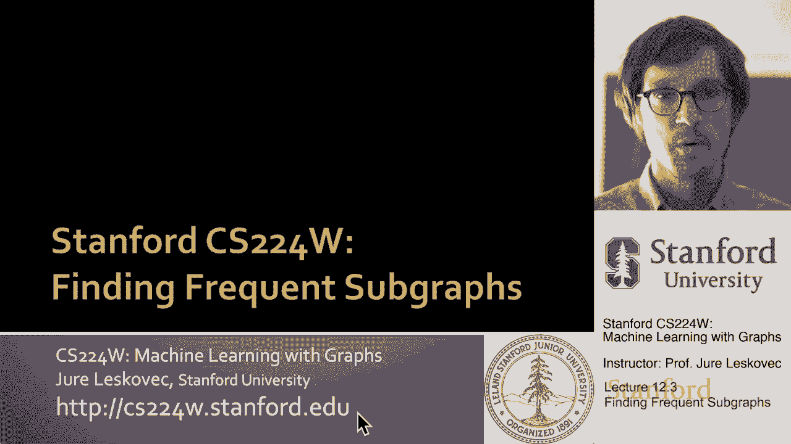
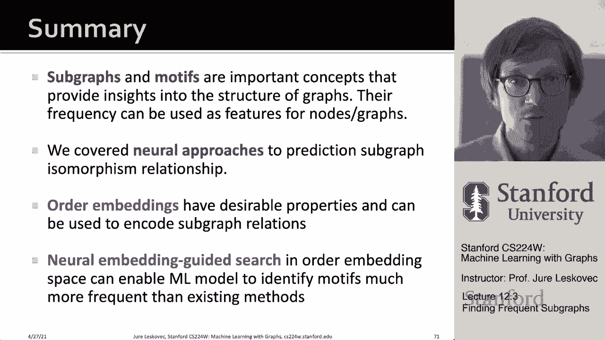

# P36：12.3 - Finding Frequent Subgraphs - 爱可可-爱生活 - BV1RZ4y1c7Co

 So far we have been talking about the problem where we are given a query graph and we want。

 to predict or identify whether a given query graph is a subgraph in a larger target graph。

 Now we are going to generalize this approach we just talked about to the problem of finding。

 frequent subgraphs。 So let me tell you what this problem is。 What we would like to do。

 is to talk about frequent subgraph mining。 So first we discussed in the previous lecture。

 about subgraphs and motifs and we defined them and then we talked about the problem of。

 neural subgraph representation and be able to quickly say whether a given query graph。

 is a subgraph in a bigger target graph。 Now we are going to further expand this to frequent。

 subgraph mining。 So here is the problem。 The idea is that given a large graph we would。

 like to identify what are the building blocks， what are the frequently occurring subgraphs。

 that are part of this bigger target graph。 And if you and this is called the frequent。

 subgraph mining where basically we want to identify this frequently occurring building。

 blocks of a big graph。 And generally using kind of combinatorial approaches the way you。

 would approach this problem is that by finding the most frequent size case subgraphs requires。

 solving two challenges。 First is that we want to enumerate or consider all size-cate connected。

 subgraphs。 And then each of these connected subgraphs of size-cate acts like a query which。

 we then want to identify in the target graph to count its occurrence。 So basically this。

 means that in order to identify frequent subgraphs of a given size we first have to identify。

 what is the universe of subgraphs of a given size and then for each of these subgraphs find。

 its frequency in the given target graph。 So this is how traditional approaches to this， would work。

 So for example if I'm interested in connected subgraphs undirected of size-3。

 then there are two possible such subgraphs that are shown here。 I generated them so this。

 is step one and then for each of them I would want to ask what is the frequency of them。

 in the larger target graph。 And here basically I would need to count them。 So for example。

 for this let's say motif subgraphs of size-3 here these different green polygons show the。

 instances of this given motif so its frequency equals to 3。 So this is a hard combinatorial。

 problem because just knowing if a certain subgraph exists in a given larger graph is a hard。

 computational problem。 This is essentially a subgraph isomorphism problem。 The frequent。

 subgraph counting is even bigger its kind of even a harder problem because first we want。

 to know the frequency of a given subgraph and then we want to find the subgraphs that are。

 the most frequent out of all possible subgraphs of a given size。 So because the number of。

 subgraphs of a given size increases super exponentially you are basically battling two。

 exponential algorithms。 First is the counting and the second one is the number of possible。

 things you have to count。 We saw how the number of motifs or how the number of subgraphs increases。

 super exponentially with their size。 So traditional combinatorial approaches can only handle subgraphs。

 between size let's say 3 to 5， 6 maybe 7 because the number of them increases so drastically。

 and then just counting each one of them to determine their frequency is computationally。

 expensive as well。 So what we are going to do in this lecture is we are going to talk。

 about how can we use representation learning and graph neural networks to solve this hard。

 combinatorial problem。 As I said finding frequent subgraphs is computationally hard because there。

 are two problems that are both exponential。 First is you get a combinatorial explosion。

 in the number of possible patterns possible subgraphs of a given size and then given one。

 of these possible subgraphs you have to count it you have to find its frequency in the big。

 target graph so that then you can say here are the let's say 10 most frequent when you。

 kind of sort them by the decreasing frequency。 So both of these by themselves are hard。 So。

 we are going to elegantly kind of sidestep this hard combinatorial problems by using representation。

 learning and show how we can tackle these challenges。 The combinatorial explosion will。

 be of possible subgraphs will be will be tamed by organizing the search space cleverly and。

 then the problem of subgraph isomorphism and subgraph counting will be tackled by graph。

 neural networks。 So let me give you a bit more details about how we are going to do this。

 So for counting we are actually using the graph neural network to predict a frequency。

 of a given subgraph。 So basically what we are going to do is we are going to take a big target。

 graph and embed it and then when a small query graph comes we are going to predict its frequency。

 So that rather than directly counting it we are just going to predict its frequency。 So。

 that would be the first innovation and then the second innovation then now rather than。

 predicting the frequency of all size scale let's say case 51020 connected subgraphs because。

 there is super exponentially many of them。 We are actually going to develop a search procedure。

 that will start with a small subgraph and kind of grow it node by node until it reaches desirable。

 size and this way we will also try to grow it in such a way that its frequency will be， high。

 The important point here is because we are talking about frequent subgraph mining we are。

 only interested in the most frequent subgraphs in the most frequent motifs and not the frequency。

 of all the motifs。 So that's why this search procedure will be useful。 So let's look into。

 this problem more。 Let's try to understand it better。 So the problem setup for the frequent。

 motif mining is the following。 We are given a large target graph G sub t and a subgraph size。

 parameter K as well as the number of desired results R and the goal is to identify among。

 all possible graphs on K node R of them that have the highest frequency in G sub t。 So I。

 want to find R most frequent subgraphs on K nodes in a given target graph G sub t。 And。

 here for the frequency definition we are going to use what we call the node level frequency。

 definition where this is the number of nodes U in target graph G sub t for which some subgraph。

 of G sub t is isomorphic to our query and the isomorphism maps no due to node V。 And。

 perhaps the best way to understand this is imagine I have my target graph。 It's kind。

 of a star with 100 spokes and imagine I have a query graph that is a star on six spokes。

 And imagine that I say this is the anchor I care about。 Then the frequency of this given。

 query in the target graph will be exactly one because the anchor is going to map to the。

 center node and that's the only way how to map this query graph to the target graph while。

 also mapping the anchor node to one of the nodes in the target graph。 So rather here having。

 G sub q frequency of 100 to 6 it will have just frequency of 1 because there is only one。

 way to map this anchor node to the underlying G sub t。 So this frequency definition is more。

 robust to this kind of combinatorial explosion when you can like I try to illustrate here。

 So that's the frequency definition we care about。 So now the method we'll talk about。

 is SP minor and it's a neural network model to identify frequent motives。 And the way。

 this is going to work is the following。 We are going to give an input graph G sub t and we。

 are going to decompose it into node anchored neighborhoods。 And then we are going to use。

 a graph neural network to embed each of these neighborhoods。 And this is exactly what we。

 have been talking in lecture 12。2。 Where we talked about how do you basically take the。

 graph decompose it into node overlapping node anchor neighborhoods and then use the， encoder。

 use the graph neural network to basically embed every dot here is a different。

 neighborhood and you embed it in the embedding space。 So this will be the encoder part。 What。

 is new in this part of the lecture is the last part where we will have what we call a。

 search procedure to find frequent subgraphs by growing our motif。 So we are going to。

 start with a trivial motif of two nodes and an edge。 And then we are going to iteratively。

 grow it while trying to preserve its frequency。 We are going to say how do I grow this motif。

 so that its frequency remains high。 And when I reach the desired size of the motif， the， size k。

 I'm going to stop and say here is the motif this is its predicted frequency。

 So the point is that we rather than trying out let's say all possible graphs on 10 nodes。

 we are going to grow a graph on 10 nodes iteratively while trying to maximize its frequency。 That。

 is the idea this is the overview。 So now let's dive deeper into this lecture。 So the key idea。

 of SP minor is to decompose the input graph GT into a lot of small neighborhoods。 And。

 we are going to embed these neighborhoods into an order embedding space。 And the key benefit。

 of order embedding space will be that we'll be able to quickly predict the frequency of。

 a given subgraph G sub q。 So essentially rather than taking G sub q and trying to match it。

 in many different places in the G sub t， we are just going to encode a G sub q and then。

 predict its frequency in the G sub t。 That's the kind of the idea is that we have a very。

 fast frequency predictor that we'll use graph neural networks。 So here is how we are going。

 to do this frequency prediction。 So the idea is that we take a set of subgraphs。 These are。

 our node encored neighborhoods G sub n of big target graph G sub t。 And the idea will。

 be that we are going to estimate now the frequency of a given subgraph a given target graph G sub。

 q by counting the number of neighborhoods such that their embedding satisfies the order embedding。

 property。 So basically we are going to say for a given graph G sub q， we are going to。

 embed it into some point in the embedding space。 And we are going to ask how many neighborhoods。

 of G sub t are to the upper right of it。 Basically with this notation I try to say how many。

 neighborhoods and subi are there whose individual coordinates are all greater than the embedding。

 coordinates of my query graph q。 And this is exactly a consequence of order embedding。

 space property that we have discussed。 So intuitively when my G sub q arrives I'm going。

 to embed it and I'm going to say its frequency is simply the number of node anchor neighborhoods。

 that are embedded into the top right of it。 So number of node anchor neighborhoods whose。

 embedding coordinates are greater than the embedding coordinates of my query point。 So。

 this means that basically there is this what we call a super graph region where basically。

 all the points all the neighborhoods in the red shaded region corresponds to neighborhoods。

 in G sub t that contain G sub q as a subgraph。 So basically this will be now our frequency。

 estimation。 And the benefit will be that now we have a super fast subgraph count subgraph。

 counting frequency estimation method because when a new motif arrives we just embed it。

 and then determine how many points fall to the top right of it and this can be done super， fast。

 So now that we know how to estimate the frequency now let's talk about the search。

 procedure that is actually going to find the motif。 So the way we are going to do this。

 is the following。 We are going to randomly pick a starting node u in the target graph， G sub t。

 And then we are going to basically expand the neighborhood around this target。

 node u in the G sub t to get the query graph and we are going to use the graph neural network。

 to estimate its frequency and we are going to grow it in G sub t while trying to keep。

 frequency as high as possible。 And the way you can think of this is that we are going。

 to start with an individual node u and you know it's embedding will be somewhere all。

 the way to the lower left because an individual node is a subgraph of all neighborhoods right。

 because neighborhoods are composed of nodes。 So this individual node is a subgraph in all。

 neighborhoods right。 So here the point is that each dot here represents a neighborhood in。

 the target graph that contains the motif pattern right and whatever is in the red shade say。

 the trigents these are the neighborhoods that contain that motif。 And of course initially。

 all all neighborhoods contain the motif because the motif is a single node。 So now that we。

 have a partially built motif S we want to grow it until it reaches size k such that its frequency。

 of this size k motif will be as large as possible。 So the way we are going to do this is we are。

 going to do it through a iterative procedure that is growing going to grow the motif iteratively。

 meaning node by node edge by edge by basically traversing the neighborhood of this chosen。

 node u in G sub t and adding neighbors neighbors of that node and neighbors of neighbors to。

 S and at the same time we are going to use the order embedding space to now take S and。

 embed it and ask what is the frequency of that bigger subgraph right。 So the way you can think。

 of it is we are going to start with a individual node and we are going now to say individual。

 node and that's our S and then we are going to add one neighbor of it to S so now S will。

 be bigger and for every possible way to add this new node or this to the S we are going。

 to ask what is the best node to add to the S so that the frequency remains as high as。

 possible and we can use this kind of greedy search procedure that is going to grow our。

 motif node by node until it reaches the desirable size and now of course what we need to decide。

 is how do we decide what node to include next right how do we how precisely do we grow this。

 underlying motif node by node and the way we are going to do this is that we are going。

 to grow it with the goal to maximize the number of neighborhoods that are in the red shaded。

 region after the case steps right so basically in the end we want to reach out some point。

 which describes a graph of a given size k such that the number of neighborhoods that are。

 to the top right of it meaning that are in this red shaded regions is as high as possible。

 because whatever are the neighborhoods to the top right of it these are the neighborhoods。

 that our red dot is a sub graph of that's the order embedding property that you know。

 we have worked so hard to establish in the previous lecture so that's the idea so right。

 and we'll be growing this motif node by node until it reaches the desired motif size until。

 it reaches size k and then we are going to terminate and what we are going to return we。

 are going to return whatever is the motif we terminated and we are going to return its。

 predicted frequency which is the number of neighborhoods in this red shaded region。

 The reason why we are and just kind of notice that we are only interested in the sub graphs。

 motifs that have high frequencies so as we are building it we are kind of greedily deciding。

 how to grow that motif so that its frequency will remain high。

 So to now answer the most important question which is how do I decide which node to pick。

 and add to my current sub graph motif S and the way we are going to do this is we are。

 going to define the notion of total violation of a sub graph let's call it G which is the。

 number of neighborhoods that do not contain this sub graph G。 So this is the number of。

 neighborhoods that do not satisfy my order embedding property which basically it would。

 be the number of neighborhoods where at least one of the coordinates in the embedding space。

 of the neighborhood is less than the embedding coordinate of my graph G。 So this is the same。

 thing G is this Q。 And this means that basically minimizing the total violation means maximizing。

 the frequency and you can then use many different search heuristics but one possible search heuristic。

 is greedy right basically at every step you want to add a node to the sub graph S that。

 results in the smallest total violation basically you want to add a node that will keep the。

 number of neighborhoods to the top right of that sub graph S to be as high as possible。

 And you can think of this right we started one node we had the second node we had the。

 third one we had the fourth one and you are kind of dancing as you are building the motif。

 you are kind of moving up and the goal is to reach a motif of a given size that has the。

 largest number of neighborhoods in the red shaded region so in the region that is up and。

 above from it。 And that's essentially the idea。 I can show you some experimental results to。

 show that this really works quite remarkably well where for example we can say let the ground。

 truth be the most frequent top 10 most frequent motifs in a given target graph。 And you know。

 we are going to do this for motifs of size 5 and 6 because this is what kind of this brute。

 force exact enumeration counting is able to do in a couple of days right。 So then we can。

 ask you know is how what are the frequency of the top 10 most frequent motifs that this。

 search procedure is able to identify where basically we pick a random node u in the target。

 graph G we kind of grow the motif around it and at the same time as we are kind of growing。

 that motif we ask what is its frequency as predicted with the order embedding space。

 And then this graph tries to illustrate this these are the top 10 most frequent motifs just。

 rank ordered and the y axis is their frequency。 And exact is the ground truth right。 So this。

 will be the frequency of the most frequent motif the second most frequent third most frequent。

 fourth fifth all the way down to tenth。 Now what we also did in our case is we use this。

 neural network order embedding space based method to identify top 10 most frequent motifs。

 that it finds and let's compare their frequency to the ground to the exact counting finds。

 And of course the frequencies drop as the rank of the motif gets higher that's okay。

 But you notice for example that sp minor is basically able to identify the top in this。

 case top eight motifs perfectly out of the top 10 and then the other two are you know。

 their frequency are just a bit lower。 So this one these two were not exactly identified。

 so their frequencies are lower。 Here is top eight are perfectly identified here for size。

 six is actually top nine that are perfectly identified。 And you know these are some traditional。

 approximate searching methods you see that they fail much much much worse and you know。

 perhaps if the if the M finder method finds the top tenth the the motif at rank 10 its。

 frequency is only you know five raised to the times 10 1000 our sp minor is able to find。

 the tenth motif that has the frequency of around let's say 15000 right so much much more accurate。

 So this is for small motifs you can also do this for very large motifs because the search。

 procedure is very cheap。 So you know you can identify large motifs for example you know。

 motifs of size 14 17 20 that still have very high frequencies and you can do this in two。

 different real world networks and really find large motifs with high frequencies computationally。

 very very cheaply and the motifs you find tend to be much much more frequent than what kind。

 of random search traditional kind of heuristic based baselines can do。 So to summarize this。

 lecture here we talked about subgraphs and motifs that are important concepts that provide insights。

 into the structure of large graphs right and the frequency of these subgraphs or motifs。

 can be used you know as features of nodes or graphs and they can also kind of tell us。

 what is the organization of networks what are the building blocks of a given graph。 And。

 I talked to you about how it is computationally hard combinatorially to identify frequently。

 occurring subgraphs of a given size in a big target graph and we covered neural approaches。

 for prediction of subgraph isomorphism relationship。 We developed this notion of an order embedding。

 space that has a desirable power property and allows us to quickly say whether a given。

 graph is a subgraph of a bigger graph or it allows us to quickly say whether what is。

 the frequency of a given subgraph in a bigger target graph。 So that prediction happens super。

 quickly and is accurate。 And then the last thing we did was we talked about this neural。

 embedding guided search that starts with a small motif iteratively grows it and node。

 by node in such that it allows us to identify a large motif that also has a high frequency。

 And we saw that these methods are extremely practical they are extremely fast and lead。

 to high accuracy of identified motifs and identified subgraphs。 So with this we have finished the。

 treatment of subgraph identification subgraph counting and frequent subgraph mining。 Thank。

 you very much。 [BLANK_AUDIO]。

