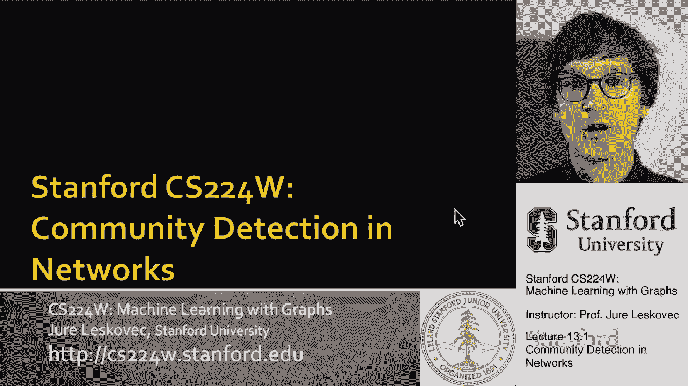
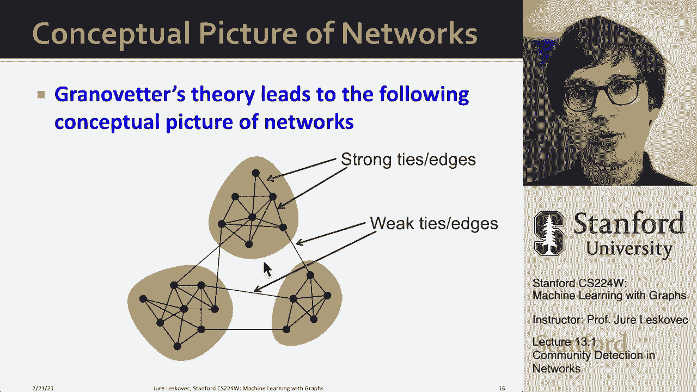

# P37：13.1 - Community Detection in Networks - 爱可可-爱生活 - BV1RZ4y1c7Co

所以今天我们要谈谈呃，网络中的社区检测，所以基本上社区检测本质上是聚类一组节点，呃，在图表中，所以呃，这就是我们今天要做的，我们要做的聚类将基于网络结构。

所以让我们从定义社区检测的问题开始，然后我要和你谈谈，关于一些社会科学研究来解释，为什么我们会看到这些，呃，网络中的集群，为什么它们有意义，它们实际上为方法的发展提供了信息，呃能够做到这一点，所以嗯。

当我们写作或绘制网络时，比如说在一张纸上，我们经常我想他们有以下几种，呃，以下结构权，我们认为它们有这些集群，这些社区，集群内部的边缘更多，不仅仅是跨越集群的边缘，这就是我们直观地认为网络。

尤其是社交网络，也许这些类型的集群可以对应于社会社区，我们认为他们是，在生物网络中，我们可以把它看作是某种功能单元，用于执行特定任务的模块，呃等等，所以我们愿意认为网络不仅仅是一种混乱的物体。

但他们有这种，问题是这张照片是怎么，呃起来，我们有什么样的证据表明这些类型的结构实际上出现在网络中，会有什么原因呢？所以嗯，这里有一种方法可以从，呃，社交网络，所以现在我们要做的是。

我们要深入探讨一下古典社会科学，呃，社交网络分析，所以问题是信息是如何通过网络流动的，想想社交网络，对呀，基本上我们让人们在社交网络中联系在一起，信息流动有不同的链接。

让我们把这些链接称为短链接和长链接，让我们叫他们，你知道，短，就像那些我们的，非常的，呃本地的，这些都是牢固的友谊，让我们也有这些长链接，我们可以把它看作是与我们的熟人、同事和人的联系，我们这么说吧。

呃不经常，我们可以想到的是我们有这么短的，强联系，我们本周有很长的链接，呃到其他地方，网络的，所以在二十世纪六十年代有一部开创性的作品，作者马克·格兰诺弗，他是斯坦福大学的社会学家。

这是我认为被引用最多和最有影响力的，呃，社会科学论文，这真的是关于他在博士期间的研究，他在那里问，人们如何通过个人联系人查找信息，他研究的是人们如何找到工作，所以他要求在就业市场上的人。

基本上已经找到了一份工作，告诉他，你从哪里听说这份工作的？你告诉了哪个人，告诉你这个职位空缺的情况，你是如何应用这样的东西的，然后呃，有趣的是，这些人为职位空缺而受伤的联系人，找到工作的人更多的是熟人。

那就说亲密的朋友吧，所以你不会，呃，听说人们听说了新的职位空缺，从他们有很强关系的人那里，你知道他们花了很多时间在一起，但他们通过这个听说了新的职位空缺，嗯，熟人，会，他们会少见面，呃，更少。

这是非常令人惊讶的，因为你会想象实际上是你的朋友，有很强关系的人，他的最大利益是帮助你，离你最近的人，谁是最有动力的，来帮助你，找工作，连接你，呃，职位空缺等等，但事实证明，这实际上是偶然的熟人，谁谁。

通过它嗯，通过谁，呃，这些求职者发现，呃，新工作，所以这意味着，如果我们回到我们以前的照片，基本上是这样的，这些类型的，让我们说，熟人链接，这些薄弱环节要有，呃，成为人们听说工作的人。

不一定是这种强烈的，呃，人际联系，所以这意味着熟人更多，呃，在这个过程中更有帮助，问题是为什么，对友谊或网络链接的两种视角，所以第一个结构，关于网络中链接的第一个视角是结构性的。

它是关于网络中链接的结构作用，所以你可以思考友谊在社交网络中的结构作用是什么，对呀，我们可以想象这种特殊的边缘连接着网络的不同部分，而这个特殊的另一个边缘嵌入得很好，呃在网络里对吧。

拥有所有这些共同的朋友，成为一个真正强大的人，呃关系，所以这是一种结构性的，然后还有人际，呃视图，大概就是，友谊不是强就是弱，对呀，和某人有很牢固的关系，或者彼此的关系更弱，然后呃。

格兰诺维特所展示的是结构和人际，链接的关系，他们他们是有联系的，他们是有血缘关系的，所以呃，我来解释一下，所以首先，呃，关键是格兰诺弗把，边缘的社会作用和结构作用之间，并表明它们是相关的，它们是相关的。

它们是连接在一起的，所以首先是结构点，对呀，结构边缘，从网络中的边缘点，他基本上展示了结构嵌入的边缘，所以边缘呃，发生在呃，在网络的密集连接部分，有很多共同的朋友，这些边缘往往是强大的边缘。

就像人际强大一样，这些远距离的边缘连接了网络的不同部分，他们往往在社会上很弱，那么这意味着什么呢，这意味着嗯，关系的强度和关系的结构之间有关系，所以力量意味着，有很多共同朋友的人之间有很强的联系。

和连接网络不同部分的薄弱环节，对呀，所以薄弱的友谊通常是连接网络不同部分的友谊，和牢固的友谊是那些呃，你有很多共同的朋友等等，我想说的是强烈的，友谊的定义不是有很多共同的朋友，你可以问你最强的朋友。

然后如果你登录社交网络，你会看到这些人，你有很多共同的朋友，所以这些是结构坚固的，呃，在结构上嵌入良好的关系在社会上是牢固的，在结构上是牢固的，嗯，呃，连接网络不同部分的关系，他们在社会上很弱。

这是两个连接，关系的两个重要方面，所以一种关系的社会力量和这种关系的结构角色或地位，这是第一点，然后Granovetter提出的第二个重要观点是信息流的概念。

他说远距离边缘可以让你从非常不同的地方收集信息，网络的遥远部分，呃，这意味着现在你可以接触到所有这些可以到达你身边的遥远信息，而且对你很有用，对吧，他说结构嵌入的边缘是非常多余的，在信息获取方面，好吧。

如果你认为我不认识这个人，A是A是网络中的优势，他们在找工作，是呀，他们有这三个强壮的，呃，和另外三个人的社会关系，但本质上这些关系是非常多余的，好吧随便，其中一个人知道他们可以直接告诉他们。

或者你知道他们正在进行随意的谈话，告诉另一个节点，谁会告诉它知道，所以在信息获取方面，这些边是非常多余的，比如说，这个弱的远距离边缘到网络的其他部分，到这个节点b，这是一个非常有用的平台。

因为它让你可以从另一个，呃，社区，所以这是第二点，嵌入的边是信息冗余的，而且是弱边，让你可以访问网络关系中非常遥远的部分，嗯，这很重要，因为如果你看看社交网络是如何发展的，嗯，它们的进化使社区的形式。

在某种意义上，紧密相连的节点集群自然形成，这意味着如果你有两个共同的朋友，你知道A有一个朋友B和A有一个朋友C，那么A和B迟早会相遇，他们会互相建立一个链接。

另一个重要的方面是我们喜欢与与我们相似的人联系对吧，所以如果我是，我知道作为一个计算机科学家，也许我喜欢足球，对呀，也许我和B节点踢足球，可能我也用节点C踢足球，所以他们已经有了共同点，这样他们就可以。

呃，形成那种关系对吧，所以这一点很重要因为我们喜欢与他人联系，和我们相似的，所以如果我和另外两个人有联系，它们可能有一些相似之处，我自己的某些方面，这意味着它们也将分享这种相似性。

所以他们更有可能结合在一起，呃，并创建一个边缘，所以这意味着在网络中，这些边缘，喜欢形成，例如，呃A到B是一个可能的优势，你知道也是A到C，因为有一个共同的朋友，呃b，呃中间，所以这些是边缘的例子，呃。

呃，都是，呃在社交网络上发生了很多，所以现在你知道了，为什么，为什么这些类型的边缘会发生，因为如果你还记得早些时候我们讨论过聚类系数，对呀，你的邻居中相互联系的部分，因为如果我们有这个简单的网络结构。

呃这里，呃在右边，那么你可以说你知道如果B和C有一个共同的朋友A，那么为什么B和C要互相链接呢，首先是他们更有可能见面，因为他们有一个共同的朋友，呃，也许他邀请他们两个，呃咖啡什么的。

第二件事是B和C更容易信任对方，因为他们又有了一个共同的朋友，他们都信任，所以他们说，哦，你有这个家伙做朋友，我喜欢他，你喜欢他吗，很明显我们有共同点，然后还有一个重要的一点。

A有动力把B和C结合在一起，对，因为从A的角度来看，它很难或很贵，它需要努力维持，呃，两种关系，呃一起，呃为了，呃为了，呃，没有这样的一天，如果有一个三角形，所以如果一个链接是账单到C。

然后他们基本上可以一起去闲逛，因为他们都是朋友，有一个重要的方面是，实际上社会科学研究表明，嵌入，有很多这些强壮的边缘，你周围有很多三角形，嗯是，呃是是，呃，有点，嗯，是比较容易的，暖和点，嗯。

这是什么，呃，人类所追求的，实际上，比如说，有一个著名的书房，嗯嗯，十几岁的女孩，比如说，低聚类系数，他们是，所以基本上是对的，很难没有彼此是朋友的朋友，所以很好地融入社会集群是很好的。

这是一种社会结构，呃，我们人类，呃，寻求，现在呃，这个呃，格兰诺弗，呃，解释是60年代的一个理论，基本上他说的是以下几点，他说，只是嵌入在网络中，所以聚类系数高的边，有很多，呃，共同的朋友，边缘呃，呃。

出现在网络的密集部分，这些边缘往往是社会强大的，和连接网络遥远部分的边缘，他们往往在社会上很弱，嗯，这是他做的一个预测，根据他的研究，但这是呃，没有经过测试，四十多年，实际上，直到2007年。

这个理论才，呃，其实是，嗯，呃，有点验证，呃，关于真实大规模数据，这项研究是基于手机，呃，数据，呃，来自欧洲国家之一，你说一段关系的力量，优势的强度将是电话的数量，嗯，我们在给定时期所做的，是的。

这个想法是，你是坚定朋友的人，你会打很多电话，和你更熟悉的人，也许你打电话给他们过圣诞节，祝他们新年快乐，比如说，那将是，你知道吗，一年一次，类型呃，电话，所以格拉诺夫的预测会，就是坚固的边缘应该是。

呃，这些有很多电话的边缘应该聚集在小口袋里，然后这些边缘，那个呃，跨越网络的不同部分，那里有呃的数字，嗯嗯，电话，呃会变小，这是预测，方式，方式呃，这是可操作的，第一个说，嗯，呃的概念，你知道，呃。

边缘在结构上是强是弱，你用叫做边缘重叠的度量来量化它，你只要问，呃的分数是多少，边缘端点有共同点的邻居，比如说，这里边缘重叠为零，因为这个节点i和j没有共同的朋友，在这里的时候，比如说，这是一个重叠。

因为他们有这么多邻居，每一个都是相互联系的，所以这里我们会说这个边缘嵌入得很好，它在结构上很坚固，而这条边缘在结构上很弱，是的，它连接到网络的不同部分，这些部分彼此不认识。

对然后格兰诺韦尔会怎么说当边缘有低重叠时，嗯嗯，电话的数量会很少，当边缘有很高的重叠时，呃的数量，电话，呃会很高，这里现在是呃，结果，嗯，就电话数量而言，这是优势，嗯，这是邻里重叠，这是真实的数据。

你看到的是强者，电话越多，重叠度越高，这意味着高度使用的链接--发生大量电话的链接--有很高的重叠，所以有大量电话的链接，嗯，看起来像这样，链接那里有较少的电话数量，重叠较小，所以它们的结构是这样的。

然后这里他们也展示了一个空模型的例子，在那里他们基本上保持网络结构相同，但随机重新分配边缘强度，然后你看到没有关系只是为了，嗯，这是意料之中的，这只是一种安全检查，以确保这个分析是有意义的。

所以这意味着你知道重叠越大，边缘越强，嗯，给你一张更能说明问题的照片，这里是这个电话网络的一部分，这就是边缘的强度，就电话数量而言，红色很强，黄绿色弱，你看到的是这些红色的边缘往往会发生。

在这里的这些小团块中，你看到这些长长的边缘，它们大多是黄色的，这意味着有少量的电话发生在他们身上，只是为了给你看对比，现在我给你看同一个网络的图片，但我会随机洗牌呃，穿过同一结构的边缘股。

你会看到现在突然间这就是网络，呃看起来像对的，所以如果我随机分配边缘股，根据实际的边缘线，你看现在这个远程远程边缘，突然开始寻找，呃红色，为什么会这样，这就是原因，因为有很多边缘。

强烈的红色边缘隐藏在这些星团中，他们只是你看不到他们，这些长距离的边缘，都是黄色的，他们都有很少的电话在里面，但如果你现在把这些边缘股随机排列，在边缘随机分配它们，那么这就是网络的样子。

突然间我们看到实际上有很多远距离，我们看不到的红色边缘，那么这意味着什么呢，这意味着，呃，边缘是强大的，呃在人与人之间密集地出现在，它聚集在一起，边缘很弱，连接不同的部分，呃网络和呃，另一个实验来验证。

这是说，什么，如果我把我的网络和我删除边缘，一个一个，呃，呃，通过减少，嗯，哦对不起，越来越多的呃，先打电话，我会移除边缘，一个电话，然后两个电话等等，下面是我如何去除边缘，这里是呃。

我的网络是如何分解成不同的连接组件的，好吧，当我移除边缘时，网络将开始断开，你注意到的是如果我，首先去掉电话数量少的边缘，网络将分解成多个断开连接的组件，嗯快得多，如果我愿意，比如说，移除呃，高度，呃。

高度使用的边缘，因为这些边缘嵌入了这个，呃在这些星团中，所以即使我把它们移除，呃，我不会断开网络，但如果我断开，如果我去掉这些薄弱的边缘，然后网络断开，呃快点，最大的连接部件较小，所以红线在下面。

呃黑线，嗯，然后如果我做类似的事情根据，我们现在说到边缘重叠，在那里我说，让我们去掉低重叠的边缘，首先，你看现在最大的连接组件是如何超快地，呃被毁了，基本上直觉是，如果我很快移除这些低重叠的边缘，断开。

呃组件，所以嗯，你知道为什么，为什么我们花了，呃呃，这二十分钟讨论这一切，就像，我们学到了什么我们学到的是网络的概念图景，我试图展示我在这里展示的，嗯实际上在社会学过程和社会科学方面有很好的基础。

我们还发现，一段关系的人际力量，这是呃重叠，它是呃嵌入网络是相关的权利，所以我们展示了这种类型的节点，这些类型的边缘有很高的重叠，有很多共同的朋友，这些往往是人与人之间很强的联系，低重叠或零重叠的边缘。

连接网络的不同部分，他们往往很虚弱，他们往往是，嗯，你知道，嗯，别兴奋，呃，强度，所以呃，这就是现在，呃，非常的帅气，呃，因为这种直觉可以帮助我们识别这种类型的呃，桥梁连接并能够分离和识别。

集群，呃。

