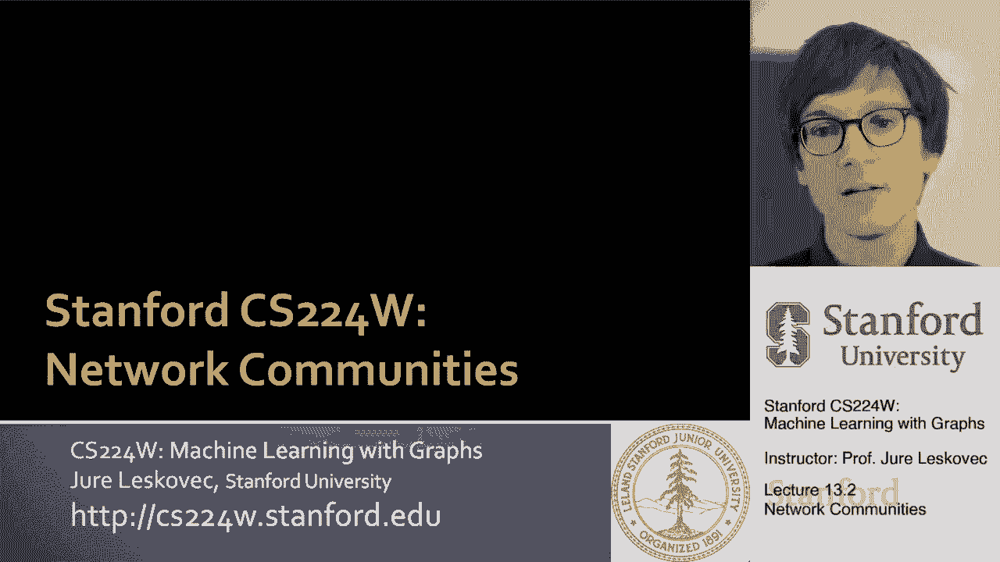
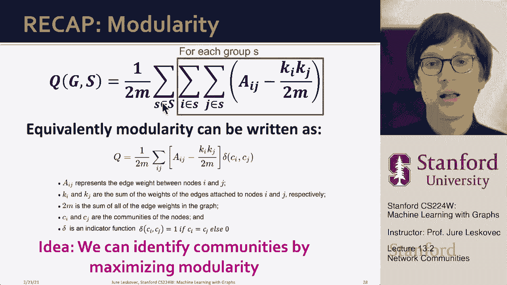

# P38：13.2 - Network Communities - 爱可可-爱生活 - BV1RZ4y1c7Co

到目前为止，我们所看到的是社会科学，解释，为什么集群，呃出现在网络上，我们接下来要做的是开始讨论建立在，我刚才解释的直觉。

实际上，呃，确认呃，这些网络中的集群，所以嗯，让我们从我们到目前为止所学到的开始，就像Granoveiter的理论表明，网络是由紧密相连的集群组成的，或节点集，集群内部的联系很强，人与人之间，在社会上。

这些跨集群的连接很弱，更像是熟人，呃，我们可以称之为集群的关系，也是社区，我们称之为团体，我们称之为模块，都是一样的对吧，然后呃，我们将使用网络社区这个词来指代节点集，有很多内部联系，而且很少，呃。

外部的对其他人来说意味着一些，呃的，网络的，所以现在这个问题将给出一个，呃，网络，我们如何找到这些密集连接的节点组，理想情况下你知道，我们希望，然后这些密度连接的节点组然后对应于真正的潜在呃，社会团体。

所以让我给你们举几个例子，例如一个，最著名和使用最多的社交网络是扎卡里的空手道俱乐部网络，扎卡里也是一名博士生，他在大学空手道俱乐部学习社会关系，嗯，这就是那个的社交网络，呃，呃，大学空手道俱乐部。

但有趣的是，在研究过程中，冲突，嗯导致这个空手道俱乐部分裂成两组，然后呃，有趣的是，实际上这里的分裂是表示的，圆圈去创造了一个，一个新的空手道俱乐部，方块留在旧空手道俱乐部，引人注目的是。

基本上这个网络在中间分裂，对呀，就像圆圈在一端，正方形在另一端，所以不是你知道，一组随机的节点会决定组成一个新的俱乐部，但这是网络的一部分，实际上，你可以自动找到这个的方式，呃，呃，这种分裂简单地说。

如何将这个网络的节点分成两组，使两组之间交叉的边数，从一组节点到另一组节点的意义是最小化的，所以基本上这是第一个例子之一，基本上，社区是基于底层的网络结构而发生的，你可以预测哪些人会加入一个团队。

哪些人会加入另一个团队，基于他们之间的社会关系，也许这对今天的我们来说是显而易见和众所周知的，但是呃，回到六十年代，这是，呃，完全奇迹般的，对呀，完全没有料到实际上是社会关系使，呃，在，呃，怎么呃。

团体，呃，社区形成，另一个群体和社区的例子是在世界的一个非常不同的地方，所以它是在呃，在线广告，基本上，如果你认为你是谷歌或脸书，嗯，你有广告商说谁，他们希望他们的广告在哪里显示。

所以你可以创建这个二分图，你放的地方，呃，底层广告商，你把，呃，查询或关键字，呃在另一边，然后这里我展示了邻接矩阵，其中点表示给定的广告商，一旦它添加到给定查询时显示，给定的关键字，有特定兴趣的人。

呃出现了，你会发现有这些定义良好的密集星系团，在你知道的地方，广告商群体，投标或广告，关于共同的关键词或共同的兴趣，你知道这里有一个例子，赌博的广告商，他们在做广告的人身上赌博，对赌博感兴趣的人，呃。

查询，所以它可以让你识别，微型市场，这类在线广告空间中的子组，另一个例子是你知道，想象一下你带着一个NCAA大学足球队的网络，你把两个队联系起来，如果他们互相玩游戏，这是网络的可视化，问题是团队如何。

呃互相玩，如果您运行这些社区检测方法，你实际上会识别出，呃，这里的群体他们是可视化的，所以注意这个网络和那个网络是一样的，对呀，所以这只是可视化网络，这就是可视化产生的结果，这里似乎没有任何真正的结构。

对呀，也许你会说，哦，这里好像有什么东西，也许这里有一个集群，我不知道，也许这里有什么东西，很难说，但是在你应用社区检测方法之后，它实际上会去识别，嗯，集群，他们在这里，什么是有趣和正确的。

它们实际上与这次会议完全一致，呃，其中呃，团队是有组织的，团队在会议中互相比赛，比其他会议多，你甚至有几个团队不属于任何社区，因为他们是这次独立会议的一部分，他们只是玩不同的主题。

这就是我们如何从网络中提取结构，即使最初这个结构不是，很明显给你另一个例子，现在是说，我们如何正式确定这一权利，我们如何识别这些紧密相连的集合，呃结节，我们要做的是，我们要指定，嗯。

一个我们称之为模块化的度量，我们是，这个指标将衡量一个网络划分到社区的程度，因此，给定网络划分为节点组，让我们假设现在有人给了我们这个分区，我们要计算这个模块化得分，如果我们有模块化，呃分数定义。

那我们接下来要做的就是，我们要说，我可以搜索一下吗，我能找到一个很好的呃，分区集，这样我的模块化得分就会尽可能高，这就是我们以后要做的，但现在让我们假设，小组给了我们，我们想估计一个集群有多好，呃。

我们有什么，模块化的工作方式如下，我们说模块化q将与所有群的和成正比，每一组，我想问，群体成员之间有多少边，群的成员中有多少条边，减去我希望有多少边，在这个呃，组s在某个空中，随机零模型，对呀。

如果群S的成员之间的边比随机预期的要多得多，然后我们发现了一个强大的显著星系团，现在你知道了，网络的总体模块化程度是多少，是这个模块化分数的和，单个集群的uh，所以因为我们在一个群中有这个预期数量的边。

s，我们需要一个空的，我们需要一个空模型，对呀，我们需要一个随机图零模型，所以现在如果我们回到我们的子图挖掘，我们谈到了鄂尔多斯的雨，作为一个模特的例子，嗯，我们还谈到了配置模型，作为空模型的一个示例。

所以现在让我告诉你，呃，并提醒您配置模型，对呀，我们已经谈过了，我觉得，两节课前我们谈到，子图挖掘，想法如下，给定n个节点和m条边上的实图G，我们想创建一个随机网络，g素数。

我们将把这个随机网络称为重连线网络，因为本质上，这意味着每个节点都保持其连接数的度数不变，但连接到随机节点，而不是他们在网络中真正连接的人，所以这意味着我们的网络将有相同的度分布，同度序列。

但会有随机连接，我们将把图G看作一个多图，对呀，我们将允许节点之间存在多个边，所以现在你可以说我有这些节点，他们有这些辐条，这些是半边，现在我想随机连接这些，呃呃终点，当然，也许在一对节点之间。

我将允许多个边，因为这两个端点可能都是随机的，你知道偶然决定连接到这两个端点，所以这将是一种双边，但为了现在讨论的目的，那完全没问题，所以你可以问自己，一对节点i和j之间的期望边数是多少。

其中节点i有度嗯k次i和节点j有度k次j，导出此表达式的方法如下，你说，嗯，边缘端点的总数是多少，基本上这个辐条的辐条数是2乘以n对，每条边都有两个端点，每条边都被切成两半，如果我有M边，然后我有两次。

m uh端点，这就是为什么我们有这个家伙这个东西在这里，那么什么是k subj对，是节点j的度数，是它的辐条数，所以现在我说嗯对于每个节点，对于每一个辐条节点，我随机选择另一个说话的，所以节点，嗯。

呃k子j的账户呃k子j除以两个m，所有可用辐条的百分比，因为这个家伙也可以决定链接到自己或其他任何东西所以现在，基本上我说从这个K潜艇我不同的尝试，它们中的每一个都有k次j除以2m的概率，连接到节点J。

现在如果我把这些相乘，我基本上说，预期的边数，在i和j之间简单地说就是i的度乘以j的度除以2 m右，所以基本上这意味着概率，或者期望的边数简单地等于度的乘积，节点的，嗯，我们感兴趣的，所以嗯。

我们有这种非常优雅的关系，关于在这个随机配置模型下一对节点之间的期望边数，其中节点保持它们的度，但是边缘是随机分配的，这基本上意味着这些端点随机连接，呃彼此，我们生活在这种多图中，呃世界对。

现在我们得到了i和j之间的预期边数，然后我可以说你知道，就像作为一个作为一个作为一个侧面计算，我可以说好，那么这个中的总预期边数是多少，图G素数所以基本上我是说，让我们对所有节点求和，i所有节点。

所以所有的节点对，并询问它们之间的预期边数是多少，当然，我得把这个乘以一半，因为当我检查所有的配对时，这意味着我会把每条边数两次，因为i j和j i会被计算两次，所以如果我锻炼，这里解释的这些总结。

基本上，我明白了，这是，呃度数乘以，度的另一个求和，呃，度之和是n的两倍，度之和是n的两倍，这里我除以，呃一个，1/2乘以n，那是从这里来的，乘以二分之一，所以我得到了嗯，两次n次两次n次。

除以4乘以n，嗯，你知道，呃，力抵消，一米抵消，只剩下我，所以这意味着这个模型，这个在这个模型上，度分布和边的总数，呃会被保存下来，确定一对节点之间的期望边数，呃，通过这个公式。

k subi乘以k subj除以2 m，现在让我们回到模块化，所以在模块化方面，我们说我们在团队之间有一些边缘，s减去内部的预期边数，呃，小组的，所以请注意，我们只对群体内部的边缘感兴趣。

我们没有明确地最小化组之间交叉的边的数量，这有点含蓄地说明了，呃，在模块化中，那么我们现在怎么把这个写出来，根据我们对配置模型的了解，作为我们的空模型，所以我们要写，下面是，我们要说模块化，呃，群体的。

呃，It’在图表里，呃，g只是，呃，所有的节点对，呃，在群里，这是呃，是否呃，那对节点是连接的，这只是计算组之间的边数，然后呃，第二个学期说啊哈，对于每一对ij，我要乘以他们的，它们的度数除以2米。

所以这是一对节点之间的预期边数，对呀，所以这基本上是在说，节点的实际数目是多少，减去给定组中所有节点对上的预期节点数，现在我在所有小组中总结了这一点，呃，从节点分组，进入社区，成组，呃，首都S。

还有这个呃，系数1/2m为，呃，是归一化常数，所以我们的模块化度量Q将从-1到1，对呀，如果所有的边都在群里，嗯，呃，呃，呃，S组，不知何故，我们会期望很小的边缘，呃，在那个群体里。

那么模块化将非常接近于，我们在，呃在小组之间，但根据这些节点的程度，我们会期待很多边缘，那么这个值就是负的，会是负一，就像我说的，模块化可以采取，呃，从-1到1的值，它是积极的。

如果组内的边数超过预期的边数，在现实中在实践中，呃，如果模块化q大于，让我们说，三点，七点，这意味着这张图有一个重要的社区结构，我们已经确定了非常强大的社区结构，呃，集群，如果我们的模块化在这个范围内。

所以让我回顾一下，模块化q定义在无向图和节点分区上，呃，S嗯，它被直观地定义为所有组的总和，组成员之间的节点数，减去um数，预期的呃数，边，呃，在使用配置模型作为空模型给出的组的成员之间，然后。

我们使用以下公式实例化模块化，我们基本上说，对于每一组，Let’让我们从组中获取所有节点对，询问给定的对是否连接，所以这个求和现在算数，呃，边数，呃，在小组成员之间，一个节点的度，另一个节点的度。

除以网络中边数的两倍，所以这是i和j um之间的预期边数，呃，在配置模型下，所以这个区别告诉我们，嗯嗯，还有多少，真实的边数和期望的边数有什么区别，呃，在给定的组中。

现在我们在所有不同的群体中总结这一点，我们把它正常化，所以这就是，我们就可以，呃，写下来，现在我们有了模块化得分，我们基本上有一个目标函数，所以现在的问题是。

我可以通过最大化这个模块化得分来识别集群社区吗，通过基本上最大化呃，这个度量，所以问题是，我们接下来要解决的是，如果我，呃，搜索这些分组，我能我怎么找到。

呃，呃，呃。

