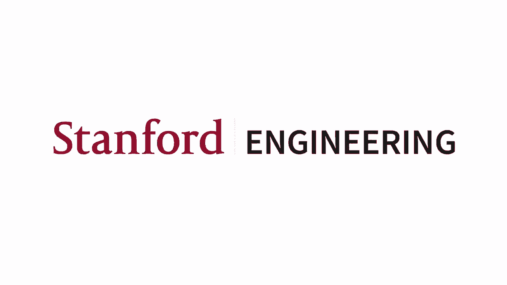
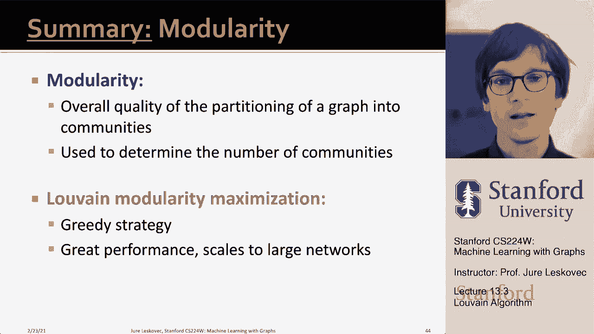
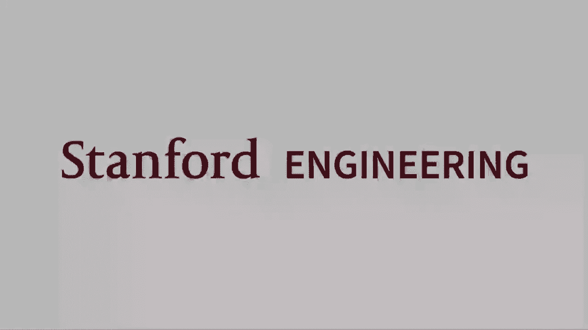

# P39：13.3 - Louvain Algorithm - 爱可可-爱生活 - BV1RZ4y1c7Co

因此，允许我们识别高模块化得分社区的算法是，它被称为卢万算法，来自比利时卢万的一所大学，呃，这就是为什么呃，这个名字，所以呃，它是一个非常可扩展和非常流行的，一个非常受欢迎的，呃，算法，呃，有点。

这是你会使用的事实上的东西，如果要将网络划分为一组群集，所以贷款算法是一种贪婪的社区检测算法，比额表，呃，嗯，呃，n log n，其中n是网络中的节点数，这样它就可以，嗯，呃，扩展到大型网络。

它支持加权图，它为我们提供了等级社区，所以它不仅为我们提供了一个层次的群集，但它为我们提供了一种集群，所以我们得到了树或树状图的概念，单个节点如何加入组，以及这些群如何进一步连接到超群中，呃等等，嗯。

就像我说的，它的应用非常广泛，呃，有快速的实现可用，它工作得很快，嗯，在实践中效果很好，它发现呃，集群具有高度模块化的社区，算法分两个阶段运行，基本上，我们希望贪婪地将节点分配给社区，以最大化模块化。

每次迭代都包含两个阶段，所以在第一阶段，模块化是通过只允许节点对社区的本地更改来优化的，所以基本上节点有机会改变社区成员资格，在第二阶段，这些被识别的社区被聚合到超级节点中，以构建一个新的超级节点网络。

这样另一个，嗯另一个，呃，社区检测的一部分，呃可以运行，所以这个想法是这样的，输入网络，呃，我们从一个输入网络开始，我们在第一阶段优化它的模块化，所以我们发现集群。

然后我们将这些集群连接成超级节点来创建这个聚合网络，现在我们有了一个新的网络，我们可以再次在上面运行，呃，第一阶段进一步分组，这样我们就会发现集群，集群的集群等等，我们等级森严，聚类网络。

现在让我解释一下第一阶段是如何工作的，第一阶段，我们首先将图中的每个节点放入一个不同的社区，所以每个节点都说我是我自己的集群，我是我自己的社区，每个节点i对于每个节点i，算法执行两次计算，它计算模块化。

当我和其他邻居J一起把这个I放进一个社区时，所以基本上我们取节点i，然后说什么，如果我把节点i放入节点j的社区，这会增加模块化吗，这个想法是i现在对于给定的节点，我试着把它放进，通勤。

和它的每一个邻居都是同一个社区的成员，任何增加模块化的东西，那是我放的最多的地方，呃，那是一个社区，我把我放进嗯，第一阶段，呃会有点，我们会遍历节点直到呃，不可能移动，增加了模块化，因此。

当获得模块化的局部极大值时，第一阶段停止，基本上意味着没有单个节点可以移动到不同的社区来提高模块化，嗯，注意，算法的输出取决于我们考虑节点的顺序，在实践中，原来顺序不重要，所以你修复了一些随机排序。

这就是处理节点的方式，然后对于你说的每一个节点，如果我加入你和邻居一的社区怎么样，邻居二，邻居三，看看这些连接中哪一个增加了最大的模块性，然后将节点移到那里，如果没有一个移动增加模块化。

那么你就不把i移到节点j的社区，那么什么是优雅，这个模块化增益是对的吗，这个Delta模块化，你说，如果我把节点I从当前的社区D移到新的社区呢，这可以非常有效地计算，以及计算它的方法。

你把它分成两个学期，一个术语是，当i取节点i时，模块化会发生什么变化，我把它从呃，当前社区d，然后模块化将如何改变，当我把这个节点I放入新的社区C时，所以你可以想象图片的方式是，你知道我现在，看节点I。

假设节点I被分配给某个社区，D我挑了一些它的邻居，也许我挑了这个呃节点呃呃，这里属于社区C，所以我说如果我把i转移到社区c会发生什么，所以首先是，我必须计算Delta模块化，把i移出d。

然后我需要计算合并i的delta模块，回到社区，求和这两个项就得到了，模块化的增加或减少，当我从，当我把i从d移动到c时，让我们导出这个，德尔塔模块化，当我搬进社区时，首先我们需要推导出，社区C原样。

我们把这个叫做c的q，以及我们推导的方式，这是我们需要两种足够的统计数据，一个是里面的一些西格玛，也就是，呃一些链接，链接数，或者C的成员之间的一些链接权重，嗯，然后嗯西格玛tot将是链接的总数，呃。

所有这些节点都有权利，所以这只是在成员内部，这个是里面，加右外侧，所以在这里我只计算学位的总和，我只是在总结，呃，边缘计数海洋成员内部的边缘，当我计算总数时，我也解释了所有的边缘。

所以我只是把学位加起来，呃边缘去，所以现在我有这两个量，西格马in和西格马tot，所以现在我可以重写，呃，模块化，呃，西格马in和西格马tot，对呀，这是给定社区的模块化，c，是这个超过2米的。

我们以前有，c中所有节点对的um双求和，它们是否有联系，减去他们学位的归一化乘积，嗯，如果我把总结分到里面，我在这里看到这基本上是现在，群的成员之间的边数，这是sigma除以2m。

我这里有一个节点度数的总和，呃在c中，C中节点度数除以2 m的另一种求和，呃平方，所以这就是，呃，sigma tot除以2 m，呃平方，所以呃，这是，这个正方形，因为我把这两个m，把这个分在里面。

所以这意味着现在QC很大，呃，当大部分链接都在社区内时，嗯和嗯嗯，很少，呃十字架，呃对其他，呃社区，所以现在我们已经定义了，呃，计算了C的模块性，现在我们需要说，当我们把这个节点i放入c时。

这个模块化是如何变化的，然后呃，在这里，我们将使用um uk子i逗号的概念，其中是节点的边数，我有另外两个C和K的成员我现在是总的呃，节点i右的度，所以基本上这两个，嗯嗯，这两个呃术语是，呃是等价的。

或者类似于sigma in和sigma tot right，这是总的程度与程度，或者其他成员的边数，现在如果我把这个写对了，所以呃，我以前的模块化是，我们已经定义的C的模块性，加上这个的模块化。

让我们说呃，孤立的社区我所以它有，我对我们自己没有优势，所以是0减去k减去i乘以k减去i加上两个m，所以是k次i的平方，现在我搬到这个节点的社区后，我得到了什么，是呃，里面有一些边。

西格玛增加k次i in，边的总数现在增加了，但是或总的度数之和现在随着节点i的度数而增加，所以，我就是这样写的，呃把它都写下来，呃所有的，呃现在都在一起，然后这里是我们说的增量模块化。

我把I搬进社区C后，你知道在减号之前，这是，这是在右边之后，我有呃的总和，这个学期，社区内部的学位增加了，总度数随节点i的度数增加，所以这是后面的模块化，这是我们定义的前模块化，现在如果我简化这个。

我基本上这是，这是我得到的表达式，什么是好的，这取决于这个足够的统计sigma in和sigma，以及节点I的度，我的边数，呃到社区C的节点，所以这是，我们刚才导出的术语，是这个吗嗯。

然后我们可以类似地确定，呃，导出一个类似的表达式，说，模块化如何变化，当我把社区外的节点I一起总结一下，我得到了一个Delta模块，现在我知道如何快速计算Delta模块化了，我基本上在每个节点之间迭代。

我试着去看，是否有机会增加模块化，如果我把它搬到另一个社区，我计算这个增量模块，我把节点移到一个新的社区，C素数呃基于基于以贪婪的方式，基于整体模块化，呃增加了，这就是精益算法的第一阶段，所以现在呃。

现在我有，呃到达了当地，奥皮，我把节点转移到了不同的社区，直到模块化停止增加，然后我进入了第二阶段，这就是所谓的重组，对呀，所以现在我想把这些簇，在第一阶段获得的社区，我可以我想把它们承包到超级节点。

创建一个新的网络，超级节点连接的下一级网络，如果节点之间至少有一条边，对应社区的，嗯和两个超级节点之间边的权重，是它们相应社区之间所有边缘的边缘权重之和，现在我将有一个超级图，我只是去运行第一阶段。

呃又是对的，所以我的想法是我有我原来的网络，我运行第一阶段来识别集群，现在我将每个集群收缩为一个超级节点，我连接两个簇，如果至少有一条边，呃他们之间，现在这将是一个加权网络，边缘权重在这里表示。

所以这将是C1和C2之间的边的总数，这将是，呃c 2等等，现在我有了超级图表，我只是再次应用我的第一阶段算法，所以这将是工作的方式，你知道总结一下，我有我原来的网络，我选择一个节点。

最初我把每个节点放入自己的社区，然后我问一个节点，如果我把你和你的会员搬到同一个社区呢，节点二上升，这将如何改变模块化，如果我把你移到第三节点的社区，模块化将如何变化，如果我把它移到第五节点的社区呢。

如何呃模块化，呃改变，所以当我这样做的时候，呃动作，然后我决定把它移到，模块化变化最大的地方，通过后是第一阶段，呃完成，这是将节点分配给社区，现在我创建了这个呃第二阶段，在那里我创建了一个超级图。

其中我将同一社区的所有节点收缩为一个超级节点，然后这个边缘，呃，自循环是，两次的总数，十字边内部的边数是从一个聚类点到，呃，另一个集群，这给了我一个超级超级的网络，超级节点网络，现在我只是把一张脸，嗯。

再一次通过聚类这个，你知道，在这里，我会再次得到以下两个集群，我收缩成超级节点，所以我现在基本上有两个社区，所以这意味着这个原始的图可以首先分成两个社区，紫绿相间的，然后你知道绿色的可以超级，呃，呃。

呃，又分裂成两个社区，和紫罗兰分成两个更多的社区，然后这四个社区中的每一个都在这个网络中表示，所以我们得到了这个呃等级，给你们举个例子，例如，如果你看一个比利时人，呃，移动网络，对呀。

比利时是一个有两个，呃，人们说两种语言，有一个强大的法语社区，有一个强大的荷兰语社区，如果你看看电话的社交网络，你可以很好地看到这个国家是如何分裂成两个独立的部分的，在你知道的地方，法语对法语说。

荷兰人对荷兰人说，而且联系相对较少，呃，在两者之间，总而言之，我们定义了模块化的概念，这给了我将图划分为社区的整体质量，嗯，现在我们然后我们谈到了，呃，模块化最大化的LN算法，基本上是一种贪婪的策略。

我们从属于自己集群的每个节点开始，然后我们合并，我们在集群之间移动节点，以便整体模块化不断增加，在没有任何动作可能的情况下，我们把集群连接成超级节点，并再次重复聚类，这样我们就得到了这种很好的等级，呃。

社区，呃，结构，嗯，Louvain在实践中做得很好。

扩展到大型网络。

