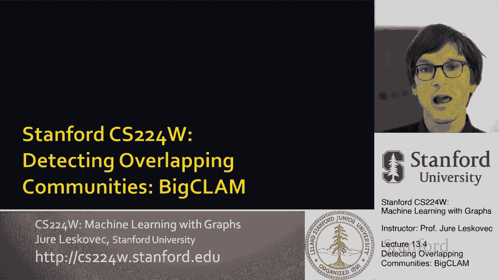
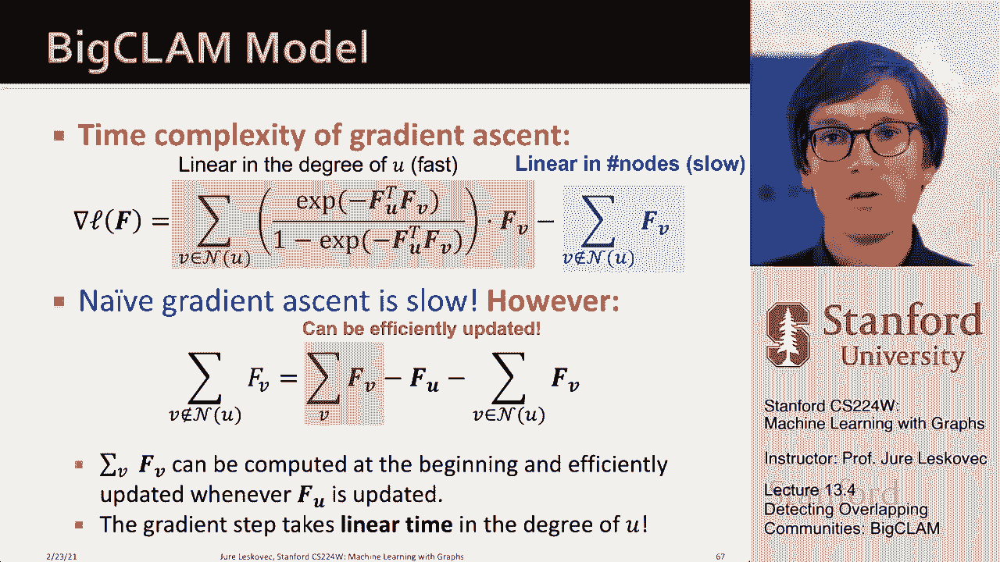

# P40：13.4 - Detecting Overlapping Communities - 爱可可-爱生活 - BV1RZ4y1c7Co

现在我想谈谈关于社区结构的第二种方法，这是为了检测网络中的重叠社区。

到目前为止我们假设，网络结构，对呀，我们有这些集群，但在很多情况下，你知道人人类，我们同时属于多个社会社区，所以你可以有这些社会群体，呃，重叠的权利，所以说。

我们如何提取这种类型的重叠社区结构来给你一个例子，这实际上是一个学生的脸书网络，呃，呃，在我的小组里，这些是他的朋友，这些是他朋友之间的联系，嗯，你可以问你知道，这个网络的社区结构是什么。

什么样的社区这样做，博士生，呃，呃，从我的小组，呃属于呃，你知道如果你看着这个，也许你会说，哦，有一个，我看到这里有一大群人，也许我在这里看到了另一个，也许这下面有什么东西，真正有趣的是什么。

如果你看它，你问这个学生，呃，把他的朋友分成不同的社会群体，以下是他想出的社会群体，他基本上是说我我有来自四个不同社会群体的朋友，嗯，这里是社会团体，当然，有些朋友属于多个这样的社会群体。

然后你可以让学生给这些组贴上标签，他说，哦，这些是我高中的朋友，我做了，呃，在某一特定公司，这些是和我一起打篮球的斯坦福朋友，这些是我玩的其他斯坦福朋友，南瓜，当然这里也有一些人。

这两个都是同一个高中的学生，他们现在在斯坦福大学，他们和他一起打篮球和壁球，你知道有一些来自同一所高中，但目前不在斯坦福大学，对呀，所以我们看看这个，我想注意的另一件事是，在这张图片中，节点要么。

固体还是呃，它们是那种灰色的，这里的重点是我想展示的，对于给定的。

呃，对于给定的网络，我们可以对于这个给定的输入，我们可以问我们的社区检测方法，然后呃，然后我们给节点上色，节点已满，如果它被分配到正确的群集，它是灰色的，如果没有将其分配给正确的群集，令人惊讶的是。

这里基本上只有在网络结构上，只在这个未标记的网络结构上，我们可以将节点分配到正确的集群，到正确的社会社区，对他们一无所知，这是了不起的，超级令人印象深刻的权利，这是一项超级艰巨的任务，所以嗯。

这是一个例子，另一个例子，我想告诉你的是在生物网络中，这是一个蛋白质-蛋白质相互作用网络，如果你在这里识别功能模块，您可以看到这些功能模块是如何，呃重叠，呃彼此，所以这是嗯。

思考网络中重叠的社区结构非常有趣，所以只是为了对比我们到目前为止一直在谈论的，我们谈到了具有这种聚类结构的网络，密集的星系团，跨连接少，如果我们用图邻接矩阵来考虑这个问题，那么邻接矩阵就像这样。

基本上你有一个集群，你知道橙色的那个，你有绿色的集群，很多联系，然后邻接矩阵的这些区域意味着，你知道一个橙色的节点链接到一个绿色的节点，这里的联系更少，因为我们假设在重叠的情况下。

两个集群之间的连接较少，实际上情况变得更加棘手，如果你有两个重叠的集群，那么这些红色节点在重叠处，如果你从邻接矩阵的角度来考虑，这就是图片对吧，你有一个集群，你有另一个集群，在重叠的地方。

你有更多的联系，因为这些连接要么来自一个集群要么来自另一个集群，这里的重点不是说，哦，有一群人彼此之间有着超强的联系，重点是说，哦，有两个集群在中间的这个集合中重叠，那么现在我们要怎么检测。

网络中的这种结构，我们将如何提取社区，我们的行动计划如下，我们将进入第一步，为图定义一个生成模型，这是基于节点社区隶属关系，我们称这个模型为隶属关系图模型，然后我们要定义一个优化问题，优化呃的对数似然。

生成的模型，呃，这个图形，所以我们今天要学的是一个例子，网络生成建模，以及如何将生成模型拟合到给定的图，所以这是呃，有点很有用，呃和非常基本的，所以首先让我定义模型，模型将如下所示。

我们会在底部有一组节点，和一组位于顶部的社区，一个节点将连接到一个社区，如果给定节点属于社区，所以在这种情况下你知道，蓝色节点属于一个单独的，下面的绿色节点，呃只属于B，然后红色节点属于两者。

所以它们都连接到A和B，嗯，这就是我们将如何描述网络的社区结构，现在我们要建立一个生成模型，上面说你给了我一个，将节点分配给社区，我想生成网络的边缘，我如何生成边，我们现在要描述生成过程。

如何将节点与社区的隶属关系转化为网络的边缘，我们的模型将有一组节点，一组社区和一组节点到社区的成员关系，就像这样，然后我们假设这里的每个社区C都有一个参数，p-sub-c，这个参数将具有以下内容，呃。

角色权，所以基本上我们会说给定我们的模型，给定此社区参数中的隶属关系，我们希望生成底层网络的边缘，我们要说社区C中的节点将相互连接，通过用概率抛一个有背景的硬币，这将产生一个概率为C的边。

所以思考这个问题的方法是，你知道的，这对节点说，哦，我们属于同一个社区，让我们掷硬币，P潜艇A和呃，如果硬币说是，我们要在我们之间建立一种联系，比如说，这两个节点，呃，在这里它们都属于A和B。

所以他们要抛第一枚硬币，如果硬币说是，他们会创建一个链接，然后他们会抛第二个硬币，如果硬币说是，他们要创建一个链接，所以基本上如果这两个硬币中至少有一个说是，他们要去，呃，相互链接。

所以这意味着属于多个社区的长节点得到多次掷硬币，这意味着他们更有可能，呃，相互链接，所以在某种意义上，如果他们不幸，第一次他们可能很幸运，建立了联系，呃，下一次他们有共同点的第二个社区。

所以有一种方法可以写出你和v相互联系的概率，就是通过这个公式，让我解释一下，所以基本上这是在说，这是这些硬币中至少有一个带有偏见的可能性，出现p subc，头向右，所以基本上我们是说。

让我们来看看U和V节点有共同点的所有社区，呃，对于每个社区，我们抛一个概率为c的硬币，p减去c的概率是，硬币说我们现在不要制造优势，乘，这是说如果你超级倒霉怎么办，每抛一次硬币，抛硬币上来说没有边。

所以这是所有掷硬币都没有边缘的总概率，一个缺点是这些掷硬币中至少有一个是积极的，边缘是这样创建的，基本上我们说一对节点是连接的，如果这些硬币中至少有一个，呃成功了，这就是这个的公式。

那么到目前为止我们学到了什么，我们了解到，如果你给我模型，呃，由节点预先指定，社区，成员资格，呃，和参数，呃，然后我们就知道如何生成一个网络，这个模型是超级灵活的，因为它让我们可以，呃。

表达多种社区结构，我们可以创造这种传统的一个两个密集的集群，嗯，用这种结构，我们可以通过说这些橙色节点属于两个社区来制造重叠，所以它们在重叠的地方，或者我们甚至可以有一个等级结构，我们说，你知道，呃。

是啊，是啊，紫罗兰节点属于，呃，绿色节点属于，c，然后所有的节点都属于B，是较大组的子组，呃，b，所以就是这样，呃，这个模型的灵活性给你一些，呃，直觉，所以到目前为止我们知道要做的是。

我们如何从模型到生成网络，我们接下来要做的是反其道而行之，考虑到网络，我们想说什么是模型，所以本质上，这被称为最大似然估计，基本上我们会说我们将定义以下推理，我们说假设有某种模型，大自然用来生成图形。

我们将假设AGM是大自然用来生成图表的模型，然后我们要说，让我们假设我们的真实世界图是由AGN生成的，所以我们要说，最有可能生成我的数据的模型是什么，所以在我们的例子中，我们说给定一个图表。

找到最有可能的，呃，生成数据的模型AGM，那么我们所说的模型是什么意思，这意味着我们需要决定我们需要分配的社区数量，呃，决定节点如何属于社区，每个社区的每个参数p-sub-c是什么。

所以我们说这些参数的值是多少，这样我在现实中观察到的这张图很可能是由我的模型生成的，所以现在就像我说的，基本上，我们希望将我们的模型拟合到底层图，我们这样做的方法是使用最大似然估计。

所以基本上给了一个真实的，呃，图，我们要找到参数，模型参数f，使我们的图形的可能性最大化，所以我写作的方式，说这是说，给定一些模型参数，我想生成一个合成图，然后我想，我想说，呃。

合成图之间的对应关系是什么，呃，和真实的图形，所以在某种意义上，我想最大化我的模型f的概率，生成实图右，所以基本上我想能够有效地计算这个呃，f生成我的数据g的可能性，然后我需要等待呃。

在f上优化以最大化此概率，现在让我先告诉你，在图上，似然是如何定义的，对呀，所以我得到了一个实数图G，我得到了一个模型F，给每条边都分配一个概率，我想生成呃，计算我的模型F生成图G的可能性。

我能做的方式，这是说有一个图，这里有一个邻接矩阵，这是我的输入数据，我有我的模型，我的模型给每条边分配一个概率，这可能发生在每一个，模型说A与自己有一个自我循环，呃。

你知道概率呃指向5个节点1连接到节点B，呃到节点二概率点1，所以现在我可以问，总的概率是多少，这种概率邻接矩阵会生成给定的图，g我可以简单地把它作为一个产品来做，呃，我去，嗯哼，我想去。

我想把G的所有边都过一遍，我想看看这个邻接矩阵的所有条目，其中有一个值1，我想让这个硬币翻转结束，呃头，我想让他们，我想把这些概率相乘，因为我想让你知道这将与，将有1的值，概率点为5，以此类推。

以此类推对，然后我也想检查所有丢失的条目，所以基本上覆盖了网络中不存在的所有边缘，在这里，我希望硬币落在尾巴上，我不要优势，所以我检查了网络的所有非边缘，我乘以一，减去边缘出现的概率。

这就是在给定模型下定义图的似然性，基本上我过去了，呃所有呃所有呃，图的所有边，我看到模型赋予这条边缘的概率是多少，我希望这些概率的乘积尽可能高，然后我想看看图的所有非边，在所有的零上面，我想乘到一起。

1减去边在那里的概率，再一次，我希望这个负值尽可能高，所以可能性很高，其中模型将为图中出现的边分配高概率，这是这部分，它将为不出现的边分配低概率，呃在我的呃图表里，呃对，因为这是G的节点和边。

这给了我F模型生成图的可能性，现在问题变成了，我如何找到我的模特，如何求f的参数，求f的参数的方法，我要去我们所说的，放松或扩展一下我的模型，以考虑到会员的优势，所以我现在要做的是。

而不是说每个社区C都有一个参数，我要呃，分配呃，成员资格有力量，所以这将是节点U成员的力量来社区一个好的，然后呃，如果强度为零，这意味着Node不是该社区的成员，嗯，那么现在我们如何写出节点的概率。

U和V相互链接，如果他们是一个共同社区的成员c，我们要参数化的方式，这是说它是力量，这是一个，它是成员资格优势的产物，会员资格只能是非负面的，所以零或更多，所以它是会员资格的产物，我取这个的负值。

求它的幂，取其中的负一，所以这意味着这应该是一个有效的概率，它会在零到一之间，嗯，会员资格越高，越强，这里的数字就越大，所以e到负负将是接近于零的东西，这意味着链接的概率会更高。

所以基本上如果成员人数少，边缘的概率很低，如果会员流浪汉都很高，那么产品就会很高，这意味着概率是，呃兴奋，所以这就是我们如何参数化它，所以现在节点V和U可以通过多个社区连接，对呀，他们可以有多个。

呃共同的社区，所以我们要做的是使用与之前相同的公式，我们要说，你和我们相互联系的概率，就是他们创造了，它们通过至少一个共同的社区相互联系，所以这又是，我们在这里导出了，但现在我说，在所有这些社区中。

他们有共同点，这些掷硬币中至少有一个必须出现，嗯，头必须创造一个连接，这是非常好的，因为它让我简化了这个表达，现在这是我们在上一张幻灯片上看到的，链接的概率按以下方式参数化，其中p subc是，呃。

以这种方式参数化的是…的强度的乘积，呃，属于公共社区C的节点U和节点V，所以现在如果我写它，把它都写出来，你知道，这是一个比普通社区少的产品，一减一减，呃到负呃，f的乘积。

下面是它如何将此简化为一个人的，呃呃，呃，相互减去，那我能做的，我可以拿这个产品，然后嗯，呃把它分在里面，指数的乘积变成指数的和，所以在这里，为什么这个优雅，因为这意味着这只是。

节点U和节点V的社区成员向量，所以我可以把整个表达简化成简单的说，概率是1减E升到点，节点U的社区成员向量的乘积，乘以节点V的社区成员向量，所以这超级酷，因为这是一个非常好的类型表达式。

所以现在我已经定义了一对节点之间边缘的概率，基于它们对社区成员的向量表示，现在你知道我的图形可能性是什么样子的了，这是一个超越边缘的产品，乘以一减的乘积，呃，非边概率，我只是你知道。

把这个插进去这个在这里，当我再把它插到这里的时候，这些会抵消掉，我现在得到指数，如果我把这个可能性进一步，呃，把它简化一点，我可以用下面的形式写对了，它基本上不是直接优化可能性，我们喜欢优化对数似然。

我们优化对数似然的原因是为了数值稳定性，右概率是小数，小数的乘积是更小的数，然后数字不稳定和不精确开始发挥作用，所以你从来不用原始概率，你总是用对数概率，概率的对数，所以如果我现在申请，这里的对数。

它是一个有效的变换，因为对数是单调变换，所以当我最大化时，最大值在相同的位置达到，不管我是否通过对数变换，因为很单调，所以如果我在日志下应用日志，产品就变成了汇总，所以我想这是对日志一的总结。

减去第一项，对数和指数相互抵消，所以在这里只有总结幸存下来，这就是我们现在的目标，我们称之为对数可能性，呃优化，所以我们把它简化了，呃很多，那么我们怎么，呃优化，如果我们从随机成员开始，呃FS。

然后我们迭代直到收敛，我们基本上更新节点u的成员f，同时修复所有其他节点的成员资格，嗯，我们可以做梯度下降，我们在f中做一个小的改变，导致对数可能性增加，呃，那就是，嗯，呃，我们所做的一切，然后呃。

再说一次，当我们计算这个导数时，的偏导数，呃，对数似然，呃，下面是表达式，我们发现这取决于，它是节点邻居的求和，呃，u，你看我们现在是如何乘以，呃，那个呃，社区成员载体，我们用节点V的社区成员向量乘它。

但是计算起来非常昂贵的项是第二项，因为这里求和是在节点u的非邻居上进行的，因为节点通常有少量的邻居，这意味着这个求和在整个网络上进行，对呀，基本上这个加上这是整个网络，这在实践中太慢了。

但我们可以有效地近似这个，呃，通过意识到这个蓝色部分计算缓慢来计算这个表达式，但我们可以扩展它，嗯，然后呃，呃，让它，呃，计算速度要快得多，基本上这个想法很简单，对呀，如果要对一组节点求和。

不是给定节点的邻居，然后你可以用下面的方法写出这个求和，你说，让我总结一下网络中的所有节点，但只从节点中减去贡献，实际上是这个节点U的邻居，对呀，所以这是对所有非节点的求和，节点u的邻居。

基本上是所有的节点，减去U本身，减去节点u的邻居，关键是大多数节点的度数都很低，你可以把这个部分，你只要计算一次，然后你只需要更新这些条款，这样，您可以使您的方法扩展得更快，并运行到能够应用于更大的。

呃，图，所以让我总结一下，呃，像讲座的这一部分，我们讨论了网络的生成建模，我们讨论了如何将生成模型拟合到底层网络，使用对数似然和梯度下降，在我们的例子中，我们定义了一个网络的生成模型，呃。

基于节点社区成员资格，所以这意味着通过将我们的模型与底层网络结构拟合，我们就可以嗯，从该模型中获取节点社区成员资格，所以本质上，我们是通过将生成模型拟合到底层来进行社区检测，呃，到底层，呃，这么大的图。

CLAM是一种定义模型隶属关系图的方法，基于节点社区隶属关系的模型，然后生成底层网络结构，然后我们定义了拟合过程，鉴于底层网络结构，节点对社区的最优分配是什么，这样呃，我们得到了潜在的，呃。

模型拟合过程中的真实网络，我们定义了对数似然的概念，然后说你知道最有可能产生这些数据的模型是什么，我们能够拟合模型，呃。

