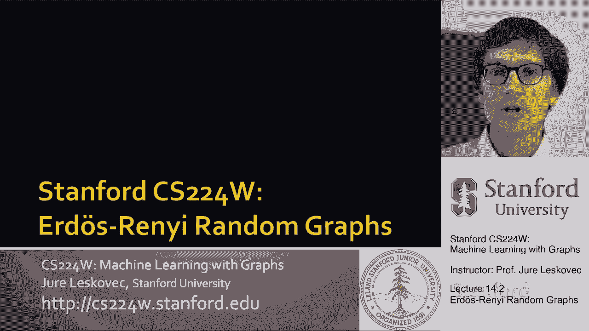
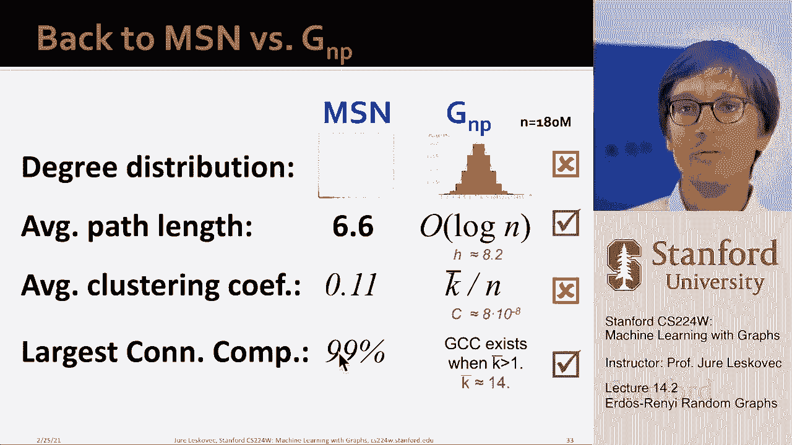

# P42：14.2 - Erdos Renyi Random Graphs V2 - 爱可可-爱生活 - BV1RZ4y1c7Co

 So now let's start talking about these null models。

 generative models for graphs that we- that can serve as， uh， reference points。 So the first， um。

 we are going to talk about is the Erdos-Shireini， uh， random graph model。 Basically， manch， uh。

 named after two famous Hungarian mathematicians who- who developed a lot of， mathematical theory。

 uh， around the， uh， random graph generation processes。 Um。

 and random graph model and the Shireini random graph model is kind of the simplest way to generate a graph。

 Right？ Uh， we have two variants of it， one called GMP and the other one called GNN。

 GMP says it is an undirected graph on n nodes where every edge， uh， appears， uh。

 IID with probability P。 So basically for every pair of nodes， I get to flip this bias coin P and。

 uh， I get to observe whether the edge is created。 And then a different， uh。

 version of this model is called GNN where it's an undirected graph with n nodes and m edges。

 picked uniformly at random。 Um， what's the difference between the two models？

 They both have the same number of nodes。 Um， they both have the same number of edges in expectation。

 uh， and they both have edges placed a random between the nodes。 So the point being because in GMP。

 the edge creations is stochastic， you know， in expectation I will have n time n times p number of edges。

 but because of some variance of this random process。

 I may have a bit less or I may have a bit more while in GNN， I always have the same， uh。

 number of edges。 So now with this， uh， simple generative model。

 let's look at what kind of networks does this model produce。 Right？ So basically。

 the point is that these models are stochastic。 So it means that this random graph models do not。

 you， uniquely determine the graph， right？ The graph is a result of a random process。

 So we can have many different realizations for the same n and p value。 So here， for example。

 I show you different， uh， random graphs， um， generated by， you know， n equals 10 and p equals， uh。

 1 over 6。 So what we want to do next is we want to say， okay， if I take this， um。

 GMP model and I generate random graphs from it， you know， what would be the degree distribution。

 what would be clustering coefficient， what would be the average path length， uh。

 what would be the connectivity？ Do I get a giant connected component？ And what is beautiful about。

 uh， GMP， the， and， erdoshani random graph model， it's that it is that it is kind of so simple。

 that you can mathematically analyze its properties， right？ You can， uh。

 mathematically derive these quantities， um， using algebra alone。

 You don't have to do simulations and measurements。 So it's kind of the simplest model。

 but it's very， uh， leads to very rich， uh， mathematical literature， um。

 and very rich mathematical analysis。 So there are kind of， and it's an entire subfield that studies。

 random graphs arising from this model。 So， uh， first， you know。

 what would be the degree distribution of the， uh， GMP model？

 The degree distribution of GMP model would is， uh， binomial。 So， uh， if you， if you say。

 why here is a quick argument， you know， let P of K denote a fraction of nodes with a given degree K。

 Then if you say， how many nodes do I， um， would I have it a given degree？ You say， uh-huh。

 out of n minus one possible neighbors of a given node， I get to sample or pick K of them。

 So n minus one to K is the number of times I can select K nodes out of n minus one。 And then。

 you know， because I'm saying my， my node has to have degree K， uh， it has to have K， K edges， uh。

 be created。 So the likelihood of that is P raised to the power of K。

 And then the other coin flips have to result in not edges。

 So that would mean it's one minus n minus one minus K， right？ So that's the probability of， uh。

 missing the rest of the edges。 And if you look at this formula。

 this is exactly the formula for a binomial distribution。 If you look at binomial distribution。

 it has this kind of bell-like shape。 So essentially it's like a discrete analog of a Gaussian distribution。

 It has， you know， uh， average， um， average or mean of the distribution is simply P times， uh。

 n minus one。 So average degree in a GMP network will be， uh， P times n minus one。

 And if n is massive， then this is essentially n times， uh， P。 So this is about binomial， uh。

 about the degree distribution。 And again， notice that， you know， in MSM network。

 we didn't see like this， uh， bell-shaped， like curve。 We saw something very skewed。 So clearly， uh。

 GMP does not generate， uh， graphs with the degree distribution that is， similar to the MSM network。

 How about clustering coefficient， right？ Um， remember the definition of clustering coefficient。

 It is twice the number of edges between the neighbors of a given node。

 divided by a k times k minus one， where k is the degree of that node。

 And remember also that edges in GMP appear ii divit probability P。

 So the expected number of edges between， um， um， uh， these neighbors is of i of a given node i。

 is simply， uh， the total number of possible edges times the probability that， you know。

 each one of them comes， comes up， uh， and actually materializes。 So the expected number of edges。

 so the expected， uh， is sub i， is simply k times k minus one divided by two。

 where k is the degree of node i， times the probability that， uh， actually this， this， uh。

 particular pair of nodes， this particular edge appears， and there is k choose to type， uh。

 number of such pairs， uh， as written here。 So now if you put these two together， uh。

 what you get is， you get that the， um， uh， clustering coefficient is， uh， uh， uh， relates to， uh。

 to the graph as average degree divided by the number of nodes。

 So what does this mean is that the average， what we can conclude is that the average。

 a clustering coefficient of a random graph will be small， right？

 So basically if we generate bigger and bigger graphs and keep the average degree constant， um。

 then the clustering will decrease the size of the graph， right？

 And we could even take the values from， uh， MSN network and plug them here， right？

 So average degree was 14 number of nodes was 180 million， right？ So this means that， um， our， uh。

 clustering coefficient should be 10 to the minus six， right？ It's， uh， 14 divided by 180 million。

 Um， so， um， that's kind of what is the clustering coefficient， of a erdoshany random graph。 Uh。

 so this means that clearly our MSN network is not a random graph。 And then， uh。

 the third property I want to comment on is connected components。 Um， and this， uh。

 is very interesting because in， um， in GNP you can actually analyze how is。

 the graph going to be connected as a function of the edge probability P， right？ If the P is zero。

 then the graph will be empty。 No， there will be no edges。 It will be just a set of isolated nodes。

 If the P equals one， then every pair of nodes will be connected， and that's a complete graph。

 What turns out is that the， the connected component is going to appear when P is， um， one， um。

 is of the order one over M， which basically means as soon as the average degree， gets above one。

 the giant component will start to appear。 And if the average degree is below one。

 there won't be this large giant component。 So we get this kind of phase transition behavior， uh， in。

 uh， GNP。 And then of course you can also analyze what is happening， um， as the， uh。

 edge probability is increasing。 And for example， you can find out if you know， uh。

 edge probability is of the order two times log n， divided by n minus one。

 then at that point in time， your graph will be， um， won't have any， isolated nodes。

 It may still have couple of disconnected components， but every， every node， in will。

 will have some edges。 So the point being is that in， uh， GNP。

 the largest connected component occurs exactly when， the average degree， uh， is greater than one。

 And here's a result of a simulation where we change the average degree。

 And here we are asking what is the fraction of nodes in the largest connected component。

 And you see how largest connected component is kind of small， small， small， but as soon as the。

 average degree hits value one， which means that， uh， P is， uh， greater than one minus one over。

 n minus one， this giant component starts to emerge。 And you know what。

 when the average degree is two， it's already 80% of the nodes in， is in the big， uh， largest， uh。

 component。 So the point being， uh， GNP is connected as soon as， or has a large component。

 as soon as， uh， average degree is greater than one。 So， uh， what have you learned so far？

 We learned that GNP has a binomial degree distribution。

 We learned that clustering coefficient of GNP is average degree divided by n。

 We learned that large connected component will exist if average degree is greater than one。 So now。

 uh， let's talk about， uh， average， uh， path length， so the diameter。

 So to be able to talk about diameter， we need to define this notion of expansion。

 And the way expansion is defined mathematically is to say， for a given graph， uh， it will have。

 expansion alpha。 If for every subset of vertices S， the number of edges leaving S is， um。

 greater than alpha times， uh， size of the S， right？ Uh， and here， uh。

 I have this minimum here just to account for the fact that S can be more than half。

 of the size of the graph。 But if I assume that S is， uh， less than half of the nodes of the graph。

 so it's the smaller part， of the graph， then the， the。

 the point is that if I pick any set of S nodes， there'd be at least。

 alpha times S edges sticking out of that set。 So， uh， equivalently。

 alpha is the minimum over all possible subsets of nodes。

 number of edges leaving that subset dividing by the size of the set。 And the point is that this is。

 this is defined as the minimum over all subsets。 Um， so the way to think of this is to say。

 here's a set S， here's， here are the rest of the nodes， that are not in S and we。

 we ask how many edges cross between S and the rest of the graph。

 And this ratio between edges crossing and the size of S is called， uh， expansion。 So， uh， you know。

 and the way you think of expansion， you can think of it as a measure of robustness。 Right？ Uh。

 for example， uh， what would mean it would mean that if you want to disconnect L nodes， uh。

 from the graph， well， this means you need to cut alpha times L edges， right？ Because if you say。

 I want to disconnect a set S from the graph， then I need to， I need to cut alpha times， uh。

 size of that set， number of edges so that that， piece。

 that set of nodes is disconnected from the rest of the graph。 Um， that's another way to think of。

 uh， uh， notion of expansion because it tells me how robust is the， network。

 So let me now give you some examples of networks with high expansion， low expansion。

 and show you some， you know， some， something in between。

 So this would be a network of low expansion because I have this one bridge edge， right？

 So basically because alpha is defined as a minimum over all， uh， subsets of nodes。

 basically if I pick this as a set of S， then this is the edge that sticks out of the set。

 So this is an example of a graph with low expansion。

 This is an example of a graph with high expansion， right？

 Kind of everything connected to everything， um， out of every set S， there is a lot of edges， uh。

 sticking， out。 Um， and then， you know， something that's kind of in between are these types of networks。

 with community structure where you have these subsets with high expansion and then perhaps the。

 expansion between the clusters， uh， is a bit， uh， lower。 So， um， you know， so real networks will be。

 kind of somewhere in between， uh， these two extremes。 Um， there is a fact， um， or one can。

 mathematically show that for a graph on n nodes with expansion alpha for， um， between all pairs of。

 nodes， then it means that， um， for any pair of nodes in the graph， there is a path length。

 the shortest path length of order， uh， log n divided by alpha。 So basically it means， um。

 the bigger the graph， the longer the path， right？ We have log n， but also the bigger the， expansion。

 bigger alpha， the shorter the path length will be。 And， uh， um， now given this fact。

 what you can then， uh， what has then also been shown is that for， uh， graphs where， um， log n。

 is greater than， uh， n times p is， uh， greater than some constant， the diameter of， uh， g and p。

 will be log n divided by log， uh， n p， right？ So basically the way to think of this if， uh， the。

 average degree， right？ Uh， sorry， if， uh， average degree is greater than， um， uh， log n， uh。

 then the， then the， um， then the， um， diameter， uh， will have， the diameter of the graph will be。

 uh， order log n。 And this means that random graphs have good expansion， so it takes a logarithmic。

 number of steps of， of， from， of a breadth first search from a given node to basically visit all。

 nodes of the graph， right？ So basically the diameter is logarithmic in the number of nodes。 Um。

 and this， is interesting because it means that diameter is exponentially smaller than the number of nodes。

 right？ Because n log n is kind of a， uh， is exponentially less， log n is exponentially less， than n。

 So it means that shortest paths are in g and p are very short。 They are only logarithmic， uh。

 in the size of the graph。 So， um， this is the notion of expansion， and it turns out that， g and p。

 random graphs have high expansion， and that's why the diameter is， uh， order log n。 Um， again。

 there is， uh， super cool， uh， theory and ways to prove this。 Uh， we can link to some papers， uh。

 where you could kind of work out and， and learn how to make， uh， these proofs， but doing them。

 is kind of outside the scope of this class。 So to give you an example， here is the， um。

 number of nodes in a， in a， uh， g and p graph。 Here， um， uh， and this is the length of the average。

 shortest path。 And here we keep the average degree constant。 So all these graphs have， um。

 a different number of nodes， but average degree in all of them is constant。

 And you see how basically， the diameter grows very， very slowly as the graph sizes， uh， increases。

 And you see， this， this basically is like a logarithmic， uh， shape。 So now that we have seen， uh。

 what g， and p is， and we have kind of worked out this， uh， properties of it。

 let's compare it to the， MSN network。 So， uh， let's compare。 For example， in the MSN network。

 the degree distribution is， heavily skewed， right？ If I plot a histogram。

 it is just kind of axis aligned。 A g and p degree， distribution would have this nice bell shape。

 So clearly the two don't match。 The average， shortest pathlet in MSN network is 6。6。 In， uh， in， uh。

 g and p， we said the average shortest pathlet， will be a order log m， right？ Log， you know。

 let's say log base 10 of 180 million is， you know， 678。 So it's close， right？ So we say， yes。

 the MSN network has short paths and the g and p also has， short paths。 So that sounds great。

 How about clustering coefficient？ Clustering coefficient of， MSN network was 0。

11 and we've worked out that， um， that the， um， that clustering of a GMP graph。

 would be average degree divided by， uh， n， where n is the number of nodes。 If we， if we enter the。

 average degree of MSN， which is 14 and divide by 180 million， we get， uh， we get average clustering。

 coefficient to be， um， 10， uh， 10 to the minus eight。 So clearly we are nowhere close， right？

 We are， you know， uh， six， uh， uh， orders of magnitude apart。 We are a million， you know。

 we have missed the， mark by a million times。 I mean， um， you could， you cannot miss more， right？

 It's like， as， as， different as possible。 So clearly totally different。

 And then in terms of largest connected component， we saw that in MSN。

 largest connected component has 99。9% of the nodes。 Um， in， uh， in airboshany。

 the largest connected component starts existing when average degree is greater than one。 MSN。

 average degree is around 14。 So yes， uh， you know， that， that is something that is matched。 So。

 basically what we can conclude is M， MSM， um， and GMP， uh， can， GMP can match an MSM in terms of。

 shortest pathlands in terms of connectivity。 It totally misses clustering。 It totally misses。

 degree distribution。 So why， why this was interesting because it's now we know that MSM network is not。

 a random network。 It's fundamentally different from the， uh， random graph。 So let's now， um， see if。

 we can extend or fix this GMP model to match more of the properties of， uh， MSM network。 Um。

 and one sentence I will add here is even though we， you know， we've worked with a single instance。

 of a network， this MSM network， it turns out that these properties are quite shared across huge。

 class of networks in a sense that you have skewed degree distribution， that you have short。

 shortest pathlands， that you have clustering coefficients that are quite high and that the。

 graphs are connected。 So these properties that the MSM network has are kind of universal across， uh。

 real world graphs。 Okay。 So， uh， to summarize what have we learned so far？ Um， you know， if you ask。

 are real networks like random graphs， uh， the answer is giant component。 Yes。 Uh， they， they。

 it behaves like in a random graph。 Every shortest path length also behaves like in a random graph。

 Clustering coefficient totally different degree distribution totally different， right？ So the。

 problem with the random graph model is the degree distribution differ significantly from real network。

 that， um， and also that in real networks， giant component， uh， does not emerge through some kind。

 of phase transition。 Um， and the other biggest problem is that， um， random graphs have no local。

 structure， right？ Like there is no friend of a friend is a， is my friend type effect。 So there is。

 no triangles。 The clustering coefficient is way too low。 So the question is are real world， real。

 world networks random？ Do they look like GMP？ The answer is no， no way。 However。

 this model is still， very useful because it serves as a first basic reference point whenever you wanna generate a graph。

 and， uh， compare it to something you， you would use a GMP model。 So。

 this model is a very useful model for the graph model。 So the question is， how can we use GMP？

