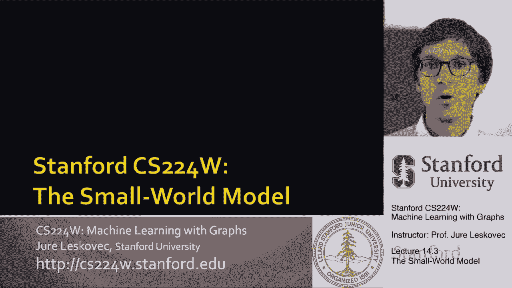
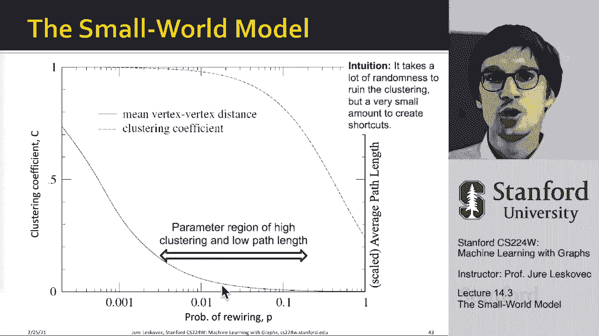

# P43：14.3 - The Small World Model - 爱可可-爱生活 - BV1RZ4y1c7Co

既然我们已经看了GP模型，让我们继续讨论小世界模型和小世界模型。

嗯，它的目标是什么，呃，它会试着给我们两件事，它会试图给我们平均的最短路径长度，但也会给我们带来很高的聚类系数，这很有趣的一点是，因为这两种力量是相互对立的，你得到的最短路径长度很小。

如果你有一个随机图，到处都有很多随机的联系，但是如果你有很多随机的联系，你有你，你的聚类系数很低，就像我们在全球定位系统中看到的那样，所以如果你想要低直径，呃就像GPS一样，但问题是你没有三角形。

你没有局部结构，所以我们的聚类系数很低，如果你有，假设一个非常正规的网络，像这个格子，在你知道的地方，呃，你有这些三角形，所以你有相当高的聚类系数，一切看起来都很好，但现在这个东西的直径会很长。

因为从一个角落到另一个角落需要很多步骤，所以下面的切线是正则格型图，它们的聚类系数很高，因为附近的节点是相互连接的，这种结构的问题是它的直径很大，你知道吗，另一方面，随机图没有局部结构，低聚类。

这很糟糕，但它们的直径很低，我们在真实的网络中也能发现，所以最大的问题是，我可以两个都要吗我可以要小直径的吗，但仍然有很多聚类系数，很多这种局部聚类结构，很多三角形，很多朋友的朋友都是我的朋友类型，呃。

呃，网络中的结构，所以嗯，关键是这种聚类意味着我们所说的边缘局部性，好吧基本上，意思是朋友的朋友就是朋友对吧，这意味着如果两个人有一个共同的朋友，那么那里更有可能有边缘。

但问题是这个边缘现在只是局部连接到已经连接的人，你不能用这个边缘连接网络的不同部分，所以你的直径变大了，我们看到MSN网络有七个数量级，较大的聚类系数，然后对应的随机图右，所以这是一个巨大的区别，对吧。

所以11点是巨大的，这是一个巨大的聚类系数，对吧，给你一个例子，在其他情况下，比如说，这是一个电影演员合作网络，我告诉你实际图中的平均最短路径长度，与具有相同节点数和相同边数的随机图的比较，嗯。

你看到你知道，平均，呃，最短路径长度在实际图和随机图之间非常好地对应，而这里我有实际图和随机图之间的聚类系数，你会看到有数量级的差异，至少一个数量级，所以至少有10个因子，如果没有，你知道几百个嗯。

实际聚类系数与相应随机图中的聚类系数之间的关系，这是电影合作网络之间的，呃，电子电网，你知道的，电线连接的方式，提供动力，就像德克萨斯州的权力一样，呃，和C优雅网络，它现在是一个网络。

C优雅蠕虫中的神经元是如何相互联系的，在你看到的所有情况下，我们有比较短的，错误训练随机图很好地捕获的最短路径，但是聚类系数远远高于随机图给我们的，所以争议或矛盾或一些不清楚的是下面的权利。

扩展的一个结果是最短路径存在，这基本上意味着具有高扩展性的网络，嗯直径小，因为我们可以得到它，呃，如果我们，呃，通过简单地遍历，呃，这个图形，但问题是，当你有短路径时，扩展和问题，你没有群集。

你没有局部结构，um三元闭包，意思是朋友的朋友是我的朋友，类型行为导致边缘的局部聚类，对呀，你有这种优势，接近朋友的朋友，但问题是，对于高聚类，你会耗尽边缘，这将作为一种捷径，呃，网络的不同部分。

然后问题就变成了您的群集，是的会很高，因为你封闭了很多三角形，但问题是现在你的直径也很高，因为从网络的一个部分导航到另一个部分需要很长时间，所以最大的问题是，我们能两者兼得吗，嗯，想法是这样的。

这个想法是我们想在正则格图和G之间插值，p，呃，随机图和呃，允许我们这样做的模型被称为小世界模型，它实际上会导致高聚类系数和低直径，所以基本上我们会从两边借最好的，我们将有局部结构。

所以我们有很高的聚类系数，我们也会有捷径，这样我们就有了一个低直径，那么我们如何实现这一点，所以GMP嗯有，呃两个，呃对不起，呃，小的，小世界模型有两个组成部分，首先，我们想从一个低维正则晶格开始。

就像一组节点，呃在一个圆圈上，这里一个节点连接到它的直接节点，邻居和邻居的邻居，所以这就是为什么它会有很高的聚类系数，但也注意到它的直径很高，因为从一个节点到另一个节点，你必须在这个周围导航，呃圆圈。

所以我有很高的聚类，我有很高的直径，我现在要做的是，我会在第二阶段做，我要介绍随机性，我要介绍捷径，这意味着我要添加和删除边缘，在远程对之间创建快捷方式，呃在圆圈上的格子上。

所以基本上对于概率为p的每条边，我要将端点移动到一个随机节点，所以我的想法是，你知道我随机选择一个边缘，我从它的一个端点随机选择它，并将边缘重新连接到另一端，所以这意味着，比如说这个边从黑色到呃。

从蓝色到黑色，我会重新布线，它仍然接触到蓝色，但它现在连接到其他一些，呃随机不，然后这是p对，你可以想到的是，嗯在左边，我有我的起始格子，当我有p等于1时，我有很高的聚类和很高的直径。

所有的边缘都重新布线，然后我有一个GPS随机图模型，我有低聚类和低直径，结果是对于p的一些中间值，我两个都保留，我有足够的捷径，以便有足够的边缘重新布线，所以直径比较小，我仍然有很多这些原始的边缘。

呃礼物，这样聚类，呃很高，所以基本上这种重新布线的机制允许我们在，嗯嗯高聚类常规网络，随机图，如果我们创建以下情节，在x轴上，我们创建重新布线的概率，然后在轴的一边，我们在这里用虚线绘制聚类系数。

在另一个轴上，我们绘制平均最短路径长度，并注意聚类系数如何保持较高，即使探测器，随着重新布线概率的增加，然后才开始减少，但最短路径长度下降得很快，随着我不断增加，呃，重新布线概率p。

所以这意味着在P的这个范围内，我有很高的聚类，但低最短路径长度，这就是我们所说的小世界，对吧，这是一个高度集中的网络，但还是有短的。

呃，最短路径，所以总结一下小世界模型，嗯，你知道，我们能有一个高度集群的网络吗，同时也是一个小世界，意思是，直径小，答案是肯定的，你知道为什么，因为你不需要更多的只是几个随机的链接来降低直径。

所以基本上直径，最短路径长度的鲁棒性远不如聚类系数，聚类系数低的权利，你需要很多三角形的边，而是直径小，您只需要沿着网络的遥远部分随机设置几个快捷方式，这将使直径非常非常快地塌陷，所以嗯。

小世界模型的意义是什么，它提供了对集群和小直径之间相互作用的见解，它捕捉到了，呃很多，呃，真实世界网络，它在这些网络中占了很高的聚类，嗯，但仍然缺少的是，呃，度分布，就像我们定义小世界模型一样，呃。

所有的节点都有相同的度，你知道在我们的情况下，我想所有的节点都有四级，这有点不现实，正如我们从信使网络中看到的那样，但只是嗯，基本上是通过这些，呃，我提出的两个模型，我想让你看看你有多能。

你可以把这看作是解释网络形成的一种方法，你可以把它看作是一种方式，捕捉网络的不同属性，思考在现实世界中可能会发生什么样的过程，你知道的，在我们的日常社交网络中，产生了网络，呃，我们实际观察到的性质，呃。

