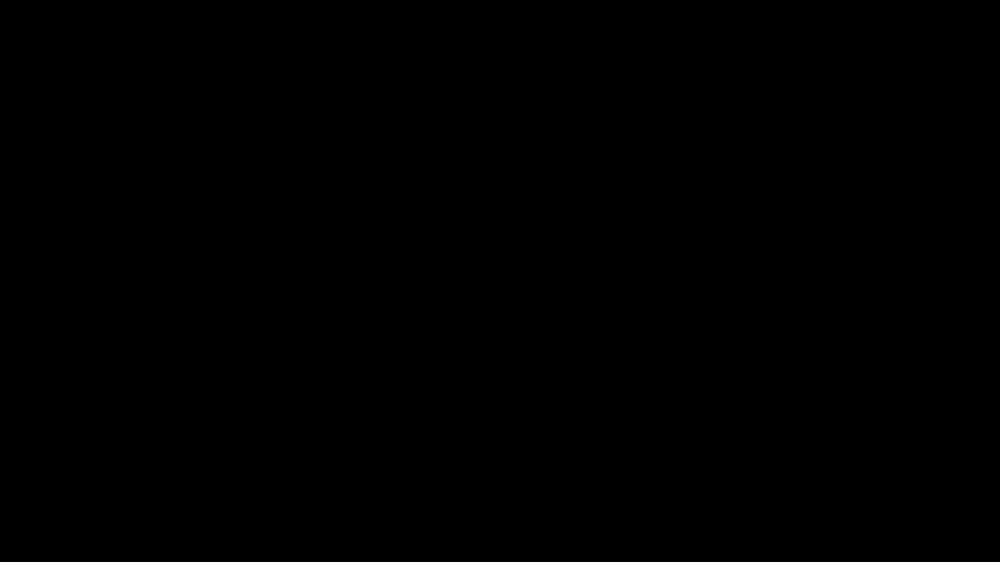
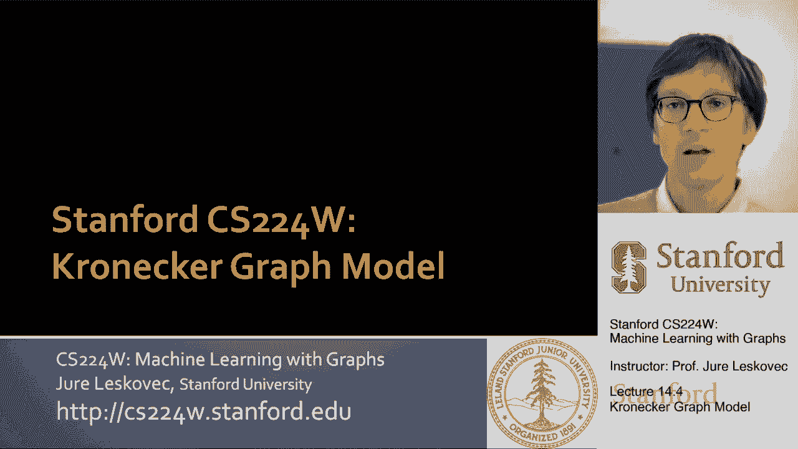
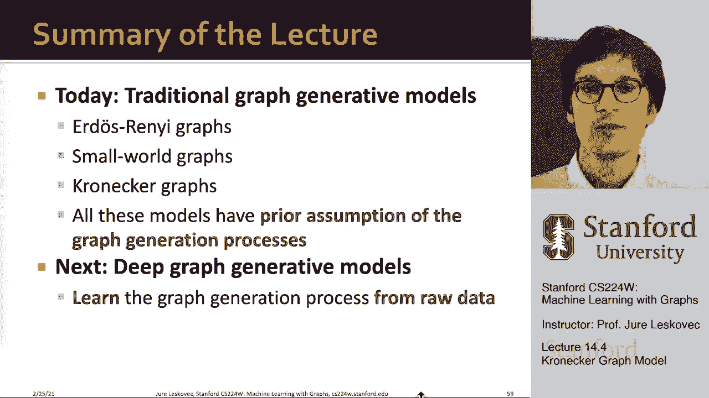

# P44：14.4 - Kronecker Graph Model - 爱可可-爱生活 - BV1RZ4y1c7Co

在讲座的最后一部分，我现在想谈谈第三个生成模型，我们称之为克罗内克图，呃生成模型，这是一个非常不同的，呃模特，因为它会更多，呃数学，在某种意义上更难解释，但它让我们产生了非常丰富的。

呃网络，所以呃，让我解释一下什么是克罗内克图模型，所以我们思考这个问题的方式是，我们将从递归图生成的角度来考虑它，对呀，我们能递归地思考网络结构吗，特别是我们能产生这种自相似的网络吗，呃结构。

你知道物体是自相似的，如果嗯嗯，如果物体与自身的一部分相似，就像你知道这个洞的形状和它的一个部分一样，这个想法是，我们将能够从小的图表中生成大的图表，呃，从，以这种方式模仿不同的社区和成长，不同的社区。

Kronecker图将允许我们通过这个来做到这一点，克罗内克产品的概念，这将允许我们生成自相似的邻接矩阵，对呀，所以这个想法是，如果我从一些起始图开始，我以某种方式递归地将这个起始图。

变成越来越大的图表，所以我想有一个小发电机，小积木，然后我想生成，用它生成越来越大的图形，它的工作方式是，我会用一个小的生成器矩阵，就像我这里的这个，我们就叫它K 1吧，然后我要。

把克罗内克产品涂在自己身上，所以我要做K1Kronecker产品，K一个现在要得到，呃一个矩阵，然后你知道我可以继续乘法，我现在会得到这个非常好的自我相似的结构，假设你知道那件衣服的尺码是81乘81。

注意K有这个，呃模式，你知道嗯，呃有一次沿着对角线带和0，对角线的，注意现在这个邻接矩阵也有相同的结构，对了，我有一个零块，然后我有这个块，但这些块都是相似的，有对角线的零点，在对角线上没有零。

然后这些块中的每一个都与原始块相似，这就是这些克罗内克图，呃呃，模型将允许我们这样做，现在我们如何定义它，我如何得到我刚才在上一张幻灯片上给你看的东西，我们要定义两个矩阵a和b的克罗内克积，下面的方法。

所以这个想法是，如果我有两个矩阵a和b，我把它们相乘，那么基本上，我把矩阵b，我把它放入a的每个单元格中，并与该单元格中的入口相乘，这意味着我可以取两个矩阵，呃A和B有不同的尺寸，和他们的克罗内克产品。

Kronecker产品的尺寸将是尺寸的乘积，对所以如果呃呃，矩阵A有n行，矩阵b有k行，那么乘积的行数将是n乘以k，列也一样，对和你看到的方式，现在，产品很简单，你拿B。

你把整个矩阵放入矩阵的每个细胞中，并与条目相乘，在那个牢房里，所以现在我们知道了什么是Kronecker的产品，呃，一般矩阵，我们可以通过以下方法定义两个图的Kronecker积。

简单地作为相应邻接矩阵的克罗内克积，对呀，所以现在我们已经定义了这个，嗯，这个基本上就在这里，我有克朗，有第一邻接矩阵，现在我把这个邻接矩阵和它自己做Kronecker乘积，我得到了这种结构，对呀。

我这里没有，因为如果我拿K，把它放在这里乘以零，我得到了一个三乘三的零块，而在这些其他部分，我得到的只是K one的副本，因为这里有一个系数1，所以基本上现在我得到了一个大小为9乘9的矩阵。

在那里我有一个两个大小为3乘3的零的块，剩下的只是这个的副本，现在我有一个9乘9的矩阵，我可以把九乘以九，九乘九矩阵，我会得到一个克罗内克，矩阵现在在81个节点上，所以我现在有一个81个节点的图。

那么我们如何定义克罗内克图，克罗内克图是通过生长得到的，嗯，通过不断增长的图表序列，通过在这个引发矩阵k上迭代克罗内克乘积，所以如果我想得到克罗内克图K，我把初始发起矩阵k k，我要把它和它自己相乘。

嗯M次，所以基本上我拿了第n个，引发矩阵的克罗内克幂，得到最终的图表，嗯，当然，没有人说你必须取一个引发矩阵，用自己的力量给它供电，m次你会有不同的引发矩阵，把它们相乘得到一个更大的图。

所以这里有很大的灵活性给你一个例子，这里是四个节点上的发起者矩阵，这里是相应的图，这是邻接矩阵，呃注意到基本上呃，我们在对角线上有自循环，然后有点呃，第一行第一列。

uh基本上是连接到其他卫星节点的星节点，如果现在我用这个启动器生成一个Kronecker图，这是邻接矩阵，再次注意到自相似性模式，呃，这里有一个不同的um引发矩阵和相应的邻接矩阵，又对了。

我有一个链接到所有其他节点的节点，但还有一个三角形，呃这里也是，呃在这一部分表示，现在请注意，当我创建一个Kronecker图时，我得到了相同的自相似结构，对呀，我基本上得到了一系列非零。

我有这两个为零的元素对应于这个区域，这里我有这个，这个部分对应于这里的这个部分，对呀，你看我是如何得到这个递归的自相似结构的，这里基本上这个发起者矩阵是，呃，它的结构被保留在不同的呃层次上。

这就是我们如何定义克罗内克图，到目前为止，我们把克罗内克图定义为确定性的，我们从零一邻接矩阵开始，我们生成了一个更大的邻接矩阵，我们接下来要做的是，这些克罗内克图，随机的，我们想让它，使其生成随机图。

我们用克罗内克图生成随机图的方法，不是把引发矩阵看作是一个小的，呃图作为一个零一类型矩阵，我们将把它看作一个概率矩阵，所以基本上不是有K，我们现在要有θ1，而不是和k有边或无边。

现在我们会说每条边都有零到一之间的概率，所以θ现在是一个概率矩阵，然后我们取这个θ1，我们要把克罗内克的力量应用到它身上，我们要去克罗内克，用自己的力量给它供电，获得机箱电源。

现在我们有了这个概率邻接矩阵，我们要随机从它的边缘取样，根据由此定义的概率，在这个矩阵里，所以让我给你一张图片来解释我的意思，所以我的想法是我从一些发起者矩阵开始，条目必须在零到一之间，它们不必和为一。

我Kronecker将这个引发矩阵相乘，得到一个更大的，呃，概率邻接矩阵，现在这里的每个单元格都可以解释为边缘的概率，所以为了生成图形，我现在只需遍历这个矩阵然后抛硬币。

每一个条目都告诉我那枚硬币的偏差是什么，如果硬币上写着，是呀，如果它能尾随着陆，呃对不起，然后我们实际上创建了一个图表，我们在图中创建一条边，然后我们称之为，这现在是从，呃概率，所以一旦你有了这个概率。

呃矩阵，你只要去抛硬币，根据单元格值中编码的偏差，这将给你一个图表，它现在会给你一个克罗内克图的实例，从这个，呃，随机克罗内克图，这很棒，因为现在我们可以生成图形，呃，随机地，但都有类似的结构。

都是从最初的，相同的首字母，呃，概率矩阵，有什么问题，问题是我们必须把所有这些硬币，如果图的大小为n，这意味着这个矩阵的大小是n乘n，然后我们需要翻转n阶平方，呃硬币，呃，这太多的硬币扔不过来了。

如果我想生成一个百万节点图，因为那样我就需要翻转一百万平方，呃节点，所以我必须掷10到12个硬币，或者如果我想生成一个十亿节点图，你知道没有太大的，那我就得把10个硬币换成18个不同的硬币，嗯。

这在实践中是不可行的，所以现在让我告诉你如何更快地做到这一点，用所谓的投球，呃或者是掉边机构，呃，这很酷，下面是我们将如何生成，呃，克罗内克图，呃快点，所以认为你有这个两个，um引发剂，呃，具有。

你知道条目a b c和d，如果你把这个和它本身相乘，克罗内克产品矩阵是这样的，第一个条目将是一个乘以a，那么它将是a乘以b a b乘以a b乘以b，乘以c以此类推，所以这是一种看待的方式。

它基本上是先让你生成所有这些细胞，然后你就可以抛硬币了，但你也可以注意到我们有这种等级结构，对，我有一个B，C和D，然后这四个中的每一个，象限还有一个B CD，所以你现在可以把它看作是一个两层结构。

你可以说的概率是多少，呃，给定边的，很简单，嗯，你可以，你可以，基本上呃，把它分成一组，几乎就像潜水一样，放入底层邻接矩阵，在哪里，在每个阶段，你必须决定四个象限中的哪一个，你想潜入。

所以让我给你举个例子，如果这是我的期末考试，呃，你知道这是我的最终邻接矩阵大小，我想创造，所以这将是节点数，呃，这里的行数和列数是多少，那么我能想到的是，我可以把它分成四个象限，我可以说，嗯哼，你知道。

有一小部分我会进入网络的这一部分，B的一小部分时间，我要去这里C和D，然后基本上你可以再选一次，嗯嗯嗯，根据这个值，a、b、c和d，这四个象限中的一个，现在你已经选择了它，你现在他们说，呃，嗯哼。

我我现在选择了这个，呃，这个象限，我再把它分成四部分，再让我从这四个不同的子部分中选择哪一个，我想潜入，你会从他们中挑一个，现在你仍然没有一直在矩阵的底部，你还可以选择哪个单元格，你去，所以再一次。

你把这个分成四，再分成四，决定这四个中的哪一个，呃选择正确，所以，呃，这意味着基本上，而不是呃，把这些呃硬币，一行一行的，你从顶部开始，然后你下降到四个象限中的一个，概率与a、b、c和d成正比。

你选择其中一个，进入那个部分，现在你说，嗯哼，我会的，我可以我有四条路可以走，从四条路中挑一条，呃随机的方式，你移动到一个部分，然后你又说，啊哈，现在我在这里，我想更深一点，你继续下降，直到你击中，呃。

单个细胞，这是当你嗯，当你停下来，你把边缘，嗯，这意味着你将降落在给定的单元格中的给定，精确地与概率，嗯，根据那个细胞，唯一的区别是你可能会得到几个边缘碰撞对，您可以多次借给同一单元格。

如果发生这种情况，忽略它，呃再试一次，这给了你一个非常快的方法来生成，呃，克罗内克图，对呀，所以嗯，基本上这个，呃，落边或落球机构，基本上说，um，取首字母，呃，矩阵，不管是什么条目，呃，使它们正常化。

然后不停地进来，继续下降直到你击中一个单独的细胞并在那里放置边缘，在那里放一个值1，这意味着您已经连接了节点，i和j，列中的，在第I行和第J列如果你这样做，有趣的是，比如说，用一个非常简单的，呃。

相邻参数矩阵，只有四个值，你实际上可以很好地生成与真实图相对应的图，这里是举个例子，的，这是一个有向图，从度到度聚类系数，呃，直径，也就是节点数，呃，在给定的距离上，这些是人们关心的其他一些属性。

你可以注意到Kronecker是如何用绿色绘制图形的，和真实的图形匹配得很好，你所要做的就是决定这四个不同的参数，对呀，四个不同的参数值，所以基本上只为了参数，我们能够生成，呃，真实感图形。

这里是克罗内克图，我们试图模仿的网络，有七万五千个节点和50多万个，呃，边，呃，所以很酷的是，现在我们也能够模拟学位分布，类聚类，还有呃，最短路径分布，以及其他一些只有四个免费的房产，呃，参数，这里是。

你知道那些参数的数目，如果你从这个发起者矩阵开始，你基本上可以在76000个节点上生成这个社交网络，和50万条边，所以呃，今天的讲座到此结束，呃，摘要，所以今天我们研究了这些传统的图形生成模型。

首先我们讨论了我们用什么指标来描述这个图，我们谈到了度分布聚类系数，嗯，巨型连接组件以及最短路径，我们从最简单的生成模型开始，叫做Erdoshi随机图模型，嗯，我们看到它产生了最短的路径长度，现实地。

它给了我们连通图，但不会产生聚类系数，然后我们谈到了小世界，呃，图形生成器，我们讨论了你只需要几个随机的捷径边，降低直径，但却保持了很高的群集度，所以这就是小世界模型的意义所在。

然后我们看了一个不同的模型叫做，克罗内克图更像数学，和呃是定义，呃，基于图邻接矩阵的克罗内克积，然后我们定义了随机克罗内克图，其中邻接矩阵是随机的，然后我们可以生成多个实例，呃，从随机矩阵，嗯。

我们聊了聊，然后最后是这个球掉下来，呃，允许我们生成克罗内克图的机制，呃快嗯，以快速有效的方式，所以我们可以生成有数十亿个节点的图，呃没有任何问题，所以嗯，用这个，呃，今天的课到此结束。

我们接下来要讲的，呃，下周是关于网络的深度生成模型，所以今天的模型是机械的，有很多呃，从现实世界中发生的网络生成过程中洞察，周二我们将讨论深度生成模型，基本上我们会说，让我们把它表述为一个机器学习问题。

作为一种情结，呃，我们所关心的是生成逼真的结构，我们不那么在乎，呃，你知不知道，真正的潜在原因是什么，让我们说，现实世界，呃，生成过程，所以我们学习如何从。

呃。

