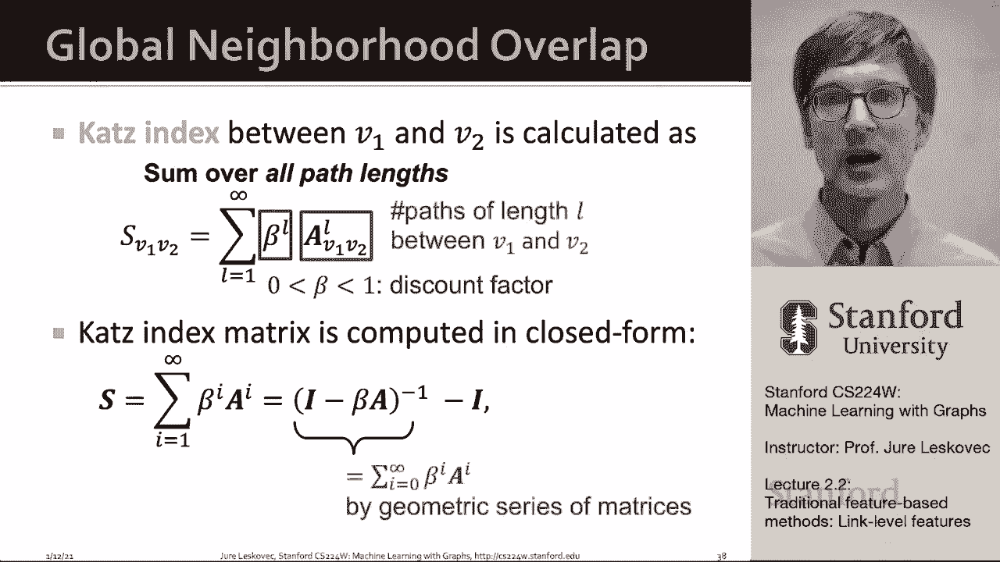

# P5：2.2 - Traditional Feature-based Methods- Link - 爱可可-爱生活 - BV1RZ4y1c7Co

我们继续研究传统的机器学习方法，呃对呃。

图级预测，现在我们有了，我们将专注于链接，预测预测任务和捕捉链接结构的特征。

在给定的网络中，因此链路级别预测任务如下，任务是根据网络中现有的链路预测新的链路，所以这意味着在测试时间，我们必须评估所有尚未链接的节点对，给他们排名，然后宣布前K音配对。

正如我们的算法所预测的是将要发生的链接，呃，在网络中，这里的关键是为一对节点设计特性，当然我们能做的，嗯，呃，正如我们在节点级别中看到的那样，呃，我们可以去的任务，然后呃，把一号节点的特征串联起来。

二号节点的特征，并训练一个模型在这种类型的呃表现，然而，这将是非常嗯不满意，因为呃，很多时候这会，呃输了呃，关于两个节点之间关系的许多重要信息，呃在网络上，所以我们认为这个链接预测任务是双向的。

我们可以用两种不同的方式来表达它，我们可以制定它的一种方法，简单地说，网络中的链接是随机丢失的，所以我们得到了一个网络，我们要把这个，呃，随机一些链接，然后试图预测回来，呃。

使用我们的机器学习算法的那些链接，这是一种配方，然后是另一种提法，我们将预测随着时间的推移的联系，这意味着如果我们有一个随着时间自然发展的网络，例如引用网络，社交网络或协作网络，然后我们可以说，啊哈。

我们要看零点和零点之间的图表，基于边缘和结构，呃时间t零质数，呃，然后我们将输出一个排名列表，我们预测未来会发生的链接，假设它们会出现在一次到一次质数之间，和方式呃，然后我们可以评估这种类型的方法。

就是说，啊哈，我们知道在未来，嗯，新的链接将出现，让我们，呃，让我们排名，呃，的，我们算法输出的潜在边，让我们把它和真正出现的边缘进行比较，呃，在未来。

这种类型的表述对于随着时间的推移而发展的网络是有用的或自然的，像交易网络，比如社交网络，井边，呃，保持，当，比如说，随机类型公式中缺少的链接更有用，比如说，对于像蛋白质这样的静态网络。

蛋白质相互作用网络，我们可以假设，尽管这一假设实际上被严重违反了，你知道生物学家正在测试蛋白质之间的随机连接，我们想推断未来还有什么联系，呃要去，呃为了，呃，因为生物学家将会发现，呃，在未来。

或者他们应该用他们的，呃，网络实验室实验，当然啦，在现实中，生物学家不是在探索物理，呃，蛋白质-蛋白质相互作用网络，嗯嗯，随机的，嗯，你知道他们受到彼此积极结果的严重影响。

所以基本上这些网络的某些部分被很好地探索了，而其他的还在探索中，所以有了这两种配方，呃，让我们现在开始思考，嗯，我们要怎么，呃，提供功能描述符，呃对于给定的，呃，结点对，所以这个想法是对于一对节点。

x y，我们要计算一些分数，嗯，呃，c x y，比如说，得分，呃可能是节点之间的公共邻居数，呃，x和y，然后我们要对所有对x排序，y根据递减呃，得分c um，我们将预测最高端对作为这里的新链接。

呃在网络上，然后我们就可以，呃，在测试时间对吧，我们可以去观察哪些链接出现了，并比较这两个列表，这样就决定了我们的方法有多好，我们的算法，嗯在工作，我们将用三种不同的方式来复习你，如何，呃。

特征化或创建两个节点之间关系的描述符，在网络中，我们将讨论基于距离的特征，局部邻域重叠特征，以及全局邻居邻域重叠，我们的目标是对于给定的一对节点，我们要描述一下，呃在两个节点之间，呃，所以从这段关系中。

我们就可以预测或了解它们之间是否存在联系，所以首先，呃，我们谈论基于距离的特征，呃，这很自然，我们可以考虑两个节点之间的最短路径距离，并这样描述它，所以说，例如，如果我们有节点B和H。

那么它们之间的最短路径长度，呃等于二，所以这个特性的值等于2，然而，如果你看这个，呃，这个确实，呃，什么做什么，这个度量没有捕获，它捕捉到了距离，但它不衡量捕获的类型，邻域重叠的程度或连接的强度，因为。

比如说，你可以看到这个网络节点b和h实际上有两个共同的朋友，所以在某种意义上，它们之间的联系更强，然后例如节点D和呃节点之间的连接，呃f，因为他们只有那种，只有一条路，而这里有两条路，所以我们可以。

试图捕捉两个节点之间的连接强度，就是问，好的，你们有多少个共同的邻居，对呀，一对节点之间的公共朋友数是多少，这是由局部邻域重叠的概念所捕获的，它捕获两个节点之间共享的相邻节点的数量，v和v 1和v 2。

一种捕捉方法，这只是简单地说什么是，共同邻居的数目是多少，对呀，我们取节点V的邻居，取节点v 2的邻居，取呃，这两个集合的交集，这个的规范化版本，呃，同样的想法是雅加达系数，我们在那里走十字路口。

相交的大小，除以工会的规模，共同邻居的问题是，当然，度数较高的节点更有可能与其他节点相邻，在雅加达的时候，从某种意义上说，我们是正常的，我们正试图正常化，嗯，在某种程度上通过说。

两个节点邻居数的并集是多少，然后呃，另一种呃，呃，局部邻域重叠，呃，实际上工作得很好的度量，实际上叫做黑暗指数，简单地说，这是在说，让我们复习一下，让我们把邻居算一算，节点V1和V2的共同点。

让我们在圆木上拿一个，他们的学位，所以基本上这里的想法是我们计算有多少邻居，嗯，两个节点有共同点，但是给定邻居的重要性是，嗯很低，呃减少，嗯，呃随着它的程度，所以如果你有很多共同的邻居他们的学位都很低。

那就更好了，那么如果你有很多关系密切的名人，作为一组共同的邻居，所以这是一张网，一个在社交网络中非常有效的功能，当然问题是，本地UM网络，邻域重叠的限制是这个度量总是返回零，如果两个节点不是，没有任何。

呃共同的邻居，所以说，比如说，在这种情况下，如果我们想知道节点a和e之间的邻域重叠是多少，因为他们没有共同的邻居，他们不仅仅是，嗯，离对方两步远，如果在这种情况下，它将被返回的价值永远是零，然而。

在现实中，这两个节点在未来仍有可能连接在一起，所以要解决这个问题，然后我们定义全局邻域重叠度量，通过只呃，专注于跳跃，一对节点之间的两跳距离和两跳路径，并考虑所有其他距离或整个图。

现在让我们看看全局邻域重叠类型，呃，度量，我们将要讨论的度量叫做削减指数，它计算所有不同长度的路径的数量，在给定的一对节点之间，所以现在我们需要弄清楚两件事，首先是如何计算给定长度的路径数，呃两个，呃。

节点，嗯，这实际上可以通过使用图的幂来非常优雅地计算，邻接矩阵，所以让我给你一个快速的例子或一个快速的证明，为什么这是真的，所以首先我想给你一个直觉，围绕邻接矩阵右的幂。

关键是我们要展示的是计算之间的路径数，呃，两个节点，um归结为图邻接矩阵的计算能力，或者本质上取图邻接矩阵并将其与自身相乘，所以第一个图邻接矩阵回忆一下，它有一个值1，嗯，在每一个入口UV，如果如果呃。

你的节点，呃，u和v是相连的，那么我们说P，呃，uv，呃，上标大写k计算长度k的路径数，在节点u和v之间，我们的目标是展示，呃，呃，如果我们对路径数感兴趣，呃，呃，长度k的，那我们就得，呃。

将A计算为K的次方，紫外线会告诉我们路径的数量，呃，这里的大写K和呃一样，小箱子，所以嗯，度量的大小写幂，给定长度的路径数，嗯，如果你想对了，有多少条长度的路径，在图邻接矩阵精确捕获的一对节点之间。

对呀，如果一对节点连接，然后有一个值1，如果一对节点没有连接，然后是价值，呃，零，现在我们知道如何计算，um-一对节点之间长度为1的路径数，现在我们可以问有多少，我们如何计算长度为2的路径数。

在你的一对节点之间，我们将通过两步程序来做到这一点，我们要通过分解，长度为2的路径变成长度为1的路径，加上另一条长度为1的路径，所以我们的想法是计算长度为1的路径数，在每个用过的邻居之间，呃和v然后嗯。

再加一个，所以这个想法是这样的，长度为1的节点u和v之间的路径数，呃，长度为2的uh只是节点上的求和，i是起始节点的邻居，u um乘以现在的路径数，从这个邻居I到目标节点，这将给出长度为2的路径数。

在u和v之间，现在你可以看到，你可以把这里的邻接矩阵代入，所以这一切都是一个总和，我你呃你你我时间，如果你看到这个，这只是矩阵的乘积，由邻接矩阵构成的，啊嗯，呃和它自己，所以现在，邻接矩阵的入口UV。

这是一个呃平方，现在基本上通过归纳法，我们可以继续重复这个，然后变得更高，呃重要的力量，呃，较长长度的路径，嗯，就像这样，呃增加嗯，另一种方法，呃，看看这个，这里有一个视觉证明，那是呃，什么是平方。

平方是a本身的乘积，所以当我们对给定的，让我们说进入这里，这些是入口，这些是节点一的邻居，这些是长度为1和1之间的路径数，呃，一个人的邻居和第二个节点，所以乘法之后，这里的值将是1。

这意味着在节点1之间有一条长度为2的路径，嗯和一个节点，呃两个，这就是邻接矩阵的幂给出计数的方法，一对节点之间长度为k的路径，呃，在网络中，这意味着现在我们可以定义，我们开发了第一个呃。

允许我们计数以计算切割指数的组件，因为它允许我们计算一对节点之间的路径数，对于给定的k，但我们还需要做的是，呃决定是我们如何为所有人做到这一点，呃，从一到无穷大的路径长度，所以要计算路径。

正如我们所说的，我们将使用邻接矩阵的幂，你知道的，呃，邻接矩阵本身告诉我们长度为1的幂，它的平方告诉我们呃的力量，它的平方告诉我们呃，两个长度的路径嗯和呃，邻接矩阵提高到l次计数。

一对节点之间长度为l的路径数，现在切割指数沿着从1到无穷大的路径长度，所以削减指数，呃，节点间的全局邻域重叠，呃，1和2只是l从1到无穷大的和，我们把这个贝塔提升到l的次方，基本上是一个折扣因子。

对长度较长的路径给予较低的重要性，A到L呃，计算v 1和v 2节点之间长度为l的路径数，切割指数的有趣之处在于，我们实际上可以用封闭的形式计算这个特定的表达式，这是削减指数的公式，基本上是什么嗯。

这里有一个封闭的表达式，它将精确地计算和，而这是真的原因，或者为什么有平等是这样的，我们注意到这只是一个几何级数，呃，对于矩阵，为此存在一个封闭的形式表达式，它所需要的就是把单位矩阵减去贝塔倍。

邻接矩阵，把那个，然后再一次，然后再减去单位矩阵，和呃的条目，这个呃，矩阵，呃，S会给我们任何一对的切割邻域重叠得分。

呃，节点数，所以总结一下，链路级特性，呃，我们描述了三个，呃，他们的类型，我们讨论了基于距离的特性，它使用，比如说，一对节点之间的最短路径，并且不捕获邻域重叠，然后我们讨论了这个邻域重叠，呃。

像公共邻居这样的度量，提花和捕捉，呃，以细粒度的方式精细，一对节点有多少邻居，呃有共同点，但问题是，相距两跳以上的节点，没有公共邻居的节点，度量将返回值为零，因此全局邻域重叠类型度量，比如说，就像呃。

Cut使用全局图结构为一对节点给出分数，并减少指数计数，一对节点之间所有Leng的路径数，这些路径被打折的地方，按指数，呃。

