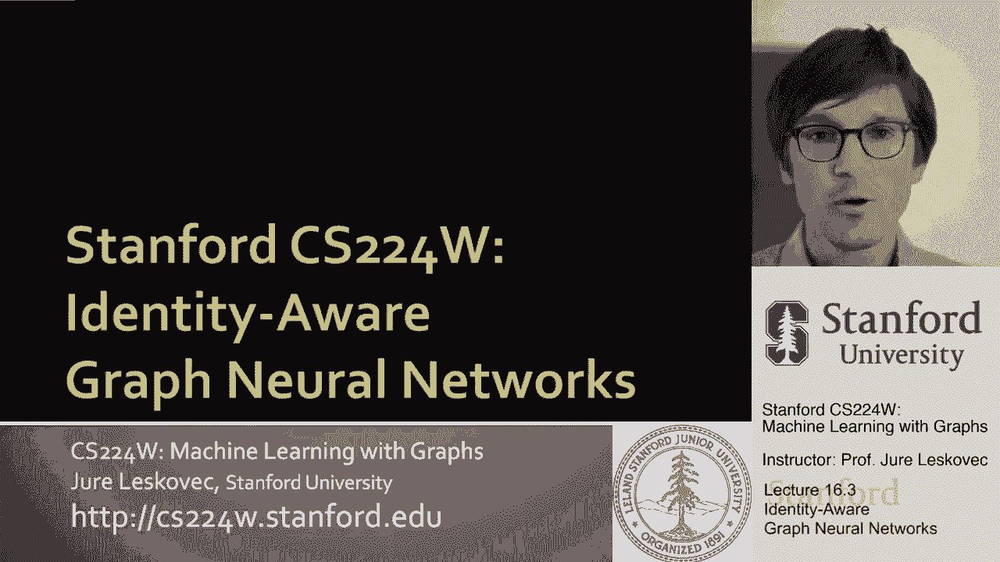
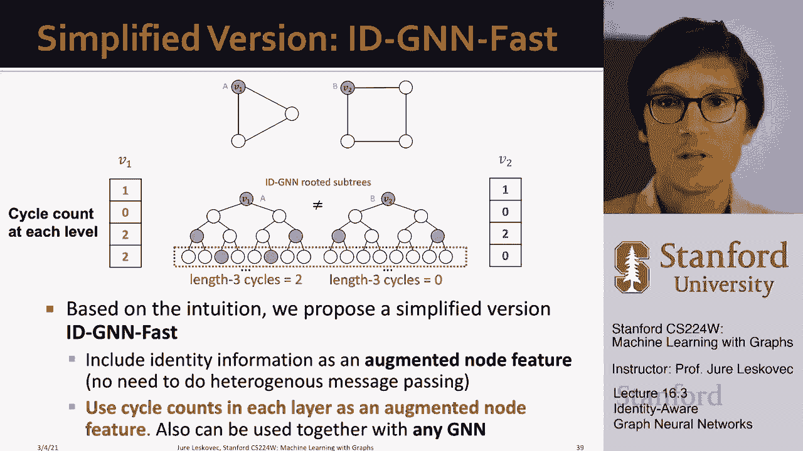

# P51：16.3 - Identity-Aware Graph Neural Networks - 爱可可-爱生活 - BV1RZ4y1c7Co

所以现在我们要，呃，勇往直前，我们将进入下一个话题，它被称为身份感知图神经网络，对呀，所以在讲座的前一部分，我们讨论了节点如何编码它在网络中的位置，节点节点如何知道网络中的位置，节点现在是，在第二部分。

我们将开发一个更具表现力的图神经网络，这将照顾到所有这些不同的对称性，可以解释，可以出现在网络和底层图中。

它将使图神经网络，呃，更有表现力，感知任务，我们说让我们用，嗯，让我们用锚，呃，现在我们要换回来把重点放在任务的结构上，并说gnns能完美地执行结构感知任务吗，正如我们之前看到的，不幸的是。

答案是否定的，问题是gnns在，结构感知任务，我要给你看一些，你知道失败的案例，当然，所有这些失败案例都是最坏的情况，非常复杂的，从某种意义上说呃，由于对称性，GNN要失败了，所以也许他们不一定出现在。

呃练习，呃太频繁了，但它们可能出现在数据的某些部分，它们仍然非常有用，呃学习，所以这里是前两个失败案例，呃，这是针对节点级任务的，假设您想进行节点级分类，你想做节点级预测，来自同一的不同输入，呃。

呃基本上不同的输入，但是相同的计算图会导致相同的嵌入，所以如果我有这两个节点，v1和v2，呃，你知道吗，驻留在这些类型的连接组件中，就像我们在他们的计算图之前说的，嗯，如果你算出来是完全一样的。

因为他们有两个邻居，每个邻居都有两个邻居，以此类推，所以这意味着这些节点，v1和v2，将被嵌入到嵌入空间中的完全相同的点中，我们将无法分配他们，呃，不同的标签，现在同样类型的事情也可能发生。

例如用于链路预测，在哪里，例如，您可以有这种类型的输入图，你想决定你是否知道V0应该链接到V1，或者它应该链接到V2再一次，如果你看看计算图，嗯那个，计算图相同，所以节点v1和v2有相同的嵌入。

因为它们有相同的嵌入，神经网络将给出相同的概率来边缘一个，以及边缘b，也许这不是，呃，最，呃，现实的，所以对于另一种类型的呃来说，这又是一个失败的案例，呃，输入图，然后你知道对于图形级别的任务。

也有一些，呃，众所周知，呃，失败案例，因为不同的输入图仍然会产生相同的图神经网络，基于uh的嵌入，为什么会这样，因为如果你，呃在这些类型的在这些类型的网络中，所有的节点都有相同的度。

但是你注意到这两个图是不同的，因为这里的节点链接到直接的节点，这里的节点，节点链接有点，呃再远一点，但是如果你看看计算图，两个计算图，呃也会一样，所以再一次，嗯，这两个，这两个完整的图将得到相同的。

呃嵌入，所以再一次，这是一种非常高度对称的，呃输入图，但还是嗯，这两个图是不同的，它们不是同构的，但是呃，你知道，这是WL测试的一个角落案例，也是一个角落的案例，图神经网络，所以这里又来了，图神经网络。

没有任何有用的节点特性，总是将节点A和B或图A和B分类为相同的，呃位置进入同一个班级，那么现在我们该如何解决这个问题，这里的大主意是什么，第二部分的主要思想是，我们可以为要嵌入的节点分配颜色。

这就是为什么我们称之为身份意识，因为当我们展开时，神经网络，它就会知道什么是起始节点，我们开始的节点是什么，所以这个想法是，如果我想嵌入节点，我要给它上色，如果我走了，嗯，因为我要给它一个颜色。

我现在是图表，计算图会不一样，因为我会记得每当我展开计算图的时候，我会记得的，这个颜色，呃，右彩色节点，所以这意味着，现在我们的计算图将，当它击中感兴趣的节点时，呃会记得，呃v一，所以它会有这些颜色。

嗯，你知道为什么，嗯，呃，为什么这个有用，呃，这很有用，因为它是归纳的，对呀，它对节点排序是不变的，呃或节点的标识，因为我们唯一着色的节点是我们开始的节点，然后我们就看。

我们开始的这个节点在计算图中出现的频率是多少，对呀，所以最终是对的，就像我们的图是连通的，当我们深入到图的更多层时，神经网络，会有一些循环把我们带回到起始节点，我们会记住这一点。

并在计算图中给这个节点着色，呃也是，这里重要的一点是因为呃，那么因为节点着色是归纳的，即使我有这两个，假设不同的输入图，但我对节点做了不同的标记或编号，我有一二三对一二三，基础计算图，呃也会一样。

这是很好的，因为他们不会在下面改变，呃，排列思想或身份，节点的呃，所以这是一个很好的功能，因为这意味着我们的模型能够更好地推广，所以现在让我们更多地谈谈这个，呃，归纳的呃，节点着色的能力。

让我们看看节点级别，任务，嗯，关键是这种归纳节点着色有助于我们完成节点分类任务，比如说，我这里有呃呃呃，你知道我们已经有的案子，呃，在我有三角形上的节点之前看了看，我在正方形上有一个节点，嗯。

我给根上色，现在我说，让我们在这里创建计算图，我创建计算图，而你嗯，很快就看到计算图很，呃很不一样，尤其是他们在，在底层，在这里的B部分，当我走的时候，呃呃两个两个跳，当我跳两下的时候。

我只打了这些节点，当呃在呃，在第一种情况下，我实际上又去打了一次，起始节点，所以现在这两个计算图是不同的，因为我们也考虑颜色，所以我们将能够成功地区分节点v1和节点，呃v二，所以呃。

这是一个非常优雅的解决方案，呃对这个，呃呃，问题在哪里呃，经典图，神经网络，呃会失败，嗯，类似地，我们可以做同样的事情，呃为了呃，用于图形分类，如果我把我的两个输入图，我创造的方式。

图的嵌入是创建一个嵌入，节点的uh，然后把那些，所以如果我看特定的节点，嗯，计算图，呃结构上，他们可能是一样的，但是因为我已经标记了开始节点，现在我知道了，每当我的计算图返回到起始节点时。

你注意到现在这两个图之间的着色模式，呃是不同的，这两个节点是不一样的，这意味着它们的嵌入将是不同的，这意味着当我们聚合嵌入时，图形的嵌入将是不同的，这意味着我们可以把这两个输入图，a和b，嗯和嗯。

将它们嵌入到不同的点中，并为它们分配不同的类，所以这正是我们想要的，你知道，对于边缘级别的任务来说，如果你知道，我从V 0开始，我说你知道我想分配一个不同的呃，从概率到节点，呃v a到边缘a和b。

我可以说V One的嵌入是什么，在这里，V 2将嵌入什么，我看到他们相应的计算图，呃会不一样，因为v 1会比v 2更快到达v 0，所以嗯这里，关键是当我嵌入节点进行链路预测时，我有一对节点。

在这里我要上色，嗯两个节点，左节点和右节点，这样我就能区分这两种计算，呃图表，所以这意味着它将允许我们为节点分配不同的概率，到边a和边b，这是呃，我们想要的，到目前为止，我所展示的是，这个节点着色。

其中我们为起始节点的标识着色，或者在链接中预测这个的，都是呃，节点和参与的链接预测任务使我们能够区分和区分呃，这些类型的对称，使经典神经网络，图神经网络，呃失败，所以现在的问题是你如何建造。

使用这种节点着色的GNN，这将使我们能够区分这些不同的颜色，呃计算图，想法如下，该模型被称为身份感知图神经网络，我们想做的是，我们想利用归纳节点着色，在嵌入计算中，关键思想是您希望使用异构消息正常传递。

在GNN中，我们将相同的消息聚合计算应用于计算图中的所有子计算，所以每当我们聚餐的时候，嗯质量和转化信息，我们在相同的神经网络算子中应用相同的聚合，对呀，这就是我们在图中的经典做法。

图神经网络的神经恒等式，我们将进行异构消息传递，所以我们将使用不同类型的聚合，嗯，根据颜色应用于不同节点的不同类型的消息传递，这意味着在静脉注射中我们将使用，不同颜色节点的不同消息和聚合uh功能。

所以这意味着例如，当我们聚合成一个颜色节点时，我们将使用一种类型的转换和消息传递运算符，每当我们聚集到一个非有色节点时，我们将使用第二种类型的聚合和转换，所以这意味着在给定的层中。

不同的消息和聚合uh功能将根据颜色用于节点，呃，节点的，这是关键对吧，因为如果节点节点的颜色，它可以使用不同的聚合器，这意味着消息将以不同的方式转换，这意味着最终的结果会有所不同。

取决于有颜色的节点是否参与聚合，而没有颜色的节点是否参与聚合，呃，呃，参与聚合，所以嗯，你知道的，为什么这种异构消息传递工作正常，假设两个节点，v 1和v 2具有相同的计算图结构。

但是它们有不同的节点颜色，既然我们应用了不同的神经网络嵌入计算，不同的um消息传递和不同的聚合权，对于具有一个的节点，我们有不同的参数，呃颜色与其他颜色的节点，这意味着最终的结果，呃会不一样。

这意味着最终输出，v1和v2之间的最后一个嵌入将是，呃不同，所以你知道，关键是什么，GNN和我们GNN的身份之间的区别，如果我们看看这个，嗯，你知道，呃，用这个箱子，呃，这个例子，我们已经看了这么远。

如果我有节点，v1和v2想在经典的gnn计算中区分它们，两个计算图相同，所有节点相同，没有区分节点特征，所以这两个的聚合，呃树也会一样，所以在这种情况下我们无法区分A和B，当我们实际给起始节点着色时。

现在两个计算图是不同的，所以我们现在要解释的，也就是说，当我们聚合来自um的信息时，呃，呃，从叶子到根的图神经网络，关于颜色的信息被保留，或者以某种方式解释，以便最终消息具有不同的值，取决于一个。

呃对另一个，而这正是，嗯，情况是发生了什么，这就是为什么IGN允许我们，呃，做出这种区分，嗯，另一件事考虑一下，G i G n到底在做什么，IDGNN实际上是在计算不同长度的循环，从给定的，呃。

给定根节点，对呀，所以如果我从这里开始，我现在将能够计数或意识到有一个长度周期，三右，所以这里，这现在基本上是一个循环，你去，你从你自己到呃，对邻居，然后给另一个邻居，你回到节点右边。

所以这是一个三跳的循环，而在这种情况下，你，我们将意识到图神经网络将意识到，这是一个长度为四的循环，因为您必须到邻居的节点，嗯，给第一个邻居，给第二个邻居，给第三个邻居，从这里你只能到达，呃。

到起始节点本身，对呀，所以在这里我们将真正的，计算图将能够捕捉到，或者能够计算，该节点是长度循环的一部分，呃四个，但没有长度为三个的循环，而在这里，这将能够捕捉到，节点是，呃，长度周期的一部分，呃。

三个但不是，呃，就四个吧，所以这就是我所能做的，它能计算周期，它能够学习和计数，通过图神经网络的A消息传递来计算它们，所以嗯，你现在怎么样，呃，呃，你现在怎么做，就像我说的，一个是用，呃，异构消息传递。

嗯和嗯，第二种方法是，我们可以根据我们的直觉，呃，刚刚求婚了，您还可以使用GNN的简化版本，其中基本上的想法是包括身份信息作为一个增强的节点特征，嗯，而避开异构节点，呃，呃，消息传递，这里的想法是。

基本上，您可以通过使用每一层中的周期计数来增强节点特性，作为增强节点特性，然后应用一个简单的gnn右，所以基本上你想在每一层中使用循环计数，作为根节点的增强特性，然后简单地应用均匀的呃，消息传递。

基本上把颜色掉对了，所以这个想法是每个节点现在，嗯，得到了一个简单的描述，说你有多少个长度为零的循环，长度的多少个循环的一部分两个长度的三个循环，然后嗯，等等，这样你就可以，节点，呃，两个计算图。

并能够区分两个节点。

呃，分成两个不同的类，让我们总结一下图神经网络的同一性，这是对图神经网络框架的一个通用而强大的扩展，嗯，它使图神经网络更具表现力，GNN，归纳节点着色的这个想法。

异构消息传递可应用于任何图神经网络体系结构，意思是嗯，呃，图卷积神经网络图，h um基因，所以图形同构网络和任何其他呃架构，um和gnn将在许多节点级别提供一致的性能增益，嗯，呃。

以及边缘和图形级别的任务，因为它允许我们打破对称性，使我们能够基本上识别节点是如何，呃属于不同的呃周期，这意味着IG NS比他们的表现力更强，呃，图，一类经典图神经网络，呃，呃，对应方，嗯。

这意味着我GNN是一种呃，呃，比一个W呃更有表现力的最简单的模型，l测试，它可以很容易地实现，因为它基本上只是你的颜色，根节点，这就是所有的信息，你需要，呃，担心，所以呃，这挺酷的。

因为它允许我们现在区分三角形上的这个节点，对正方形上的节点，嗯，这是第一次，关键的想法是让这个归纳节点着色，然后我们还谈到了位置感知图神经网络，其中的思想是你想区分节点在图中的位置。

关键的想法是使用锚的概念并描述位置，节点按位置的位置，嗯，通过节点到锚的距离，我们说过我们想要主播，不同尺寸的锚，我们想有很多一号的锚，我们想拥有很多，呃，2号锚较少，四号的就更少了，等等，等等，嗯。

节点到锚的距离是，节点到其中任何节点的距离，呃，锚还是呃。

