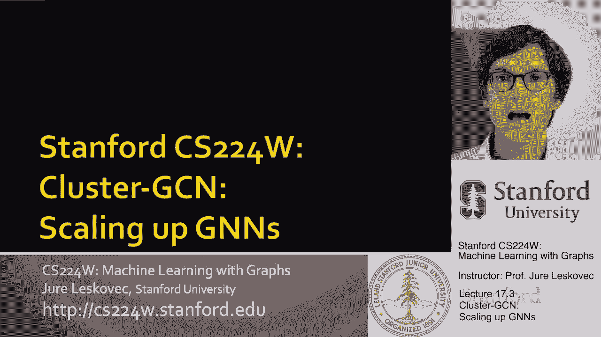
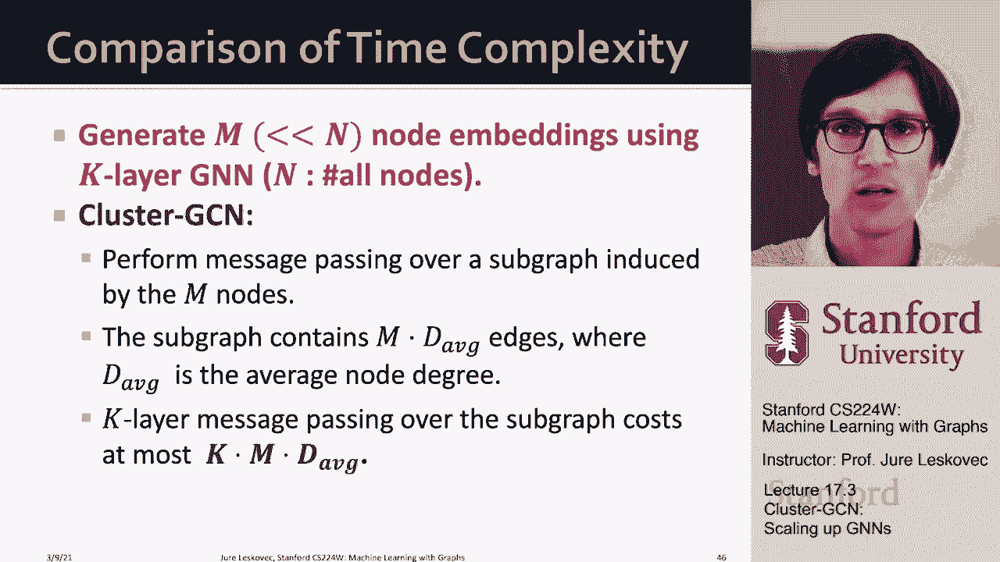

# P55：17.3 - Cluster GCN Scaling up GNNs - 爱可可-爱生活 - BV1RZ4y1c7Co

现在我们要讨论邻域概念中的第二种方法，取样并试图限制批量大小。

呃问题呃，在图神经网络中，我们要做的是，从下面的观察开始，计算图的大小，嗯仍然可以变得很大，呃或随着呃gnn层的数量呈指数增长，我们还可以观察到和注意到的是，在这些计算中，呃，由于共享邻居。

计算图可能非常冗余，对如果你觉得，比如说，两个节点a和b，你想想他们的计算图，然后他们就有了，呃，因为他们分享，他们有很多共同的朋友，这些计算图非常冗余，对呀，就像呃，同时计算a和b，子图，的。

下面节点C和D之间的计算图的部分是相同的，所以这将是重复的，这将是重复的，嗯嗯计算和嗯，有两种方法可以做到这一点，一个是呃，意识到这个呃，计算是重复的，只计算一次，去年有一篇关于这方面的很好的论文。

KDD叫呃，呃，母夜叉，分层聚合，呃，基本上防止，嗯，呃，多重计算，所以冗余计算，嗯和嗯，第二个案例将是关于集群GCN，这就是我今天要讲的，和我们的方式，呃激励集群GCN是为了记住，什么是整批，呃。

图神经网络，右整批图神经网络，就是，所有节点的所有嵌入都嵌入在，在一次传球中，所以基本上，为第一层计算所有节点的嵌入，然后为第二层计算所有节点的嵌入，呃等等，对呀，关键是。

你需要在实验室里嵌入所有的节点，在l层，减一，能够计算所有其他节点的嵌入，对于L层的所有节点，所以这意味着呃，在每一层中边缘数的两倍，呃，需要交换消息，因为每个节点都需要连接，收集它邻居的信息。

所以每个无向边都有两条消息，你知道对两个人来说，端点和呃，观察是什么，观察到我们在单层中需要做的计算量，呃，假设一个完整的批处理实现在图的大小上是线性的，它的边数是线性的，所以它的速度非常快。

但问题是图太大了，呃，所以我们不能马上做这种事，呃在GPU里，所以整批的洞察力，gnn是分层节点嵌入更新，允许我们重用上一层的嵌入，这大大减少了计算冗余，邻里抽样，对呀，这意味着该层智能更新以生成嵌入。

从一层到下一层很便宜，对呀，所有我需要做的是以前的层嵌入，我需要把它们聚合在一起，将它们与给定节点的前一层嵌入相结合，我有了一个新的，嗯，新嵌入，所以这意味着，这可以做得很快。

它只是图的大小的线性时间运算，因为这个聚合，呃，时间基本上是线性的，因为它是我们聚合的边的线性数，所以这意味着计算非常快，但当然问题是分层更新是不可行的，一次对整个图，因为GPU内存。

所以现在集群中的想法是什么，gcn是我们能把整个图分成小的子部分吗，然后对这些子图执行完整的批处理实现，所以这个想法是这样的，我拿大图，我要取样它的一个子图，我不知道。

也许我只想说我会对这个子图进行采样，然后我要去，呃，在这个子图中，我能适应GPU，所以现在我可以应用一个完整的批处理实现，呃在那个采样子图上的GPU里，所以这就是本质上的想法，所以邻里采样的区别。

在那里我们计算每个节点的计算图，嗯，在这里，我们将取样原始图的整个子图，然后假装这是感兴趣的图，在上面执行gnn，呃，右子图，那么问题是我应该如何对这些子图进行采样，训练GNN的好子图是什么，嗯。

原因是这样的，要记住的要点，GNN通过网络边缘传递消息来执行嵌入，对呀，每个节点通过从邻居收集信息来计算其嵌入，呃对，所以现在的想法是，如果我想有一个好的子图，好的子图，必须尽可能多地保留原始图形的边。

这样我的计算就模仿了，尽可能地在大图上进行计算，所以我们的子图应该尽可能地保留原始图的边连通性结构，这意味着子图上的gnn，生成接近的嵌入，呃到原始图表上的GNN，所以给你一个想法。

如果我有一个原始的图表，让我们假设我取样呃，我在四个节点上采样一个子图，就像我在左边展示的那样，或者我在四个节点上采样另一个子图，就像我在右边显示的那样，那么很明显，左边的子图更适合训练。

因为如果我现在说，让我们计算这里这个角节点的嵌入，它的三个邻居都在子图中，所以说，我就能对这个的嵌入有一个很好的估计，呃结点嗯，这里的一个角节点，所以对了，都是它的，嗯，呃，邻居是我子图的一部分。

如果我在这里取另一个子图，我们用绿色节点表示，我也想预测或生成这个绿色节点的嵌入，然后我所能做的，是来自其邻居之一的聚合消息，因为只有它的一个邻居是我的呃，右子图，所以右子图下降了很多很多边，嗯。

并导致孤立的节点，这意味着我的呃，这个子图上的计算图不会代表计算，原图中的图，所以左选择要好得多，嗯比正确的选择，现在让我们回到网络社区结构，因为现实世界的图表显示了社区结构，它们表现出集群结构。

所以一个大的图可以分解成许多小的图，呃，社区，关键的洞察力是我们可以对这些子图进行采样，基于社区结构，使每个子图保留大部分边，而只保留少数边，呃都掉了，所以一个集群，gcn，它的工作方式，它有一个呃。

两步过程，在预处理步骤中，我们把原来的图拆分，把它切成许多小块，呃，小，呃子图，然后呃，迷你批量训练意味着我们对一个节点组进行采样，一个子图，然后呃，执行传递整个子图的完整批处理消息，计算节点嵌入，呃。

子图中所有节点的节点嵌入，估价损失，计算梯度，并正确更新参数，所以这个想法是输入图分成许多子图，我们取一个子图，把它装进GPU内存，在子图上进行完整的计算，计算损失，在另一个子图中更新模型参数加载。

做完整批，呃，子图中所有节点的层嵌入，计算损失，更新梯度载荷，呃，下一个子图，这就是香草集群GCN的方式，呃，会起作用，所以为了给你更多的细节，这个想法是，给定一个大图，我们要把它划分为。

比如说大写的c群，我们可以使用一些可扩展的社区检测方法，就像鲁文，呃喜欢我的方法，嗯，或者我们可以用，然后基本上这一套，节点组v，我们将在这个节点子集上取一个诱导子图，嗯，基本上。

这个诱导子图将包括所有的边，在小组的成员之间，当然，这些穿过子图的边，这些都会被扔掉，所以在群边之间会掉在这个，呃呃，图G 1到GC，我们采样的这些子图是什么，所以现在每个呃，小批量。

我们将对一个这样的节点组一个这样的子图进行采样，在该节点集上创建一个诱导子图，这是我们将要使用的图表，um作为GPU中的计算，所以关键是这个诱导的子图必须适合GPU内存，所以现在我们进行分层节点更新。

基本上和我们整批做的一样，呃GNN，现在计算所有节点的嵌入，在子图中，我们计算，呃，损失，然后做，计算相对于损失的梯度，然后进行渐变更新，所以这里的重点是当我们做图表的时候，h邻域采样我们的节点。

我们能够对它们进行取样，所有的图表，但在这种情况下，嗯，我们将对原始图的一个子图进行采样，现在只在这些节点上计算，呃，我们已经取样了，这就是邻里采样之间的最大区别，这些社区可以分布在整个网络中。

而在这里，我们将创建这些街区，基本上只是局限于我们采样的子图，我们将该子图放入GPU内存，那么有什么问题，我们如何修复它们，集群gcn的问题是这些诱导子图在，呃，在组链接之间，子图链接之间，结果。

来自其他组的消息将在消息传递过程中丢失，会很痛，这可能会伤害，呃，GNN性能权，所以说，比如说，如果我在这里取这个红色的图，我只是放大节点，融入其中，我看到的是，比如说，无论何时，呃，这个特定的节点。

它永远不会从这两个边缘聚合信息，因为这两个，呃，节点端点是集合的一部分，不同的子图，因此，所有的消息聚合将只发生在这四个节点之间，呃，和五个，呃，它们之间的边缘，所以在某种意义上会有，呃，丢失的消息。

所以呃，问题将是，因为图社区检测将相似的节点放在同一个组中，样本节点组往往只覆盖整个图的一小部分集中部分，对呀，所以我们将只在图的一小部分集中学习，而邻里抽样让我们可以在很小但非常多样化的情况下学习。

呃，一套呃，街区，嗯，这意味着，因为示例节点示例子图将是什么，将是整个图形的集中部分，它不会是多样化的或代表性的，以代表整个，呃，训练图，所以这意味着当我们计算梯度和损失时，呃。

从一个节点组到另一个节点组会有很大的波动，因为社会社区，呃，如果你这么想的话，每个子组将非常集中在一个给定的方面，模特会很难学对，你会我知道你知道你有一群计算机科学家，所以你会学会如何制作。

你将计算关于计算机科学家的梯度，然后你有一群，让我们说，呃，音乐系学生，现在你的渐变，只是你的模型，刚刚通过计算机科学家计算，在你的社交网络中，现在将被计算在音乐人身上，非常非常不同。

然后我知道你有不同的数学家，不同于两者的数学家群体，所以梯度会波动很大，训练也很不稳定，这在实践中导致，呃，随机梯度下降的梯度下降，所以呃，改进的方法，这就是所谓的高级集群GCN，这里的想法是。

我们希望在每个迷你批处理中聚合多个节点组，对呀，所以我们的想法是让我们采样的图变得更小，但接下来我们要取样多个这些子图，嗯到迷你批，嗯，我们将在聚合节点组上创建一个诱导子图，它现在由许多小的，呃节点组。

其余的将与集群gcn中的相同，也就是现在取诱导子图，将其放入GPU内存并创建更新，但现在的重点是，这些子组可以更加多样化，所以诱导子图会更加多样，所以你的渐变会更稳定，更，呃代表，所以这是照片，图片是。

现在我的节点组比以前小了，但我可以品尝更多，所以我在这里采样两个节点组，现在采样子图是节点上的诱导子图，属于这两个群体，所以我也会包括，呃这个呃呃蓝色，呃边缘，把两个群体联系在一起，所以这意味着。

这使得示例节点更具代表性，更加多样化，它们更能代表整个节点种群，这将导致更好的梯度估计，梯度差异更小，训练更快，呃和收敛，所以呃，只是想说更多对吧，这又是一个两步走的方法，我取节点，我把它们分成很小的。

呃子组，比原版小得多，但是呃，当我在做小批量训练的时候，我将对多组节点进行采样，然后我将把这些节点组聚合成一个超组，然后我要在整个上创建一个诱导子图，呃超群，然后我要包括这个超群所有成员之间的边。

这意味着它将是小亚群之间的边缘，以及小亚群之间的边缘，嗯，然后我将执行一个集群gcn和我们之前做的一样，所以现在如果我比较集群gcn方法和邻里抽样方法，这两个是如何比较的邻里抽样说，呃，样品h uh。

每层节点，嗯，让我们为网络中的嗯M节点做这个，升到k的次方，m是计算图数，呃是计算图的扇形，k是GNN的层数，所以对于计算图中的m uh节点，我们在内存和计算方面的成本将是M倍，呃到集群中的K，呃呃。

我们正在对由m个节点诱导的子图执行消息传递，在m个节点上的子图将包括n倍平均度数，边数，对呀，子图中的每个节点都有，所以我们总共会有m乘以，平均学位，呃，图中的边数，因为我们在做K跳。

呃，消息传递，这种方法的计算成本是子图大小的k倍m，乘以平均度数，所以如果你把两者进行总结比较，从K层中的M个节点生成嵌入的成本，在集群gcn中，gnn是m到m乘以h到k，是平均度数的k倍m倍，嗯。

如果你假设让我们说嗯，h为平均度数的一半，那就意味着，集群gcn比邻域采样计算效率高得多，所以嗯，它是线性的，而不是指数的，关于到深度，所以我们在实践中所做的，这有点取决于数据集。

通常我们设置h大于平均度数的一半，呃，也许你知道，两次三次，呃，平均学位，而且因为层数k不是，呃没那么深，嗯，邻里抽样的方法倾向于更多，呃，已使用，呃，在实践中，所以总结一下，集群gcn。

首先将图中的整个节点集划分为一个小的节点组，在每个迷你批次中，对多个节点组进行采样，呃，它们的节点聚集在一起，然后在此基础上生成一个诱导子图，呃，呃，um节点节点，呃，从我们取样的组的结合中。

呃是创造出来的，然后gnn执行分层节点嵌入，在此诱导子图上更新，一般来说，集群GCN的邻域抽样计算效率更高，嗯，尤其是层数大的时候，嗯，但是集群gcn会导致系统的倾斜梯度，因为缺少跨社区的边缘。

也因为呃，如果呃，层数深，然后在原图中，嗯，如果你做邻里抽样，你真的可以深入，但是在集群gcn中，你只需要走到采样图的原始边缘，然后你会反弹回来，即使你有很大的深度，这个深度会在子图上振荡。

甚至不会真正探索潜在原始图形的真正深度，所以呃，总体，嗯，我想说邻里抽样更多的是使用，因为额外的，呃。

