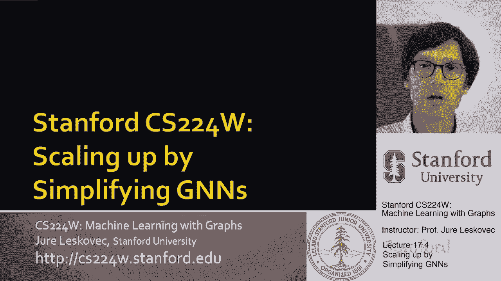
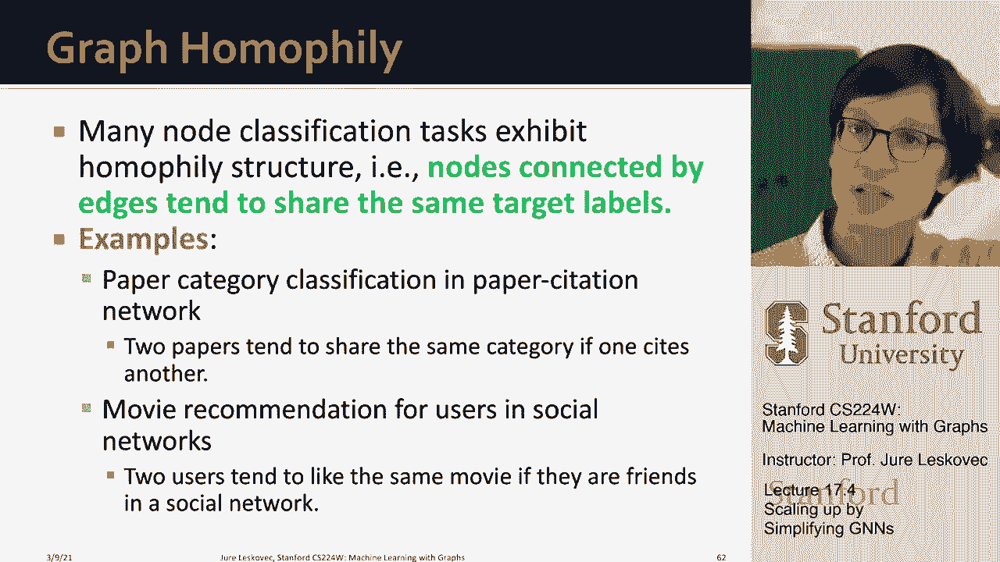

# P56：17.4 - Scaling up by Simplifying GNNs - 爱可可-爱生活 - BV1RZ4y1c7Co

所以嗯，我想讨论的第三个主题是扩展图神经网络，通过简化它们的体系结构，这是一种与前两种方法正交的方法。

我们要怎么做，我们将从一个图卷积开始，呃，呃，网络作为一个示例体系结构，我们将通过消除非线性激活来简化它，从gcn右边，实际上有一份报纸，呃，两年前或一年半前，这表明基准测试的性能并没有低太多。

因为你有，呃，去掉了非线性，这意味着现在，这个简化的GCN架构是一个非常可伸缩的，呃，我们可以快速训练的模型，所以基本上这里的想法是，你将简化图神经网络的表达能力，这样你就可以训练得更快，嗯。

在复杂的模型上，可以模拟复杂的模型，嗯，呃，这里的表示，我们在说，简化模型，所以在大数据上运行很快，当然，这里有一个权衡，所以让我，呃，介绍呃，gcn，然后我们从那里继续，所以GCN采取了一个图表。

有结节的特征，u，这将是呃，方便呃，后来的数学符号，让我们把这看作是一个完整的批处理实现，对呀，所以我们基本上说节点嵌入是一层接一层的，简单地说，节点特性，然后我们要迭代k，呃K层在呃每一个。

K层的每个节点，另外一个是将其邻居的嵌入，从前面的层，总结一下，um除以层数，邻居数，呃，呃，呃，然后我们要运行这个，呃，英国迭代的递归，以及我们最终得到的任何东西，用任何嵌入，我们最终。

这就是我们所说的，呃，最后的嵌入现在gcn的好处是它是如此简单，我们可以很好地把它写成矩阵形式，所以我们将它写成矩阵形式的方式，我们要把这些嵌入，我们要把它们堆叠到一个嵌入矩阵中。

然后A是我们的邻接矩阵，其中每个节点也有一个自循环，在给定节点的邻居上写入和的方式，嗯，的一些嵌入，呃，呃，呃，给定节点的邻居的给定，您可以简单地将其写成邻接矩阵之间的乘积，A和嵌入矩阵，嗯嗯和嗯。

这意味着现在我们可以，um也将d的这个概念定义为对角矩阵，在那里我们都是零，只在对角线上，呃，我们有每个节点的度，然后d d与负数的倒数，是对角矩阵的逆，就是你在学位上放一个，在每个节点的对角线条目上。

所以现在你可以在邻居身上写总结的方法，除以节点的度数，对角矩阵的逆，所以1除以度乘以邻接矩阵，乘以隐藏，呃，呃，嵌入矩阵h，所以这意味着现在给定l级的h，如果我们把它乘以a，再乘以d到负数。

我们得到H级加一的节点嵌入矩阵，所以基本上这里的优雅之处在于，您可以重写这个迭代，嗯嗯，就像三个矩阵的乘积，当然，在gcn中，我们也有一个值非线性，嗯嗯，然后呃，转化，呃，这里所以回到GCN。

下面是基于节点的，呃，呃，制定全球化学品统一分类和标签制度，如果你用矩阵形式写，你可以写这是一个呃，非线性，时间乘以这个波浪，这只是学位时间，呃一个，作为变换矩阵的W矩阵，所以基本上方程。

这个基于网络的方程，和下面的矩阵方程它们是等价的，所以如果你是，如果你计算这些矩阵的乘积，你刚刚计算了k，加上网络所有节点的一层嵌入，现在你可以迭代这个大写的k次来计算k，呃层次，所以嗯。

这就是GCN的矩阵公式，所以现在让我们去简化gcn，让我们假设并移除这个值，呃，非线性，所以让我们，让我们说会发生什么，如果gcn将由以下等式控制，对呀，所以回去，这是一个非线性方程。

现在我们决定现在我们决定放弃非线性，所以这是我们的，你知道简化的GCN方程，所以现在让我们去展开这个，呃，这个迭代，让我们展开这个递归，对呀，所以我们说，呃，下面是最后一层嵌入，呃，对于节点。

它们依赖于节点的K层减去一个嵌入，现在让我们把这个h到k减去一，然后把它，呃，用我们计算的方式，在K层减去1，你知道，我把这个部分，只是我把它插在这里，所以我再一次把h，k，减去2，再一次把它展开。

如果我一直这样做到零层，那么我知道该怎么做了，就像零点是呃的矢量，节点特征x这些一个波浪就这样相乘在一起，所以这是一个上升到k次方的波浪，最后这个，这个呃参数矩阵，它只是参数矩阵的乘积。

那仍然是一个矩阵，所以我可以重写这个递归方程，如果我用下面的方式展开它，然后我意识到参数矩阵的乘积只是一个参数矩阵，对呀，所以基本上我只是重写了K层，把gcn转化为这个非常简单的方程，这是非递归的。

它是一个上升到k次方的波浪，乘以特征向量，乘以变换矩阵，那么重要的是，你需要什么，呃，记住这里关于，呃，上升到k次方的波浪线，记得在我认为一两节课，我们说过，给邻接矩阵供电，到第k次方，意思是。

意思是我们在数路径，意思是我们在连接节点，它们是，他们是邻居，邻居的邻居等等，所以基本上这意味着这是K的一个波形，真正将目标节点连接到其邻居，邻居的邻居，邻居的邻居邻居的邻居等等，嗯。

在网络的更远的地方跳一跳，呃随着我们的增加，呃，这很有趣，那么现在我们能得出什么结论，我们可以得出结论，去除非线性显著简化了GCN，还注意到，所以我们可以在CPU上预先计算，甚至在我们开始呃训练之前。

嗯，对，这可以非常有效地计算，因为我所要做的就是把A和，呃X和它自己在一起，嗯多次，我将能够到达A波浪形上升到功率，k乘x，所以计算这部分非常容易，它不依赖于任何UM模型参数，所以我可以预先计算。

嗯怎么样，所以说，我们了解到的是，呃a到k乘x可以预先计算，让我们把这个叫做呃x呃波浪，所以现在呃简化的gcn，最后的嵌入层就是这个X波形，乘以参数矩阵，这只是预算矩阵的线性变换，好吧，这样我就可以。

我能想到这个，这基本上只是节点的预先计算的特征向量，节点的嵌入，呃V只取决于它自己的预处理，呃功能对，我在那里，我说这个x波浪真的是x波浪，用波浪线的k次方乘以x来计算，但这是一个矩阵，每个节点有一行。

所以如果我说一个给定节点的最后一层嵌入是什么，只是矩阵中相应的行，呃W，但这里要注意的是，一旦计算出这个x波形，那么呃，给定节点的嵌入仅依赖于给定行，固定不变的x波形，唯一可以改变的是。

所以这意味着M的嵌入嵌入，节点可以在线性um与m的时间内线性生成，因为对于给定的节点，它的最终嵌入只取决于它自己，矩阵中的一行，呃x波浪，所以我很容易看到，对一小批节点进行采样，我从矩阵中抽取一组行。

呃，然后i乘以w，获得这些节点的最后一层嵌入，嗯在迷你批，所以嗯，当然，这将是超级快的，因为节点之间没有依赖关系，呃x波浪，所以总而言之，呃，简化的gcn由两个步骤组成，预处理步骤，其中pre。

在那里我们预先计算，这个x波浪是简单的邻接矩阵，啊嗯，在对角线上节点的度数上有一个，我们称之为波浪，我们把这个提升到案例力量，所以我们将它与自身相乘k星k次，然后我们将其与节点的原始特征相乘，呃X。

所有这些都可以在CPU上完成，甚至在我们开始训练之前，所以这意味着我们有这个矩阵，呃，呃，每个节点有一行的波浪，嗯，这就是我们所需要的训练步骤，基本上每一小批，我们要取样呃，随机m个节点。

然后我们简单地计算它们的嵌入，并将其与，呃，在矩阵中的相应条目，与那个节点相对应的波浪，呃，呃，呃v，和，我们只需计算所有节点的最后一层嵌入，在迷你批次中，嗯，然后你知道我们可以用这些嵌入来做出预测。

计算损失，然后更新矩阵，参数矩阵，呃W，所以这里的好处是现在每个节点的嵌入，呃，它是一个简单的矩阵乘以向量的乘积，而这是可以做到的，呃，超级超级快，总结一下，比较呃呃，集群gcn与呃呃。

我们学到的其他方法，呃，今天，简化的gcn生成了更多的节点嵌入，呃有效率，不需要创建巨大的计算图，不需要做图形采样，一切都很非常简单，对呀，你只要做那些矩阵乘积，所以嗯，看起来很棒，但我们失去了什么。

嗯对，与集群GCN相比，简化gcn中的小批处理节点，可以完全随机采样，从呃，整个节点集，正如我所说，不需要做组来做节点组来做，呃，喜欢集群gcn，不需要做诱导子图，没有像这样的，所以这意味着。

我们的训练很稳定，um和梯度的方差，呃在控制之下，但对吧，价格是多少，代价是这个型号远，呃不那么有表现力的意思，与原始图神经网络模型相比，简化的gcn远没有那么有表现力，因为它没有非线性，呃。

在生成节点嵌入中，所以这意味着我们讨论的理论，保持底层子图的结构，呃，窗外的一切，因为我们不再有非线性了，所以这真的对模型的表现力产生了巨大的影响，但你知道，在许多现实世界的案例中，呃。

简化的GCN往往工作得很好，嗯，而且往往比最初的图神经网络工作得稍微差一点，尽管远不如，在理论上很有表现力，所以问题是，呃，为什么呢，原因是图同源，这基本上意味着，呃，这是社会科学的一个概念，呃。

一般人喜欢叫它，呃，羽翼鸟，呃粘在一起，所以说，物以类聚，所以基本上这个想法是相似的人倾向于相互联系，所以基本上你知道计算机科学家互相认识，呃，学音乐的人，互相认识，所以本质上。

这个想法是你有这些紧密紧凑的社会社区，人们共享属性和属性的地方，只是因为更容易与与你有共同点的人联系，你和他分享一些，呃利息对吧，所以基本上这在，让我们说，网络，在社会生物学知识图中。

由边连接的节点往往共享相同的标签，它们往往有相似的特征，在引文网络中写作，同一地区的论文，在电影推荐中倾向于互相引用，就像人们对给定的流派感兴趣一样，你看了同一类型的多部电影，所以这些电影有点相似。

所以，嗯，你知道为什么，为什么这对简化的GCN很重要，因为嗯，简化GCN的三个预处理步骤，只是K跳上的特性聚合，呃，邻里权利，因此，IS获得的预处理特征是通过迭代平均获得的，嗯，呃。

邻居的特征和邻居的特征，没有学会改造的邻居，没有任何非线性的意志，所以结果，由边缘连接的节点往往有相似的预处理，呃，特征，而现在，如果标签，嗯也聚集在网络的同质部分，如果标签在网络上聚集。

那么简化gcn会很好的，所以呃，基本上，的，简化的GCN什么时候起作用，前提是模型利用预处理节点特征进行预测，由边缘连接的节点倾向于获得相似的预处理特征，因为这一切都是关于当地社区的特征平均。

所以如果由边连接的节点倾向于在同一类中，往往有相同的标签，那么简化的GCN就要，呃，做得非常准确，呃，预测，所以基本上如果图现在有这种同构结构，如果图没有这种同构结构，那么简化的gcn就会失败，呃。

相当相当糟糕，所以这是一种直觉，当然也提前了，我们通常不知道标签是否聚集在一起，或者它们是那种闪闪发光的，呃，整个网络，所以总结一下，简化的gcn消除了gcn中的非线性，然后把呃简化为简单，呃。

节点特征与图邻接矩阵的预处理，当在CPU上获得这些预处理特征时，一个非常可扩展的简单迷你批处理，随机梯度下降可以直接应用于参数的优化，简化的gcn在许多基准测试中工作得出奇地好，原因是这些基准很容易。

嗯，呃，相似标签的节点倾向于相互链接，他们往往是同一个网络的一部分，这意味着仅仅是对它们特征的简单平均，嗯，呃，没有任何非线性，也没有任何方法，不同的重量给你一个很好的表现，呃。

