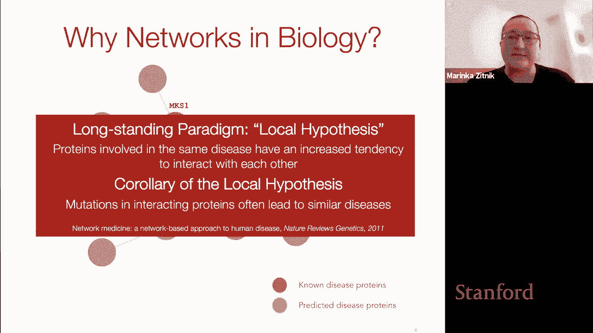
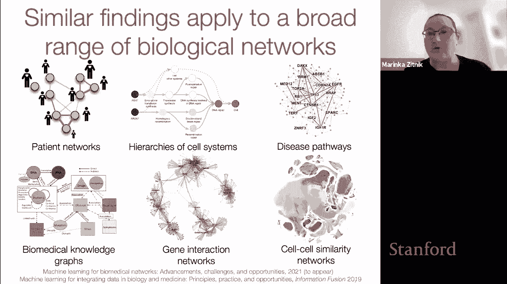
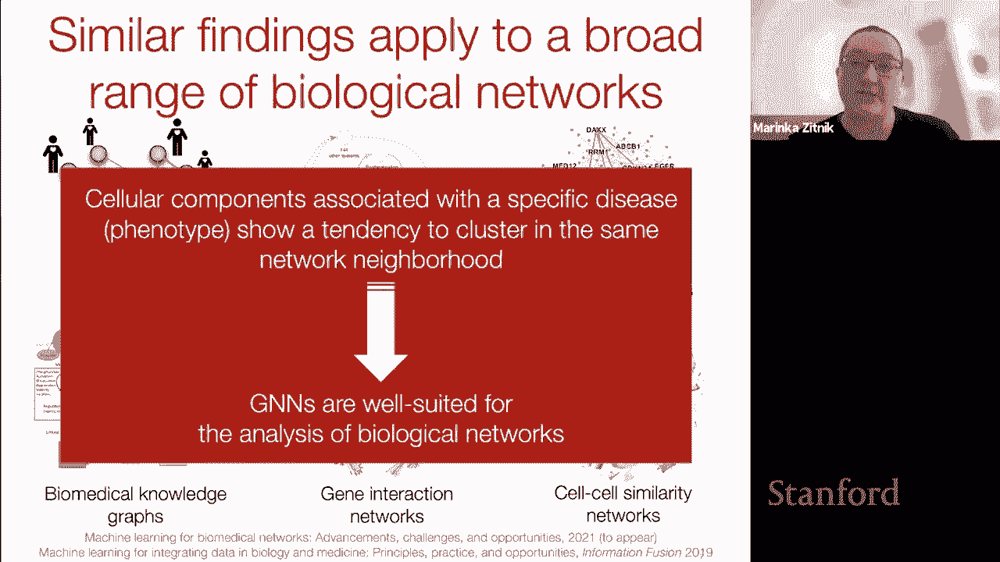
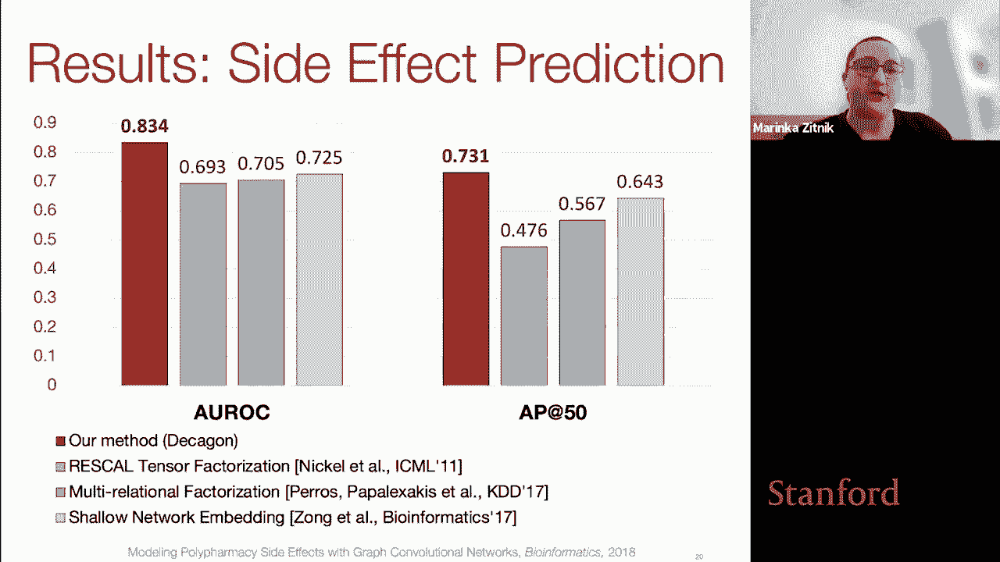
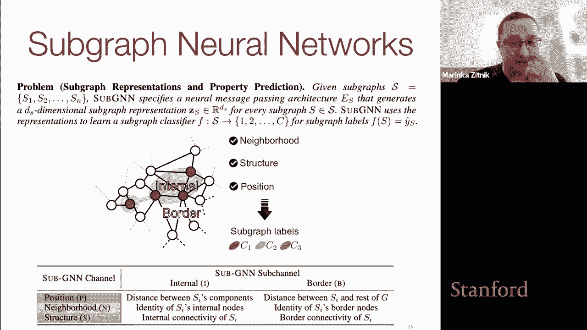
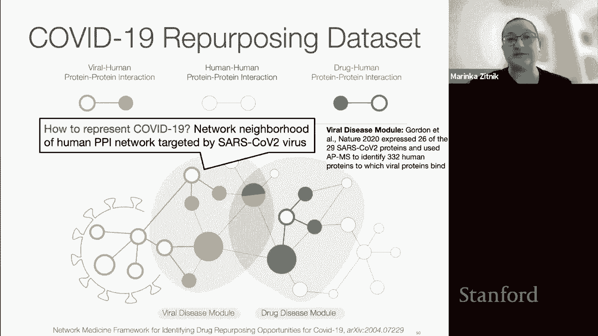
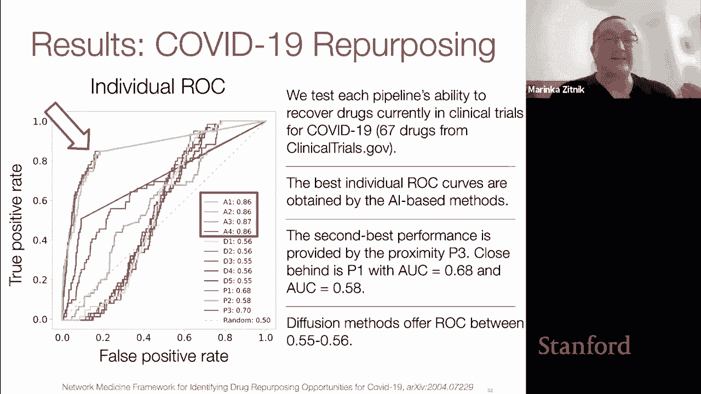
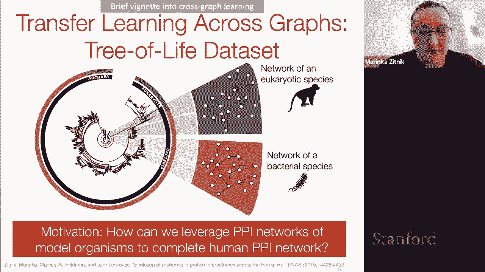
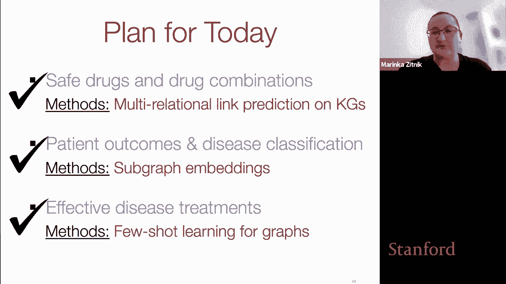
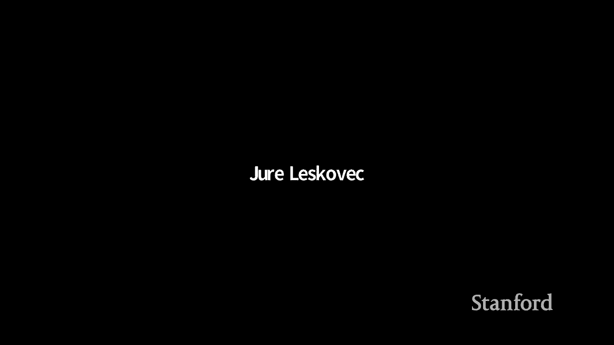

# P57：18 - GNNs in Computational Biology - 爱可可-爱生活 - BV1RZ4y1c7Co

今天我将讨论计算生物学中的图神经网络，和，人们对利用图神经网络的兴趣激增，和图形表示学习用于学习有意义的生物学表示，当我们在生物学和医学中遇到数据集和实体的有意义的表示时，所以在过去的几年里。

我们已经看到了几个突出的例子，在这些例子中，gnns被成功地用于学习，呃，在各种下游任务中支持关键预测的表示，包括关于发现蛋白质之间新的相互作用的预测，关于，关于呃，关于新奇药物等的小说，所以就有了。

当然是很有趣的，尤其是一个自然的问题是，为什么我们看到那个图表，神经网络在生物医学和生物数据上取得了如此大的成功，所以要回答这个问题，我们需要考虑一下生物学，并观察到生物学实际上与，从某种意义上说，嗯。

当人们服用药物时，药物的作用方式，并不是它们彼此独立工作，但药物的作用方式是它们实际上会影响人类细胞中一定数量的分子，通常是蛋白质，这些蛋白质相互作用，然后这些效应就像它们在。

在人体内和人体细胞中是通过这些潜在的生物网络，所以我们可以真正看到生物学在不同的尺度上是相互联系的，从基因组序列的规模，我们看到基因组部分之间的相互作用，细胞内蛋白质和分子之间相互作用的规模。

对人体中包括的外部因素的相互作用，例如药物和治疗学，一直到种群规模或整个生态系统，我们有的地方，比如说，医疗保健系统和不同机构之间的依赖关系，不同的医院，或医疗保健记录中的不同类型的症状。

所以许多生物的影响，然后干预，许多生物实体真的有网络效应吗，正因为如此，从网络的角度研究生物学是很有意义的，生物相关实体之间的相互作用，所以把这个打开一点，我们可以试着理解为什么生物学中的网络如此强大。

我看着，我会看的，2。我要举一个特别的例子来说明，所以让我们找一个，让我们来看看人类蛋白质相互作用网络，这是一个网络，节点代表人类蛋白质，两个蛋白质通过边缘连接，如果蛋白质发生物理相互作用。

这意味着在某个时间点，这两种蛋白质在细胞中物理上是接近的，然后嗯，你可能想知道，为什么，为什么蛋白质会相互作用，如果我们观察蛋白质相互作用网络的一个特定子区域，这可能是五种人类蛋白质的特殊子图。

我们看到，呃，五种互动，这两种蛋白质之间有什么意义吗，mx s 1和b 92，所以从某种意义上说，这意味着什么，它们相互作用的含义是什么，回答这个问题，我们能做的就是覆盖蛋白质相互作用网络。

关于这些蛋白质与哪些疾病有关的信息，如果我们这样做了，对于这个特定的示例，我们可以看到这里用红色突出显示的这三种蛋白质，都与同一种疾病有关，这意味着当这两种蛋白质发生某些变化时，一种特定的疾病会发展。

所以探索和观察什么是有趣的，如果我们把蛋白质参与各种疾病的信息叠加在上面，蛋白质相互作用网络，我们可以看到与同一疾病相关的蛋白质倾向于聚集，或在某些区域聚集，在网络的某些街区，这已经，在过去的二十年里。

对一个非常强大的人大喊大叫，因为它很强大，因为它使我们能够识别可能与疾病有关的新蛋白质，通过简单地探索这些蛋白质的周围和网络社区，已经知道与这种疾病有关的，这种特殊的长期范式被称为局部假说，换句话说。

这意味着参与同一种疾病的蛋白质，当突变时导致相同疾病的蛋白质，他们，它们之间的相互作用有增加的趋势，这意味着它们将在我们的BPI网络中连接，所以这个局部假设的含义是。

相互作用蛋白质的突变往往导致类似的疾病，现在我们知道我们可以有效地利用这些信息作为一个精灵。

机器学习模型的信息，当我在人类蛋白质相互作用网络和疾病的案例中解释这个特殊的局部假说时，类似的发现适用于我们在生物学中看到的广泛的不同种类的网络，从蛋白质相互作用网络到节点与患者相关和连接的网络。

基于其基因组图谱的家族或关系或相似性，到表示多个系统层次结构的网络。

代表疾病途径的网络，基因相互作用网络，细胞相似网络，和许多其他人，所以局部假设的概念我们看到，具有相似性质或倾向于在某些网络区域聚集和凝聚的实体，这可以解释为什么图神经网络如此好，适用于生物网络分析。

以及为什么它们已经在生物医学问题上得到了几个非常成功的应用。

所以这是我们可以分享的所有伟大和奇妙的愿景，这是一个很好的动力，为什么使用图神经网络获取生物数据是有意义的，但生物网络也带来了一些根本性的挑战我们可以通过算法创新来解决，所以有很多挑战。

我在这里只提三个，所以第一个挑战是生物网络往往涉及异质的相互作用，从分子水平，一直到整个人口或社会的水平，所以通常的挑战是如何在计算上操作数据，如何构建，然后呢，然后是易于机器学习的图，第二个挑战是。

生物学中的um网络，包含来自各种不同资源的数据，包括实验读数，精心策划的注释和元数据，我们真的需要共同考虑所有这些数据，因为没有单一的数据类型，能够真正捕捉到理解特定复杂现象所必需的所有因素，例如疾病。

真的是，嗯，我们需要，呃，共同考虑来自不同来源的数据来这样做，最后，生物网络顾名思义是嘈杂的，因此定义是不完整的，因为我们对自然和生物学的理解是不完整的，它们很吵，因为固有的自然变化。

以及产生数据的当前生物技术平台的局限性，这意味着我们需要假设我们的数据会丢失，它将包含重复的测量，甚至矛盾的观察会困扰分析和方法，需要对这些问题采取强有力的措施，今天讲座的计划如下，嗯，我会谈谈尝试。

然而，这将突出其中的一些挑战，处理生物网络工作的一些挑战，以及拟议的解决办法，并展示图神经网络在计算生物学中的成功应用实例，所以我会接触的部分是，但首先是与建模有关的问题。

药物的安全性和药物组合的安全性，第二，我将讨论预测病人的结局和疾病分类，最后我们会讨论，确定有效疾病治疗方法的方法，并用于查明，新出现疾病的有希望的治疗机会，一路走来，我也会强调一些新的技术工作。

这是由特定的生物医学问题引起的，所以让我们从第一个话题开始，即模拟药物安全性和模拟药物组合，所以这项工作的真正动机是被称为多治疗的问题，有时也称为多药，它是指病人同时服用多种药物的情况。

治疗复杂或共存的疾病，这是一个很常见的问题，实际上是四十个，百分之六的65岁以上的人服用五种以上的药物，医生给他们开的处方，同时医生，服用二十多种药物的病人并不少见，治疗心脏病，抑郁症，癌症。

其他一些复杂的疾病，所以问题是当一个病人同时服用几种药物时，他们发生不良事件的风险要高得多，据估计百分之十五的人口中大约有百分之五十受到，不想要的副作用，这代表着一个巨大的负担。

对个人和整个医疗保健系统都是如此，就不断上升的医疗保健费用而言，所以当我说个人有更高的风险发展成不利的，不想要的不良事件，我这么说到底是什么意思，所以当病人同时服用多种药物时。

因为我们现在知道药物并不是相互独立的，它们可能会引起药物之间意想不到的相互作用，那么这意味着什么呢，让我们看看这个假设的场景，我们有一个只有两种药物的系统，可以有一个蓝色的药丸和一个红色的药丸。

当一个病人单独服用蓝色药丸时，情况并非如此，没有观察到副作用，达到预期的治疗效果，一切都很好，当病人单独服用红色药丸时，没有观察到副作用，一切都好，然而，当一个病人同时服用蓝色和红色的药丸时。

那么病人有一定的可能性会经历副作用，呃，当乘坐卡车的组合时，所以这是令人惊讶和意想不到的，因为如果这两种药物完全独立地发挥作用，那么我们就不会期望看到任何显著的副作用，两种药物一起服用的地方。

所以我们的学习任务是为了这部分的谈话，我们就会，我们，我们是下面的，我们想设计一个模型，能够预测，一种特定的药物组合导致特定副作用的可能性有多大，所以这就是，呃，我们要解决的任务，好的。

所以问这个问题很自然，现在我们知道我们的问题是什么，模拟药物组合和药物相互作用确实是一个具有挑战性的问题，我的回答是，是呀，这是一个很有挑战性的问题，为什么首先这么有挑战性，这也许是核心挑战。

我们可以看到可能的药物组合的组合爆炸，即使我们只服用美国批准的一套药物，我们只考虑由两种药物组成的组合，两种药物有超过1300万种可能的组合，三种药物有超过200亿种可能的组合。

和更多的高阶药物相互作用，所以这意味着这肯定是不可行的，并在实验室测试这些药物组合的安全性，这实际上意味着这些药物是由，呃，他们去市场，然后病人服用，然后我们看看会发生什么，所以这是一个巨大的机会。

计算模型可以优先考虑，和先验，识别并标记那些可能不安全的药物组合，在它们真正用于真正的病人之前，第二个问题是，根据定义，意想不到的药物相互作用是非线性的，非加性效应，对呀，交互被定义为不同于。

什么是个别药物的加成效应，它提出了自己的一系列挑战，最后，你可能会把这个问题看作是一种大数据问题，因为我们将与美国所有的药物合作，以及与这些药物相关的所有不良事件，会有数以百万计的不良事件报告。

但很快我们就开始讨论小数据问题，实际上对于任何特定的药物组合，只有一小部分患者服用这种药物组合，实际上可能没有关于这些组合的信息，尚未用于患者的，所以这是另一个挑战，所以为了应对这个特殊的挑战。

我要提到的是一种叫做执事的方法，使用图神经网络来预测药物组合的安全性，所以Deagon被定义在一个多药房知识图上，具有以下结构，这是一张图表，呃，两种实体，药物和蛋白质，所以在这个特殊的情况下。

用绿色三角形表示，两种药物之间的优势有一种特殊的类型，所以两种药物之间的R型边缘表明一种特定类型的相互作用，特定的不良事件，当观察到r次1时，呃，在服用这两种药物的病人中，嗯在一起。

这种副作用不能明确地归因于任何一种药物，当然啦，除了了解嗯包括关于药物之间现有相互作用的信息，我们想了解这些药物实际上是如何起作用的，就身体的哪个部位而言，它们影响，以及它们如何改变人体细胞的活性。

因此，第二个节点信息，知识图将药物与其蛋白质靶点联系起来，当蛋白质呈橙色圆圈时，然后我们知道蛋白质是相互作用的，这就产生了这个潜在的蛋白质-蛋白质相互作用网络，所以把这个给一个多模态，呃，多药房网络。

我要描述的项目叫做德康，有两个组成部分，因此在编码器阶段的第一个组件中，它将采取多式联运网络，它将学习图表中每种药物和蛋白质的嵌入，然后它将这些嵌入平均，预测药物结点之间的标记边缘。

与预测的药物相互作用或药物组合的不良事件相对应，所以让我们简单地看一下，嗯，所以说，产生药物和蛋白质节点嵌入的关键思想，在图中是探索本地并查看本地网络，图中每个节点的邻域。

并通过不同的边缘类型将它们分开，所以这是通过两个阶段来实现的，其中在每个节点的第一阶段，说节点V um，我们将确定一个节点计算图，每种边缘类型都有一个单独的计算图，呃，存在于该节点提要的本地邻域中的。

在第二阶段，这个想法是把这些计算图，并学习什么是沿着神经信息的边缘传播的最佳方法，计算图的um，然后对它们进行非线性变换，所以在这个特殊的情况下，我们看到对于节点V，节点V有两个，呃。

R3型和3型的两个一阶邻居，类型的二阶邻居是三个，所以这将是，然后为节点V定义一个特定的计算图，用于边缘类型R 3，它将指定信息如何沿着边缘类型的边缘传播，这就产生了多关系图编码器，在2018年。

当模型被开发出来时，建筑相对简单，我相信你对这种建筑很熟悉，到目前为止，所以我会很简单地描述一下，这里的想法是，在节点中，嵌入是由，呃，节点特征，嗯，在这种情况下，嗯。

多药学问题是代表关于药物和蛋白质的附加信息的特征，例如药物结构和蛋白质在通路中的成员关系等等，所以节点V的嵌入，然后在零层是该节点的初始节点特征，然后在GNN的每一层，更新了节点V的嵌入。

基于这个特殊的方程，它查看了所有可能的边缘类型，节点V参与了，对于节点V的每个邻居，在那个特定的边缘类型中，对于每个邻居，你嗯，该方法采用了该节点的嵌入，你从上一层k减去一，它结合了嵌入，可训练的。

一个特定于我们目前正在查看的边缘类型的权重矩阵，聚合的结果是，然后与上一层节点V的嵌入相结合，并进行非线性变换，得到K层节点V的更新嵌入，结合重量，嵌入，它是，嗯，它的节点嵌入从上一层，以及邻居的嵌入。

在这一点上是由归一化常数定义的，它是根据今天的节点度固定的，我们肯定想用我们的注意力机制，但这个特殊的方程后来被应用了一些大的k倍，其中大的k，我们定义层数，的最后嵌入，节点。

是该邻域传播聚合模式的k层后的嵌入，所以现在这是相当标准的多关系图编码器，所以多个图形编码的结果，有药物和蛋白质节点的嵌入，因此，一旦获得了这些节点的嵌入，然后边缘贴上标签，预测药物结点间的边缘，为此。

输入由两个节点的嵌入组成，c和x，这将是两种特殊的药物，所以这两个节点的嵌入，CNN由，嗯，一种特定类型的东西或因式分解，嗯，这是一种容器的风格，对一对药物笔记进行嵌入的因式分解，嗯，把它们组合起来。

乘以，呃，两个关系特定的对角线矩阵，本质上它编码在，然后一个矩阵R，这是一个小的非，完全非零矩阵，嗯，允许模型捕获任何类型的依赖关系，在学习的嵌入中的任意对维度之间，所以这个解码器的输出。

然后预测每对的边缘，对于每一个特定的副作用，嗯，模型将返回，一对给定的药物会通过特定的副作用相互作用，好的，因此，为了将该模型应用于多药房知识图，首先要做的是构建实际的多药房知识图。

所以用来这样做的数据是捕获的分子，美国开出的所有药物的药物和病人数据，s，为此，建立了一个独特的数据集包括超过400万个药物边缘，这些是目前已知的配对和药物之间的相互作用，那是，呃，从FDA撤退。

药物蛋白边缘与蛋白质蛋白边缘信息，以及节点上的侧特性，所以这就产生了我们前面看到的多模态知识图，大约有500多万条边在一起，它是高度多关系的，因为在图中有一千种不同的边缘类型，一旦模型，构建了数据集。

并完全指定了数据集，然后在多药学知识图上训练执事模型，努力回答以下形式的问题，这样用户就可以发布查询，呃，比如说，他汀类药物和环丙氨酸的一种形式，一起吃太下药了，它们会导致肌肉组织破裂吗。

这种效果实际上意味着在后端，模型被要求预测呃，这两种药物在图中由R2型的边连接起来，如果r 2表示肌肉组织破裂，所以嗯，一旦模型被训练，它与，呃，若干基线，在那个时间点的基线算法。

这就是这张幻灯片中显示的结果，在y轴上我们看到性能，更高性能，较高的值表明用岩石测量的性能更好，前50名的平均精度更高，然后呃，模型的性能以红色显示其他基线的性能为，呃，以棕色显示，蓝色和绿色。

所以这里考虑的特定基线是一个简单的风险，叫做张量因式分解，它可以被认为是不使用深图编码器的deon，所以，那个测试表明，使用图卷积真的很重要，学习强大的嵌入，然后将Gon与多关系因式分解进行比较。

也就是，呃，那个嗯嗯，这是过去的相对改善，因式分解表明，能够共同模拟副作用是非常重要的，因为副作用之间有一些相关性，最后，将Dekoven与一个浅网络嵌入式模型进行了比较，嵌入模型。

这是一个给维克风格模型的笔记，那里的进步表明，然后新的，在这个特定的应用程序中，消息传递网络的性能要好得多。

比一些基于随机游动的，呃，当时的嵌入，所以另一个测试是以时间的方式应用deon，这意味着degon是根据2012年之前产生的所有数据进行训练的，然后呢，呃，模型被冷冻了，它被要求做出预测，嗯。

模特是最有信心的，然后我们测试得很好，这张幻灯片显示的是模型做出的十大预测，所以回想一下，每个预测都是以一对药物的形式出现的，与那对药物相关的副作用，因此，在这十大预测中，有五个。

直接证据是在二千一十二年后发现发表的，嗯，显示它显示了真实病人的例子，他们服用了一种特定的药物组合，并经历了他们本可以预测到发生了什么的副作用，所以说，比如说，对于第八个药物预测。

有几个报告说病人同时服用他汀类药物和氨氯地平，经历了肌肉炎症，它为模型的预测提供了证据，这个空间中的一些新颖的预测是新颖的假设，可以，值得进一步分析的，与领域专家进行了几次合作，并进行了下游调查。

他们在这个疾病和药物领域工作，实际上已经出去了，以及最近对Degan研究的跟进，关注在患者群体水平上建模不良事件，在努力预测什么是不良事件可能与，某一群人，其中这些群体可以按年龄定义，按性别分列。

或者是患有某些疾病的人，所以嗯，我在说什么，因为数据已经被预处理并提供给这项研究，所以那些对，潜在利用GNNS进行更个性化的不良事件预测，这当然是可以，现在有可能做到的，我们做了这个数据集。

包含超过1000万份不良事件报告，好的，这就是我的第一个小插曲，我们的第一个话题，今天的一个大话题，下一个话题将改变齿轮，我们将不再预测药物的安全性，相反，现在我们将，我们会考虑诊断病人。

这是一个非常重要的问题在任何药物真正，或者治疗方法可以被识别并推荐给病人，所以让我从疾病诊断的动机开始，呃，所以嗯，这是什么的核心信息，呃，用于诊断疾病，从广义上讲。

是在特定患者中看到和观察到的表型信息，因此表型可以定义为一些可观察到的特征，在病人身上可以看到，它们是基因型之间各种相互作用的结果，和病人体内的基因组信息，以及病人生活中的环境，所以医生通常利用，呃。

描述人类疾病的各种表型标准化词汇，比如说，一个非常突出的标准化词汇，表型被称为人类表型，这编码了各种不同的表型，以及它们如何映射到人类疾病，所以通过建模疾病，然后作为表型的集合或代表一种疾病。

然后我们可以根据病人的表型来诊断他们，根据这些病人会有什么症状，所以在机器学习中，我们可以定义诊断任务，然后以下列方式，我们将从一个图表开始，所以考虑，在这个特定的例子中。

从表型的标准化词汇表中构建的图表，这将是一个节点是表型的图，这些可能是可见的症状，以及分子或基因组水平的各种表型，这些表型节点之间的边缘表明了不同类型的关系，在这种情况下，我们可以在表型之间。

然后疾病将被表示为一组节点，或者作为表型网络中的一个子图，所以学习任务就是诊断测试，我们预测，与特定子图最一致的疾病标签或预测，描述病人的是什么，所以你可以想到，现在病人是病人表型的不同子图。

目标是预测标签，在这种特殊情况下，这些子图的颜色，这些标签是疾病，这是候选疾病，病人可能有，好的，所以考虑到这个提法，呃，让我们呃，让我们稍微讨论一下这个问题的算法，然后我们将返回到诊断任务中的数据。

所以在图神经网络的背景下，问题表述如下，这里的目标实际上是学习子图的嵌入，这样的点，我学到的子图的嵌入，我们很好地捕捉到了节点之间交互的拓扑结构，以及他们在哪里，它们存在的地方，在基础图的上下文中。

所以这意味着，它的输入由下面的图组成，g和大量具有标签的子图，目标是学习子图嵌入，这样到子图，具有相似子图拓扑的a i和n subj，我将定义下一个，这意味着它们应该紧密地嵌入在嵌入空间中。

所以用嵌入空间中的附近点表示，我们想学习，那么为什么子图具有挑战性，那么我们为什么可以，比如说，只要把我们最喜欢的音符水平和更好，到目前为止，我相信您已经听说过许多节点级嵌入器，在课程中。

本质上只是学习节点嵌入，取这些节点嵌入的平均值，或者以某种方式聚合那些没有嵌入的，到达嵌入的子图，所以有几个原因，如果你这样做，我们可能会丢失很多信息，其中之一就是我们在诊断任务中遇到的子图。

是大小不一的子图，然后问题是如何有效地表示这些子图，不简单的，围绕一个单一中心的K跳社区，节点，第二个子图将具有丰富的连通性结构，与图的其余部分的交互的内部和外部。

那么我们如何将这些信息注入到我们的gnns中呢，最后是由呃给出的子图，患者的表型集可以定位，从某种意义上说，它们将居住在一个单一的地区，在图的单个大邻域中，比如这个假设的例子。

其中子图由这个红色斑点指示，也就是走到图的核心的中心，或者子图可能分布在许多多个本地社区，所以嗯，那么简单的平均节点嵌入可能不是一个有效的策略，所以要解决这个问题，开发的是一个子图神经网络模型。

所以子图神经网络要解决的问题是，它假设给定我们的一些子图集，这个集合有n个子图，s one s two to sn sub gnn指定，然后是一个神经消息传递架构，它将生成，嗯。

我是不是把它作为该集中每个子图的维子图表示，它将使用这些表示来学习子图级别分类器，所以一个函数将把这些子图映射到一些离散的标签上，它这样做的方式是，通过真正考虑不同类型的子图拓扑，特别是。

我们感兴趣的郊区拓扑部分，与捕获每个子图的直接本地邻域内的连通性有关，子图中的内部，以及在子图和um的边界，图树，关于子图结构的信息，在…的意义上，在一个子图中，是否有某些母题被过度或不足地表示。

以及该子图相对于图G位于何处，其中。

呃，它是存在的，我想在这里给出一个关于问题表述的快速说明，子GNN提出了子图预测的定义，学习任务，嗯，这与图上的其他规范任务不同，主要与节点级预测和表示有关的。

其中的目标是预测图或链路预测中单个节点的属性，它与预测一对节点的属性或图级别预测有关，它涉及预测整个图的性质，所以潜艇，gnn与预测非平凡子图的性质有关，意思不是大小只有两个的子图，这将对应于一条边。

这样做的方法是子基因由两部分组成，因此，第一个重要的部分是一个消息传递方案，它本质上是分层的，它指定了神经信息从锚定补丁传播的方式，从g到子图采样的辅助图，那是呃，我们想嵌入，以及这些消息是如何嵌入的。

聚合到最后的子图嵌入，在第三部分在第二部分，消息的路由实际上是在三个不同的通道上完成的，其中每个通道对应于子图拓扑的一个不同方面，职位，我们想简单地捕捉的邻域和结构，让我来描述一下这两个部分。

所以子图信息传递，方案具有以下结构，嗯，指定的神经消息，这些消息是特定于三个属性中的每一个的，所以它们被表示为m subx，这些消息从锚点补丁传播到子图组件，锚补丁只是随机采样的辅助子图，从基础图G。

有三种不同的补丁取决于捕获，呃，捕捉，职位，邻域与结构，所以嗯，然后传递的消息就被公式化为来自这个锚补丁的消息，a到子图，她的嗯是呃，发送，它是根据它的方式得分的，它的贡献由相似函数加权。

在子图组件和锚补丁之间，表示锚补丁嵌入的权重，呃，有助于子图的嵌入，所以这在幻灯片的右边可以直观地显示出来，其中子图是我们要嵌入的数据的一部分，是次一级，这个子图实际上有两个断开的组件，每一个都在这里。

上，在左边和右边，的，右呃，图的流和在消息传递阶段，呃，那些助手补丁，灰色的锚斑块，将它们的消息发送到子图形组件，在子图组件接收到的消息集被聚合，然后将子图组件的聚合消息与其前一个组件组合，呃。

使用它以前的嵌入来获得子图组件的属性特定表示形式，所以h-x-c是um子图组件的嵌入，c，所以它只针对子图的这一个组件，捕获方面x的子元素，可以定位为邻域或结构，因此。

消息传递的方式是在三个独立的通道中完成的，它描述的每一个通道都是为了捕捉拓扑的一个方面而设计的，职位，邻域与结构，每个通道x都有棘手的元素，这些元素是衡量消息的相似性函数，锚点补丁和子图组件之间的交换。

然后是一套，锚贴片采样功能，指定此帮助器修补程序需要如何，呃，从底层图形中采样，以便捕获um，邻里或C和捕捉不同的社区不同的结构和不同的位置，最后是如何对这些锚补丁进行编码，这些函数可以学习或预定义。

总结一下我们可以把这个问题看作，作为，作为学习子图表示的问题，作为具有三个不同通道的消息传递网络，那些通道输出通道，然后聚合以产生最终子图表示的特定嵌入，子图s的z a传递，现在让我们回到我们的问题呃。

疾病诊断，我们要做的第一件事，我们就会，呃问，但我们会，我们将测试该方法是否适用于一些模拟合成数据集，看看该方法是否能真正捕捉子图拓扑的不同方面，为此进行的设置如下，在每种情况下，每个数据集以基图开始。

然后撒上基图，嗯，有大量的子图，有两种策略来定义子图，任何一种策略都是种植策略，在种植策略中生成一个子图，它被种植在底图的顶部，或者它本质上只是以呃的形式连接在一起，以类似的方式。

因为它将与这个特定子图中的基图钉在一起，在这个特定的综合数据集中，每个子图的每个子图，定义了一个标签，因此，标签是根据这些子图的某些网络结构性质定义的，所以一个特殊的合成数据集被称为密度。

这是一个数据集，在那里嗯，它由基础图组成，然后大量的子图，这些子图的标签被传送，密度值，网络，密度，公制，并根据切割率建立了类似的数据集，公制，坐标和组件，你为什么要这么做，我的想法是这样做。

测试某些类型标签的信息最丰富的通道，是那些真正决定标签的渠道吗，所以这是一个测试模型性能的受控环境，所以这些结果表明亚GNN，这是学习子图嵌入的有效策略，它的性能超过了人们可以想到的各种简单的临时措施。

比如说，取节点嵌入的简单平均值，并以这种方式获得几个嵌入，或者引入ITA人工节点，然后嵌入那些可以作为代理的元节点，用于子图嵌入，甚至进行图级嵌入，最后这个，这些结果还表明。

子n可以很好地捕捉子图拓扑的不同方面，这可以通过观察三个通道中的哪一个来研究，邻里，位置或结构对于预测某些类型的标签是最有信息的，所以对于密度的情况，嗯，标签将主要由子图的邻域决定，所以接下来测试的是。

邻域通道是否对预测密度标签最有信息，事实确实如此，好的，所以现在呃，我们知道GNN潜艇工作得很好，让我们回到现实世界的数据集，所以有四个现实世界的数据集是为解决，呃，嗯，临床诊断任务。

所以四个数据集中的每一个都由一个基图组成，和带有相关标签的子图，所以这两个，呃，的，我想提请您注意的两个数据集，被称为HBO Meetup和HBO Neuro，所以这些是数据集，其中基图是嗯的图。

从人类表型本体论，这是一张节点是人类表型的图，边，我们在人类群体中看到的表型和症状之间的等级关系，然后标签由某些，呃，被呃，子图是由代谢的子图定义的，呃，影响人类的疾病和代谢紊乱，在HBO神经数据集中。

那么子图表示um，所以这两个人的目标，呃，呃，那些，这两个特定的数据集是为了定义，就是预测与各种代谢或神经疾病相对应的子图标签，与潜在的表型一致，所以说，这模拟了诊断病人的环境。

可能有代谢或神经疾病的人，那么让我们看看Sub gnn在这四个数据集中的性能，特别关注人类表型，本体，神经和代谢数据集，所以我们可以看到的是GNN潜艇的性能，用，呃，嗯，当与基线模型相比时。

模型要好得多，一些GNN的表现优于，虽然那些呃，在这里考虑的基线模型多达127个，百分之二十五，这就是啊，在性能上是一个非常不可思议的进步，这显然激发了子图的使用，而不是简单地考虑节点级或图级聚合，嗯。

这就结束了呃的第二部分，谈话，其中涉及，嗯利用子图的力量，嵌入和gnns，疾病诊断任务，在演讲的第一部分，在第三部分，我将重点关注药物开发的重要终点，也就是药效，所以在第一部分我们谈到了药物安全。

但是呃，和安全，是我们在药物开发过程中关心的两个角落终点之一，除了药物安全，第二个重要的终点是疗效，问题是要理解，是否有某种可能是候选的分子，这种药物对病人确实有积极的治疗作用，让我们呃。

从演讲的第三部分开始，激励人的事实，的，激励呃，这项任务的问题是如何找到治疗新出现疾病的方法，这项特殊的工作激励着，到去年Covid-19大流行开始时，在那里嗯，很明显，在呃，在那里流行病开始的时候。

a，需要快速部署和识别药物，这可能对19名Covid患者有积极的治疗作用，但是简单的迭代开发的传统方法，新药的实验测试、临床验证和批准不可行，因为他们平均需要十年以上的时间来引入这个设计。

从零开始的新药并将其推向市场，这根本不可行，所以一个道德策略依赖于药物的重新用途，要求我们基本上识别哪些是临床批准的药物，这可能对COVID-19患者有治疗作用，所以我要提到的特别研究是。

是去年3月初开始进行的，大部分都是在3月到，去年夏天，它确实展示了一个机会，在这个特殊的情况下，图神经网络能够将多年的工作压缩到实际上的几周内，在某些情况下，实际工作天数。

但是通过机器学习模型之间非常密切的合作，这些模型和最终用户提供的预测，在这种情况下是病毒学家和实验生物学家，他们在实验室里进行预测并进行实验筛选，好的，所以说，这就是我们这部分谈话的目的，让我们。

现在让我们先试着解开并定义火箭用途的问题，然后描述我们解决这个问题的技术方法，所以正如我提到的，从零开始发现一种新的新药，是一个资源密集型的过程，平均需要十多年的时间。

从零开始设计一种新药需要花费10到20亿美元，因此，面对开发新药的飞涨成本，研究人员正在寻找方法来重新利用旧的，基本上是服用已经上市的药物，并要求，这些药物对其他疾病可能有效吗。

这是一个非常有吸引力的策略，因为它会更短，而且可能更有效，在市场上被重新利用的药物的著名例子是伟哥，最初是为治疗心血管疾病而设计的，但在临床试验中，事实证明，可能还有其他迹象表明，这将有助于。

所以在过去，那些重新定位的策略主要是，现在有一个协调一致的努力，我们能系统地检查临床批准和上市的药物吗，并确定可能的治疗机会，所以这个问题的核心，现在这个问题的核心是以下问题。

我们可以把它看作是一个链接预测问题，在条形蟒蛇图中，在左边我们有一套药物，那些可能都是批准的药物，加上研究性实验性药物，嗯，一些临床试验失败的药物，但对病人来说并不是很不安全。

在右边我们会看到成千上万种疾病它们都是编码疾病，嗯，这可以描述，比如说，通过我们正在讨论的一组表型，在演讲的第二部分，所以把药物和疾病联系在一起的边缘表明了非治疗关系，我们这里的问题。

我们的目标是有一个模型，这将预测一种新分子或现有药物可能治疗哪些疾病，那么这是一个具有挑战性的问题吗，为什么寻找一种新疾病的治疗方法，尤其是这样一个具有挑战性的问题，所以当我们。

当我们关心为一种新出现的疾病寻找治疗方法的问题时，这意味着我们想确定可能治疗这种疾病的药物，但目前还没有治疗这种疾病的药物，所以和Covid是一个非常，非常突出的例子，呃，去年年初，所以从概念上来说。

从技术上来说，这并不奇怪，因为我们知道在机器学习中，推广新的现象通常很难，流行的图神经网络方法仍然假设和要求丰富的标签信息，为了真正有效地训练并达到高精度，然而，我认为。

生物学和医学前沿的决定性因素之一是问题，标记的例子非常稀少，十九种罕见疾病，难以诊断，病人建模，开发中的新药，和许多其他问题，所以说，流行的方法假设，我们从已经标记丰富的图开始。

这一假设在大多数令人兴奋的问题中都被严重违反，在现实中，世界上发生了什么，我们只有少数几个标签，呃，对于特定的类，如果有，一点都没有，所以对于药物重新用途的问题，呃，我将描述的方法、基因和方法。

它真的依赖于很少的短期学习和元学习，所以我现在有两张幻灯片，只是对元学习的一个非常简短的高级概述，我想很多人已经在其他课程中听说过这一点，所以元学习是非常有效的学习策略，在有极少数。

可用于任务的少量标记示例，因此，典型的元学习策略的思想是这样的，我们假设我们有一个，我们在各种学习任务中训练一个元学习模型，该模型被优化，以实现任务分配的最佳性能，包括潜在的看不见的任务。

元学习的方法是把每个学习任务都定义好，并与小数据集相关联，D包含了呃，数据实例，特征向量和一些真标签，所以元学习就和它有关，那么嗯，寻找模型的最优参数θ星，这将最大限度地减少大量数据集的损失函数。

每个描述不同的任务，所以如果这些模型可以被定义为成功，如果这些参数θ星能成功定义，这表明模型能够真正成功地从一个任务推广到另一个任务，从一个数据集到另一个数据集。

如果可以的话如果它能通过称为元训练的过程有效地做到这一点，那么我们可以希望在测试时间的情况下，它将能够非常迅速地，非常有效地适应新任务，在我们的情况下，这将是一种新的疾病，Covid十九。

所以这看起来很像正常的常规机器学习任务，但你可以认为，本质上，数据样本不是一个单一的节点，它不是图中的一条边，但本质上，数据样本是一个小数据集，在我们的例子中，将是模型训练的图的一小部分。

这只是监督学习领域中元学习的一个具体实例，我提到这一点只是因为我想引入一个符号，这个符号是，描述了一些困难，一些简短的学习任务，我们会说我们对解决K镜头和类分类感兴趣，意思是我们想解决一个任务，呃。

在一个问题中，对于n个类中的每一个，我们只有k个标记的例子，那么这里展示的，在这张幻灯片中是一个两摄三向图像分类的例子，我们会在那里，嗯，每个课桌都包括对班级的分类，呃，图像分为三类。

这就是为什么它是三路图像分类，对于每个类，我们有两个例子，所以这里的过程是在训练阶段，每一个都是两短三路图像分类的实例，因此，如果模型可以成功地启动到两个，解决这个问题，或者在元训练阶段解决这个任务。

然后在元测试时间内，那么模型将很快适应全新的类集合，也只有少数标签，我们在这里的目标，如何对新的图或新的标签集进行预测，所以本质上，我们想用V镜头学习，不开启图像分类，我们想要，但我们想用。

用它来做图形，所以问题的表述是这样的，嗯和嗯，我们有兴趣设计一个元学习者，元学习者将关注的，需要能够对看不见的标签集进行分类，所以这可能是一个蓝色标签集，通过观察同一图中的其他标签集，所以在训练的时候。

呃，模型只会在黄色标签上学习，我们希望模型是，将能够推广到在同一图中定义的蓝色标签，嗯，在呃，测试时间，所以这样做的方法被称为gomea，Gitta概述，如果我用类似的方式呈现。

就像我在短暂的学习中所做的那样，就在几张幻灯片前，它与一般的未来学习环境非常相似，但现在我们不关心解决图像分类测试，但是我们关心的是解图形，嗯嗯嗯学习问题，对于这种情况，呃解释这些是节点分类问题。

在训练期间，我们将定义大量的任务，每一个都来自与特定标签集不同的，在测试时，新任务将显示在标签集上，三个不会被看到的，没有训练时间，所以GMA用来解决这个问题的关键思想，呃。

解决图形上的几个镜头学习问题是，它将指定，然后嗯，你知道的，每个学习任务的签名函数，签名功能将根据um的结构定义，包含，呃，在每个任务中标记示例，然后这些子图签名函数本质上会学习。

它将学习如何映射表示任务的采样子图的结构，以及如何有效地，呃，作为我们GNN的初始化，所以这个策略可以非常有效，提取包含标记示例的子图的策略，然后将gnn单独应用于每个子图，是做几个镜头学习的有效策略。

现在问的一个自然问题只是概念上的，这是一个有趣的问题，我们现在使用的这些局部子图的值是多少，将知识从一项任务转移到另一项任务，为什么子图在这里有用的理由如下，你可以想到。

GNN正在使用两个基本的核心信息来源，一种是基于标签传播，在那里我们可以想到具有相同标签的节点，它们往往在图表中附近，我们在今天讲座的一开始就看到了，倾向于相互作用的蛋白质，他们也倾向于，呃。

附属于相似的表型，导致相似的疾病，GNN动力的另一个核心来源是结构相似性，其中具有相同标签的节点，他们可能不在图表的附近，但他们在当地社区可能有相似的网络形状，好的。

所以现在我们知道我们知道在很少学习的情况下，标签真的很少，我们，那么我们就不能太依赖标签传播，这根本不够，会的，会的，只有少数节点被标记，在整个图形中有效地传播标签是非常具有挑战性的，因此。

我们可以更好地利用结构信息和结构等价性，这正是这些局部子图，捕获作为一种跨任务转移知识的机制，实际上可以从理论上证明，定义在周围的局部子图，呃，标记的示例捕获了许多用于预测的相关信息，理论发现之外。

许多研究已经证明了这一点，被呃，在生物网络方面的作用，这通常是描述特定任务的最有用的信息，嗯，在生物网络的背景下，存在于目标节点周围的大约两个三跳邻域中，因此，局部子图的使用是非常有动机的，好的。

所以现在让我们最后回到我们的Covid-19重新用途问题，所以我将从描述这个数据集开始，这个转移，我描述的这几个镜头学习策略是提供的，因此，重新使用的数据集有三个主要组成部分。

第一个是关于如何代表垂涎十九的信息，好的，我们如何用图形的形式来表示它，或者一些机器可读的结构，我们实际上可以计算，所以要做到这一点，我们依靠戈登去年发表在《自然》杂志上的研究。

Natal和来自UCSF的同事，他们所做的，呃，他们有，呃，在sars kovi病毒中表达了二十九种蛋白质中的六种，他们检查了那些病毒蛋白质攻击的人类蛋白质是什么，所以在这样做的时候。

他们鉴定了332种人类蛋白质来达到非典，COV两个病毒字节，所以这可以作为本质上的计算，Covid-19的可计算表示，Covid十九，然后可以用该集合或子图表示。

或被病毒直接攻击的332种人类蛋白质的结构，所以这些被称为病毒人类蛋白质-蛋白质相互作用，因为病毒和人类之间实际上有相互作用，第二个重要的信息是，那些攻击的其他蛋白质是什么，亲蛋白与。

这就是人类相互作用网络或人类蛋白质蛋白质相互作用网络，第三条信息是关于市场上现有药物的信息，所以对于每一种现有的药物，我们把它已知目标的信息，在那些药物的蛋白质上，这给了，嗯上升到那些药物模块。

这将是每种药物的一组蛋白质，当病人服用药物时，这些药物是有针对性的，所以Covid 19最终被表示为人类ppi网络的一个网络社区，非典两种病毒的目标，然后应用一些简短的学习策略来学习Covid的嵌入。

Covid十九，那是新的任务，我们想对进行排名，基于他们对Covid 19的希望，模型优化的方式，它是根据已知的药物疾病进行优化的，比Covid-19更好理解的其他药物和其他疾病的适应症。

所以这个过程为批准的药物和疾病提供了一个嵌入空间，嵌入空间中的一个点代表Kovic 19，因此，识别Covid 19重新利用机会的有效方法，就是看看其他的，嗯，什么是嵌入接近Covid-19的药物嵌入。

然后根据药物之间的密切关系来优先考虑药物，呃，Covid-19嵌入和药物嵌入，这就产生了一个排名靠前的药物列表，代表最有前途的算法，呃，Covid-19背景下最有希望的重新定位机会。

当你有这样一个模型时，要做的第一个测试是尝试得到一个，呃，对这些预测有多准确的一些理解，那么这个情节所展示的，它是一块岩石，呃，情节，嗯，显示在x轴上的假阳性率，在预测问题的y轴真正率上。

这被定义为一个罐头问题，这些模型能有效地识别那些，呃，在4月20日进行了COVID-19的临床试验调查，因此，许多基线方法对此进行了测试，呃问题，基于GNN的三种方法，这四种基于GNN的方法被称为，呃。

1表示从1到4，与其他一些人相比，他们在性能上有了很大的提高，基于扩散的战略，随机游动，网络邻近性，和其他更常用于药物重新用途领域的药物，自己找，然而，虽然承诺不是特别令人兴奋。

十九并不意味着它成功了，因此，对预测的准确性和能力的真正考验是有用的，是通过实验来验证预测，所以为了那个，嗯，嗯，来自国家新兴传染病实验室的生物学家和病毒学家，所以这是一个国家实验室，可以研究活病毒。

它看起来是这样的，所以看起来很像，几乎就像一个没有人可以进入的空间中的某种环境，除了那些有，呃，和非常特别的前任，他们能够在那里与生命病毒合作，所以那里的病毒学家根据模型做出的顶级预测，然后测试屏幕。

它是VIE六个细胞，一个非常突出的细胞系，用于觊觎十九项测试，后来在老鼠的人体细胞中，所以结果是，呃，预测的77种药物显示出强或弱的效果，它们在广泛的浓度范围内都很活跃，重要的是，GNN获得的那些预测。

实际上是一系列方法，包括其他一些网络医疗的方法，给出了一个数量级高的热率在顶级预测比以前的工作，所以之前的工作只是对所有药物进行强力测试，在实验室里，如果这不是以集体力量的方式进行的。

但它是由药物的优先级列表提供的，由ML模型制作，那么一个数量级更好的命中率是我们可以预期的，因为我们在课程中，它关注网络，我想在这里提到一个有趣的发现，嗯，所以一个自然的问题是很好的。

所以这项分析确定了77种药物，那些抑制病毒生长的药物有什么共同点，所以这个问题的答案是肯定的，所以预测的77种药物中有76种，实验表明他们成功地减少了病毒感染，不直接结合的药物。

病毒直接攻击的那些人类蛋白质，而是，这些药物依赖于基于网络的行动，像D3这样的药物，这里将针对一些不受病毒直接攻击的人类蛋白质，这些人类蛋白质反过来会与其他蛋白质相互作用，反过来。

谁最终会正是那些病毒攻击的蛋白质，当我提到，因为这些我们现在称之为网络的，传统的战略无法确定的，在计算生物学和计算药理学中，这是基于对接，好的，所以，因为我已经运行的时间，我会在这里结束。

所以总结一下讲座，嗯，今天，呃，我们讨论了图神经网络在计算生物学中的有趣应用，我们谈到了两个三个话题，我们谈到了用gnns为我们建模，药物组合和识别不良事件和药物安全性问题，然后我们谈到了GNN的机会。

确定诊断任务并对这些疾病进行分类，最后我们讨论一种方法，或者使用gnns来识别具有特定角度的有希望的治疗机会，这是前所未有的新出现的疾病的机会，所以我嗯，这是我最后一次，呃，在这里讲课。

我很乐意回答问题。

谢谢。非常感谢，马林卡，呃，这太棒了，嗯，你想更多地评论一下你认为是什么吗，嗯，很大的挑战，呃，在准备接受机器学习攻击的生物医药中，人工智能方法，哦哇哦，那是一个非常，呃，这是一个非常宽泛的问题。

所以我对生物医学的看法是这样的，所以我们可以广泛地思考某些核心问题，所以一个核心问题是，与诊断病人有关，在确定任何治疗方法之前，或者任何一种药物都可以推荐，我们首先要知道，病人的核心问题是什么。

也就是说，从ml的角度来看，这是可以解决的，这里特别是，嗯，呃，我们需要快速诊断病人的方法，特别是，那些有，嗯，很难诊断，有许多罕见的新疾病，你可能会说嗯，那可能不是很多病人。

但事实证明美国20%的病人都患有这种疾病，平均而言，罕见病患者需要看七位专家才能得到正确的诊断，又来了，医疗保健系统的一个巨大问题，对于个人，等等，等等，所以现在数据集可以大大加快诊断任务。

所以我认为这是一个令人兴奋的问题和追求的方向对不起，只是想问一个后续问题，那么你认为这是一个主动学习类型的问题吗，你还建议参加哪些其他测试，这样你就可以诊断出疾病，可能不是，呃，因为呃。

问题是如果你想到如果你看着那些病人，他们已经做了很多很多的测试，他们或多或少，他们做了很多不同的测试，我们不知道还能做什么，所以这不是一个确定他们应该进行什么实验室测试的问题，但问题是你。

我们可以问自己，为什么我们不能轻易地诊断病人，问题是他们是，他们在某种程度上是冲突的，意思是病人会来，并将赠送礼物，表型和症状与任何已知的疾病分类都不匹配，所以病人去看医生的方式，医生们有一本很大的书。

他们他们，他们他们打开，他们说，好的，这是一个，这些是我所期望的疾病的症状，他们将其与患者进行比较，没有匹配的，好的，所以没有，这是一个，让我们去这个疾病，b，让我们去这个C，很难诊断这些病人的问题。

他们不知何故有多种症状，与任何疾病都不一致，所以它实际上更多的是诊断他们，问题是什么是好的诊断，可能不仅仅是说病人有疾病，但它有这一系列疾病，或者我们能不能了解一些已知疾病的分布来很好地捕捉病人。

所以这只是识别什么是，有什么问题，接下来的问题是人们能否找到成功的治疗方法，所以在这里，所有与药物发现开发相关的问题都适用于，我们能重新利用现有的药物吗，我们能确定对病人有效的药物组合吗。

我们能以更个性化的方式做到这一点吗，到目前为止，数据集已经准备好并可用，这意味着这是可能的，摆脱一刀切的治疗建议，多少还是，我在今天的讲座中所描述的工作，基本上是一刀切的治疗建议。

但现在有可能达到一个更精确的水平，至少在病人群体阶段，意思是什么对某些性别有效，某些年龄，性别的某些组合，年龄，或分子标记，嗯，我想，然后还有一大群非常重要的，生物医学中的高影响力问题，都是跟，嗯嗯。

疾病如何的时间方面，进展，以及如何监测病人，并帮助他们提高自我照顾能力，所以这些都是需要解决的重要问题，也有数据集的，然后与医疗保健系统的密切合作将提供很多机会，单调乏味的工作。

繁琐的工作将是优化临床工作流程，识别医疗错误，嗯嗯再次，提出系统，最终使用主动学习来识别，嗯什么时候，嗯嗯，去给一个病人加另一种药，从病人身上取出药物，什么时候给病人打电话，来诊所。

所以这些都是令人兴奋的问题，在大流行期间出现了一些新的问题，并键入新问题的示例，嗯，这是现在特别令人兴奋的话题，在呃的界面上，特别是AI和医疗空间，问题是我们能否设计出各种人工智能系统。

um医生远程出诊，在某种意义上，一个人会，嗯，嗯，嗯，就有可能拍到一张照片，病人可以用他们的应用程序拍摄图像，图像将在病人一侧自动分析，然后传达给医生或者，特别是在这里，主动学习策略是最重要的，比如说。

确定数据的哪一部分是最关键的，以便做出正确的诊断，然后这部分数据可以在病人不需要去医院的情况下获得吗，这将使嗯，远程诊断与管理，呃，这超级酷，所以呃，我想后续行动，呃问题嗯特别是对最初的几个。

你提到的问题，为什么像这样的图形要领，为什么这些图形问题，你知道不是自然语言问题，或者我知道计算机视觉问题，为什么你认为图形是必不可少的，在这种情况下，那是一个很好的问题，我试图阐明这个问题。

在谈话一开始，这个讲座的一开始，所以一个问题的答案，原句：本来应该由两个部分组成，第一部分是很容易看出，生物学中的大多数问题都是相互依赖的，或者在我们接的任何任务的意义上，通常。

任务中的重要实体之间有实质性的关系，需要建模，几十年的基础生物学研究表明这些依赖性真的很重要，也不能忽视，所以数据集的关系结构是非常通用的，所以我们已经看到，从本质上来说，讨论这个谈话的三个问题。

事实确实如此，从蛋白质相互作用网络中，它已经被一次又一次地实验证明，克里斯普，基因编辑，疾病诊断任务等，所以这些关系是数据集的重要组成部分，所以我们需要利用模型，那一秒钟不仅仅是，嗯，这些关系是存在的。

但在大多数情况下，都有真正的信息，有时甚至比结构数据更有信息，比如说，对于预测的问题，呃，蛋白质，呃，结构，DeepMind最近推出的模型，实际上利用蛋白质的相关信息来推断它们的结构是关于什么的，因此。

不仅数据集和问题具有很强的关系结构，但这种关系结构与我们想要产生的预测任务很好地相关，所以某种形式的基于图的机器学习，谢谢。非常感谢，呃，再来一个，呃，问题嗯是关于，呃，让医学界采用这些方法有多有效。

嗯和嗯，呃，是啊，是啊，所以呃，我想这就是问题所在，所以这是一个很好的问题，对此的简短回答是，会是，它是，很有挑战性，所以首先要结束回答这个问题，到目前为止，我们已经看到了几个成功部署，嗯，这个算法。

一般的ml算法，在临床环境中，以及大型制药公司，所以到目前为止，对于基于图像的模型来说，这主要是正确的，嗯，没有多少，或者我不知道真正成功的基于图的机器学习模型，在临床环境中常规应用和使用，或在，嗯。

至少在公共临床环境中，我们目前在这个阶段处于什么位置，通常单个研究人员与合作者合作，他们将是医生或临床研究人员，等等，他们会携手合作解决他们的特殊问题，人们可以把这看作是验证，预测的实验验证。

但目前我们还没有到那里，在那里这些方法将被常规使用，图神经网络或图ML将在现实世界中常规使用，2。为什么会这样，所以我认为主要的差距是存在于，URI论文中发表的模型说。

然后这些模型在现实世界中部署是这种滞后，通常当我们将这些模型应用于数据集时，它们不会产生用户认为是可操作的预测，这意味着仅仅预测是不够的，一种药物是否能治疗一种疾病，很难说服别人。

这将在实验室进行非常昂贵的下游实验，通过这种基于高层逐点的预测，那么在Covid重新用途项目的背景下，我没有讨论的是什么，从本质上提供解释是非常重要的，允许用户向模型提供反馈。

并在模型中建立一些信任和信心，所以现在产生了这个值得信赖的机器学习的总括术语，我认为这与，呃，谢谢。呃，然后再问两个快速的问题，呃，你能详细说明一下药物的节点特征工程吗，药物相互作用。

你演讲第一部分中的药物组合，然后我们还有一个，是呀，所以呃，对于演讲第一部分中的节点特性，我们有药物和蛋白质的节点特征，药物的结节特征，呃，微笑，Dro和嗯的指纹，他们是，它们不是我们手工设计的。

但这是一个非常常见的药物结构描述符，用于化学信息学，它是从一个叫做银行的数据库中撤退的，呃，为了呃，蛋白质结节，节点特征是，呃，包含这些蛋白质参与的分子途径信息的二元载体，比如说。

如果我们知道蛋白质A是，参与细胞凋亡途径，这是一条途径，这非常重要，因为它基本上告诉我们，它可以控制细胞何时死亡或存活，所以如果一个蛋白质是这一途径的成员，然后会有一个简单的指示器，一个在那个，呃。

特别是，在蛋白质特征向量的相关维度中，谢谢然后，呃一个，呃，下一个问题是关于，几何学习，某人怎么会感兴趣，它与贝叶斯网络学习有何不同，和EM算法，你能讨论一下利弊吗，哦，我看到有趣的，所以说。

我们实际上没有考虑任何贝叶斯网络学习方法，为了GMETA问题，我们主要将其与目前的工作进行了比较，即基于图神经网络的少镜头学习，从这个问题中我可以清楚地看出，使用它可能会很有趣，一些贝叶斯模型。

然后了解药物有效性在疾病中的分布，然后用它来采样一种新的疾病，这种疾病将接近COVID-19，嗯，这个过程就是，使用贝叶斯模型可能会给我们一个更好的药物排名。

因为针对这个问题的药物排名是根据GNN返回的预测分数确定的，我们知道戈梅因写的，特别是从几个应用程序，我们知道经常，模型返回的分数不一定经过很好的校准，或表示概率。

所以我可以想象贝叶斯网络模型可能更适合于此，所以这将是一个过程，这样做的缺点是，嗯，我们在Covary目的的背景下发现的，基于GMETA或图形神经网络的模型在最近实现时，来自类群的UM邻域抽样策略。

GCN或图形圣徒，比如说，它们可以很好地扩展到非常大的数据集，嗯包括，比如说，一个数据集，我们查看信息，不仅对人类，而是来自我们1800个其他物种，并试图翻译来自其他物种和模式生物的信息，如斑马。

鱼和猴子对人类，我嗯，至少在我的基因和模型经验中，比某些贝叶斯模型更好地扩展到更大的数据集，非常感谢，玛拉的精彩演讲，感谢大家提出了很好的问题，非常感谢，呃非常感谢。

然后呃，祝波士顿一切顺利，谢谢你邀请我，是啊，谢谢你，拜拜，拜拜，拜拜。

