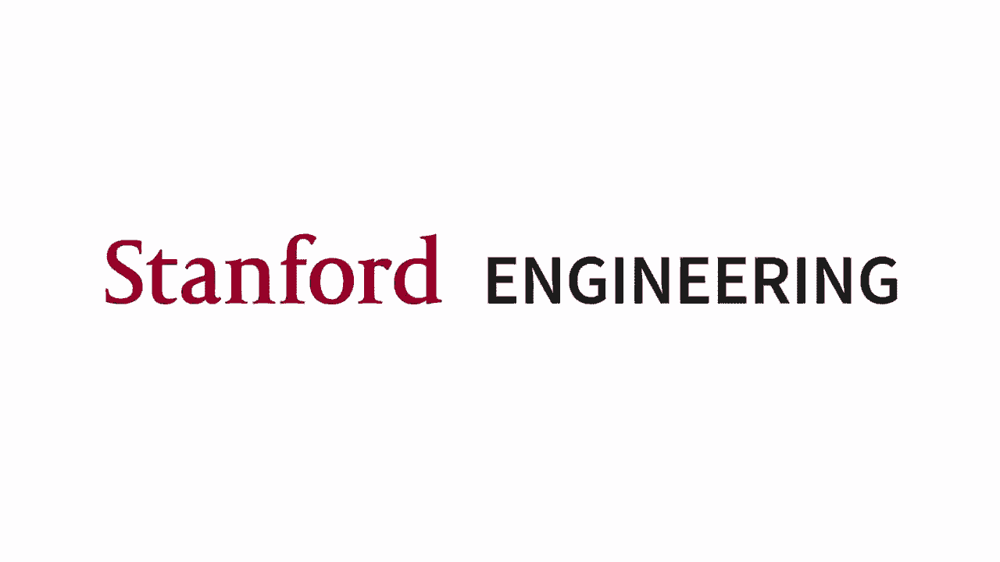
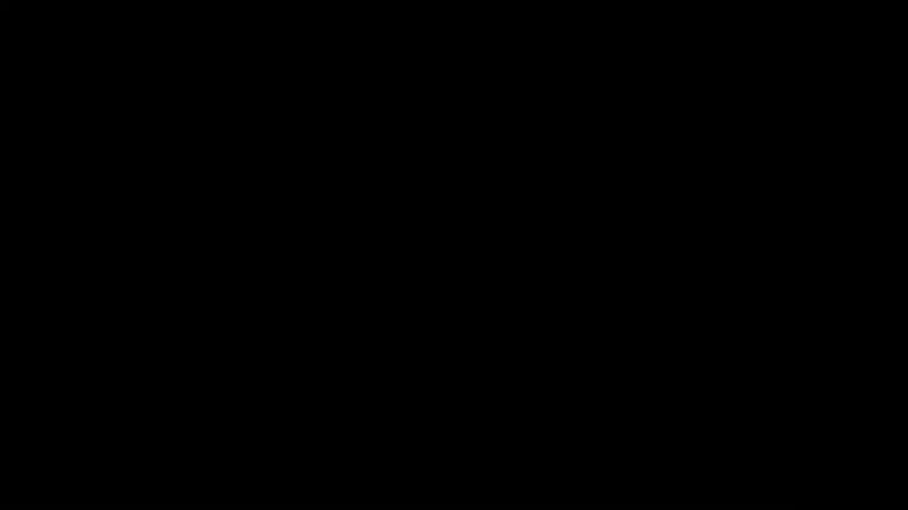
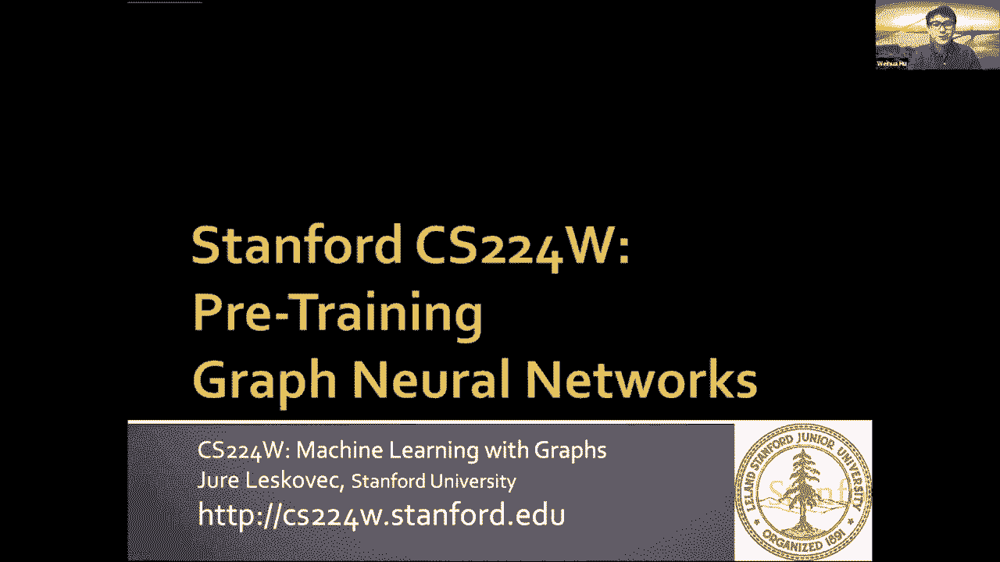
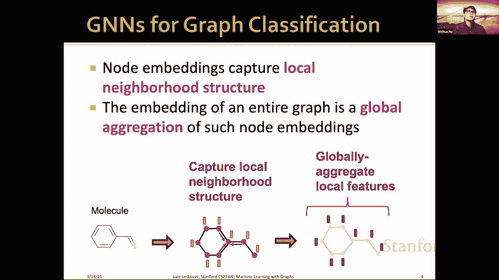
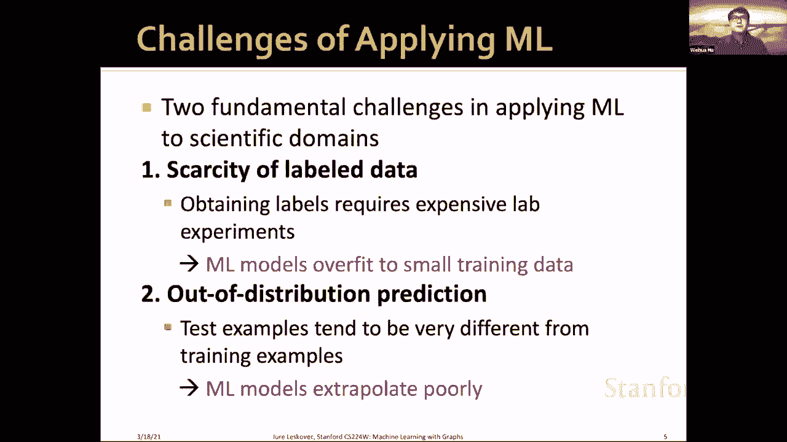
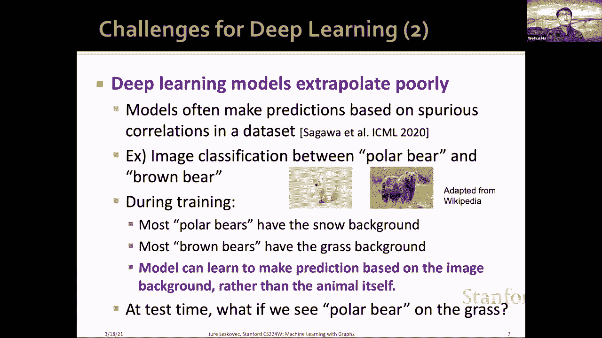
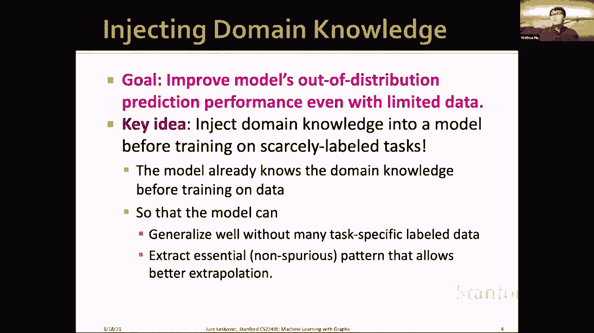
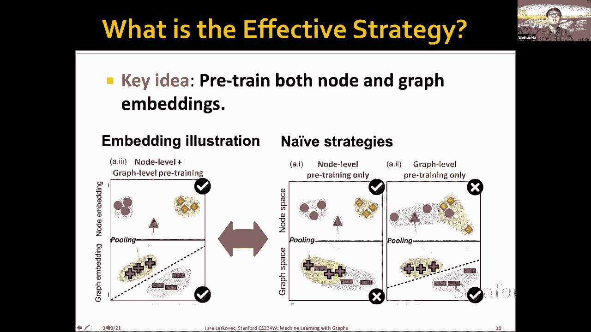
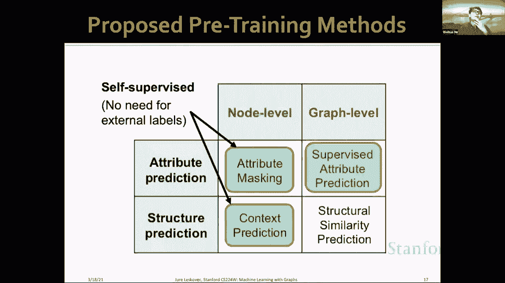
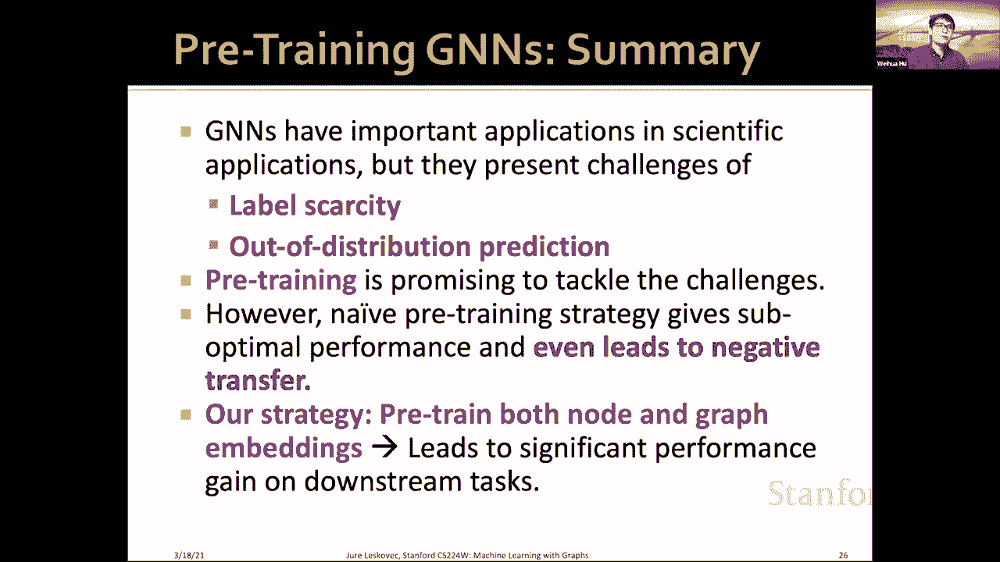

# P58：19.1 - Pre Training Graph Neural Networks - 爱可可-爱生活 - BV1RZ4y1c7Co

谢谢你给我这个机会，我很高兴能谈谈我在预训练图神经网络方面的工作。

好的，所以这里，我呃，我想谈谈将图神经网络应用于科学领域，比如说，呃，在化学中，我们有这个分子图，其中每个节点是一个原子，每个边代表化学键，在这里，我们对预测分子的性质感兴趣，比如说，给出这种分子图。

我们想预测，呃，是否有毒，在生物学中，还有一个图形问题，比如说，呃，我们有一个蛋白质蛋白质关联图，其中每个节点都是一个蛋白质，边缘代表蛋白质之间的某种联系，这些关联对确定蛋白质的功能非常重要。

我们的目标是给出一个以蛋白质节点为中心的子图，我们想预测中心蛋白节点是否有一定的生物活性，所以我想说的是，在许多科学领域，这个呃图形问题出现了很多，我们想应用GNNS来解决这个问题。

最后只是回顾一下gnns如何用于图分类，首先，嗯，给定一个分子图，让我们说图表，比如说分子，通过迭代聚合相邻信息获得节点的嵌入，一旦我们这样做了，我们一旦获得这个节点嵌入，我们可以拉这个节点全局嵌入。

获得整个图的嵌入，一旦我们获得了整个图的嵌入，我们可以用它，但是我们可以在它上面应用一个线性函数，来预测这整个图是否，不管有没有毒，然后呃，只是为了，呃，我说这意味着，这里。

节点嵌入试图捕获本地邻域结构，呃，在每个节点周围，如果我们应用K跳gnns，我们就会知道它应该捕捉到K Hop当地的社区，然后整个图罐的嵌入是，呃，基本上聚集了这个局部结构。

虽然不知道捕捉当地邻里结构的嵌入。

呃呃。

这就是Gwork，和，现在我要谈谈将机器学习应用到这些科学领域的挑战，基本上有两个基本挑战，将机器学习应用于科学领域的第一个挑战，标签数据的稀缺，在科学领域获得标签需要昂贵的实验室实验，例如。

我会说一个分子是否有毒，我们需要进行湿实验室实验，而且这些都很贵，结果，我们无法获得大量的训练数据，机器学习模型倾向于过度适应这些小的训练数据，另一个重要的问题是超出分布预测。

这意味着我们想要做出预测的测试示例往往与训练示例非常不同，这就是科学发现的本质，因为在科学发现中，我们想发现一些新的分子，这与你的训练分子本质上非常不同，在这些领域，机器学习模型推断不佳。

尤其是这两个挑战对深度学习来说越来越具有挑战性，第一个，呃，标签稀缺的第一点，深度学习模型有很多参数需要训练，通常在数百万和呃，训练数据的数量远少于参数的数量，深度学习模型极易对小数据进行过拟合。

小标记数据，另一个问题是，众所周知，深度学习模型的外推能力很差，据报道，模型经常做出预测，基于数据集中的虚假相关性，如果不了解如何做出预测的真正因果机制，所以说，让我们把这看作是一个中间的玩具例子。

北极熊和棕熊的图像分类，如图所示，所以在训练的时候，假设我们的训练数据在我们的训练数据中，大多数北极熊都有这样的雪背景，大多数棕熊都有这样的草背景，结果，模型可以学会预测，预测它是否，呃。

根据图像背景给出的图像是北极熊或棕熊，而不是动物本身，因为这足以对训练数据集做出预测，但如果在测试的时候，如果我们在草地上看到北极熊，那么模型就会，呃，因为模型不理解这个预测任务。

模型在数据上的表现会很差，在与训练数据不同的测试数据上，模型只是捕捉到了这种虚假的，训练数据集中的假相关性。

我们的关键思想。

或者考虑到这些挑战的目标是我们希望在分发性能之外改进模型，即使数据有限，我们这样做的方法是将领域知识注入模型，在我们将它们应用于稀缺性标记的任务之前，这项工作可能会奏效，因为模型已经知道领域知识。

在模型对我们的下游数据进行训练之前，这样模型也可以生成，而不需要许多特定于任务的标记数据，然后呃，该模型可以从数据中提取出基本的非虚假模式，这使得模型能够更好地推断金枪鱼和测试数据。

这一步与训练数据非常不同，将领域知识注入模型的非常有效的解决方案称为预训练，我们在相关的任务上预先训练一个模型，这不同于嗯，我们数据丰富的下游任务，在我们对模型进行预训练后。

模型的参数或已经包含了一些领域知识，一旦这样做了，我们可以将这个预先训练好的模型参数转移到下游任务中，这才是我们关心的，在我们有少量数据的地方，我们可以从预先训练的参数开始，微调，下游任务上的参数。

然后呃，只是想提一下，培训在计算机视觉和自然语言处理领域取得了巨大的成功，据报道，预培训提高了标签效率，预训练也提高了，我们认为训练可以成为科学应用的一个非常强大的解决方案。

这两个挑战是稀缺的标签和超出分布预测，现在，我们激励这个预培训GNN来解决科学应用中的重要问题，所以让我们考虑一下，你知道的，实际上是预先训练的GNN，我们的工作是设计GNN，培训前战略。

我们想系统地调查，调查以下两个问题，预培训GNS的效果如何，什么是有效的预训练策略，所以作为一个运行的例子，让我们考虑一下分子性质预测，药物发现的任务预测，所以给定分子，我们想预测它的毒性或生物活性。

非常简单的策略是在相关标签上进行多任务监督预训练，这意味着在例如，化学品数据库，我们有所有的嗯，许多分子的各种毒性和生物活性的实验测量，我们可以先预，训练GNN来预测那些非常多样化的毒性生物活性。

然后我们期望gns参数捕获一些化学领域的知识，这些知识可以是，然后我们可以将该参数转移到下游任务，我们考虑的设置是，来研究这种幼稚的策略是否有效，我们会考虑这个设置，我们考虑分子的这种二元分类。

给定分子，我们想判断它是消极的还是积极的，我们负责监督培训前的部分，呃，我们认为，我们考虑预测超过一千个，四十五万个分子，所以有很多数据，呃，在这个训练前的阶段，然后我们将参数转移到下游任务。

这是一个ACE分子分类数据集，那些相对较小，呃，大约一千，二十万分子，对于下游任务的数据拆分，我们认为脚手架裂开，这使得测试分子不分布，原来这个多任务的刀策略，加上相关标签的预培训效果不太好。

它对下游任务的性能改进有限，甚至导致负转移，这意味着预先训练的模型性能比随机初始化的模型差，这是呃桌子，或者这里有一个数字，所以我们有一个八，呃，下游数据集，y轴是原始的aac改进，没有训练前的基线。

所以这个紫色是一个未经预先训练的基线，我们看到天真的策略有时很有效，呃，但是为了这个，两个数据集，它实际上比非预先训练的随机初始化基线性能更差，所以这是，呃，呃，有点不可取。

我们想预先训练模型以表现得更好，那么什么是，然后我们进入下一个问题，什么是有效的培训前策略，我们的关键思想是预训练节点和图嵌入，这样gnns就可以捕获关于图的领域特定知识，在地方和全球一级。

所以在第九个策略中，我们只在图的层次上预先训练GNN，使用此图嵌入进行各种预测，但我们认为预先训练这个节点嵌入也很重要，因为，这些节点嵌入被聚合，生成整个图的嵌入。

所以我们需要一个高质量的节点嵌入来捕捉本地，这背后的直觉是，所以这是数字，上边表示节点嵌入，这些节点嵌入很酷，可以生成图的嵌入，我们想要，节点嵌入和图嵌入的质量都很高，捕获中的语义这与预训练策略不同。

比如说，如果我们在节点级预训练，我们在节点级别捕获语义，但是如果那些全局聚合的节点嵌入，我们可能无法获得很好的图嵌入，嗯，或者如果我们只预先训练，图层次上的GNN，我们可以得到很好的图嵌入。

但是不能保证之前的聚合，那些节点嵌入是高质量的，这可能会导致负转移，因为节点嵌入有点不健壮。

所以为了实现这一点，呃，在节点和图级别预训练gnns的策略，我们设计了三种具体的方法，嗯二自监督法，这意味着每个训练和一个图形级别都不需要节点级别的外部标签，呃预测训练前策略，预训练方法，呃，那是监督。

所以让我来介绍一下这三个具体方法，好的，所以第一个方法是属性掩蔽，这是一种低级的预训练方法，I算法相当简单，所以给定一个输入图，我们首先屏蔽一个随机屏蔽节点属性，假设我们在分子图中屏蔽了这两个节点属性。

他们知道我们基本上是在掩盖原子的身份，嗯，然后我们可以使用GNN生成一个节点，这两个屏蔽节点的嵌入，我们使用这个节点嵌入，预测掩码属性的身份，所以这里我们要使用节点嵌入，预测这个x是a是氧。

这个X是一个碳，这背后的直觉是，通过解决掩码属性预测任务，我们的GNN被迫学习领域知识，因为它需要解决这个测验，通过解决这种测验，GNN可以学习，GNN的参数可以捕获，化学领域，这里的想法是，算法如下。

所以对于每个图，我们采样一次节点间，假设这是一个红色节点，我们为此，呃，中心节点，我们提取邻域和上下文图，邻域图就是k跳邻域图，嗯，在这种情况下，像这样的两跳邻居图，然后上下文图是一个。

是一个直接连接到方舟跳邻域图的周围图，一旦我们提取了这个图，我们可以使用两个独立的GNN将这个邻域图编码为，你知道一用一把这个邻域图编码成向量，另一个世代是将这个上下文图编码成一个向量，和。

我们的目标是最大化或最大化真邻域上下文对之间的内积，同时最小化假阴性之间的内积，这个是，假对可以通过从其他邻域随机抽取上下文图获得，直觉是我们在使用，我们假设，被相似上下文包围的子图在语义上是相似的。

所以我们基本上是在推动，呃，邻域的嵌入要相似，如果它们有相似的上下文图，这是自然语言处理中广泛使用的一种假设，被称为分布假说，因此，出现在相同相似上下文中的单词具有相似的含义。

它被利用在著名的词甲板模型，所以最后，嗯，我要谈谈这个呃，这基本上是我之前介绍的，因此，在许多相关的图级标签上进行多任务监督预训练，这实际上是将领域知识注入模型的直接方法。

所以总结一下我们执行的整体策略，我们首先进行节点级预训练以获得良好的节点表示，我们使用预先训练的参数，呃，两个，然后进一步进行预训练，呃，在图的层次上，使用监督图级预训练一次，一旦我们完成了这两个步骤。

我们微调我们关心的下游任务的参数，所以这是总体策略，事实证明，我们的策略效果很好，正如你所看到的，这些绿点是我们的策略，我们的策略首先避免了这两个数据集中的负转移，也一直比那时表现得更好。

跨数据集的橙色朴素策略基线，还有一个有趣的旁注是，我们对不同的GNN模型进行了预训练策略和预训练，使用不同的gnns模型进行预训练，我们发现最具表现力的GNN模型，就是我们在讲座上学到的基因。

嗯从预培训中受益最大，就像你在这里看到的，非预先训练模型与非预先训练模型的增益为，就精度而言是最大的，和，这里的直觉，表达式GNN模型，可以学会捕捉比更便宜的模型更多的领域知识。

特别是从大量数据中学到的，预训，所以总结一下我们的GNN，我们了解到gns有重要的应用，分子性质预测或蛋白质功能预测等科学领域，但是这些应用领域带来了标签稀缺和分布预测之外的挑战。

我们认为预训练是一个有希望的框架来解决这两个挑战，然而，我们发现这种高超水平的天真训练前策略。

预训练给出次优的性能，甚至导致负迁移，我们的策略是有效的策略，是对节点和图嵌入进行预训练，我们发现这种策略在不同的下游任务中带来了显著的性能提升，是啊。

