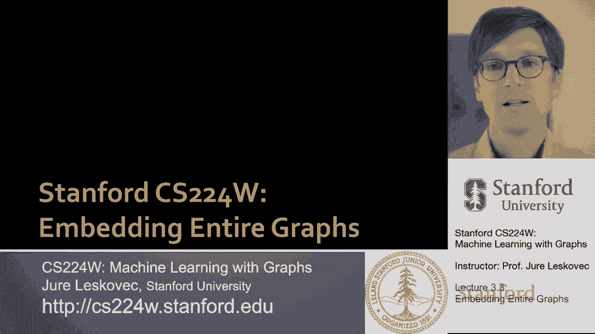
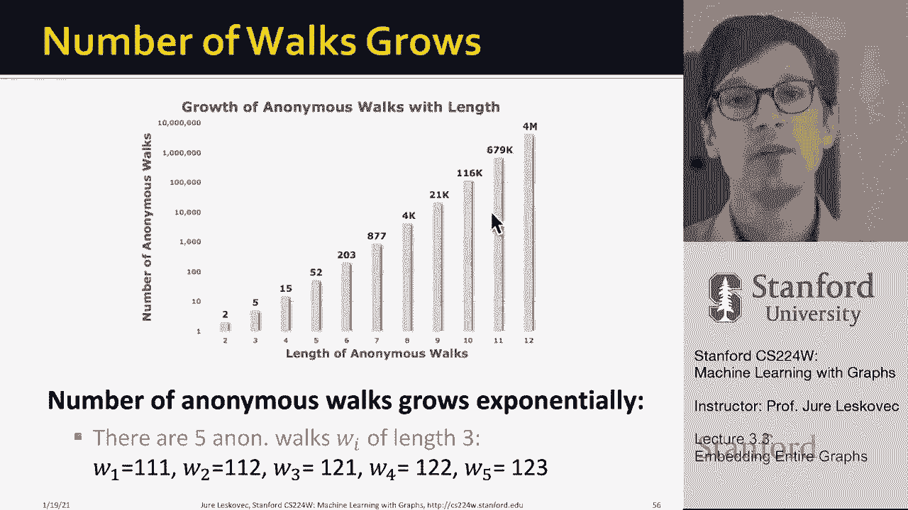

# P9：3.3 - Embedding Entire Graphs - 爱可可-爱生活 - BV1RZ4y1c7Co

现在我们要讨论嵌入整个图，因此，与其嵌入单个节点，我们要讲的是，如何嵌入或查找整个图的嵌入，我们将要讨论的方法是基于匿名的，呃，随机游动，所以我们要继续随机漫步的主题，但这种随机行走将是匿名的。

所以让我解释一下，目标，现在是将一个子图或整个图嵌入到嵌入空间中，呃z嗯和呃，你可能想这么做，因为你可能想这么做，比如说，分子分类，以预测哪些分子是有毒的，哪些是无毒的，或者你想做某种图形异常检测，嗯。

你想在嵌入空间中这样做，所以目标是嵌入整个图，或者你也可以想到，作为在图中嵌入节点的子集，所以第一个想法很简单，人们已经尝试过了，所以这个想法是运行标准节点嵌入，呃，呃，像我们这样的技术。

就像我们已经讨论过的要走的节点而言，或者深走，然后加起来或平均，呃，节点嵌入，在整个图中或子图中，对呀，所以这个想法是，嗯说，图的嵌入，只是该图中节点嵌入的总和，例如，这种方法在二十六年被用来分类，呃。

分子，呃，基于它们的图形结构，非常非常成功，所以即使简单，嗯，嗯在实践中效果很好，对平均节点嵌入的最初想法的改进，是引入一个虚拟节点来表示整个图或子图，然后运行标准的图形嵌入或节点嵌入技术，呃。

然后将这个虚拟节点视为图的嵌入，所以让我解释一下，这个想法是对的，我将创建这个虚拟节点，我将把它连接到节点集，我现在想嵌入，我可以运行节点回到这个，呃，在这个嗯，在这个图上确定这个虚拟节点的嵌入。

然后呃，的的嵌入，比如说一组节点，S只是嵌入了这个，呃，用深度游走计算嵌入空间中的虚节点，或者呃，节点二后退，当然，如果我想嵌入整个图，那么这个虚拟节点将连接到网络中的所有其他节点，要么跑，呃，深走。

呃，或节点返回，确定虚拟节点的嵌入，并将整个图的嵌入表示为嵌入，呃，红色节点的，所以这是个好主意，呃，两个现在是第三个想法，我们将定义匿名的概念，呃，走在路上，我们会想到这个。

匿名遍历中的状态与第一次的索引相对应，访问给定节点时，呃，在散步中，例如，这里有一个，这里有一个图表，嗯，你知道感兴趣的图形的一小部分，然后这里是这个图上的几个随机游动，比如说，从a我们去b c b。

或者另一个随机游走从c开始到d，到B到D再回到B，但我们不会把随机游走表示为节点序列，它访问，但是节点第一次被访问的时间序列，例如这两个随机游动1和2得到相同的表示，它是一个，因为A在第一步被访问。

那么它是二，因为B在第二步被访问，那么它是三个，因为节点C在第三步被访问，然后我们又去了B，但B已经被访问过了，所以它不会得到一个新的呃索引，但它得到的值是2，然后我们回到C，所以嗯所以再次，嗯。

我们有呃，第三名，然后另一个随机游走从c开始到d b d b um，得到相同的序列，对呀，c得到一个，呃D得到两个，B得到三个，然后我们回到D，所以又是两个，然后我们到b，又是三，然后呢，比如说。

另一个随机游动现在有了不同的匿名表示，因为我们从A到B到A到B再到D，所以是一二一二，因为在时间3或者，节点D作为第三个节点访问，呃，在图表中，所以呃，这个无名氏走了，基本上这是一个。

这是他们不知道节点的身份，访问的节点，这就是为什么他们被称为匿名者，这意味着随机遍历过不同节点的节点，但现在以同样的顺序得到同样的匿名行走表示，呃，你可能想知道散步的次数，呃，随着长度的增加而增加。

可能的匿名行走次数呈指数级增加，呃，这是图表，比如说，因为有五次匿名的散步，长度为三次，你知道他们在这里，你基本上可以停留在同一个节点，三次你就可以走了，你可以在同一个节点停留两次。

然后导航到第二个节点，可以从第一个节点到第二个节点，回到第一个，你可以从第一个到第二个，停留在第二个，或者从节点一导航到节点二再导航到节点三，这是五次可能的匿名行走，长度为3，然后你知道长度四，那就是。

会更多，会有十五个，土地会有十二个，就会有，我知道有四百万。

就像这里显示的那样，那么我们现在如何嵌入一个图表，一个想法是简单地模拟长度的匿名行走，l，呃，并记录他们的计数，然后将图表示为这些行走的概率分布，例如，如果我选择匿名行走长度为3。

然后我们可以把一个图表示为一个五维向量，因为有五个不同的匿名行走长度为三，正如我之前解释的那样，哪里呃，你知道吗，图的嵌入，嵌入的第i个坐标只是概率，那以后，概率或次数的分数。

图中发生了I型匿名匿名行走，g，所以现在，这基本上意味着我们嵌入了一个图作为一个五维表示，现在如果你想要更多的维度，你增加长度，匿名者的，呃，步行，这就是匿名散步的想法，呃，以及你如何基本上计算它们。

然后在，呃，每次匿名行走在图表上发生的次数，你呃，呃，通过基本设置来设置表示的维度，呃，的长度，呃，匿名，呃，走吧嗯现在，当然问题也变成了有多少呃，你需要随机漫步吗，而且有很好的，呃，呃。

告诉你有多少的数学公式，呃，匿名行走，呃，你想取样，这样你的嗯，呃，2006-2007两年期估计数，呃，发生的频率或概率是呃，准确，你可以用两个参数来量化精度，呃，Epsilon，嗯和嗯，然后呃。

Delta，呃，基本上我们说我们想要这个的分布，呃，匿名行走出错的概率，概率不超过Epsilon，呃，小于delta，你可以把这两个数字插入下面的方程，它会告诉你，匿名行走，你可能想，呃。

你可能需要取样，所以说，比如说，如果你考虑匿名走七步，他们有八百七十七人，如果你把epsilon设置为1点把delta设置为0点1，那么你需要取样12万份，呃，随机游动，你可以估计这些上的概率分布，呃。

八百七十七，呃不同，呃，匿名行走，这就是匿名散步的想法，然后嗯，我们可以进一步，嗯，增强这个想法，嗯，实际上学习散步本身的嵌入，所以让我解释一下我们怎么做，因此。

不是简单地用它发生的时间来表示每一次行走，我们可以学习匿名行走的嵌入z subi，呃wi，然后我们还可以学习一个图嵌入，呃z潜艇g，加上匿名行走，呃，嵌入，所以这意味着，呃，为了呃。

因为我们将学习嵌入的数量，我们要学习，将是匿名散步的次数，加上一个，因为我们正在学习每一次匿名行走的嵌入，加上嵌入，呃，对于图形，好吧，又来了，我们将如何学习这些图形的嵌入和匿名行走，我们就可以。

我们这样做的方式与我们在深度行走中所做的非常相似，或节点到后，你想嵌入漫步，所以呃，它附近的行走是可以预测的，所以让我解释一下这个想法，所以我们的想法是，我们将有这个向量g来描述图，我们要有，呃。

这将是整个图的嵌入，我们要学习，假设我们从某个节点1开始，我们对匿名进行采样，呃，从它随机游走，所以这个想法是学习预测在一些U中同时发生的行走，窗户尺寸大概是，当我们从给定节点采样随机游动时。

所以这个想法是目标函数是，我们想看看这个窗口大小的三角形，其中这些W呃T是随机的，是匿名随机游动，都从，呃在一个起始节点，呃一和呃，z-g是图的嵌入，现在我们基本上把这个目标加起来，呃在图表中。

所以我们的想法是，我们将从每个随机游动中运行不同的随机游动，呃，长度为l的节点u，所以现在我们对邻域的概念不是一组节点，但它是一组匿名的，呃，随机游动，这里用W标记。

然后我们想学习预测同时发生在大小窗口中的行走，德尔塔，所以这个想法是，你想估计嵌入z subi，无名氏，匿名行走，然后最大化这些给定的目标，基本上我们从，从给定节点，这是一个随机游动的序列。

或者发生的匿名游动，我们的目标是找到图的嵌入，以及匿名行走的嵌入，这样我们就可以预测下一次匿名行走是什么，下一次匿名散步的身份是什么，呃发生在这个，呃，在这个匿名行走的样本中，所以本质上。

这是我们在节点向后或深度行走中使用的相同的目标函数，但不同的是，当我们定义邻域的概念时，我们不在被访问的节点上定义邻域，但我们在，呃，从节点u开始时发生的匿名遍历，所以这里是一个完整的匿名行走。

这是一个匿名行走的ID，如果你想要更多的细节和呃和阅读更多，呃，有一个，有一张纸，呃，链接到这里，呃，您可以进一步阅读，呃细节，但这里的想法是对的，既然我们已经学会了节点的嵌入，以及散步的嵌入。

我们可以抱歉，当我们学习图形的嵌入时，我们可以用这个，呃，呃，Z潜艇，g作为图的描述符，我们可以把它用在下游预测任务中，对吧，所以总结一下，我们得到了图的嵌入，呃，Z子G，在此优化后是可学的。

然后我们可以用Z，g作出预测，比如说，用于图形分类，我们可以用，点积的方法和我们到目前为止使用的方法一样，或者我们可以用神经网络，呃，Z潜艇，g作为分类器的输入，并试图预测这一点的一些标签，呃。

图G两个选项，呃，是呃，在这种情况下是可行的，所以在这个呃，讲座的一部分，我们讨论了关于如何嵌入整个图的三个想法，首先是图中节点的简单平均或总和嵌入，其中节点的嵌入是通过深度行走计算的。

或者嗯节点到那个，第二个想法是创建一个跨越感兴趣的子图的超级节点，嵌入超级节点，然后呢，第三个想法是使用匿名行走嵌入的概念，呃，在那里我们匿名取样，以每次匿名行走发生的次数来表示图表，所以这是一个想法。

第二个，更复杂的想法是嵌入匿名行走，然后要么，比如说，串联它们的嵌入或使用这些z z子，呃，g，呃来定义这个概念，整个图形的嵌入，我们将来要考虑的也是更多，嗯，图嵌入的不同方法，特别是。

很多时候图表往往具有这种类型的社区或集群结构，所以这就成了一个很好的问题，我们如何分层聚合，嗯网络，呃，获得嵌入，呃，整个图的，后来在第八讲，我将讨论这样一种方法，它使用，呃，图，神经网络。

呃能够做到这一点，到最后，继续接近讲座的结尾，下一个问题是你知道，我们如何使用这些嵌入，节点的z i，比如说，嗯，你可以用它们，例如，对点进行聚类，基本上你拿着图表，计算嵌入，然后在嵌入上运行聚类算法。

例如，进行社区检测或任何形式的社会滚动识别，您可以使用这些嵌入进行节点分类，简单预测节点I的标签，基于它，它在嵌入z，你也可以用它们来，呃，链路预测，在哪里，基本上你可以取节点i和j。

您可以连接它们的嵌入，然后呃，根据串联，呃，你可以做一个预测，当嗯，组合此节点嵌入时，你有几个选择，正如我所说，一个是简单地将它们连接起来，另一个选择是通过每个坐标乘积来组合它们，这对于无向图很好。

因为这个操作是交换的，嗯，您还可以将它们相加或平均，另一个社区交换操作，意思是你知道，从i到j的链接概率与从j到i的链接概率相同，或者你可以测量某种L-2距离，然后做一个预测，基于这些不同的聚合。

两个嵌入中的两个，如果你想在有向图中做出预测，那么串联是很好的，因为你可以输出不同的概率，取决于你知道，是从i到j吗，或从j到i进行图形分类，节点嵌入uh可以通过聚合来计算，呃，节点嵌入。

或者通过匿名散步，或者通过这个匿名行走嵌入加，呃，这个图形，呃，嵌入方法，呃，我们已经讨论过了，今天总结一下，我们讨论了作为学习节点和图嵌入的一种方法的图表示学习，呃，与下游预测任务无关。

并且没有任何手动特征工程，我们讨论了这个编码器解码器框架，其中编码器只是一个嵌入查找，解码器预测分数或基于网络的相似性，呃，基于节点的嵌入，我们定义了一个基于随机游动的节点相似性概念。

我们讨论了两种方法，使用相同优化问题的深度遍历和节点到返回，同样的负抽样方法，但是深度行走使用了一个非常简单的随机行走，基本上呃，一阶随机游动，而Noto Back使用二阶随机游动，可以，在那里你可以。

微调网络探索的方式，然后我们还讨论了扩展，呃对呃，图嵌入，嗯，这意味着我们可以简单地聚合节点嵌入，我们还谈到了匿名，呃，随机游动，其中匿名随机游动表示游动，不是通过节点的身份，但按时间或按索引。

在什么时间，在什么时间，给定的节点是第一个，呃参观过，所以呃，这些是，这是一套方法，嗯，我想，呃，今天讨论，嗯和嗯，非常感谢大家的收看，然后呃。

