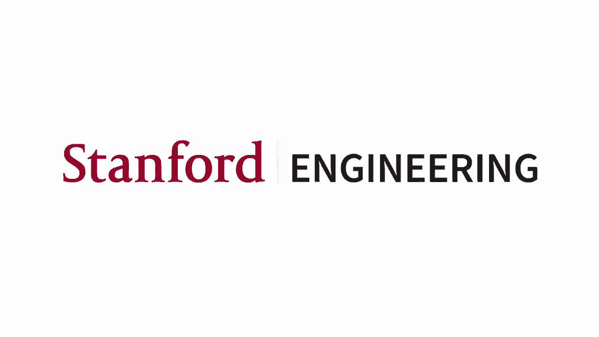
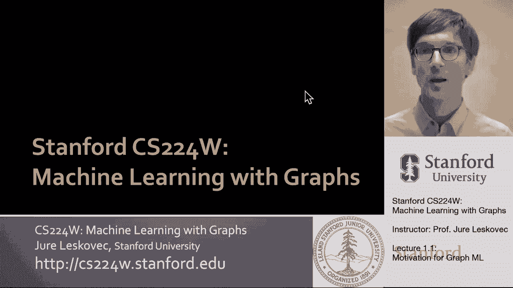
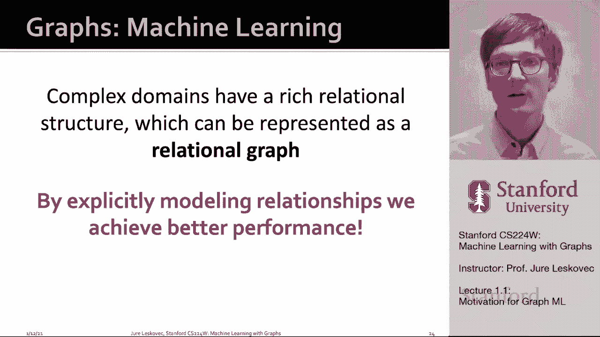
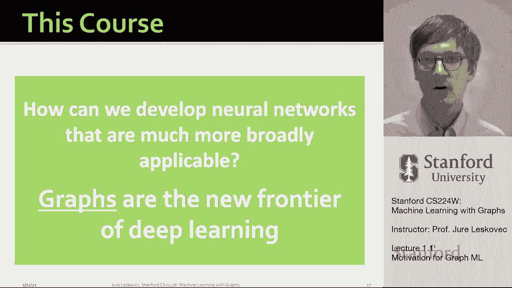
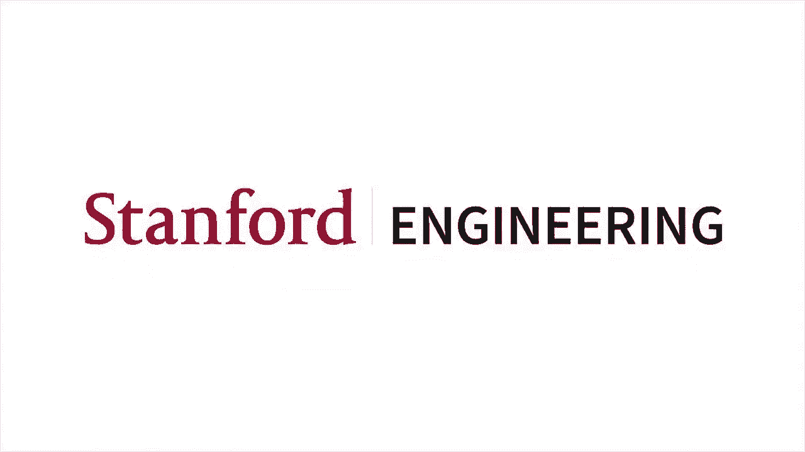

# 1：1.1 - 为什么需要图？ 🧩

在本节课中，我们将要学习图（Graph）这一数据结构的重要性，以及为什么它是机器学习和数据分析中一个强大且通用的工具。我们将探讨图如何自然地表示现实世界中各种复杂的关系网络，并理解为什么传统的深度学习方法在处理图数据时会面临挑战。

## 概述：什么是图？

图是描述和分析具有交互关系的实体的通用语言。这意味着我们不是将世界或特定领域视为一组孤立的数据点，而是从实体之间的网络和关系角度来审视它。

实体之间存在着潜在的关系图，这些实体根据连接或图的结构相互关联。许多类型的数据都可以自然地表示为图，并对这些图形关系进行建模。底层领域的关系结构使我们能够建立更忠实、更准确的模型，以反映数据背后的现象。

## 图的应用领域

以下是图数据可以发挥重要作用的一些领域示例：

*   **计算机网络与基础设施**：设备之间的连接和通信。
*   **生物与医学网络**：基因、蛋白质之间的调控关系，疾病传播途径，神经元连接。
*   **物理与化学系统**：粒子间的相互作用网络，分子结构（原子为节点，化学键为边）。
*   **社交与经济网络**：人与人之间的社交关系，经济实体间的交易。
*   **信息与知识网络**：学术论文间的引用关系，互联网网页链接，知识图谱中的实体关系。
*   **计算机科学领域**：软件代码的函数调用图（抽象语法树），三维形状的网格表示，场景图中物体间的关系。

在所有这些领域中，图结构是让我们以本质方式建模底层现象的重要组成部分。

## 图数据的分类

我们思考关系数据的方式是，可以表示为图的数据主要分为两大类：

1.  **自然图或网络**：底层领域本身就是一个图。
    *   例如：社交网络、通信网络、大脑神经网络、生物分子相互作用网络。
2.  **具有关系结构的领域**：其关系结构可以用图来建模和表示。
    *   例如：通过链接相似数据点创建的图（相似性网络）、分子结构图、三维形状图、基于粒子模拟的物理系统。

这意味着存在许多不同的领域，它们要么本身就是自然图，要么可以自然地建模为图以捕捉其关系结构。

## 图数据带来的挑战

上一节我们介绍了图在各种领域的广泛应用。本节中我们来看看，为什么处理图数据对现代机器学习工具箱构成了独特的挑战。

今天的深度学习工具箱主要针对简单的数据类型设计，特别是**序列**（如文本、语音）和**网格**（如图像）。深度学习方法非常擅长处理这种具有固定尺寸或规则结构的数据。

然而，图网络更难处理，原因如下：

*   **任意的大小与复杂的拓扑结构**：图没有固定的尺寸或形状，其结构（拓扑）可以非常复杂。
*   **缺乏空间局部性**：在图像网格中，我们有上下左右的明确概念；在文本序列中，有左右顺序。但在图中，没有这样的参考点或空间局部性概念。
*   **没有固定的节点顺序**：节点的排列顺序不是固定的，这给许多需要固定输入顺序的深度学习操作带来了困难。
*   **动态性与多模态特征**：图通常是动态变化的（随时间演变），并且节点和边可能具有多种类型的特征信息。

因此，在本课程中，我们将重点讨论如何开发更广泛适用的神经网络，特别是能够处理像图这样复杂数据类型的神经网络。关系数据图是深度学习和表示学习的新前沿。

## 图表示学习的目标

我们想要构建的神经网络，能够接收图作为输入，并输出各种预测。这些预测可以发生在不同层级：

*   在**单个节点**的级别（例如，用户分类）。
*   在**节点对或边**的级别（例如，链接预测）。
*   在**整个图**的级别（例如，图分类或生成新图）。

关键问题是：**如何设计神经网络架构，使其能够端到端地处理图数据？** 这意味着无需大量人工特征工程。

传统机器学习方法需要精心设计特征来捕获数据结构。本课程将聚焦于**表示学习**，即自动从图数据中学习有效的特征表示。具体来说，表示学习的目标是学习一个映射函数：

`f(node) -> embedding_vector`

该函数将图中的每个节点映射到一个 **d 维**的实数向量（称为**嵌入**或**表示**）。目标是使图中相似的节点在嵌入空间中的向量也彼此接近。

## 本课程大纲

我们将探讨图结构数据的机器学习和表示学习的多个主题：

1.  **传统图机器学习方法**：如图核方法。
2.  **节点嵌入方法**：如 DeepWalk、Node2Vec 等。
3.  **图神经网络**：我们将深入探讨流行的图神经网络架构，如图卷积网络、GraphSAGE 和图注意力网络。
4.  **图神经网络的理论与扩展**：包括其表达能力和扩展到大规模图的技术。
5.  **高级主题与应用**：在课程后半部分，我们将讨论异构图、知识图谱及其在逻辑推理中的应用（如 TransE、BetaE 等方法），图的深度生成模型，以及在生物医学、科学和工业（如推荐系统、欺诈检测）领域的应用。

本课程将持续约十周，共 20 节课，涵盖上述所有核心主题。

## 总结

本节课中，我们一起学习了图作为一种通用数据表示语言的重要性。我们看到了图在众多领域的自然存在，理解了图数据因其任意大小、复杂结构和缺乏固定顺序而带来的独特挑战。最后，我们明确了本课程的核心目标：通过**图表示学习**和**图神经网络**，开发能够自动、高效处理复杂关系数据的机器学习方法，从而在节点、边和图级别做出更准确的预测。